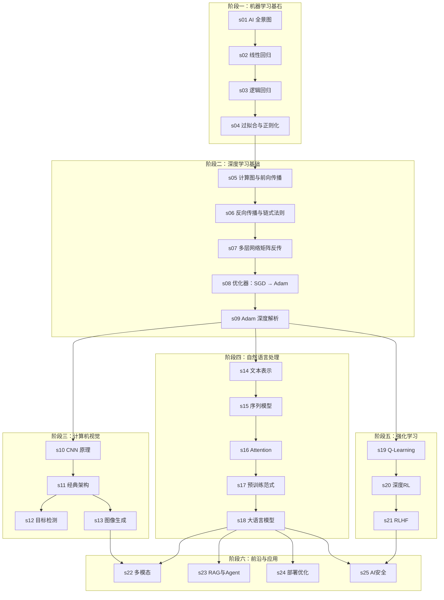

# learn-ai：图解 AI，一行代码看懂一个概念

<p align="center">
  <strong>从感知机到大模型 · 25 篇文章 · 100+ 张图解 · 50 个可运行代码示例</strong>
</p>

<p align="center">
  <a href="#-目录总览">目录</a> ·
  <a href="#-快速开始">快速开始</a> ·
  <a href="#-每章结构">章节结构</a> ·
  <a href="#-文档站点">文档站点</a> ·
  <a href="#-贡献">贡献</a>
</p>

---

## 为什么做这个仓库

AI 领域每天都有新论文、新框架、新名词。但真正关键的底层原理并不多——神经网络的训练、反向传播、注意力机制、强化学习的 Bellman 方程——几十年没变过。

这个仓库的目标：**用最直观的图解，配上一跑就能看到结果的代码，把 AI 的核心概念一个一个讲清楚**。

每篇文章只聚焦一个知识点，20-30 分钟读完。所有代码**默认 CPU 运行**，消费级笔记本就能跑，GPU 作为可选项。

---

## 学习路线图



---

## 目录总览

### 阶段一：机器学习基石

| 编号 | 标题 | 核心内容 | 代码实操 |
|------|------|----------|----------|
| [s01](s01_ai_overview/) | AI 全景图 | AI/ML/DL 关系、三大范式、发展简史 | NumPy 手写感知机 |
| [s02](s02_linear_regression/) | 从线性回归理解「学习」 | 模型-损失-优化三要素、梯度下降 | 从零实现 + 正规方程 + sklearn 对比 |
| [s03](s03_logistic_regression/) | 逻辑回归与分类 | Sigmoid、交叉熵、Softmax 多分类 | 手写二分类 + 多分类器 |
| [s04](s04_bias_variance/) | 过拟合与正则化 | Bias-Variance 权衡、L1/L2、交叉验证 | 多项式拟合 + 正则化路径 + K-Fold |

### 阶段二：深度学习基础

| 编号 | 标题 | 核心内容 | 代码实操 |
|------|------|----------|----------|
| [s05](s05_forward_computation_graph/) | 计算图与前向传播 | 计算图抽象、激活函数、数据流 | 纯 NumPy 搭建 MLP |
| [s06](s06_backprop_chain_rule/) | 反向传播与链式法则 | 局部梯度规则、链式法则、fan-out | 从零实现 mini autograd 引擎 |
| [s07](s07_matrix_backprop/) | 多层网络的矩阵反传 | δ 递推公式、梯度检查、梯度消失/爆炸 | 手写 MLP + 梯度检查 |
| [s08](s08_optimizers_sgd_to_adam/) | 优化器：从 SGD 到 Adam | Momentum、RMSProp、自适应步长 | 四种优化器轨迹对比可视化 |
| [s09](s09_adam_deep_dive/) | Adam 深度解析 | 偏差修正、AdamW、梯度裁剪、诊断 | MNIST 训练 + 优化器对比 |

### 阶段三：计算机视觉

| 编号 | 标题 | 核心内容 | 代码实操 |
|------|------|----------|----------|
| [s10](s10_cnn_fundamentals/) | CNN 核心原理 | 卷积、池化、感受野、参数共享 | 从零实现 Conv2d + 特征图可视化 |
| [s11](s11_cnn_architectures/) | 经典架构演进 | LeNet → ResNet → EfficientNet | 从零写 ResNet 训练 CIFAR-10 |
| [s12](s12_object_detection/) | 目标检测 | R-CNN → YOLO、IoU、NMS、mAP | 从零实现 IoU + NMS |
| [s13](s13_image_generation/) | 图像生成 | GAN、VAE、扩散模型原理 | 训练 GAN + VAE 生成 MNIST |

### 阶段四：自然语言处理

| 编号 | 标题 | 核心内容 | 代码实操 |
|------|------|----------|----------|
| [s14](s14_text_representation/) | 文本表示 | 词袋→TF-IDF→word2vec | 训练 Skip-gram + 词向量可视化 |
| [s15](s15_sequence_models/) | 序列模型 | RNN、LSTM、GRU 门控机制 | 字符级语言模型 + 情感分类 |
| [s16](s16_attention_transformer/) | Attention & Transformer | Q/K/V、多头注意力、位置编码 | 从零实现 mini GPT |
| [s17](s17_pretrained_models/) | 预训练范式 | BERT vs GPT、MLM vs CLM | BERT 微调 + 掩码预测 |
| [s18](s18_large_language_models/) | 大语言模型 | Scaling Law、涌现、RLHF/DPO | LoRA 微调 + DPO 对齐 |

### 阶段五：强化学习

| 编号 | 标题 | 核心内容 | 代码实操 |
|------|------|----------|----------|
| [s19](s19_rl_qlearning/) | 强化学习入门 | MDP、Q 表、ε-greedy、Bellman | Q-Learning 走迷宫 |
| [s20](s20_deep_rl/) | 深度强化学习 | DQN、经验回放、REINFORCE | DQN 玩 CartPole |
| [s21](s21_rlhf/) | RLHF | PPO、DPO、Reward Model | PPO + DPO 对比训练 |

### 阶段六：前沿与应用

| 编号 | 标题 | 核心内容 | 代码实操 |
|------|------|----------|----------|
| [s22](s22_multimodal/) | 多模态模型 | CLIP、对比学习、LLaVA 架构 | CLIP 零样本分类 |
| [s23](s23_rag_agent/) | RAG 与 AI Agent | 检索增强、ReAct、工具调用 | 完整 RAG + Agent 系统 |
| [s24](s24_deployment_inference/) | 部署与推理优化 | KV Cache、量化、Flash Attention | KV Cache + INT8 量化对比 |
| [s25](s25_ai_safety/) | AI 安全与对齐 | 幻觉、越狱、偏见、防御 | 安全扫描 + 幻觉检测 |

---

## 快速开始

### 环境配置

```bash
# 1. 克隆仓库
git clone https://github.com/DeconBear/learn-ai.git
cd learn-ai

# 2. 创建虚拟环境（推荐 Python 3.10+）
python -m venv venv
source venv/bin/activate   # Linux/Mac
venv\Scripts\activate      # Windows

# 3. 安装依赖
pip install -r requirements.txt
```

### 运行代码

```bash
# 每章都是独立可运行的——直接跑
cd s01_ai_overview/code
python demo.py       # 完整教学代码
python exercise.py   # 动手练习（需先补全 TODO）

# 更多章节
cd s08_optimizers_sgd_to_adam/code && python demo.py
cd s16_attention_transformer/code && python demo.py
```

### 硬件要求

| 阶段 | 最低配置 | 推荐配置 |
|------|----------|----------|
| 阶段一~二（s01-s09） | CPU，任意笔记本 | — |
| 阶段三~五（s10-s21） | CPU（已优化训练量） | GPU 4GB+ |
| 阶段六（s22-s25） | CPU | GPU 8GB+ |

> **所有代码默认 CPU 运行**，自动检测 GPU。有 GPU 的章节在 CPU 下会自动减少训练量，保证快速出结果。

### 学习建议

1. **按顺序**：学习路线图的箭头标明了前置依赖
2. **先图后文再代码**：图解建直觉 → 文字理解原理 → 代码验证
3. **完成 exercise.py**：每章练习留有空缺，先独立尝试再对照 demo.py
4. **动手实验**：改超参数、换数据集、加噪音——比死记硬背有用得多

---

## 文档站点

本仓库附带 **VitePress 文档站点**，支持全文搜索、深色模式、Mermaid 流程图和 LaTeX 公式渲染。

```bash
# 启动文档站点
npm install
npm run dev        # http://localhost:5173

# 构建静态站点
npm run build      # 输出到 .vitepress/dist/
npm run preview    # 预览构建结果
```

站点功能：
- 侧边栏导航（六阶段 25 章）
- 全文搜索
- LaTeX 公式渲染
- 深色/浅色模式
- 每章代码在线查看 + 下载

---

## 每章结构

```
sXX_topic/
├── index.md                # 图解正文（在线浏览）
├── CODE.md                 # 代码说明与运行报告
├── code-demo.md            # demo.py 查看页面（含说明 + 完整代码）
├── code-exercise.md        # exercise.py 查看页面
├── code/
│   ├── demo.py             # 完整教学代码（中文注释）
│   └── exercise.py         # 动手练习
└── images/                 # 手绘图解 + 代码运行结果
    ├── XX-01-xxx.png       # 概念图解
    ├── XX-02-xxx.png       # 概念图解
    └── ...                 # 运行生成的图表
```

每章配套：
- **正文**（index.md）：图文讲解，100+ 张手绘级插图
- **代码报告**（CODE.md）：嵌入实际运行结果的图片 + 解读说明
- **在线查看**（code-demo.md / code-exercise.md）：语法高亮代码 + 下载

---

## 贡献

欢迎贡献！你可以：

- 提交 Issue 指出错误或改进建议
- 提交 PR 修正错误、改进代码注释
- 贡献新文章（认同「图解 + 代码」风格即可）

---

## 致谢

- [learn-claude-code](https://github.com/shareAI-lab/learn-claude-code) — 仓库结构理念
- [3Blue1Brown](https://www.3blue1brown.com/) — 「先直觉，后公式」的教学哲学
- [nanoGPT](https://github.com/karpathy/nanoGPT) — 从零实现的教学思路
- [Distill.pub](https://distill.pub/) — 图解学术文章先驱

---

## License

MIT License — 自由使用、修改、分发。
