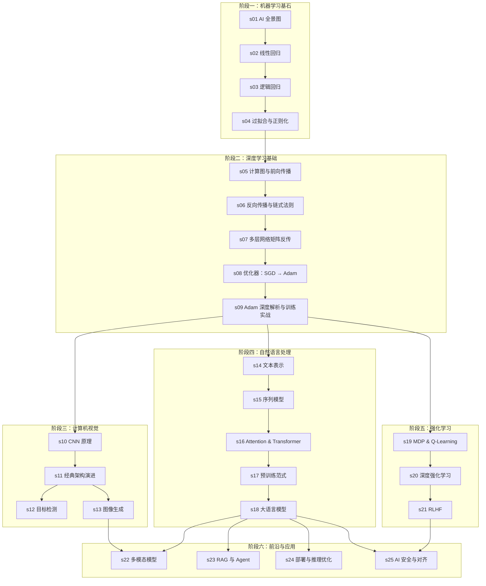

# learn-ai：图解 AI，一行代码看懂一个概念

> 从感知机到大模型，用图解 + 可运行代码，把 AI 的核心原理一个一个拆给你看。

---

## 为什么做这个仓库

AI 领域发展太快，每天都有新论文、新框架、新名词。但如果你往回看，真正关键的底层原理并不多——神经网络的训练、反向传播、注意力机制、强化学习的 Bellman 方程——这些东西几十年没变过。

这个仓库的目标是：**用最直观的图解，配上一跑就能看到结果的代码，把 AI 的核心概念一个一个讲清楚**。

每篇文章只聚焦一个知识点，读完大约 20-30 分钟。代码在消费级机器上就能跑，不需要 GPU 集群。

---

## 学习路线图



---

## 目录总览

### 阶段一：机器学习基石

| 编号 | 标题 | 一句话 | 代码 |
|------|------|--------|------|
| [s01](s01_ai_overview/) | AI 全景图 | AI/ML/DL 是什么关系？学习的本质是什么？ | NumPy 手写感知机 |
| [s02](s02_linear_regression/) | 从线性回归理解「学习」 | 模型、损失函数、梯度下降三要素 | 从零实现线性回归 |
| [s03](s03_logistic_regression/) | 逻辑回归与分类 | 决策边界、交叉熵、多分类 | 手写逻辑回归分类器 |
| [s04](s04_bias_variance/) | 过拟合、正则化与 Bias-Variance | 容量与泛化的权衡 | L1/L2 正则化对比实验 |

### 阶段二：深度学习基础

| 编号 | 标题 | 一句话 | 代码 |
|------|------|--------|------|
| [s05](s05_forward_computation_graph/) | 计算图与前向传播 | 神经网络的前向计算与计算图抽象 | 纯 NumPy 搭建 MLP |
| [s06](s06_backprop_chain_rule/) | 反向传播与链式法则 | 每个节点只关心自己的局部导数 | 手动实现 autograd |
| [s07](s07_matrix_backprop/) | 多层网络的矩阵反传 | δ 递推公式、mini-batch 平均 | 手写 MLP 完整训练循环 |
| [s08](s08_optimizers_sgd_to_adam/) | 优化器：从 SGD 到 Adam | Momentum、RMSProp、自适应步长 | 可视化不同优化器收敛 |
| [s09](s09_adam_deep_dive/) | Adam 深度解析与训练实战 | 偏差修正、AdamW、超参数调优 | 梯度诊断与调参实战 |

### 阶段三：计算机视觉

| 编号 | 标题 | 一句话 | 代码 |
|------|------|--------|------|
| [s10](s10_cnn_fundamentals/) | CNN 核心原理 | 卷积、池化、平移不变性 | 从零实现 CNN 可视化特征图 |
| [s11](s11_cnn_architectures/) | 经典架构演进 | LeNet → ResNet → EfficientNet | ResNet 训练 CIFAR-10 |
| [s12](s12_object_detection/) | 目标检测 | R-CNN、Anchor、YOLO | YOLO 实时检测 |
| [s13](s13_image_generation/) | 图像生成 | GAN、VAE、扩散模型 | 训练小型 Diffusion 模型 |

### 阶段四：自然语言处理

| 编号 | 标题 | 一句话 | 代码 |
|------|------|--------|------|
| [s14](s14_text_representation/) | 文本表示 | 词袋 → TF-IDF → word2vec | 训练 Skip-gram 可视化词向量 |
| [s15](s15_sequence_models/) | 序列模型 | RNN、LSTM、GRU 的门控机制 | LSTM 文本生成 |
| [s16](s16_attention_transformer/) | Attention 与 Transformer | Q/K/V、多头注意力、位置编码 | 从零实现 mini Transformer |
| [s17](s17_pretrained_models/) | 预训练范式 | BERT vs GPT、MLM vs CLM | BERT 微调文本分类 |
| [s18](s18_large_language_models/) | 大语言模型 | Scaling Law、涌现、对齐 | LoRA 微调 + DPO 对齐 |

### 阶段五：强化学习

| 编号 | 标题 | 一句话 | 代码 |
|------|------|--------|------|
| [s19](s19_rl_qlearning/) | 强化学习入门 | MDP、Q 表、探索与利用 | Q-Learning 走迷宫 |
| [s20](s20_deep_rl/) | 深度强化学习 | DQN、经验回放、Policy Gradient | DQN 玩 CartPole |
| [s21](s21_rlhf/) | RLHF：强化学习遇见大模型 | Reward Model、PPO 在 RLHF 中的角色 | 模拟 RLHF Reward 训练 |

### 阶段六：前沿与应用

| 编号 | 标题 | 一句话 | 代码 |
|------|------|--------|------|
| [s22](s22_multimodal/) | 多模态模型 | CLIP、图文对齐、LLaVA 架构 | CLIP 零样本分类 |
| [s23](s23_rag_agent/) | RAG 与 AI Agent | 检索增强、工具调用、ReAct | 完整 RAG + Agent 系统 |
| [s24](s24_deployment_inference/) | 模型部署与推理优化 | 量化、KV Cache、Flash Attention | 量化 Qwen + vLLM 推理 |
| [s25](s25_ai_safety/) | AI 安全与对齐 | Jailbreak、幻觉溯源、红队测试 | 模型安全扫描 |

---

## 如何使用

### 环境配置

```bash
# 1. 克隆仓库
git clone https://github.com/your-org/learn-ai.git
cd learn-ai

# 2. 创建虚拟环境（推荐 Python 3.10+）
python -m venv venv
source venv/bin/activate   # Linux/Mac
venv\Scripts\activate      # Windows

# 3. 安装依赖
pip install -r requirements.txt

# 4. （可选）配置 API Key
cp .env.example .env
# 编辑 .env 填入你的 API Key
```

### 学习建议

1. **按顺序阅读**：每篇文章之间有依赖关系，学习路线图中的箭头标明了前置知识
2. **先图后文再代码**：先看图解建立直觉 → 阅读文字理解原理 → 运行代码验证
3. **完成 exercise.py**：每章的 `code/exercise.py` 留有空缺，建议先独立尝试再对照 `demo.py`
4. **实验比记忆重要**：修改超参数、换数据集、加噪音，观察模型行为变化——这才是真正的理解

### 硬件要求

- **s01-s09（基础篇）**：CPU 即可，任何笔记本都能跑
- **s10-s18（CV + NLP）**：建议有 GPU（GTX 1060 6GB 以上），也可以用 Google Colab 免费 GPU
- **s19-s25（前沿篇）**：部分实验需要 8GB+ 显存，README 中会标注最低硬件要求

---

## 每篇文章的结构

```
sXX_topic/
├── README.md              # 图解正文（核心阅读材料）
├── image_prompts.md       # GPT Image 2.0 生图提示词（用于生成 images/ 中的插图）
├── code/
│   ├── demo.py            # 完整可运行教学代码（含详细中文注释）
│   └── exercise.py        # 动手练习（关键部分留空，引导读者补全）
└── images/                # 手绘图解
    ├── 01-xxx.png
    └── ...
```

---

## 贡献指南

欢迎贡献！你可以：

- **提交 issue**：指出文章中的错误、不清楚的地方或改进建议
- **提交 PR**：修正错误、改进代码注释、添加练习答案
- **贡献新文章**：如果你擅长某个 AI 子领域并且认同「图解 + 代码」的风格，欢迎联系

---

## 致谢

本项目受到以下优秀资源的启发：

- [learn-claude-code](https://github.com/shareAI-lab/learn-claude-code) — 仓库结构和「渐进式学习」理念
- [3Blue1Brown](https://www.3blue1brown.com/) — 「先建直觉，再推公式」的教学哲学
- [Distill.pub](https://distill.pub/) — 交互式图解学术文章的先驱
- [Andrej Karpathy](https://github.com/karpathy) — 从零实现的教学思路（nanoGPT, micrograd）

---

## License

MIT License — 自由使用、修改、分发。
