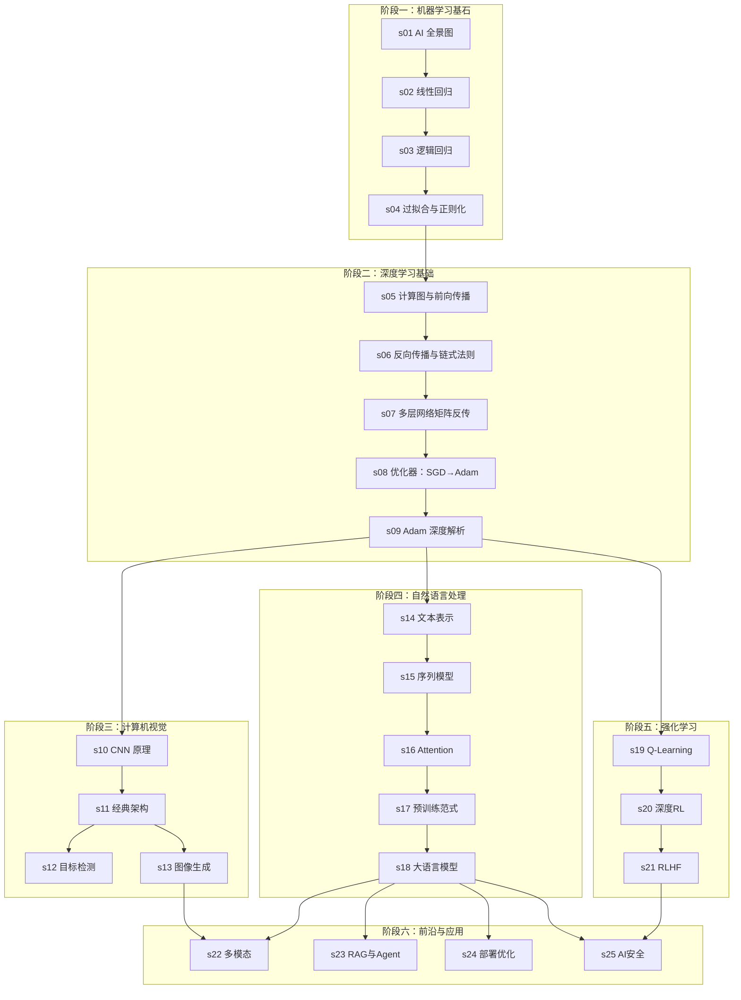

## 📖 学习路线



## 🚀 快速开始

```bash
# 1. 克隆仓库
git clone https://github.com/DeconBear/learn-ai.git
cd learn-ai

# 2. 安装 Python 依赖
pip install -r requirements.txt

# 3. 运行任意章节的代码
cd s01_ai_overview/code
python demo.py

# 4. 启动文档站点（可选）
npm install
npm run dev
```

## 📂 每章结构

```
sXX_topic/
├── README.md              # 图解正文（核心阅读材料）
├── image_prompts.md       # 生图提示词
├── code/
│   ├── demo.py            # 完整教学代码（中文注释）
│   └── exercise.py        # 动手练习
└── images/                # 手绘图解
```

## 🙏 致谢

受以下优秀项目启发：

- [learn-claude-code](https://github.com/shareAI-lab/learn-claude-code) — 仓库结构理念
- [3Blue1Brown](https://www.3blue1brown.com/) — 先直觉后公式的教学哲学
- [Distill.pub](https://distill.pub/) — 图解学术文章先驱
- [Andrej Karpathy](https://github.com/karpathy) — 从零实现的教学思路
