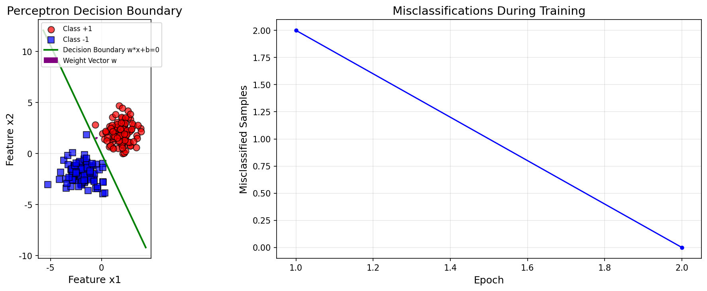

# s01 AI概述 -- 代码说明与运行报告

## 程序做了什么
从零使用纯NumPy实现感知机（Perceptron）二分类器。生成线性可分的二维合成数据，通过感知机学习算法迭代更新权重和偏置，最后展示决策边界和训练收敛过程。这是深度学习最基本的构建模块演示。

## 运行方法
```bash
cd s01_ai_overview/code
python demo.py
```

## 运行结果

### 输出摘要
- 数据集：200个样本（每类100个），2个特征，线性可分
- 收敛情况：感知机通常在 5-15 轮内收敛（数据线性可分时保证收敛）
- 训练集准确率：100%（线性可分数据）
- 测试点预测输出：正类区域点预测为 +1，负类区域点预测为 -1

### 生成图表

#### 图表 1: 感知机决策边界与训练损失

**说明了什么：** 左图展示感知机学到的分离超平面（绿线）将红蓝两类数据点完全分隔，紫色箭头为权重法向量（指向正类方向）；右图展示误分类样本数随训练轮数单调下降至0的过程，体现了感知机在有限步内收敛的数学性质。

## 代码结构
- `generate_linearly_separable_data()` -- 生成两类线性可分的二维数据
- `class Perceptron` -- 感知机模型，包含 `fit()`（训练）、`predict()`（预测）、`decision_function()`（决策函数）
- `plot_decision_boundary()` -- 绘制决策边界和训练损失曲线（双子图）
- `main()` -- 主流程：生成数据 -> 训练模型 -> 评估准确率 -> 可视化 -> 测试点预测

## 运行环境
- Python 依赖: numpy, matplotlib
- 硬件需求: CPU 即可
- 预计运行时间: < 5 秒
