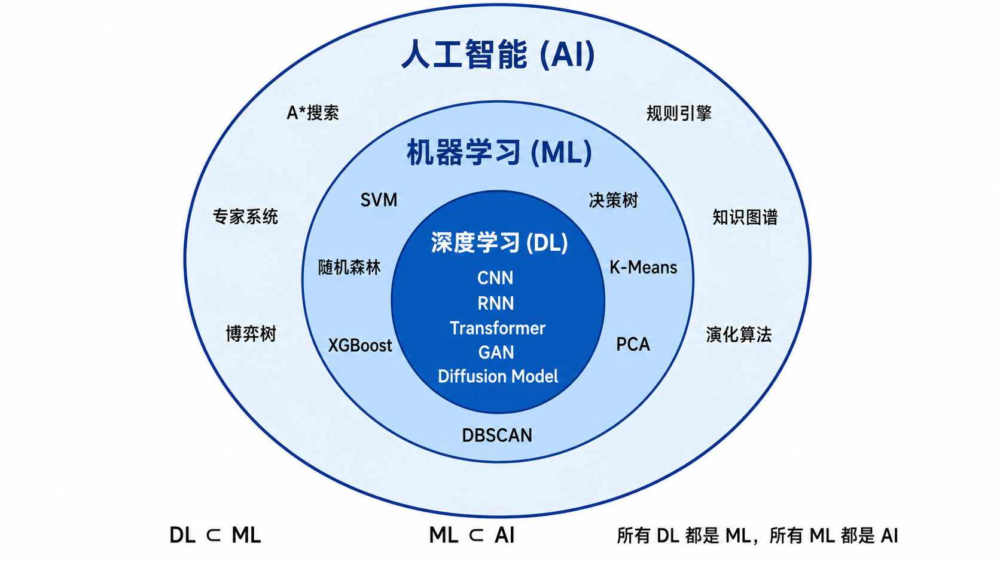
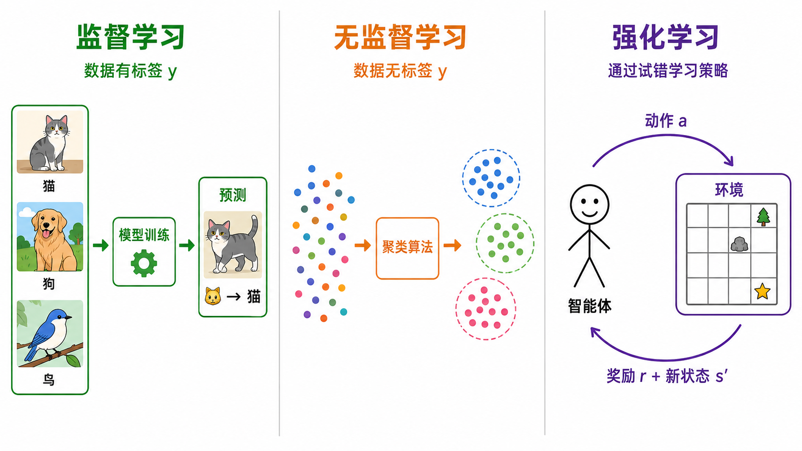
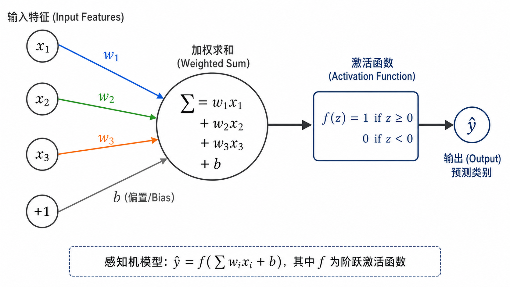
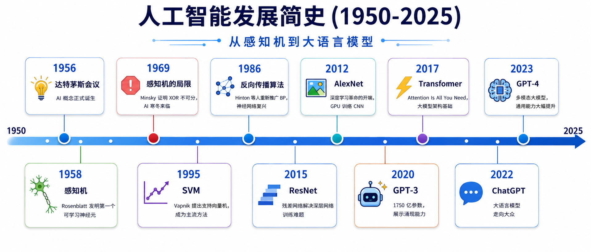
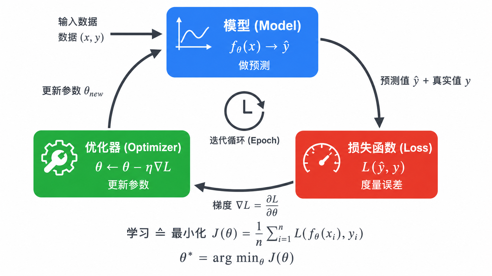

# AI 全景图：从感知机到大模型

## 1. 什么是 AI？

**人工智能（Artificial Intelligence，AI）** 是计算机科学的一个分支，目标是让机器能够完成通常需要人类智能才能完成的任务——理解语言、识别图像、下棋、驾驶汽车、回答问题等。从广义上讲，任何让计算机模仿人类智能行为的技术都属于 AI 范畴。

然而，术语「AI」在不同语境下有不同含义。为了准确地理解这个领域，我们需要先厘清三个核心概念的关系：**AI、机器学习、深度学习**。

### AI vs. ML vs. DL

- **人工智能（AI）**：最宽泛的概念，涵盖所有让机器表现智能的方法。这既包括基于规则的专家系统（如「如果发烧且咳嗽，则诊断感冒」），也包括从数据中学习的现代方法。AI 的起源可以追溯到图灵 1950 年提出的著名问题：「机器能思考吗？」

- **机器学习（Machine Learning，ML）**：AI 的一个子领域，核心思想是**不显式编程规则，而是让机器从数据中自动学习规律**。Arthur Samuel 在 1959 年给出了经典定义：「使计算机能够在没有明确编程的情况下学习的研究领域」。例如，与其手工编写「如果图像中某处有圆形，且有胡须，则是猫」这样的规则，我们让算法从大量标注好的猫狗图片中自动发现区别。

- **深度学习（Deep Learning，DL）**：ML 的一个子集，使用多层（深层）人工神经网络作为模型。灵感来自生物神经系统，每一层学习不同抽象层次的特征表示。深度学习在 2012 年 ImageNet 竞赛中大放异彩（AlexNet），之后在图像识别、语音识别、自然语言处理等领域取得了突破性进展。



> 所有的深度学习都是机器学习，所有的机器学习都是 AI；但反过来不成立。

一个简单例子：在你的手机相册中，人脸识别使用的是 DL（CNN 网络），邮件垃圾过滤可能使用 ML（朴素贝叶斯），而相册里的「自动创建相册」功能可能混合了规则（时间、地点）+ ML（场景识别）+ DL（人脸聚类）。

---

## 2. 机器学习的三大范式

机器学习可以按训练数据的性质和任务目标分为三类。

### 2.1 监督学习（Supervised Learning）

监督学习是我们有**输入 $X$ 和对应的正确答案 $y$**（称为标签/label），模型学习一个映射 $f: X \rightarrow y$。

$$
\text{给定训练集 } \{(x_1, y_1), (x_2, y_2), \dots, (x_n, y_n)\} \text{，学习 } f(x) \approx y
$$

典型任务：
- **分类（Classification）**：预测离散类别。例如：垃圾邮件检测（垃圾/正常邮件）、猫狗识别（猫/狗）、疾病诊断（良性/恶性）。
- **回归（Regression）**：预测连续数值。例如：房价预测（$y \in \mathbb{R}$）、股票价格、温度预测。

### 2.2 无监督学习（Unsupervised Learning）

无监督学习中，我们**只有输入 $X$，没有标签 $y$**。模型需要自己发现数据中的结构或模式。

$$
\text{给定 } \{x_1, x_2, \dots, x_n\} \text{，发现数据的隐藏结构}
$$

典型任务：
- **聚类（Clustering）**：将数据分成若干组。例如：客户分群（高价值/中价值/低价值客户）、文档主题分类。
- **降维（Dimensionality Reduction）**：用更少的维度表示数据。例如：数据可视化（t-SNE、UMAP 将高维数据投影到 2D/3D 平面）、特征压缩（PCA）。
- **密度估计（Density Estimation）**：学习数据的概率分布。

### 2.3 强化学习（Reinforcement Learning）

强化学习中，**智能体（Agent）**在**环境（Environment）**中通过**试错（trial-and-error）**来学习最优策略。它与监督学习有本质区别——没有「正确答案」，只有「奖励信号」。

$$
\text{Agent 在状态 } s_t \text{ 执行动作 } a_t \text{，获得奖励 } r_t \text{，环境转移到 } s_{t+1}
$$

核心组件：
- **策略（Policy）** $\pi(a|s)$：在状态 $s$ 下选择动作 $a$ 的概率
- **价值函数（Value Function）** $V(s)$：从状态 $s$ 开始的预期累积奖励
- **Q 函数** $Q(s, a)$：在状态 $s$ 采取动作 $a$ 后，一直遵循最优策略的预期累积奖励

典型例子：AlphaGo 下围棋、机器人行走、游戏 AI（Atari、Dota 2）、推荐系统优化长期用户留存。



---

## 3. AI 简史：从感知机到大模型

AI 的发展并非一帆风顺，经历了多次「冬天」与「春天」的交替。

### 3.1 萌芽期（1950s-1960s）

- **1950 年**：图灵发表《计算机器与智能》，提出图灵测试
- **1956 年**：达特茅斯会议，**「人工智能」一词正式诞生**
- **1958 年**：Rosenblatt 发明**感知机（Perceptron）**——第一个可学习的人工神经元模型，能够进行简单的二分类。它是现代神经网络的鼻祖。

感知机的数学模型非常简单：

$$
y = f\left(\sum_{i=1}^{n} w_i x_i + b\right), \quad f(z) = \begin{cases} 1 & \text{if } z \geq 0 \\ 0 & \text{if } z < 0 \end{cases}
$$



### 3.2 第一次 AI 寒冬（1970s）

- **1969 年**：Minsky 和 Papert 出版《感知机》，证明了**单层感知机无法解决 XOR 问题**。由于 XOR 不可线性分割，而感知机只能解决线性可分问题，这直接导致了神经网络研究的停滞和资金断流。

### 3.3 复兴期（1980s-1990s）

- **1986 年**：Rumelhart、Hinton 等人重新推广**反向传播算法（Backpropagation）**，使得多层神经网络（即多层感知机 MLP）的训练成为可能。误差从输出层反向传播到输入层，逐层更新权重，从而解决了 XOR 等非线性问题。

- **1995 年**：Vapnik 提出**支持向量机（SVM）**，凭借强大的理论基础在小样本学习上碾压神经网络，成为 1990s-2000s 的主流方法。SVM 通过核技巧（kernel trick）将数据映射到高维空间，在低维线性不可分的问题中寻找高维超平面。

### 3.4 深度学习革命（2010s）

- **2012 年**：Hinton 小组的 **AlexNet** 在 ImageNet 图像识别竞赛中以大幅优势夺冠，标志着深度学习时代的正式开启。关键因素：GPU 加速 + 大规模数据集（ImageNet） + ReLU 激活函数 + Dropout 正则化。

- **2015 年**：**ResNet**（残差网络）通过引入跳跃连接（skip connection）解决了深层网络难以训练的问题，将网络深度推到了 152 层甚至 1001 层。核心思想：让网络学习残差映射 $F(x) = H(x) - x$，而非直接学习目标映射 $H(x)$。

- **2017 年**：Google 团队发表 **「Attention Is All You Need」**，提出 **Transformer** 架构。用**自注意力机制（Self-Attention）**替代 RNN 的序列计算，实现了并行训练和对长距离依赖的高效建模。这是大语言模型的基础。

### 3.5 大模型时代（2020s-至今）

- **2018 年**：OpenAI 发布 GPT，BERT 发布。**预训练 + 微调**范式成为 NLP 标配
- **2020 年**：**GPT-3**（1750 亿参数）展示出惊人的**涌现能力（Emergent Abilities）**——无需微调，仅通过提示（prompt）即可完成翻译、编程、推理等任务
- **2022 年**：**ChatGPT** 发布，让全球用户第一次直接体验到大语言模型的能力。InstructGPT 通过 RLHF 对齐人类偏好
- **2023 年**：**GPT-4** 支持多模态（文本 + 图像输入），能力大幅提升
- **2024-2025 年**：开源模型（Llama 3、Mistral、DeepSeek 等）追赶闭源模型，o1/o3 等推理模型引入「思维链推理」



---

## 4. 「学习」的本质是什么？

当我们说一个模型在「学习」时，它究竟在做什么？本质上，**学习 = 在数据驱动下，通过优化算法调整模型参数，使得模型在给定任务上的表现越来越好**。

一个机器学习系统由三个核心组件构成：

### 4.1 模型（Model）

模型是一个带有可调参数 $\theta$ 的函数 $f_\theta$，它将输入 $x$ 映射到输出 $\hat{y}$：

$$
\hat{y} = f_\theta(x)
$$

对于线性回归，$f_\theta(x) = wx + b$，参数 $\theta = \{w, b\}$。
对于深度神经网络，$f_\theta$ 可能是一个由数亿个参数组成的多层非线性函数。

模型定义了**「我们能表达什么」**——即假设空间（hypothesis space）。

### 4.2 损失函数（Loss Function）

损失函数 $\mathcal{L}(\hat{y}, y)$ 度量模型的预测 $\hat{y}$ 与真实值 $y$ 之间的**误差**。它是我们优化的目标：

$$
J(\theta) = \frac{1}{n} \sum_{i=1}^{n} \mathcal{L}(f_\theta(x_i), y_i)
$$

不同的任务选用不同的损失函数（MSE 用于回归，交叉熵用于分类），因为损失函数决定了模型**「什么算好」**。

### 4.3 优化器（Optimizer）

优化器根据损失函数对参数的梯度 $\nabla_\theta J(\theta)$ 来**更新参数**，使损失逐步降低：

$$
\theta_{t+1} = \theta_t - \eta \cdot \nabla_\theta J(\theta_t)
$$

其中 $\eta$ 是**学习率（learning rate）**，控制每一步更新的幅度。

### 学习的循环

```
数据 (x, y) → 模型预测 ŷ → 计算损失 L(ŷ, y) → 求梯度 ∂L/∂θ → 更新参数 θ → 返回第一步
```

每一次完整遍历全部训练数据称为一个 **epoch**。这个循环重复数千甚至数百万次，参数逐步收敛到损失函数的（局部）最小值。



---

## 5. 为什么是现在？数据、算力、算法的三重奏

AI 之所以在近十年迎来爆发，是三大因素同时成熟的结果：

### 5.1 数据（Data）——「燃料」

- 互联网产生了海量数据：每天产生约 $3.28 \times 10^{15}$ 字节（3.28 EB）
- ImageNet（1400 万张图像）、Common Crawl（PB 级文本）、大规模视频数据集为模型训练提供了「燃料」
- 数据的**标注成本**也在下降：众包平台（Amazon Mechanical Turk）、半自动标注工具

### 5.2 算力（Compute）——「引擎」

- **GPU（图形处理器）**：原本为游戏渲染设计，2000 年代被发现在矩阵运算上远超 CPU。一块 A100 GPU 的浮点运算能力达 312 TFLOPS（FP16）
- **分布式训练**：数据并行（Data Parallelism）、模型并行（Model Parallelism）、流水线并行（Pipeline Parallelism）使得训练万亿级参数模型成为可能
- **专用硬件**：Google TPU、华为昇腾、专用 AI 芯片持续提升性价比

算力增长趋势：2010 年前 AI 训练算力大致遵循摩尔定律（每两年翻倍），而 2012 年后，用于训练最大 AI 模型的算力**每 3.4 个月翻一倍**。

### 5.3 算法（Algorithms）——「大脑」

- **激活函数**：ReLU（$f(x) = \max(0, x)$）解决了深层网络中的梯度消失问题
- **归一化**：Batch Normalization、Layer Normalization 使训练更稳定迅速
- **残差连接**：允许训练上百层的网络
- **注意力机制**：Transformer 的自注意力使长序列建模成为可能
- **预训练范式**：在大规模无监督数据上预训练，在小规模有监督数据上微调
- **Scaling Laws**：发现模型性能随参数、数据、算力的增加呈幂律增长

---

## 6. 今日 AI 全景图

当前 AI 领域可以按技术方向分为几个主要板块：

### 计算机视觉（Computer Vision）
- 图像分类、目标检测（YOLO 系列、DETR）、语义分割（SAM）
- 图像生成（Stable Diffusion、DALL-E 3、Midjourney）
- 视频理解与生成（Sora、Runway）

### 自然语言处理（NLP）
- 大语言模型（GPT-4、Claude、Gemini、Llama、DeepSeek、Qwen）
- 文本生成、翻译、摘要、对话

### 强化学习（Reinforcement Learning）
- 游戏 AI（AlphaGo、AlphaZero、AlphaStar）
- 机器人控制（Sim-to-Real）
- 大模型对齐（RLHF——从人类反馈中强化学习）

### 多模态（Multimodal）
- 图文理解（CLIP、BLIP-2、LLaVA）
- 文生图、文生视频
- 跨模态检索

### 技术与基础设施
- 向量数据库（Pinecone、Milvus、Chroma）
- 推理框架（llama.cpp、vLLM、TensorRT-LLM）
- 开源生态（Hugging Face、LangChain、LlamaIndex）

### 关键趋势
- **Scaling 的边界**：单纯扩大模型规模是否可持续？合成数据和推理时计算成为新方向
- **AI Agent**：从对话工具到自主完成任务的智能代理
- **开源 vs 闭源**：社区驱动的创新与商业化的博弈
- **AI 安全与对齐**：如何确保越来越强大的 AI 系统与人类价值观一致

---

## 本章总结

从 1958 年的感知机到今天的大语言模型，AI 经历了 60 多年的起伏。理解这条发展脉络，不是为了背诵历史节点，而是为了理解**每一次技术跨越背后的驱动力是什么**——是数据？是算力？是算法创新？还是三者恰到好处的结合？

在接下来的章节中，我们将从最简单的模型开始，逐步构建起对现代 AI 系统的深刻理解。**千里之行，始于感知机。**

---

## 参考

1. Rosenblatt, F. (1958). The Perceptron: A Probabilistic Model for Information Storage and Organization in the Brain.
2. Rumelhart, D. E., Hinton, G. E., & Williams, R. J. (1986). Learning representations by back-propagating errors.
3. Krizhevsky, A., Sutskever, I., & Hinton, G. E. (2012). ImageNet Classification with Deep Convolutional Neural Networks.
4. Vaswani, A., et al. (2017). Attention Is All You Need.
5. Brown, T., et al. (2020). Language Models are Few-Shot Learners.
