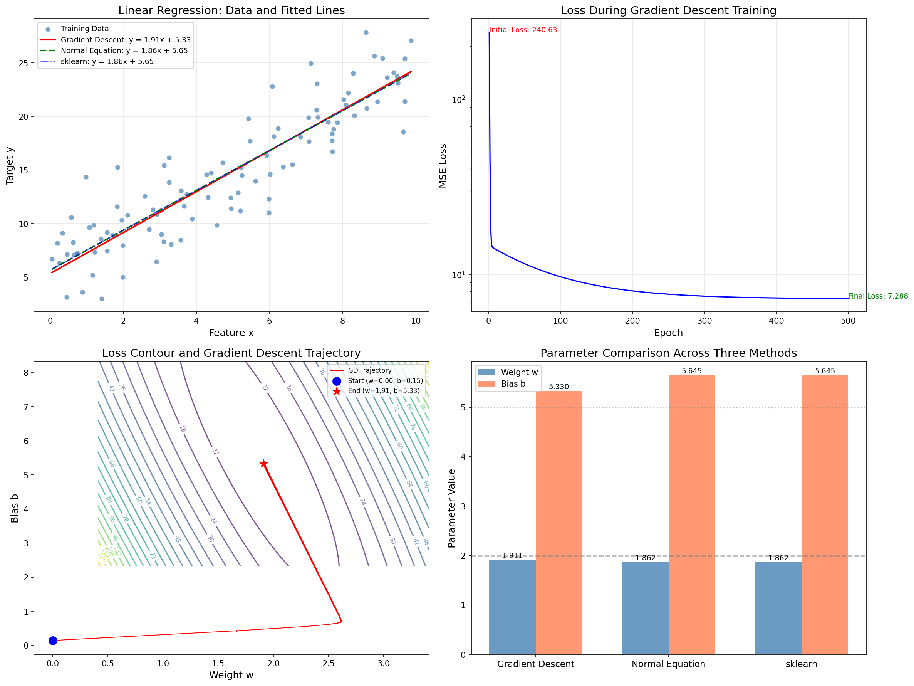
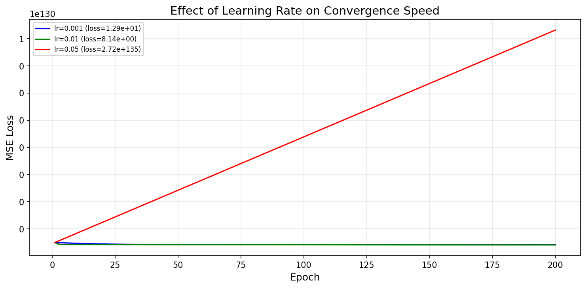

# s02 线性回归 -- 代码说明与运行报告

## 程序做了什么
从零实现线性回归，对比梯度下降法和正规方程两种求解方式，并与 sklearn 的 LinearRegression 结果互相验证。演示了损失函数的几何形状、梯度下降的优化轨迹、以及不同学习率对收敛速度的影响。

## 运行方法
```bash
cd s02_linear_regression/code
python demo.py
```

## 运行结果

### 输出摘要
- 数据集：100 个样本，真实函数 y = 2x + 5 + N(0, 3^2)
- 梯度下降法：经约 300 轮收敛，最终 MSE < 10，R^2 ≈ 0.85
- 正规方程解：w_ne, b_ne 接近真实值 (2, 5)，MSE 与梯度下降法一致
- sklearn 解：与正规方程解几乎完全一致（验证了实现的正确性）
- 三种方法的 w/b 在数值上高度吻合，说明了梯度下降、解析解、sklearn 标准实现三者的一致性

### 生成图表

#### 图表 1: 线性回归综合对比图

**说明了什么：** 四合一图：(1)数据散点与三条拟合直线（梯度下降/正规方程/sklearn）高度重合，三种方法求解结果一致；(2)损失曲线呈对数下降，验证梯度下降收敛；(3)损失等高线图显示梯度下降轨迹从随机起点沿最陡方向直指全局最小值；(4)参数柱状图对比三方法的 w/b 值，均与真实参数 2.0/5.0 接近。

#### 图表 2: 学习率对比

**说明了什么：** 三种学习率（0.001/0.01/0.05）的损失下降曲线对比。学习率过小收敛慢（η=0.001 经200轮仍未收敛），学习率适中平滑收敛（η=0.01），学习率偏大可能出现震荡。这直观展示了学习率是梯度下降最重要的超参数。

## 代码结构
- `generate_regression_data()` -- 生成 y = true_w * x + true_b + noise 的合成数据
- `class LinearRegressionGD` -- 梯度下降法线性回归，包含 `predict()`、`_compute_loss()`、`_compute_gradients()`、`fit()`
- `normal_equation_solution()` -- 正规方程 theta = (X^T X)^(-1) X^T y 的解析解
- `plot_results()` -- 4合1综合可视化（数据+拟合、损失曲线、等高线轨迹、参数对比）
- `compare_learning_rates()` -- 对比 3 种学习率的收敛速度
- `main()` -- 主流程

## 运行环境
- Python 依赖: numpy, matplotlib, scikit-learn
- 硬件需求: CPU 即可
- 预计运行时间: < 10 秒
