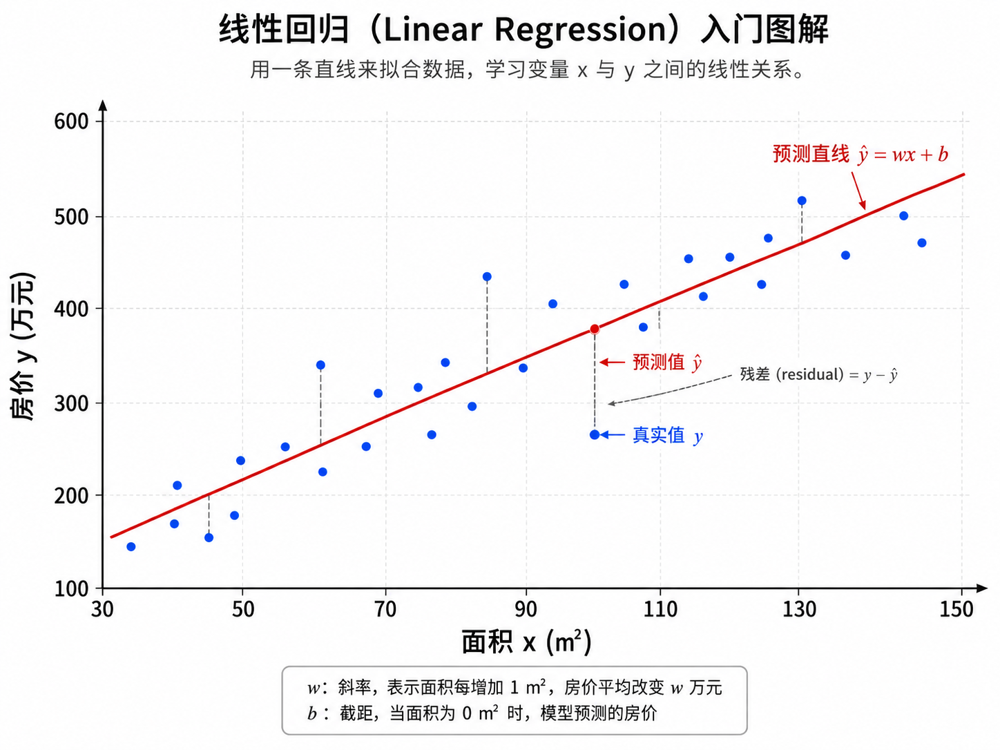
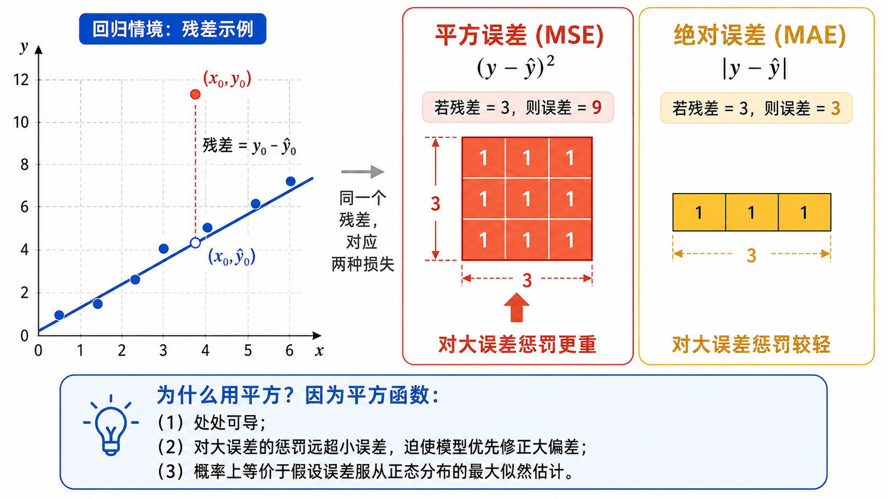
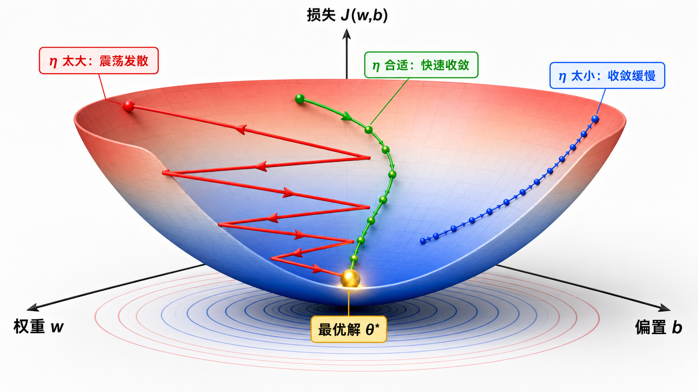
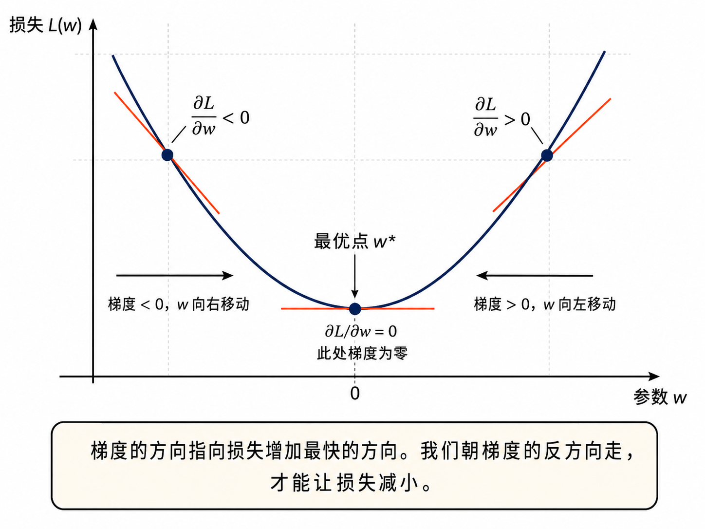

# 从线性回归理解「学习」

## 1. 什么是回归？

**回归（Regression）**是监督学习中预测**连续数值**的任务。与分类（预测离散类别）不同，回归的输出是一个实数。

以一个日常例子来理解：你想预测北京的房价。你有以下特征（features）：
- $x_1$：房屋面积（平方米）
- $x_2$：卧室数量
- $x_3$：距离地铁站的距离（米）

你的目标是预测一个连续值 $y$（房价，单位：万元）。这个任务就是回归。

回归问题的数学描述：

$$
\text{给定训练集 } \{(x^{(i)}, y^{(i)})\}_{i=1}^{n}, x^{(i)} \in \mathbb{R}^d, y^{(i)} \in \mathbb{R}
$$

$$
\text{学习一个函数 } f: \mathbb{R}^d \to \mathbb{R} \text{ 使得 } f(x^{(i)}) \approx y^{(i)}
$$

回归是机器学习中最基础也是最重要的任务之一。理解了线性回归，你就能理解「学习」的本质——**模型如何在数据驱动下自动调整参数，以最小化预测误差**。

---

## 2. 线性模型：最朴实但最有力的假设

### 2.1 标量形式

最简单的线性模型假设输出 $y$ 是输入特征的线性组合：

$$
\hat{y} = wx + b
$$

其中：
- $\hat{y}$（读作 y-hat）是模型的预测值
- $x$ 是输入特征
- $w$ 是**权重（weight）**，决定了 $x$ 每变化 1 个单位时，$\hat{y}$ 变化多少
- $b$ 是**偏置（bias）**，当 $x=0$ 时的预测值

### 2.2 多特征推广

当有 $d$ 个特征时，我们使用线性组合：

$$
\hat{y} = w_1 x_1 + w_2 x_2 + \cdots + w_d x_d + b
$$

### 2.3 矩阵形式（向量化）

将所有参数和特征写成向量，可以得到简洁的矩阵形式：

$$
\hat{y} = \mathbf{w}^T \mathbf{x} + b
$$

对于整个数据集（$n$ 个样本，$d$ 个特征），可以写成矩阵形式：

$$
\hat{\mathbf{y}} = \mathbf{X} \mathbf{w} + b \cdot \mathbf{1}
$$

其中 $\mathbf{X} \in \mathbb{R}^{n \times d}$ 是特征矩阵，$\mathbf{w} \in \mathbb{R}^{d}$ 是权重向量，$\mathbf{1} \in \mathbb{R}^{n}$ 是全 1 向量。

为了进一步简化，我们可以把偏置 $b$ 吸收进权重向量中，在 $\mathbf{X}$ 中添加一列全 1：

$$
\tilde{\mathbf{y}} = \tilde{\mathbf{X}} \tilde{\mathbf{w}}, \quad
\tilde{\mathbf{X}} = [\mathbf{X} \;\; \mathbf{1}] \in \mathbb{R}^{n \times (d+1)}, \quad
\tilde{\mathbf{w}} = \begin{bmatrix} \mathbf{w} \\ b \end{bmatrix} \in \mathbb{R}^{d+1}
$$

这种紧凑形式在大规模计算（如深度学习框架中）非常有用。

---

## 3. 损失函数：如何衡量「好」与「坏」

有了模型，我们需要一种方式来量化模型的预测到底有多「好」或有多「差」。这就是**损失函数（Loss Function）**的作用。

### 3.1 均方误差（MSE）

在线性回归中，最常用的是**均方误差（Mean Squared Error, MSE）**：

$$
J(w, b) = \frac{1}{n} \sum_{i=1}^{n} \left( \hat{y}^{(i)} - y^{(i)} \right)^2
      = \frac{1}{n} \sum_{i=1}^{n} \left( w x^{(i)} + b - y^{(i)} \right)^2
$$

用矩阵形式表示：

$$
J(\mathbf{w}) = \frac{1}{n} \|\mathbf{X}\mathbf{w} - \mathbf{y}\|^2_2
$$

### 3.2 为什么用平方误差而不是绝对值？

这是一个值得深入思考的问题。让我们比较两种候选：

- **绝对值误差（MAE）**：$|\hat{y} - y|$ —— 对所有误差一视同仁
- **平方误差（MSE）**：$(\hat{y} - y)^2$ —— 对大误差给予更大的惩罚

选择平方误差的关键原因：

1. **可微性**：绝对值函数在 $x=0$ 处不可导，而平方函数处处光滑可导。这使得我们可以使用梯度下降法来优化。

2. **对大误差更敏感**：平方函数放大了大误差的惩罚。一个误差为 10 的样本，在 MSE 中的惩罚是 100，在 MAE 中仅为 10。对于回归任务，大偏差通常意味着模型质量明显下降，应受到更强的纠正。

3. **概率解释**：如果假设误差服从正态分布 $\epsilon \sim \mathcal{N}(0, \sigma^2)$，那么最小化 MSE 等价于最大似然估计（MLE）。

4. **凸性**：MSE 是关于参数 $(w, b)$ 的凸函数，意味着只有一个全局最小值，不会被卡在局部最小值中。

### 3.3 MSE 的几何意义

在几何上，线性回归是在寻找一个超平面，使得所有数据点到该超平面的竖直距离（残差）的平方和最小。这被称为**最小二乘法（Ordinary Least Squares, OLS）**。

对于二维情况（$d=1$），我们寻找的是一条直线，使得所有数据点到直线的竖直距离平方和最小。

---

## 4. 梯度下降：「走下坡路」的智慧

### 4.1 直觉

想象你蒙着眼睛站在一座山上，目标是走到山谷的最低点。你唯一的信息是脚下的坡度（斜率）。一个自然的策略是：每次都朝最陡的下坡方向走一小步，重复直到你感觉地面变平了。这就是梯度下降的核心思想。

### 4.2 数学表述

梯度下降的更新规则：

$$
\theta_{t+1} = \theta_t - \eta \cdot \nabla_\theta J(\theta_t)
$$

其中 $\eta$（eta）是**学习率**，控制每一步的大小。$\nabla_\theta J(\theta_t)$ 是损失函数在 $\theta_t$ 处的梯度。

### 4.3 推导 MSE 的梯度

对于简单的一元线性模型 $\hat{y} = wx + b$，MSE 损失为：

$$
J(w, b) = \frac{1}{n} \sum_{i=1}^{n} (w x^{(i)} + b - y^{(i)})^2
$$

**对 $w$ 求偏导**（链式法则）：

$$
\begin{aligned}
\frac{\partial J}{\partial w}
&= \frac{1}{n} \sum_{i=1}^{n} 2 \cdot (w x^{(i)} + b - y^{(i)}) \cdot x^{(i)} \\
&= \frac{2}{n} \sum_{i=1}^{n} (\hat{y}^{(i)} - y^{(i)}) \cdot x^{(i)}
\end{aligned}
$$

**对 $b$ 求偏导**：

$$
\begin{aligned}
\frac{\partial J}{\partial b}
&= \frac{1}{n} \sum_{i=1}^{n} 2 \cdot (w x^{(i)} + b - y^{(i)}) \cdot 1 \\
&= \frac{2}{n} \sum_{i=1}^{n} (\hat{y}^{(i)} - y^{(i)})
\end{aligned}
$$

梯度下降更新：

$$
w \leftarrow w - \eta \cdot \frac{\partial J}{\partial w}
$$
$$
b \leftarrow b - \eta \cdot \frac{\partial J}{\partial b}
$$

---

## 5. 正规方程：封闭解

对于线性回归，我们不仅可以梯度下降，还可以直接求出解析解。

### 5.1 推导

将损失函数写成矩阵形式：

$$
J(\mathbf{w}) = \frac{1}{n} (\mathbf{X}\mathbf{w} - \mathbf{y})^T (\mathbf{X}\mathbf{w} - \mathbf{y})
$$

对 $\mathbf{w}$ 求梯度并令其为零：

$$
\nabla_{\mathbf{w}} J = \frac{2}{n} \mathbf{X}^T (\mathbf{X}\mathbf{w} - \mathbf{y}) = 0
$$

解得：

$$
\mathbf{w}^* = (\mathbf{X}^T \mathbf{X})^{-1} \mathbf{X}^T \mathbf{y}
$$

这就是著名的**正规方程（Normal Equation）**。

### 5.2 梯度下降 vs. 正规方程

| 方法 | 优点 | 缺点 |
|------|------|------|
| **梯度下降** | 适用于大规模数据（$n$ 很大时仍可行）；可处理在线学习（新数据逐步加入）；容易扩展到非线性模型 | 需要选择学习率；需要多次迭代；可能收敛到局部最优点（对非凸函数） |
| **正规方程** | 不需要选择学习率；不需要迭代；一次性得到精确解 | 计算 $(\mathbf{X}^T \mathbf{X})^{-1}$ 的时间复杂度为 $O(d^3)$，$d$ 大时不可行；需要 $\mathbf{X}^T \mathbf{X}$ 可逆 |

在实际工程中，当 $n > 10^6$ 或 $d > 10^4$ 时，梯度下降通常是更好的选择。此外，梯度下降可以自然地扩展到深度学习中的非线性模型（神经网络）。

---

## 6. 从梯度下降到随机梯度下降

### 6.1 批量梯度下降（Batch GD）

每次更新使用**全部** $n$ 个样本计算梯度：

$$
\nabla J = \frac{1}{n} \sum_{i=1}^{n} \nabla \mathcal{L}^{(i)}
$$

优点：梯度计算精确，收敛稳定。
缺点：每步都要处理全部数据，当 $n$ 很大时速度慢。

### 6.2 随机梯度下降（Stochastic GD, SGD）

每次更新使用**1 个**随机样本的梯度：

$$
\nabla J \approx \nabla \mathcal{L}^{(i)}, \quad i \sim \text{Uniform}(1, n)
$$

优点：每次更新极快，可以跳出局部最优点（噪声有正则化作用）。
缺点：梯度估计有噪声，收敛路径不稳定。

### 6.3 小批量梯度下降（Mini-batch GD）

每次更新使用**一小批（batch）**样本（如 32、64、128 个）：

$$
\nabla J \approx \frac{1}{|B|} \sum_{i \in B} \nabla \mathcal{L}^{(i)}
$$

取两者之长：比 SGD 稳定，比 Batch GD 快。这是深度学习中最常用的形式。

---

## 7. 学习率的选择

学习率 $\eta$ 是最重要的超参数之一，也是最需要调参的。如图 02-02 所示：

- $\eta$ **太大**：参数更新幅度过大，可能在损失函数曲面上来回震荡，甚至发散（损失越来越大）。
- $\eta$ **太小**：收敛速度极慢，可能需要数万个 epoch 才能到达最优解附近。
- $\eta$ **适中**：在合理的时间内收敛到最小值。

实际中的学习率选择策略：
- **学习率衰减**：随着训练进行逐步减小学习率
- **学习率预热**：开始用很小学习率，逐步增大到目标值
- **自适应学习率**：每个参数有不同的学习率（Adam、RMSprop 等）

---

## 本章总结

线性回归是机器学习中最简单但最重要的模型。它教会我们：

1. **模型 = 假设空间**：线性模型假设输出是输入的线性组合
2. **损失 = 优化目标**：MSE 衡量预测与真实的差距，且具有优美的数学性质
3. **梯度下降 = 优化方法**：沿着损失函数的梯度方向，一步步走向最优解
4. **正规方程 = 解析解**：对于线性模型，我们甚至可以直接写出最优参数的公式

这些概念构成了所有机器学习模型（包括最深的神经网络）的基础框架。第 3 章我们将看到，只需要在输出端加一个 sigmoid 函数，线性回归就能摇身一变成为分类利器——逻辑回归。

---

## 📥 Code

| File | View | Download |
|------|------|----------|
| demo.py | [Open](./code-demo) | <a href="../code/s02_linear_regression/demo.py" target="_blank" download>Download</a> |
| exercise.py | [Open](./code-exercise) | <a href="../code/s02_linear_regression/exercise.py" target="_blank" download>Download</a> |

## 参考

1. Hastie, T., Tibshirani, R., & Friedman, J. (2009). The Elements of Statistical Learning. Springer.
2. Goodfellow, I., Bengio, Y., & Courville, A. (2016). Deep Learning. MIT Press.
3. Bishop, C. M. (2006). Pattern Recognition and Machine Learning. Springer.
