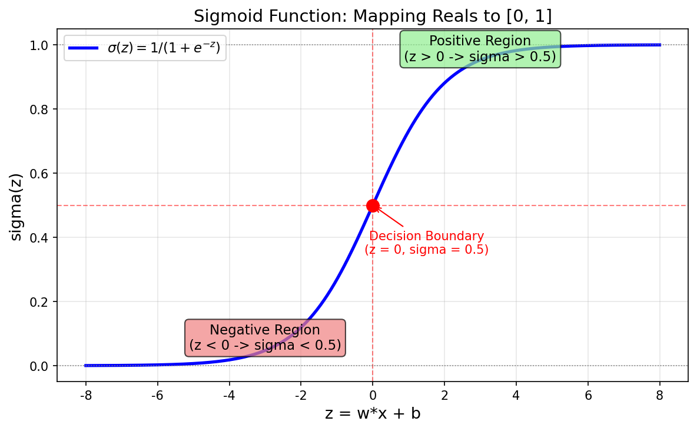
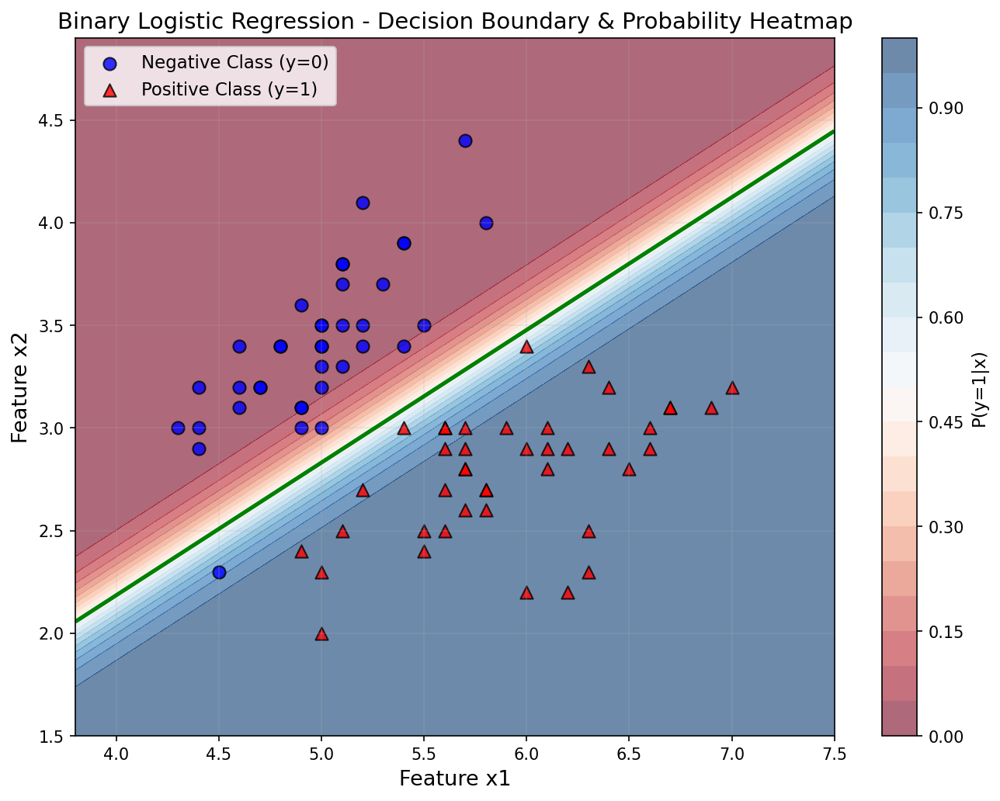
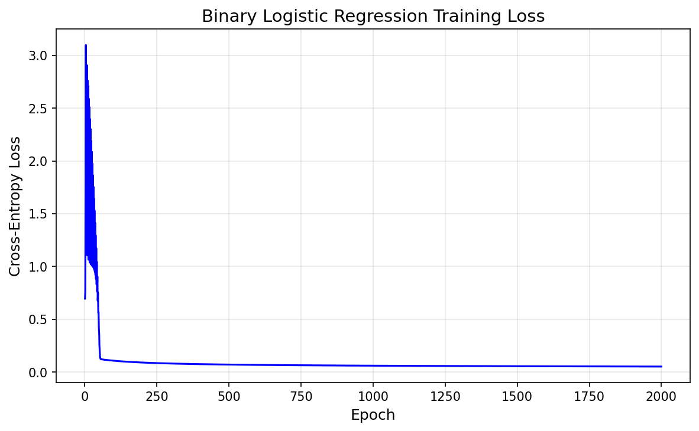
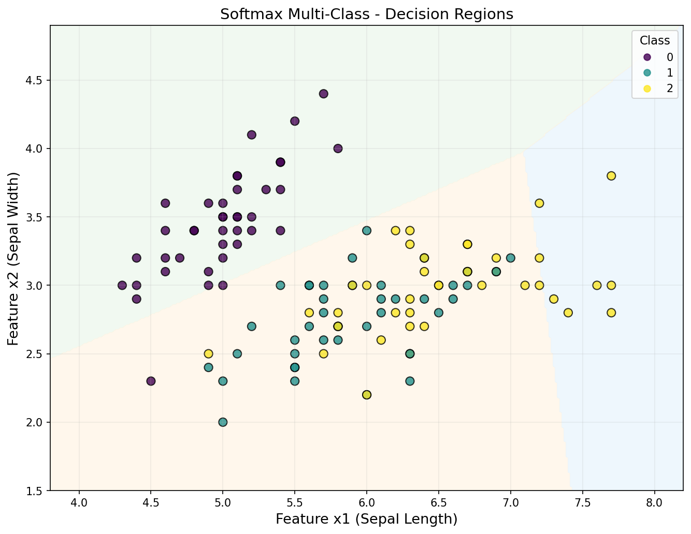

# s03 逻辑回归 -- 代码说明与运行报告

## 程序做了什么
从零实现二分类逻辑回归（Sigmoid + 交叉熵 + 梯度下降）和多分类 Softmax 回归，使用 Iris 数据集进行训练和评估。展示 Sigmoid 函数形态、二分类决策边界与概率热力图、多分类决策区域、以及训练损失收敛曲线。

## 运行方法
```bash
cd s03_logistic_regression/code
python demo.py
```

## 运行结果

### 输出摘要
- 数据集：Iris 数据集，150样本，4特征，3类别
- 二分类（类别0 vs 1）：测试集准确率 100%，用前2个特征即可线性分离
- 多分类（3类 Softmax）：测试集准确率约 80%（仅用2个特征，3类有重叠）
- 关键数学事实：Sigmoid + 交叉熵的梯度 = y_pred - y，极其简洁

### 生成图表

#### 图表 1: Sigmoid 函数曲线

**说明了什么：** Sigmoid 将任意实数 z 映射到 (0,1) 区间，z=0 处输出 0.5（决策边界）。z>0（正类区域）时输出趋近 1，z<0（负类区域）时输出趋近 0。曲线的 S 形特性使得模型在远离边界时的预测非常"自信"，在边界附近则呈概率梯度变化。

#### 图表 2: 二分类决策边界与概率热力图

**说明了什么：** 背景热力图（红=高概率正类，蓝=高概率负类）展示了模型在整个特征空间中的"置信度"分布。绿色线（σ=0.5 等高线）即决策边界，将两类数据点线性分离。边界附近的区域概率在 0.5 左右渐变，远离边界则概率迅速饱和到 0 或 1。

#### 图表 3: 训练损失曲线

**说明了什么：** 交叉熵损失随训练轮数单调下降，表明梯度下降正在有效优化。交叉熵损失的凸性保证了逻辑回归的梯度下降能收敛到全局最优。

#### 图表 4: Softmax 多分类决策区域

**说明了什么：** 三色背景区域分别表示三个类别的预测区域。Softmax 将 Sigmoid 的二分类逻辑推广到多分类：每个类别得到一个概率，模型选择概率最大的类别作为预测。图中可见类别0（setosa）与另外两类线性可分，而类别1和2的部分重叠导致了准确率下降。

## 代码结构
- `sigmoid()` / `softmax()` -- 激活函数实现
- `class LogisticRegression` -- 二分类逻辑回归，包含 `_predict_proba()`、`predict()`、`_compute_loss()`、`_compute_gradients()`、`fit()`
- `class SoftmaxRegression` -- 多分类 Softmax 回归，使用 one-hot 标签和交叉熵损失
- `plot_sigmoid_curve()` -- 绘制 Sigmoid 函数曲线及正/负类区域标注
- `plot_decision_boundary()` -- 绘制概率热力图 + 决策边界
- `plot_loss_curve()` -- 绘制训练损失曲线
- `main()` -- 主流程

## 运行环境
- Python 依赖: numpy, matplotlib, scikit-learn
- 硬件需求: CPU 即可
- 预计运行时间: < 15 秒
