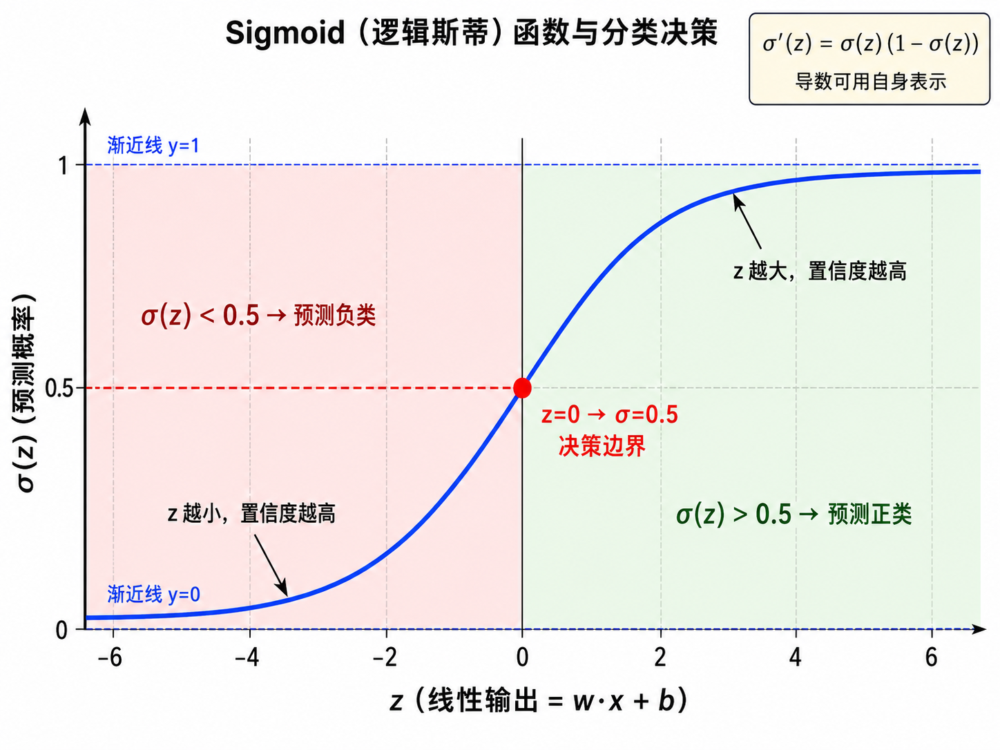
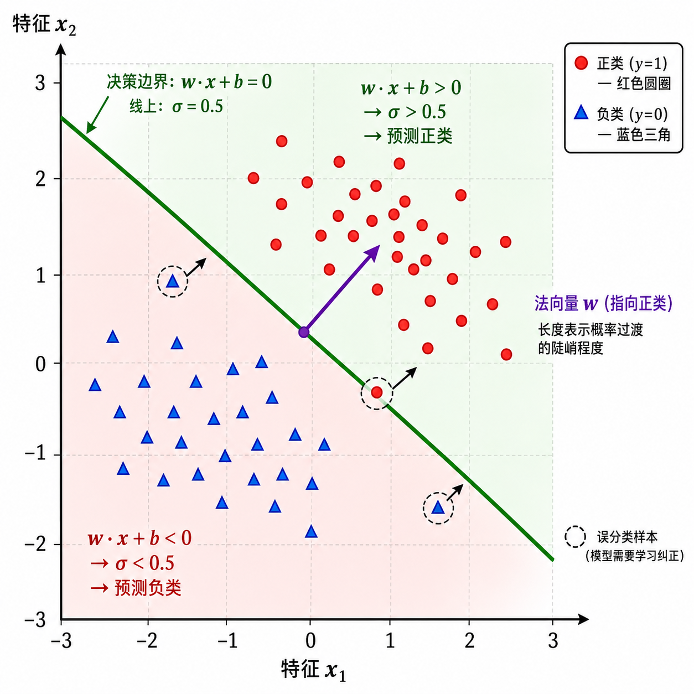
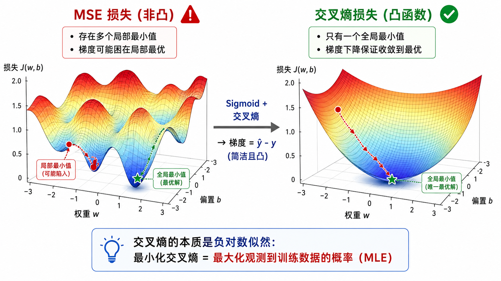

# 逻辑回归与分类

## 1. 从回归到分类

在前一章中，我们学习了线性回归——预测一个连续的数值。但现实中很多问题需要回答「是」或「否」：

- 这封邮件是垃圾邮件吗？（是/否）
- 这个肿瘤是恶性的吗？（是/否）
- 这张图片是猫还是狗？（猫/狗）

这些问题属于**分类（Classification）**。分类的目标是将输入 $x$ 分配到 $K$ 个离散类别中的一个。

### 为什么不能直接用线性回归做分类？

假设我们尝试用一个线性模型 $f(x) = wx + b$ 来做二分类。我们设定标签 $y=1$ 表示正类，$y=0$ 表示负类。我们可能遇到以下问题：

1. **输出范围不对**：线性模型的输出可能是任意实数（$-\infty$ 到 $+\infty$），而我们需要一个介于 0 和 1 之间的值来表示「属于正类的概率」。

2. **对异常值敏感**：一个极端的数据点可能大幅拉扯决策边界。在分类问题中，一个点只要被正确放在了边界的一侧即可，不应要求预测值「逼近」标签。

3. **决策边界的解释**：我们希望 $\hat{y} > 0.5$ 时判为正类，$\hat{y} < 0.5$ 时判为负类。线性回归的输出无法满足这种概率解释。

解决方案：给线性模型的输出套上一个**非线性函数**，将其「压缩」到 $(0, 1)$ 区间。这个函数就是 Sigmoid。

---

## 2. Sigmoid 函数：从实数到概率

### 2.1 定义

Sigmoid 函数（也称 logistic 函数）的定义为：

$$
\sigma(z) = \frac{1}{1 + e^{-z}}
$$

其中 $z = \mathbf{w}^T \mathbf{x} + b$ 是线性模型的输出。

### 2.2 关键性质

**值域**：$\sigma(z) \in (0, 1)$。当 $z \to +\infty$ 时 $\sigma(z) \to 1$；当 $z \to -\infty$ 时 $\sigma(z) \to 0$。

**对称性**：$\sigma(-z) = 1 - \sigma(z)$。将得分取反，概率恰好互补。

**导数**：Sigmoid 的导数可以用自身表示，这是其最重要的数学性质之一：

$$
\sigma'(z) = \sigma(z)(1 - \sigma(z))
$$

这个优美的性质使得在反向传播中计算梯度变得异常简单。

**中心点**：当 $z = 0$ 时，$\sigma(0) = 0.5$，这正好对应决策边界（$wx + b = 0$）。

### 2.3 逻辑回归模型

将 Sigmoid 套在线性模型上，就得到了逻辑回归模型：

$$
P(y=1|\mathbf{x}) = \hat{y} = \sigma(\mathbf{w}^T \mathbf{x} + b) = \frac{1}{1 + e^{-(\mathbf{w}^T \mathbf{x} + b)}}
$$

这个值被解释为「给定输入 $\mathbf{x}$，样本属于正类的概率」。

---

## 3. 决策边界

逻辑回归输出的是概率，但我们最终需要做出类别决策。规则很简单：

$$
\text{预测类别} = \begin{cases} 1 & \text{if } \sigma(z) \geq 0.5 \text{ 即 } z \geq 0 \\ 0 & \text{if } \sigma(z) < 0.5 \text{ 即 } z < 0 \end{cases}
$$

因此，**决策边界**是满足 $\mathbf{w}^T \mathbf{x} + b = 0$ 的所有 $\mathbf{x}$ 的集合。

### 几何解释

在二维特征空间中，$\mathbf{w}^T \mathbf{x} + b = 0$ 是一条直线（三维中是一个平面，更高维中是一个超平面）。法向量 $\mathbf{w}$ 垂直于决策边界，指向正类区域。

- 对于决策边界上方的点，$\mathbf{w}^T \mathbf{x} + b > 0$，$\sigma > 0.5$，预测为正类
- 对于决策边界下方的点，$\mathbf{w}^T \mathbf{x} + b < 0$，$\sigma < 0.5$，预测为负类

点到决策边界的**有符号距离**与 $\mathbf{w}^T \mathbf{x} + b$ 成正比，决定了预测概率的置信度。越远离边界，$\sigma$ 越接近 0 或 1——模型越「确信」。

---

## 4. 交叉熵损失：为什么不用 MSE？

### 4.1 为什么 MSE 不适合分类

对于二分类问题，如果我们仍使用 MSE 损失：

$$
J(\mathbf{w}, b) = \frac{1}{n} \sum_{i=1}^{n} (\sigma(\mathbf{w}^T \mathbf{x}_i + b) - y_i)^2
$$

会遇到一个严重问题：由于 Sigmoid 的「饱和」特性，当预测值接近 0 或 1 且标签相反时，梯度会变得极小（梯度消失），导致训练停滞。更重要的是，MSE 在参数空间中对逻辑回归是非凸的，存在多个局部最小值，梯度下降可能找不到全局最优。

### 4.2 交叉熵的引入

逻辑回归的标准损失函数是**二元交叉熵（Binary Cross-Entropy）**：

$$
\mathcal{L}(\hat{y}, y) = -[y \log(\hat{y}) + (1 - y) \log(1 - \hat{y})]
$$

对于 $n$ 个样本，总体损失为：

$$
J(\mathbf{w}, b) = -\frac{1}{n} \sum_{i=1}^{n} \left[ y_i \log(\hat{y}_i) + (1 - y_i) \log(1 - \hat{y}_i) \right]
$$

### 4.3 为什么交叉熵好？

**概率解释**：交叉熵等价于负对数似然（Negative Log-Likelihood）。最小化交叉熵 = 最大化看到训练数据的概率（MLE）。

**梯度优美**：交叉熵和 Sigmoid 搭配使用时，梯度中的 Sigmoid 导数项会被约掉，得到一个非常简洁的形式：

$$
\frac{\partial \mathcal{L}}{\partial z} = \hat{y} - y
$$

这个结果意味着：**梯度的方向就是「预测值 - 真实值」**，直观合理——预测偏高就往下调，预测偏低就往上调。

**凸性**：交叉熵损失在参数空间中是凸的（对逻辑回归而言），保证了梯度下降能找到全局最优。

---

## 5. 梯度推导

让我们推导逻辑回归 + 交叉熵的完整梯度。

### 5.1 单样本梯度

对于单个样本 $(\mathbf{x}, y)$，令 $z = \mathbf{w}^T \mathbf{x} + b$，$\hat{y} = \sigma(z)$。

损失对 $z$ 的导数（这步用到了 Sigmoid 的性质 $\sigma'(z) = \sigma(z)(1 - \sigma(z))$）：

$$
\begin{aligned}
\frac{\partial \mathcal{L}}{\partial z}
&= \frac{\partial}{\partial z} \left[ -y \log(\sigma(z)) - (1-y) \log(1-\sigma(z)) \right] \\
&= -y \cdot \frac{\sigma'(z)}{\sigma(z)} - (1-y) \cdot \frac{-\sigma'(z)}{1-\sigma(z)} \\
&= -y(1-\sigma(z)) + (1-y)\sigma(z) \\
&= \sigma(z) - y = \hat{y} - y
\end{aligned}
$$

然后利用链式法则传播到参数：

$$
\frac{\partial \mathcal{L}}{\partial \mathbf{w}} = \frac{\partial \mathcal{L}}{\partial z} \cdot \frac{\partial z}{\partial \mathbf{w}} = (\hat{y} - y) \cdot \mathbf{x}
$$

$$
\frac{\partial \mathcal{L}}{\partial b} = \frac{\partial \mathcal{L}}{\partial z} \cdot \frac{\partial z}{\partial b} = \hat{y} - y
$$

### 5.2 批量梯度

对于 $n$ 个样本，总体损失梯度为各样本梯度的平均：

$$
\frac{\partial J}{\partial \mathbf{w}} = \frac{1}{n} \sum_{i=1}^{n} (\hat{y}_i - y_i) \cdot \mathbf{x}_i
$$

$$
\frac{\partial J}{\partial b} = \frac{1}{n} \sum_{i=1}^{n} (\hat{y}_i - y_i)
$$

你会发现一个惊人的事实：**逻辑回归 + 交叉熵的梯度形式与线性回归 + MSE 的梯度形式完全相同**（都等于「预测值 - 真实值」乘以输入）！唯一的区别在于 $\hat{y}$ 的计算方式：线性回归中是 $wx+b$，逻辑回归中是 $\sigma(wx+b)$。这种一致性是交叉熵的优雅之处。

---

## 6. 多分类扩展：Softmax 回归

### 6.1 从二分类到多分类

当有 $K > 2$ 个类别时（如鸢尾花的三个品种），我们需要做一个扩展。

### 6.2 Softmax 函数

Softmax 将 $K$ 个原始得分 $\mathbf{z} = [z_1, z_2, \dots, z_K]$ 转换为概率分布：

$$
\text{softmax}(z_k) = \frac{e^{z_k}}{\sum_{j=1}^{K} e^{z_j}}
$$

它满足：
- **非负性**：每个输出 $\in (0, 1)$
- **归一性**：所有输出之和 = 1
- **保序性**：如果 $z_i > z_j$，则 $\text{softmax}(z_i) > \text{softmax}(z_j)$

![Softmax 函数：将原始得分 [2.0, 1.0, 0.1] 通过 exp 和 normalize 两步变换为概率分布 [0.66, 0.24, 0.10]](./images/03-04.png)

### 6.3 多分类交叉熵

多分类的交叉熵损失（也称 categorical cross-entropy）：

$$
\mathcal{L} = -\sum_{k=1}^{K} y_k \log(\hat{y}_k)
$$

其中 $y_k$ 是 one-hot 编码的真实标签（只有一个位置为 1，其余为 0），$\hat{y}_k$ 是 Softmax 输出的概率。这实际上是二元交叉熵的自然推广。

梯度同样简洁：

$$
\frac{\partial \mathcal{L}}{\partial z_k} = \hat{y}_k - y_k
$$

与二分类形式一致！这就是为什么交叉熵 + Sigmoid/Softmax 被称为机器学习中的「黄金搭档」。

### 6.4 One-vs-Rest 策略

另一种多分类方法是训练 $K$ 个二分类器，每个区分「类别 $k$」vs「其他所有类别」，然后取得分最高的类别。这种方法称为 One-vs-Rest (OvR)。

---

## 7. 实战案例解析

让我们用一个实例来串联所有概念——使用经典的 Iris 数据集进行花卉分类。

### 数据准备
Iris 数据集包含 150 个样本，3 个类别（Setosa, Versicolor, Virginica），4 个特征（花萼长度/宽度，花瓣长度/宽度）。为了直观展示，我们通常先取前两个特征做二维可视化。

### 二分类问题
取其中两个类别（如 Setosa vs Versicolor），训练一个逻辑回归模型。模型会学到一个决策边界直线。

### 多分类问题
取全部三个类别。我们可以选择：
- **Softmax 回归**：一个模型输出三个概率
- **One-vs-Rest**：训练三个二分类器

### 评估指标
对于分类问题，我们有比 MSE/R² 更合适的指标：
- **准确率（Accuracy）**：预测正确的比例
- **精确率（Precision）**：预测为正的样本中，真正为正的比例
- **召回率（Recall）**：真正的正样本中，被正确预测的比例
- **F1-Score**：精确率和召回率的调和平均
- **混淆矩阵（Confusion Matrix）**：直观展示各类别的预测情况

---

## 本章总结

逻辑回归虽然名字里带「回归」，但它是最经典的**分类**模型。它的核心思想简单而优美：

1. 用线性模型计算原始得分 $z = \mathbf{w}^T \mathbf{x} + b$
2. 用 Sigmoid/Softmax 将得分转化为概率
3. 用交叉熵损失来度量概率预测的质量
4. 用梯度下降（或更高级的优化器）来最小化损失

这个框架——线性变换 + 非线性激活 + 交叉熵损失——是几乎所有现代神经网络的基石。逻辑回归本质上就是一个**没有隐藏层的神经网络**。

---

## 参考

1. Bishop, C. M. (2006). Pattern Recognition and Machine Learning. Springer. Chapter 4.
2. Hastie, T., Tibshirani, R., & Friedman, J. (2009). The Elements of Statistical Learning. Springer. Chapter 4.
3. Murphy, K. P. (2012). Machine Learning: A Probabilistic Perspective. MIT Press.
