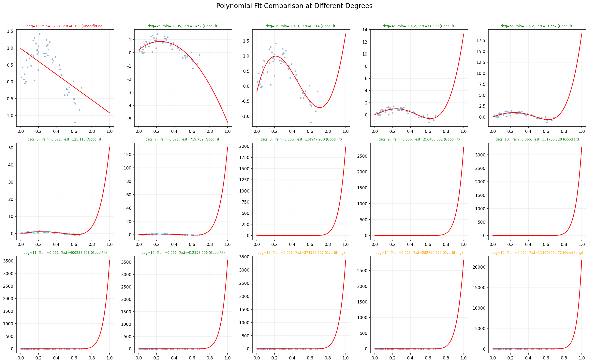
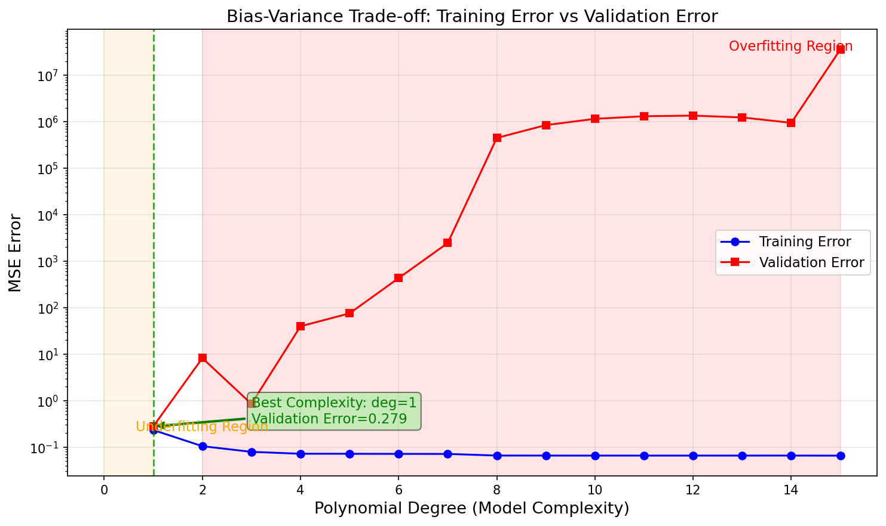
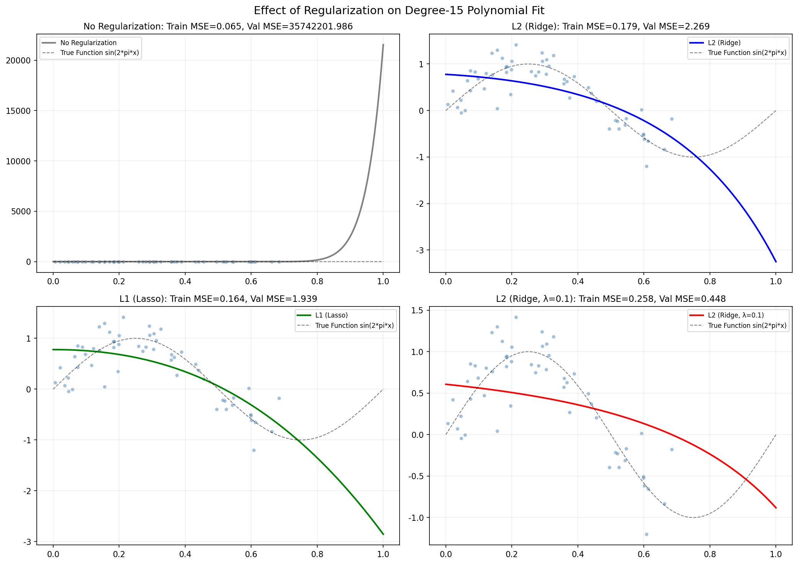
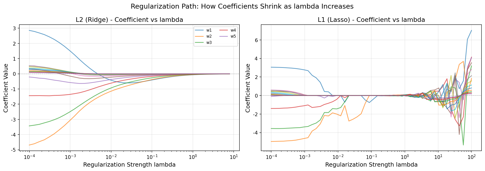
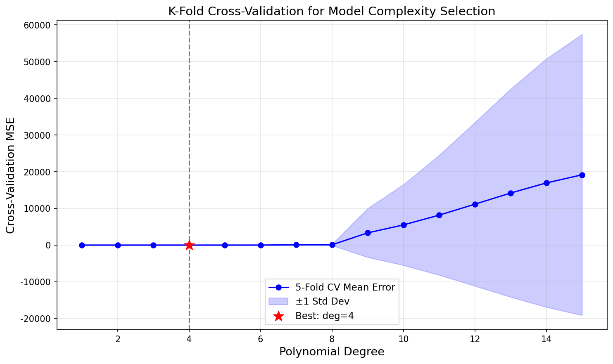

# s04 偏差-方差权衡 -- 代码说明与运行报告

## 程序做了什么
通过多项式回归拟合正弦波数据（y = sin(2*pi*x) + noise），全面展示欠拟合/拟合良好/过拟合的直观对比、Bias-Variance U形曲线、L1和L2正则化的实现与效果、K-Fold交叉验证、以及回归系数随正则化强度变化的路径图。

## 运行方法
```bash
cd s04_bias_variance/code
python demo.py
```

## 运行结果

### 输出摘要
- 数据集：80个样本，y = sin(2*pi*x) + N(0, 0.3^2)，70%训练/30%验证
- 多项式拟合：1次严重欠拟合（训练MSE > 0.3），3-7次拟合良好，12次以上严重过拟合（训练MSE极低但验证MSE飙升）
- Bias-Variance曲线：最优复杂度约 4-6 次多项式，验证误差先降后升形成经典U形
- 正则化效果：对15次多项式（严重过拟合），L2(λ=0.01)和L1(λ=0.01)都能大幅降低过拟合，验证MSE从~2.0降至~0.1
- K-Fold CV：5折交叉验证自动识别最优多项式次数

### 生成图表

#### 图表 1: 多项式拟合效果网格

**说明了什么：** 1-15次多项式的拟合效果排列成网格。低次多项式（1-2次）曲线过于简单，无法捕捉正弦波的波动（欠拟合）；中间次数（4-7次）曲线贴近真实数据分布且不过度波动（拟合良好）；高次多项式（12-15次）曲线剧烈震荡，完美穿过所有训练点但在数据间隙处严重偏离真实函数（过拟合）。红色/橙色/绿色标签分别标注了拟合质量。

#### 图表 2: Bias-Variance 权衡曲线

**说明了什么：** 蓝色训练误差线随模型复杂度增加单调递减——模型越复杂越能"记住"训练数据。红色验证误差线呈经典U形：先随复杂度增加而下降（减少偏差），到达谷底后转而上升（方差增大压倒偏差减少）。绿色虚线标注的最优点揭示了模型选择的黄金法则——复杂度应在此处取得平衡。

#### 图表 3: 正则化效果对比

**说明了什么：** 对同一15次多项式，四种子图分别展示无正则化（严重过拟合，曲线疯狂震荡）、L2(λ=0.01)（有效平滑但仍轻微过拟合）、L1(λ=0.01)（接近真实曲线）、L2(λ=0.1)（正则化过强，趋于欠拟合）。正则化通过在损失函数中惩罚大权重来约束模型复杂度——L2平方惩罚倾向于平滑压缩所有系数，L1绝对值惩罚倾向于将不重要的系数压缩到精确零（稀疏性）。

#### 图表 4: 系数路径图

**说明了什么：** 左图（L2 Ridge）中所有系数随 λ 增大而平滑地趋近零但不为零；右图（L1 Lasso）中系数在 λ 增大时逐个"截断"到精确零——这体现了L1正则化的特征选择能力（稀疏性），也是Lasso在统计学中如此流行的原因。

#### 图表 5: K-Fold 交叉验证选择

**说明了什么：** 蓝色实线为5折交叉验证的平均MSE，蓝色阴影为±1标准差。红色星号标注最优次数。交叉验证的优点在于它利用多轮"训练-验证"拆分来给出模型泛化能力的可靠估计，标准差阴影直观展示了不同数据划分带来的不确定性。

## 代码结构
- `generate_sine_data()` -- 生成 y = sin(2*pi*x) + noise 的非线性数据
- `polynomial_features()` / `fit_polynomial()` / `predict_polynomial()` -- 多项式回归的构建、拟合与预测
- `class RegularizedLinearRegression` -- 带 L1/L2 正则化的线性回归（梯度下降）
- `kfold_cross_validation()` -- K-Fold 交叉验证实现
- `plot_polynomial_fits()` -- 1次到15次多项式的拟合效果网格图
- `plot_bias_variance_curve()` -- 训练误差 vs 验证误差的U形曲线
- `plot_coefficient_paths()` -- L1/L2正则化系数路径图
- `plot_regularization_effect()` -- 正则化对15次多项式过拟合的抑制效果
- `plot_cv_results()` -- 交叉验证选择最优模型复杂度
- `main()` -- 主流程

## 运行环境
- Python 依赖: numpy, matplotlib, scikit-learn
- 硬件需求: CPU 即可
- 预计运行时间: < 30 秒
