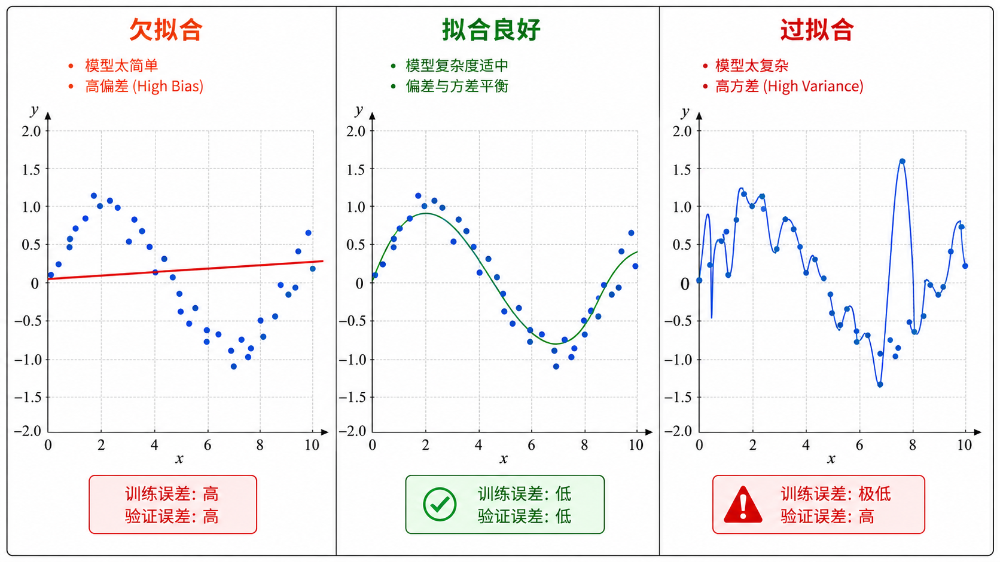
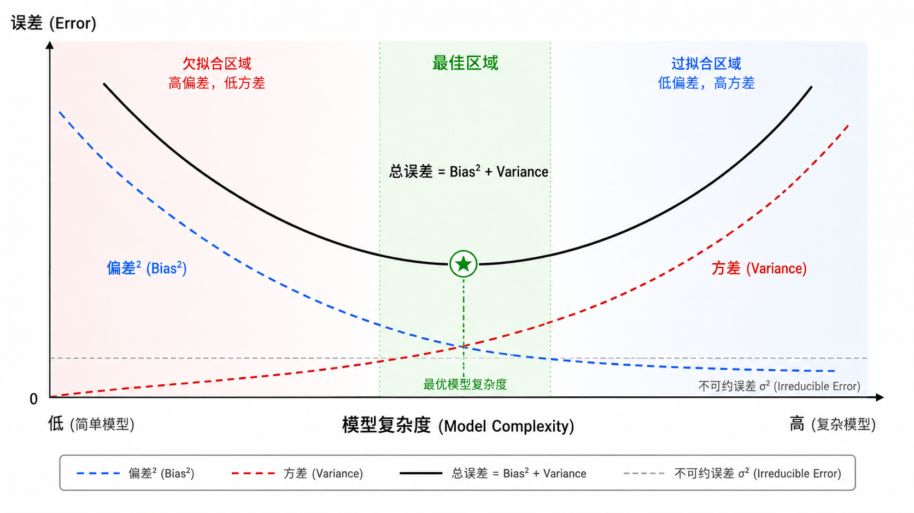
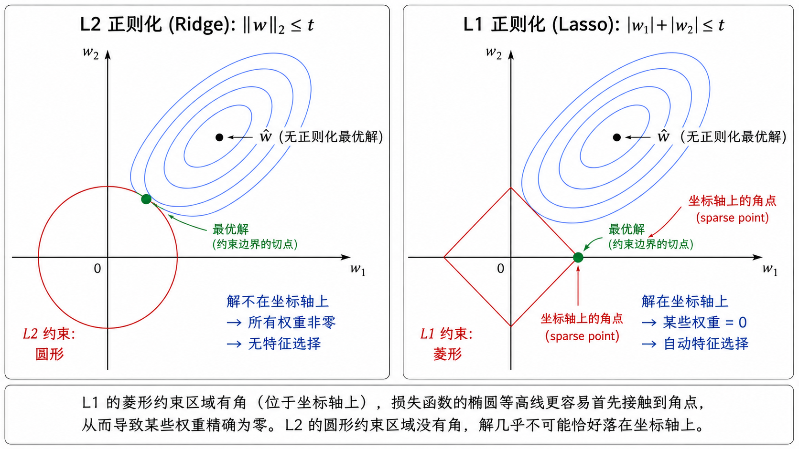
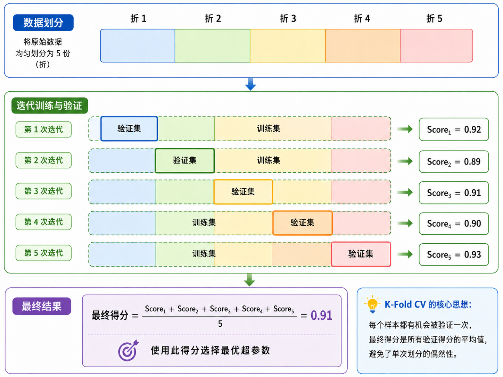

# 过拟合、正则化与 Bias-Variance 权衡

## 1. 过拟合与欠拟合：经典的「度」的问题

机器学习中最核心的挑战之一，不是让模型在训练数据上表现好，而是让模型在**从未见过的数据**上也表现好。这就是**泛化（Generalization）**问题。

### 1.1 三个状态

以多项式回归为例，用不同次数的多项式去拟合一组带有噪声的 sin 函数数据：

- **欠拟合（Underfitting）**：使用次数太低的多项式（如 1 次，即直线）。模型太简单，无法捕捉数据中的非线性规律。**训练误差高，验证误差也高。**

- **拟合良好（Good Fit）**：使用适当次数的多项式（如 3 次）。模型恰好捕捉到数据的趋势，但又不被噪声干扰。**训练误差和验证误差都低。**

- **过拟合（Overfitting）**：使用次数太高的多项式（如 15 次）。模型「记住」了每个训练数据点（包括噪声），曲线剧烈震荡。**训练误差极低，但验证误差很高。**

$$
\text{欠拟合} \quad\longleftarrow\quad \text{最佳拟合} \quad\longrightarrow\quad \text{过拟合}
$$



### 1.2 为什么会过拟合？

从数学角度看，过拟合是因为模型的**容量（capacity）**超出了数据所能支持的复杂度。一个拥有过多参数的模型，会在参数空间中找到一个恰好「穿过」所有训练点的解，但这个解对数据中的噪声极其敏感。

从直觉上理解：假设你是一个学生，考试前「背下了所有习题的答案」（过拟合）vs「理解了背后的原理」（好的泛化）。前者在旧题上得满分，但遇到新题就束手无策。

---

## 2. Bias-Variance 分解：误差从何而来？

### 2.1 核心公式

任何监督学习模型的期望泛化误差可以被分解为三个部分：

$$
\mathbb{E}[(y - \hat{f}(x))^2] =
\underbrace{(\mathbb{E}[\hat{f}(x)] - f(x))^2}_{\text{Bias}^2} \;+\;
\underbrace{\mathbb{E}[(\hat{f}(x) - \mathbb{E}[\hat{f}(x)])^2]}_{\text{Variance}} \;+\;
\underbrace{\sigma^2}_{\text{Irreducible Error}}
$$

让我们逐项理解：

- **Bias²（偏差的平方）**：模型在不同训练集上的平均预测与真实函数之间的差距。反映了**模型的表达能力是否足够**。高偏差意味着模型「没学进去」——欠拟合。

- **Variance（方差）**：模型在不同训练集上的预测值之间的差异程度。反映了**模型对训练数据的敏感度**。高方差意味着模型「学过头了」——过拟合。

- **Irreducible Error（不可约误差）** $\sigma^2$：数据本身包含的噪声。这是理论上最好的模型也无法消除的误差（因为 $y = f(x) + \epsilon$，$\epsilon$ 是随机噪声）。

### 2.2 经典的 Bias-Variance 权衡

传统理论认为，Bias 和 Variance 之间存在一个不可兼得的权衡（trade-off）：

- **简单模型**（如线性回归）：高 Bias，低 Variance。对数据不敏感，预测稳定但可能不准。
- **复杂模型**（如深层神经网络）：低 Bias，高 Variance。可以拟合任意函数，但预测不稳定（不同训练集得到差异很大的模型）。

总误差的曲线通常是一个 U 形：

```
误差
  ^
  |     \                /
  |      \   总误差     /
  |       \   (U形)    /
  |        \    \/    /
  |         \   /\   /
  |  Bias²   \ /  \ /   Variance
  |  (递减)   X    X   (递增)
  |          / \  / \
  +-------------------------> 模型复杂度
         最优复杂度
```



### 2.3 数学推导（选读）

设真实函数为 $f(x)$，训练得到的模型为 $\hat{f}(x)$，$y = f(x) + \epsilon$ 其中 $\mathbb{E}[\epsilon] = 0$，$\text{Var}(\epsilon) = \sigma^2$。

展开 MSE 期望：

$$
\begin{aligned}
\mathbb{E}[(y - \hat{f})^2]
&= \mathbb{E}[(f + \epsilon - \hat{f})^2] \\
&= \mathbb{E}[(f - \hat{f})^2] + \mathbb{E}[\epsilon^2] + 2\mathbb{E}[\epsilon(f - \hat{f})] \\
&= \mathbb{E}[(f - \hat{f})^2] + \sigma^2 \quad (\because \mathbb{E}[\epsilon] = 0)
\end{aligned}
$$

接下来，引入 $\mathbb{E}[\hat{f}]$（在所有可能训练集上 $\hat{f}$ 的期望），通过加减这个中间量：

$$
\begin{aligned}
\mathbb{E}[(f - \hat{f})^2]
&= \mathbb{E}[(f - \mathbb{E}[\hat{f}] + \mathbb{E}[\hat{f}] - \hat{f})^2] \\
&= (f - \mathbb{E}[\hat{f}])^2 + \mathbb{E}[(\mathbb{E}[\hat{f}] - \hat{f})^2] + 2(f - \mathbb{E}[\hat{f}])\mathbb{E}[\mathbb{E}[\hat{f}] - \hat{f}]
\end{aligned}
$$

由于 $\mathbb{E}[\mathbb{E}[\hat{f}] - \hat{f}] = 0$，交叉项消失。最终得到：

$$
\mathbb{E}[(y - \hat{f})^2] = \underbrace{\text{Bias}[\hat{f}]^2}_{\text{偏差}^2} + \underbrace{\text{Var}[\hat{f}]}_{\text{方差}} + \underbrace{\sigma^2}_{\text{不可约误差}}
$$

---

## 3. 正则化：约束模型的复杂度

既然过拟合源于模型过于复杂，一种自然的思路就是**在训练过程中对模型的复杂度施加惩罚**。这就是正则化的核心思想。

### 3.1 L2 正则化（Ridge 回归）

在原始损失函数上加上权重的 L2 范数（平方和）的惩罚项：

$$
J_{\text{Ridge}}(\mathbf{w}) = J(\mathbf{w}) + \lambda \|\mathbf{w}\|_2^2 = J(\mathbf{w}) + \lambda \sum_{j=1}^{d} w_j^2
$$

**效果**：$\lambda$ 越大，权重被「压缩」得越厉害。L2 正则化使得所有权重都趋近于 0，但一般不会恰好为 0（除非 $\lambda \to \infty$）。

**几何直觉**：L2 正则化相当于在参数空间中添加一个以原点为中心的超球面约束。梯度下降时，参数既被梯度的方向「牵引」，又被约束边界「弹回」。

**梯度**：

$$
\nabla_{\mathbf{w}} J_{\text{Ridge}} = \nabla_{\mathbf{w}} J + 2\lambda \mathbf{w}
$$

这个额外的 $2\lambda \mathbf{w}$ 项也被称为**权重衰减（weight decay）**，因为它在每次更新中都把权重往 0 的方向「拉」了一把。

### 3.2 L1 正则化（Lasso 回归）

L1 正则化使用权重的绝对值之和作为惩罚：

$$
J_{\text{Lasso}}(\mathbf{w}) = J(\mathbf{w}) + \lambda \|\mathbf{w}\|_1 = J(\mathbf{w}) + \lambda \sum_{j=1}^{d} |w_j|
$$

**效果**：L1 正则化不仅压缩权重，更重要的是——它倾向于产生**稀疏解**（sparse solution），即许多权重恰好为 0。这使得 Lasso 具有内置的**特征选择**功能。

**几何直觉**：L1 的约束区域在参数空间中是菱形（而不是圆形）。损失函数的等高线与菱形的角（坐标轴上）最先接触的概率最大，而落在坐标轴上意味着某些权重精确为 0。



### 3.3 ElasticNet

ElasticNet 结合了 L1 和 L2：

$$
J_{\text{ElasticNet}}(\mathbf{w}) = J(\mathbf{w}) + \lambda_1 \|\mathbf{w}\|_1 + \lambda_2 \|\mathbf{w}\|_2^2
$$

弹性网络兼具 Lasso 的稀疏性和 Ridge 的数值稳定性，在实践中非常流行。

### 3.4 选择指南

| 场景 | 推荐方法 |
|------|----------|
| 特征很多但只有少数真正重要 | Lasso (L1) |
| 所有特征都有一定贡献 | Ridge (L2) |
| 特征数多于样本数，或特征高度相关 | ElasticNet |
| 需要可解释的稀疏模型 | Lasso (L1) |
| 追求预测精度 | ElasticNet 或 Ridge |

---

## 4. 交叉验证：如何选择超参数

正则化参数 $\lambda$ 需要被合理选择——太小无法抑制过拟合，太大导致欠拟合。如何找到最优的 $\lambda$？

### 4.1 K-Fold 交叉验证

K-Fold 交叉验证（K-Fold Cross-Validation）是选择超参数的标准方法：

1. 将数据随机分成 $K$ 个等大的「折（fold）」
2. 对于每一折:
   - 用其余 $K-1$ 折作为训练集
   - 用当前折作为验证集
   - 训练模型并记录验证集上的性能
3. 报告 $K$ 次验证性能的平均值



### 4.2 如何选择 K

- **$K = 5$ 或 $K = 10$**：最常用的选择。在偏差-方差之间取得良好平衡。
- **$K = n$（留一交叉验证，LOOCV）**：每次留一个样本验证。方差大但偏差小。计算成本高，适合小数据集。
- **$K = 2$（简单 50/50 划分）**：训练集不够大时，偏差可能较高。

### 4.3 嵌套交叉验证

如果需要同时选择模型类型和超参数（如选择是用 Ridge 还是 Lasso，以及对应的 $\lambda$），应该使用**嵌套交叉验证**：外层循环评估模型性能，内层循环选择最优超参数。避免「用同一个测试集既选参数又评估性能」的信息泄露。

---

## 5. 双重下降现象：现代的观察

传统智慧告诉我们 Bias 和 Variance 之间存在 U 形权衡。但 2019 年以来，研究者们发现了一个反直觉的现象——**双重下降（Double Descent）**：

在模型复杂度超过训练数据量的「插值阈值（interpolation threshold）」时，测试误差不仅不上升，反而会**再次下降**。这意味着：

- 在复杂度刚好等于样本数时，误差达到峰值（传统上认为这里过拟合最严重）
- 当模型大到一定程度（参数量远超样本数）时，误差反而下降

这一现象在现代深度学习中被广泛观察到：超大模型（如 GPT-3/4）即便参数量远超训练样本数，仍然表现出色。关于双重下降的完整解释仍是活跃的研究课题，但认识到它的存在可以帮助我们理解为什么现代大模型可以如此好地泛化。

---

## 6. 实战诊断指南

### 如何判断模型是欠拟合还是过拟合？

| 症状 | 诊断 | 处方 |
|------|------|------|
| 训练误差高 + 验证误差高 | 欠拟合 | 增加模型复杂度、添加特征、减少正则化 |
| 训练误差低 + 验证误差高 | 过拟合 | 增加数据、添加正则化、降低模型复杂度、早停 |
| 训练误差低 + 验证误差低 | 拟合良好 | 可以继续微调优化 |
| 训练误差高 + 验证误差低 | 数据分布不一致 | 检查训练/验证集划分、数据泄露 |

### 如何系统性地解决过拟合？

1. **更多数据**：最有效的方法。如果获取更多数据不可行，考虑数据增强（对图像旋转、裁剪、加噪声等）
2. **正则化**：L1/L2 正则化、Dropout（对神经网络）、早停（early stopping）
3. **降低模型复杂度**：减少特征数量、降低多项式次数、减少神经网络层数/节点数
4. **集成方法**：Bagging、随机森林等方法通过平均多个模型降低方差
5. **交叉验证**：确保评估结果的可靠性

---

## 本章总结

Bias-Variance 权衡是理解机器学习泛化性能的核心框架：

1. **Bias** 是模型在多个训练集上的平均预测与真实值的差距——反映模型是否「学到了」
2. **Variance** 是模型在不同训练集上预测的波动——反映模型是否「学过头了」
3. **正则化** 是约束模型复杂度的主要工具——L1 产生稀疏，L2 全面压缩
4. **交叉验证** 是选择超参数的标准方法——用数据本身来决定「度」在哪里
5. **双重下降** 提醒我们，传统的 U 形曲线可能不适用于极端过参数化的现代模型

掌握这一章，你就掌握了机器学习模型调优的「内功心法」——不是盲目的试参数，而是有理有据地诊断和改进。

---

## 参考

1. Hastie, T., Tibshirani, R., & Friedman, J. (2009). The Elements of Statistical Learning. Springer. Chapter 7.
2. Geman, S., Bienenstock, E., & Doursat, R. (1992). Neural Networks and the Bias/Variance Dilemma.
3. Belkin, M., Hsu, D., Ma, S., & Mandal, S. (2019). Reconciling modern machine-learning practice and the classical bias-variance trade-off.
4. Hoerl, A. E., & Kennard, R. W. (1970). Ridge Regression: Biased Estimation for Nonorthogonal Problems.
5. Tibshirani, R. (1996). Regression Shrinkage and Selection via the Lasso.
