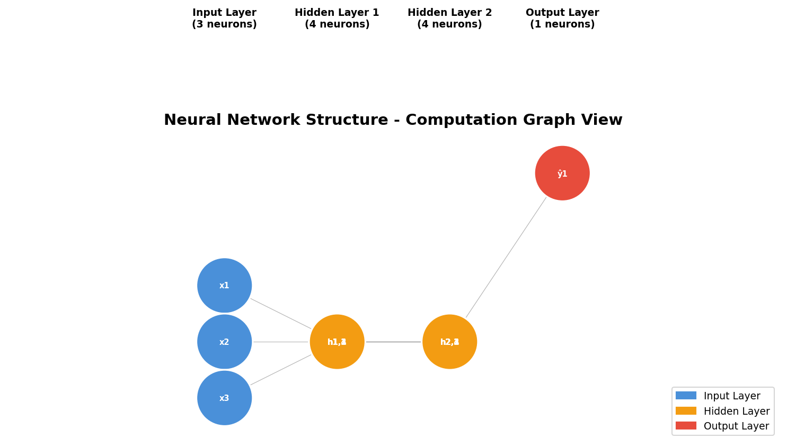
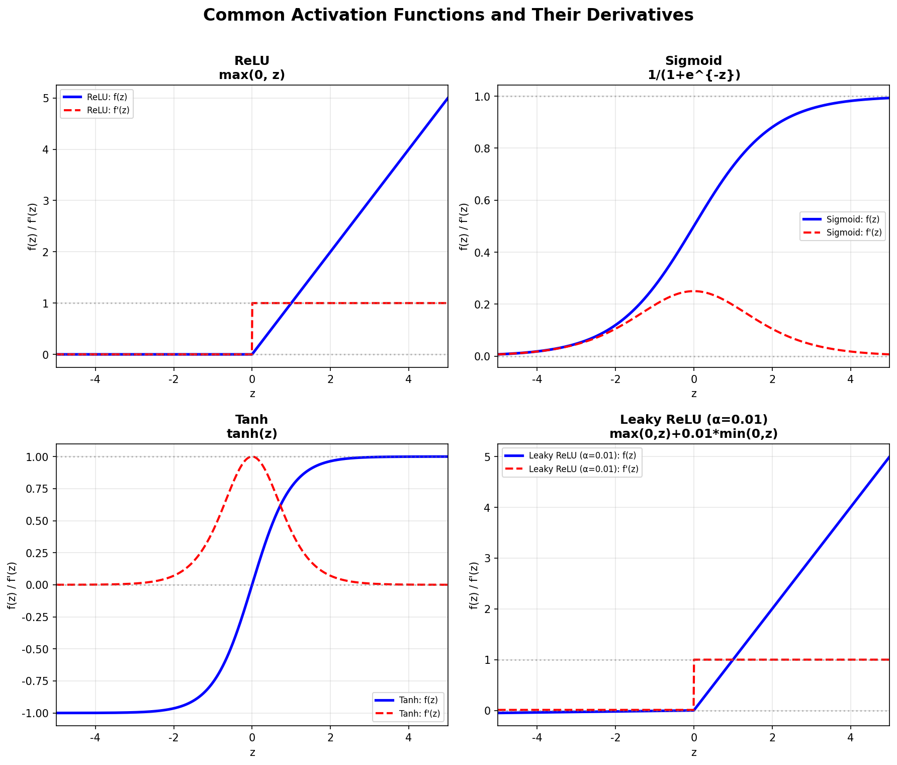
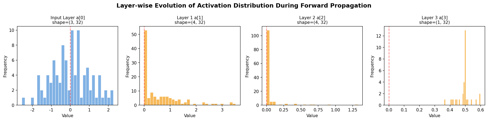

# s05 前向传播与计算图 -- 代码说明与运行报告

## 程序做了什么
用纯NumPy构建一个3层MLP（3->4->4->1），展示完整的前向传播过程。包括He参数初始化、逐层线性变换+非线性激活（ReLU/Sigmoid）、中间值缓存（cache）、张量形状追踪，以及网络结构图、激活函数对比图和激活值分布演变图的可视化。

## 运行方法
```bash
cd s05_forward_computation_graph/code
python demo.py
```

## 运行结果

### 输出摘要
- 网络结构：输入3维 -> 隐藏层1(4神经元, ReLU) -> 隐藏层2(4神经元, ReLU) -> 输出层(1神经元, Sigmoid)
- 总参数量：3*4+4 + 4*4+4 + 4*1+1 = 41个参数
- 输入：32个样本的小批量，每个样本3个特征
- 前向传播输出：每个样本一个标量预测值（Sigmoid输出，范围[0,1]）
- 每层激活值统计：min/max/mean/std 打印，用于监控激活值分布

### 生成图表

#### 图表 1: 神经网络结构图

**说明了什么：** 蓝色输入层(3神经元) -> 橙色隐藏层1(4神经元) -> 橙色隐藏层2(4神经元) -> 红色输出层(1神经元)。层间连线代表所有神经元间的全连接权重矩阵（标注了形状如 W1:4x3）。这张图直观展示了计算图的数据流向：每一层的输出是下一层的输入，形成了前馈计算的有向无环图。

#### 图表 2: 激活函数对比图

**说明了什么：** 四子图分别展示ReLU、Sigmoid、Tanh、LeakyReLU及其导数。蓝色实线为函数值，红色虚线为导数。ReLU在正区导数为1（梯度流通畅）、负区导数为0（死神经元风险）；Sigmoid和Tanh的两端导数趋近零（饱和区导致梯度消失）；LeakyReLU通过给负区一个小的正斜率(0.01)缓解了ReLU的"死亡"问题。

#### 图表 3: 前向传播数据流分布

**说明了什么：** 从输入层到输出层，每一层的激活值分布直方图展示了数据在网络中的逐层演变。He初始化配合ReLU使得隐藏层的激活值保持合理的散布（不会全部坍塌到0或爆炸），这是深度网络能成功训练的前提。输出层的Sigmoid将值压缩到[0,1]区间，符合二分类的需求。

## 代码结构
- `relu()` / `sigmoid()` / `tanh()` / `gelu_approximate()` 及对应的导数函数 -- 激活函数族
- `initialize_parameters()` -- He 初始化（W = N(0, sqrt(2/n_in)), b = 0）
- `forward_pass()` -- 执行完整前向传播，逐层计算 z = W@a_prev+b, a = activation(z)，存储cache
- `plot_network_structure()` -- 绘制网络神经元连接结构图（含权重矩阵标注）
- `plot_activation_functions()` -- 绘制4种激活函数及其导数对比
- `plot_forward_data_flow()` -- 绘制每层激活值的直方图分布演变
- `print_tensor_shape_table()` -- 打印前向传播中所有张量的形状表格
- `main()` -- 主流程

## 运行环境
- Python 依赖: numpy, matplotlib
- 硬件需求: CPU 即可
- 预计运行时间: < 5 秒
