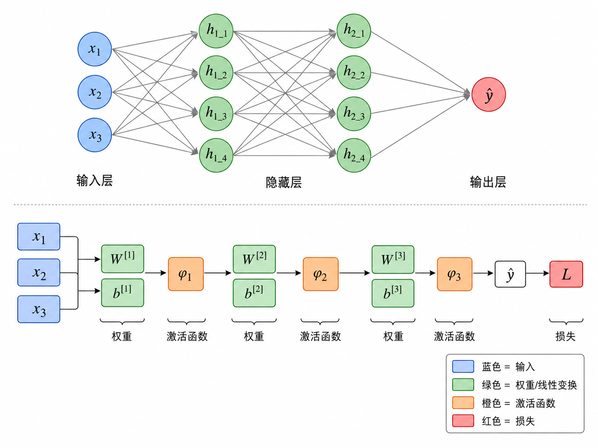
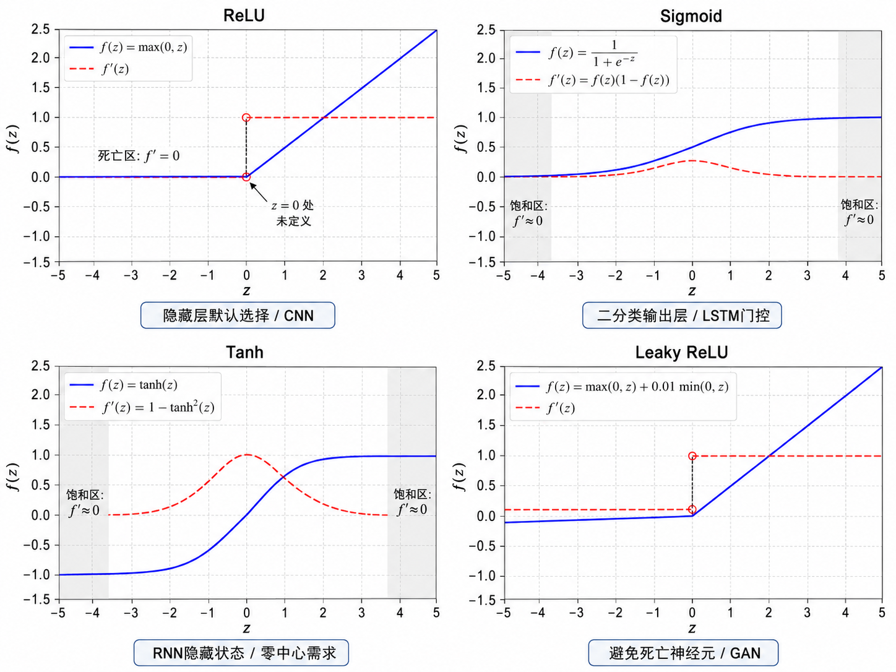
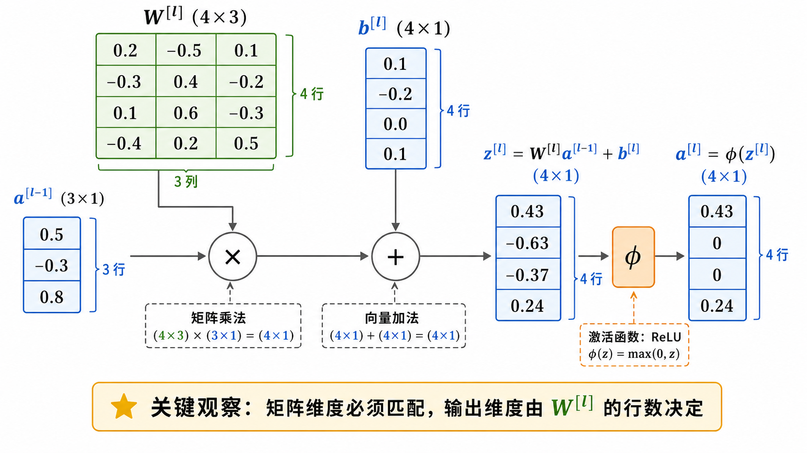
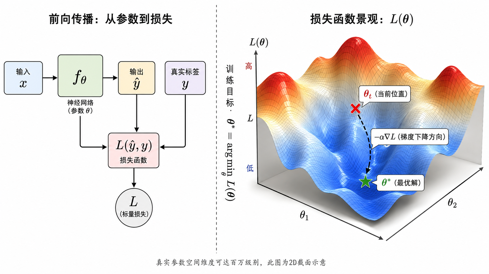

# s05 计算图与前向传播

> 神经网络的前向计算与计算图抽象 —— 理解模型如何从输入走到输出

---

## 一、神经网络：一个可组合的函数

用数学语言来说，一个有 $L$ 层的神经网络就是一个高度复合的函数：

$$
\hat{y} = f_\theta(x) = f_L \left( f_{L-1} \left( \cdots f_2 \left( f_1 (x) \right) \cdots \right) \right)
$$

其中，$\theta$ 代表模型中所有可学习的参数（权重 $W$ 和偏置 $b$），$x$ 是输入，$\hat{y}$ 是预测输出。

每一层函数 $f_l$ 通常由两部分组成：一个**线性变换**（仿射变换）和一个**非线性激活**。以第 $l$ 层为例：

$$
z^{[l]} = W^{[l]} a^{[l-1]} + b^{[l]}
$$

$$
a^{[l]} = \phi^{[l]}(z^{[l]})
$$

这里 $a^{[0]} = x$ 是网络的输入，$a^{[l]}$ 是第 $l$ 层的激活输出。$W^{[l]}$ 是权重矩阵，$b^{[l]}$ 是偏置向量，$\phi^{[l]}$ 是激活函数。

> **核心直觉**：神经网络就是把简单函数（线性变换 + 非线性激活）一层层嵌套起来。通过足够多的层和神经元，理论上可以逼近任意复杂的函数——这就是所谓的**万能逼近定理**（Universal Approximation Theorem）。



---

## 二、什么是计算图？

**计算图**（Computational Graph）是一种有向无环图（DAG），用于描述数学计算的结构：

- **节点**（Node）：代表一个操作（operation），比如加法、乘法、矩阵乘法、激活函数等。
- **边**（Edge）：代表数据（张量）在操作之间的流动方向。

计算图的核心思想是**分解**：把复杂的函数拆成一系列基本操作，每个操作只做一件简单的事。比如 $f(x) = \text{ReLU}(Wx + b)$ 可以拆成：

```
x ──→ [MatMul: W·x] ──→ [Add: +b] ──→ [ReLU] ──→ a
```

为什么计算图如此重要？三个原因：

1. **前向传播**清晰可追踪：输入数据沿着图的边一步步流动，最终得到输出。
2. **反向传播**变得简单：从输出端往回走，每个节点只需要知道自己的"局部导数规则"，就能把梯度传回去。这叫做**自动微分**（Automatic Differentiation）。
3. **框架实现**的基础：PyTorch、TensorFlow、JAX 的底层都是动态或静态地构建计算图，然后自动求导。

> 可以把计算图想象成工厂的流水线：每个工人（节点）只负责一道工序，原材料（数据）在传送带（边）上流动，最终组装成产品（输出）。



---

## 三、前向传播的完整流程

让我们跟踪一个输入样本 $x$ 经过 $L$ 层网络的前向传播过程：

### 第 0 步：输入

$$
a^{[0]} = x \quad (\text{shape: } n^{[0]} \times 1)
$$

其中 $n^{[0]}$ 是输入特征数。

### 第 $l$ 层（$l = 1, 2, \dots, L$）

**子步骤 1：线性变换**

$$
z^{[l]} = W^{[l]} a^{[l-1]} + b^{[l]}
$$

- $W^{[l]}$ 的形状为 $n^{[l]} \times n^{[l-1]}$（输出维度 × 输入维度）
- $b^{[l]}$ 的形状为 $n^{[l]} \times 1$
- $z^{[l]}$ 的形状为 $n^{[l]} \times 1$（该层的"预激活"值）

**子步骤 2：非线性激活**

$$
a^{[l]} = \phi^{[l]} \left( z^{[l]} \right)
$$

- $\phi^{[l]}$ 是逐元素（element-wise）的非线性函数
- $a^{[l]}$ 是该层的最终输出，也是下一层的输入

### 第 L+1 步：损失计算

最后一层的输出 $a^{[L]}$ 就是模型的预测 $\hat{y}$。然后计算损失：

$$
L = \ell(a^{[L]}, y)
$$

其中 $\ell$ 是损失函数（如均方误差 MSE、交叉熵 Cross-Entropy）。



---

## 四、为什么必须存储中间值？

在前向传播过程中，我们需要把每一层的中间结果存储下来——$z^{[l]}$ 和 $a^{[l]}$（以及输入 $a^{[l-1]}$）。这不是为了调试，而是为了**反向传播**。

具体来说，反向传播需要用到：

| 存储的值 | 用途 |
|---------|------|
| $z^{[l]}$ | 计算激活函数的导数 $\phi'(z^{[l]})$ |
| $a^{[l-1]}$ | 计算权重梯度 $\partial L / \partial W^{[l]} = \delta^{[l]} (a^{[l-1]})^T$ |
| $\delta^{[l+1]}$ | 递推计算 $\delta^{[l]}$（前一层误差信号） |

这就是为什么训练神经网络需要比推理时更多的显存——前向传播的中间结果必须保留到反向传播完成。

> 这叫做**计算换内存**还是**内存换计算**的经典权衡。如果你不想存中间值，可以在反向传播时重新计算（Re-materialization / Checkpointing），这样可以节省显存但增加计算量——大模型训练常用的技巧。

---

## 五、常见的激活函数

激活函数是非线性变换的核心。如果不用激活函数，多层网络等价于单层网络——因为线性变换的复合仍是线性的。

### ReLU

$$
\text{ReLU}(z) = \max(0, z)
$$

$$
\text{ReLU}'(z) = \begin{cases} 0 & z < 0 \\ 1 & z > 0 \end{cases}
$$

- **优点**：计算简单（只需比较），正区间导数为 1，不会像 sigmoid 那样饱和，深层网络训练更稳定。
- **缺点**：负区间导数为 0，神经元可能"死亡"（永远输出 0）。这个问题可以通过 Leaky ReLU 缓解。
- **适用场景**：隐藏层的默认选择，大多数 CNN 和 MLP 都优先使用。

### Sigmoid

$$
\sigma(z) = \frac{1}{1 + e^{-z}}
$$

$$
\sigma'(z) = \sigma(z)(1 - \sigma(z))
$$

- **优点**：输出在 $(0, 1)$ 之间，天然适合做概率解释。
- **缺点**：两端饱和（$z \to \pm\infty$ 时导数 $\to 0$），深层网络中容易造成梯度消失。输出不以 0 为中心，也可能影响优化效率。
- **适用场景**：二分类的**输出层**（配合二元交叉熵），或某些门控机制（如 LSTM 的遗忘门）。

### Tanh

$$
\tanh(z) = \frac{e^z - e^{-z}}{e^z + e^{-z}} = 2\sigma(2z) - 1
$$

$$
\tanh'(z) = 1 - \tanh^2(z)
$$

- **优点**：输出以 0 为中心（范围 $(-1, 1)$），比 sigmoid 更适合隐藏层。
- **缺点**：同样存在饱和问题——$|z|$ 较大时导数接近 0。
- **适用场景**：RNN/LSTM 的隐藏状态，或在需要零中心输出的场景中使用。

### Leaky ReLU

$$
\text{LeakyReLU}(z) = \max(0, z) + \alpha \cdot \min(0, z) = \begin{cases} z & z \ge 0 \\ \alpha z & z < 0 \end{cases}
$$

其中 $\alpha$ 是一个小常数（如 0.01）。

- **优点**：解决了 ReLU 的"死亡神经元"问题——负区间也有微小的梯度。
- **适用场景**：对 ReLU 死亡问题敏感的任务，或使用 GAN 等对梯度敏感的架构时。

### GELU（Gaussian Error Linear Unit）

$$
\text{GELU}(z) = z \cdot \Phi(z) \approx z \cdot \sigma(1.702z)
$$

其中 $\Phi$ 是标准正态分布的累积分布函数。

- **特点**：在 ReLU 的基础上加入了随机正则化效果——不是简单地把负值截断为 0，而是根据输入的大小"概率性地"让某些值通过。
- **适用场景**：Transformer 架构的默认激活函数（BERT、GPT 等都使用 GELU）。



---

## 六、训练目标与参数更新

### 学习的数学定义

前面说过，神经网络就是一个带参数的函数 $f_\theta$。**训练**就是在寻找最优参数 $\theta^*$，使得模型在所有训练数据上的表现最好：

$$
\theta^* = \arg\min_\theta L(\theta) = \arg\min_\theta \frac{1}{N} \sum_{i=1}^{N} \ell(f_\theta(x_i), y_i)
$$

其中 $N$ 是训练样本数，$\ell$ 是单个样本的损失。

### 梯度下降的基本思想

我们无法直接解出 $\theta^*$ 的闭式解（只有在极少数简单模型中可以）。所以采用迭代优化的方式——**梯度下降**：

$$
\theta_{t+1} = \theta_t - \alpha \nabla_\theta L(\theta_t)
$$

拆解这行公式：

- $\nabla_\theta L(\theta_t)$：损失函数在当前位置 $\theta_t$ 的**梯度**。梯度是一个向量，指向函数值**上升最快**的方向。
- $\alpha$：**学习率**（Learning Rate），控制每一步走多远。
- 前面有个负号：因为我们想**下降**（找最小值），所以沿梯度的反方向走。

### 高维地形中的"下山"

如果把 $L(\theta)$ 想象成一个高维地形（$\theta$ 的每个分量对应一个维度），训练过程就像一个人在雾中下山：

- 他只能感知脚底的地面坡度（局部梯度）。
- 他不知道山的全局形状（非凸函数）。
- 他每一步沿最陡的下坡方向走一小段（梯度下降）。
- 学习率 $\alpha$ 就是他的步长——步长太大可能摔下悬崖（发散），步长太小下山太慢。

虽然真实神经网络的损失面是极度非凸的高维流形，但实践中梯度下降及其变体通常能找到很好的局部最优解（甚至全局最优）。这是深度学习"反直觉地有效"的核心秘密之一。

> **关键认识**：反向传播的职责是回答"每个参数对当前损失有多少责任"（即高效计算 $\nabla_\theta L$）。而优化器（SGD、Adam 等）的职责是回答"知道责任之后，这一步该怎么改参数"。这两件事分工明确，但都依赖于对计算图的理解。

---

## 七、前向传播的代码实现要点

在 `code/demo.py` 中，我们用纯 NumPy 实现了一个 3 层 MLP 的前向传播。关键实现细节：

### 1. 参数初始化

权重不能初始化为全 0——那样所有神经元会学到相同的特征。通常使用：
- **He 初始化**（配合 ReLU）：$W \sim \mathcal{N}(0, \sqrt{2/n_{\text{in}}})$
- **Xavier 初始化**（配合 tanh/sigmoid）：$W \sim \mathcal{N}(0, \sqrt{1/n_{\text{in}}})$

### 2. 中间值存储

前向传播时，每一层的 $(z^{[l]}, a^{[l]})$ 必须存入 cache（以一个字典或列表的形式），供后续反向传播使用。

### 3. Batch 处理

实际训练时，数据以 mini-batch 形式传入。此时前面的公式需要微调：输入 $X$ 的形状变为 $(n^{[0]}, m)$，其中 $m$ 是 batch size。每一层的输出也从列向量变为矩阵，但计算逻辑完全一致。

---

## 八、本节小结

| 概念 | 一句话 |
|------|--------|
| 神经网络 | 线性变换 + 非线性激活的多层嵌套 |
| 计算图 | 用节点和边描述数学运算的有向无环图 |
| 前向传播 | 数据沿着计算图从输入流向输出 |
| 中间值存储 | 为反向传播保留 $z^{[l]}$ 和 $a^{[l]}$ |
| 激活函数 | 引入非线性，ReLU/sigmoid/tanh/GELU 各有适用场景 |
| 训练目标 | $\theta^* = \arg\min_\theta L(\theta)$，通过梯度下降迭代求解 |

> 下一节 [s06 反向传播与链式法则](../s06_backprop_chain_rule/) 将详细拆解：梯度如何从损失出发，沿着计算图一层层传回到每一个参数。前向传播存储的中间值，将在那里被一一"消费"。

## 📥 Code

| File | View | Download |
|------|------|----------|
| demo.py | [Open](./code-demo) | <a href="../code/s05_forward_computation_graph/demo.py" target="_blank" download>Download</a> |
| exercise.py | [Open](./code-exercise) | <a href="../code/s05_forward_computation_graph/exercise.py" target="_blank" download>Download</a> |

