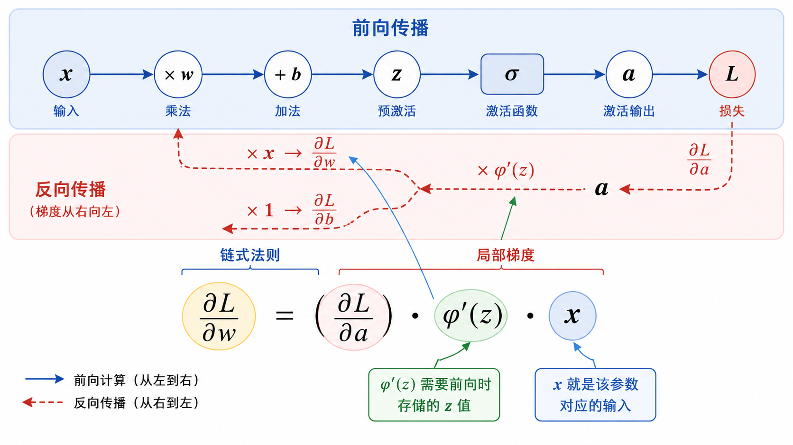
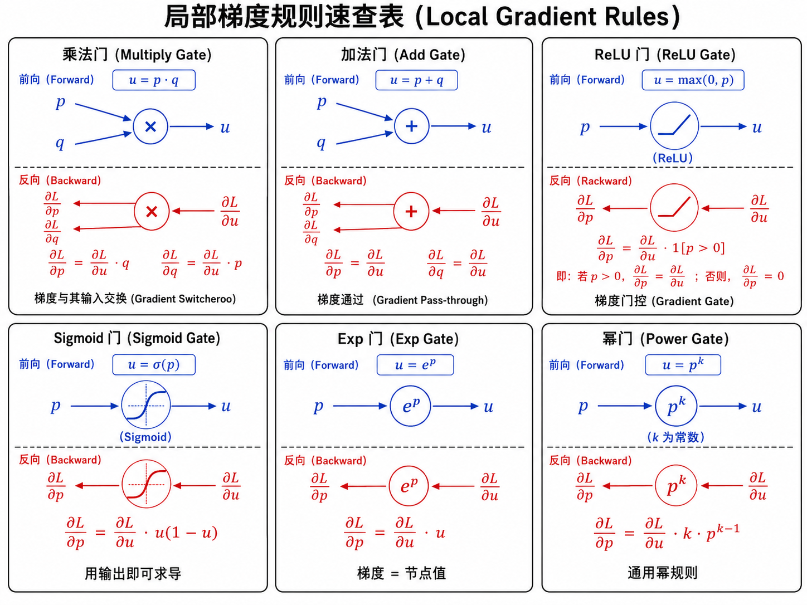
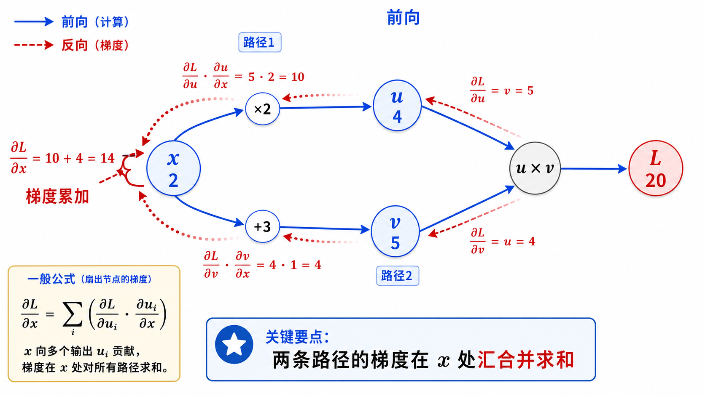
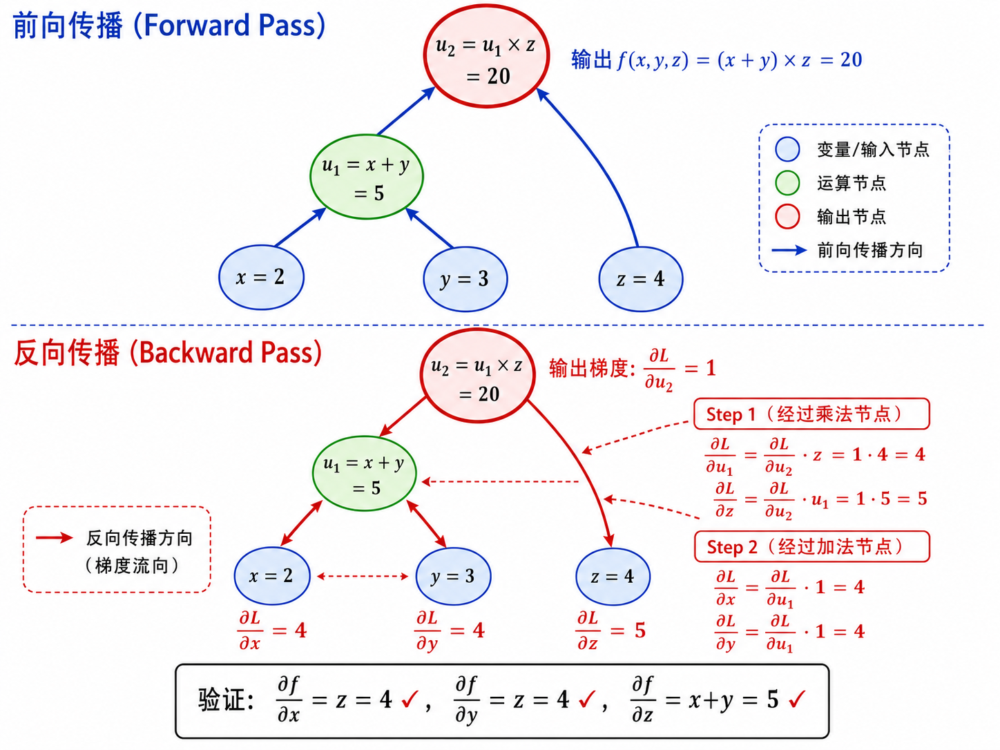

# s06 反向传播与链式法则

> 每个节点只关心自己的局部导数 —— 揭开 autograd 的魔法

---

## 一、核心问题：一个参数的微小变化如何影响损失？

在上一节 [s05 计算图与前向传播](../s05_forward_computation_graph/) 中，我们学会了把神经网络组织成计算图，前向地计算预测值和损失。现在来到训练最关键的环节：**反向传播**。

考虑一个具体的问题。神经网络中有一个权重参数 $w$，我们想知道：如果让 $w$ 增加一个微小的量 $\Delta w$，损失 $L$ 会变化多少？用数学语言：

$$
\frac{\partial L}{\partial w} = \text{?}
$$

这个偏导数就是 $w$ 的梯度。知道了它，我们就知道该往哪个方向调整 $w$ 才能让损失变小。问题是，$L$ 并不直接依赖 $w$——中间隔了很多层运算。**链式法则**就是回答"间接依赖如何传导"的数学工具。



---

## 二、链式法则：从简单神经元开始

考虑一个最小化的神经元模型：

$$
z = wx + b
$$

$$
a = \phi(z)
$$

$$
L = \ell(a, y)
$$

我们想知道 $\partial L / \partial w$。根据链式法则，将 $L$ 对 $w$ 的依赖沿着中间变量 $a$ 和 $z$ 拆开：

$$
\frac{\partial L}{\partial w}
= \frac{\partial L}{\partial a} \cdot \frac{\partial a}{\partial z} \cdot \frac{\partial z}{\partial w}
$$

逐项拆解：

- **第一项** $\dfrac{\partial L}{\partial a}$：损失对激活输出的梯度。对于 MSE 损失 $\ell(a,y) = \frac{1}{2}(a-y)^2$，这就是 $a - y$。对于交叉熵，公式会复杂一些，但原理相同。
- **第二项** $\dfrac{\partial a}{\partial z} = \phi'(z)$：激活函数的导数。这一项在 $z$ 处取值，所以前向传播时**必须存储** $z$。
- **第三项** $\dfrac{\partial z}{\partial w} = x$：因为 $z = wx + b$，对 $w$ 求偏导就是 $x$。类似地，$\partial z / \partial b = 1$。

把它们乘起来：

$$
\frac{\partial L}{\partial w}
= \underbrace{\frac{\partial L}{\partial a}}_{\text{损失梯度}}
\cdot \underbrace{\phi'(z)}_{\text{激活导数}}
\cdot \underbrace{x}_{\text{输入}}
$$

对偏置的梯度更简单：

$$
\frac{\partial L}{\partial b}
= \frac{\partial L}{\partial a} \cdot \phi'(z) \cdot 1
= \frac{\partial L}{\partial a} \cdot \phi'(z)
$$

> **直观理解**：$w$ 的梯度 = "损失对你的输出有多不满" $\times$ "激活函数在当前点的斜率" $\times$ "这个参数对应的输入值的大小"。如果输入 $x$ 很大，那么 $w$ 的梯度也大，意味着这个 $w$ 对最终结果影响大，需要更大的调整。

---

## 三、为什么叫"反向"传播？

"反向"是相对于前向传播而言的：

- **前向传播**：数据从输入流向输出（$x \to z \to a \to L$），这是计算预测值的过程。
- **反向传播**：梯度从损失流回输入（$L \to a \to z \to w$），这是计算梯度信息的过程。

反向传播的计算顺序恰好与前向相反。这不是人为规定，而是数学必然——链式法则的每一项都依赖"后面"的计算结果：

- 要算 $\partial L / \partial z$，需要先知道 $\partial L / \partial a$ 和 $\phi'(z)$
- 要算 $\partial L / \partial w$，需要先知道 $\partial L / \partial z$ 和 $x$

所以算法的自然流程是：先一路前向算到损失，再一路反向把梯度传回去。这也是为什么前向传播时要把中间值都存起来——反向时会逐个用到。

---

## 四、计算图视角：每个节点只关心自己

反向传播真正的"魔法"在于：**网络再深，每个节点只需要实现自己的局部导数规则**。

考虑计算图中的一个乘法节点：

$$
u = p \cdot q
$$

当反向传播时，这个节点收到"上游"传来的梯度 $\partial L / \partial u$。它需要做的是：算出梯度如何分配给自己的两个输入 $p$ 和 $q$。

因为 $\partial u / \partial p = q$，$\partial u / \partial q = p$，所以：

$$
\frac{\partial L}{\partial p}
= \frac{\partial L}{\partial u} \cdot \frac{\partial u}{\partial p}
= \frac{\partial L}{\partial u} \cdot q
$$

$$
\frac{\partial L}{\partial q}
= \frac{\partial L}{\partial u} \cdot \frac{\partial u}{\partial q}
= \frac{\partial L}{\partial u} \cdot p
$$

注意一个有趣的现象：**乘法门的梯度分配是"交换"的**——$p$ 的梯度乘的是 $q$ 的值，$q$ 的梯度乘的是 $p$ 的值。这在英文文献中常被称为"gradient switcheroo"。

再看加法节点：

$$
u = p + q
$$

因为 $\partial u / \partial p = 1$，$\partial u / \partial q = 1$：

$$
\frac{\partial L}{\partial p} = \frac{\partial L}{\partial u}, \quad
\frac{\partial L}{\partial q} = \frac{\partial L}{\partial u}
$$

加法门像是一个"梯度分发器"——上游梯度原样复制给每个输入。这就是为什么在 `x += y` 操作中，梯度是累积的。



---

## 五、常见操作的局部梯度规则

以下是计算图中常见操作的反向传播规则，可以当作参考卡片使用：

| 前向操作 | 局部导数 | 反向规则 |
|---------|---------|---------|
| $u = p + q$ | $\partial u/\partial p = 1$, $\partial u/\partial q = 1$ | 梯度原样传递：$\partial L/\partial p = \partial L/\partial u$ |
| $u = p - q$ | $\partial u/\partial p = 1$, $\partial u/\partial q = -1$ | $q$ 的梯度取反 |
| $u = p \cdot q$ | $\partial u/\partial p = q$, $\partial u/\partial q = p$ | 梯度交换（乘以对方的**值**） |
| $u = p / q$ | $\partial u/\partial p = 1/q$, $\partial u/\partial q = -p/q^2$ | 注意 $q$ 的梯度含负号 |
| $u = p^k$ | $\partial u/\partial p = k \cdot p^{k-1}$ | 相当于 $k$ 与 $p^{k-1}$ 的乘法 |
| $u = \max(0, p)$ (ReLU) | $\partial u/\partial p = 1$ if $p>0$ else $0$ | 像一个"门"——根据前向时的 $p$ 值决定梯度是否通过 |
| $u = \sigma(p)$ (sigmoid) | $\partial u/\partial p = u(1-u)$ | 用**前向输出**即可算出导数，无需知道 $p$ |
| $u = \tanh(p)$ | $\partial u/\partial p = 1-u^2$ | 同样可以用输出直接算导数 |
| $u = \exp(p)$ | $\partial u/\partial p = u$ | 梯度等于自身的值 |

> **关键思想**：每种操作都是独立的"乐高积木"。深度学习框架（PyTorch、TensorFlow、JAX）在底层为每种操作都实现了 `forward()` 和 `backward()` 两个函数，然后把它们按计算图拼起来。当你调用 `.backward()` 时，框架不过是在按拓扑序的逆序逐个调用这些节点的 `backward()`。

---

## 六、梯度累积：多路径的 Fan-Out

一个变量可能在计算图中被多次使用（fan-out）。例如：

```
x ──┬──→ [×2] ──→ u ──┐
    │                   ├──→ [u·v] ──→ L
    └──→ [+3] ──→ v ──┘
```

$x$ 同时影响了 $u$（通过 $\times 2$）和 $v$（通过 $+3$），而 $u$ 和 $v$ 又共同影响了 $L$。此时，$x$ 的梯度来自**两条路径的梯度之和**：

$$
\frac{\partial L}{\partial x}
= \frac{\partial L}{\partial u} \cdot \frac{\partial u}{\partial x}
+ \frac{\partial L}{\partial v} \cdot \frac{\partial v}{\partial x}
$$

这是多元微积分中**全导数**的链式法则：

$$
\frac{\partial L}{\partial h}
= \sum_i \frac{\partial L}{\partial u_i} \cdot \frac{\partial u_i}{\partial h}
$$

其中 $u_i$ 是计算图中以 $h$ 为输入的所有节点。

在代码实现中，这就是为什么**梯度要累加**（`grad += ...`），而不是直接赋值（`grad = ...`）。PyTorch 中的 `.backward()` 默认就是累加模式，所以在每次反向传播前需要调用 `optimizer.zero_grad()` 来清零。



---

## 七、完整示例：用手算理解反向传播

让我们通过一个具体例子，手动做一遍前向和反向计算。考虑表达式：

$$
f(x, y, z) = (x + y) \times z
$$

给定具体值：$x = 2, y = 3, z = 4$。

### 前向传播（Forward Pass）

1. $u_1 = x + y = 2 + 3 = 5$
2. $u_2 = u_1 \times z = 5 \times 4 = 20$

所以 $f(2, 3, 4) = 20$。

### 反向传播（Backward Pass）

我们要计算 $\partial f / \partial x$、$\partial f / \partial y$、$\partial f / \partial z$。

从输出端开始（设 $L = f$，即 $\partial L / \partial u_2 = 1$）：

**步骤 1**：穿过乘法门 $u_2 = u_1 \times z$

$$
\frac{\partial L}{\partial u_1} = \frac{\partial L}{\partial u_2} \cdot z = 1 \times 4 = 4
$$

$$
\frac{\partial L}{\partial z} = \frac{\partial L}{\partial u_2} \cdot u_1 = 1 \times 5 = 5
$$

**步骤 2**：穿过加法门 $u_1 = x + y$

$$
\frac{\partial L}{\partial x} = \frac{\partial L}{\partial u_1} \cdot 1 = 4
$$

$$
\frac{\partial L}{\partial y} = \frac{\partial L}{\partial u_1} \cdot 1 = 4
$$

### 验证

$\partial f / \partial x = z = 4$（因为 $f=(x+y)z$，$\partial f / \partial x = z$）。与我们算的 4 一致。

$\partial f / \partial y = z = 4$。与我们算的 4 一致。

$\partial f / \partial z = x + y = 5$。与我们算的 5 一致。

这就是反向传播的全貌——一个具体的、可复现的过程。所有深度学习框架的 `backward()` 不过是在更大的计算图上做同样的事情。



---

## 八、反向传播的复杂度分析

反向传播的一个重要特性是它与前向传播有相同的计算复杂度（量级上）。具体来说：

- 前向传播：遍历一次计算图，每个节点计算一次
- 反向传播：逆向遍历一次计算图，每个节点计算一次

两者都是 $O(N)$ 的时间复杂度，其中 $N$ 是计算图中节点的数量。这意味着训练时间大约是推理时间的两倍——一次前向，一次反向。

**空间复杂度**则更高，因为反向传播需要存储前向传播的所有中间值。对于有 $N$ 个节点的计算图，空间复杂度也是 $O(N)$。这在大模型训练中是显存的主要消耗来源之一。

---

## 九、从手动求导到自动微分

人类手动求导的方式是：写出整个函数的符号表达式，然后对每个参数求导。对于浅层网络这还可操作，但面对上千层的网络，写出一个包含百万参数的巨大导数表达式是完全不可能的。

自动微分（Automatic Differentiation, AD）的解决方式是：

1. 把复杂函数拆成**基本操作**（加、减、乘、除、指数、log、sin 等）。
2. 为每个基本操作手工实现一个 "局部 backward"——就像我们上面整理的规则卡片。
3. 前向计算时，记录操作顺序和中间值。
4. 反向时，按逆序依次调用每个操作的 backward。

这种方法叫做**反向模式自动微分**（Reverse-mode AD），是深度学习框架的核心引擎。它的关键优势是：不管函数多复杂，只要它能被分解为基本操作，就能自动求出所有参数的梯度——而且计算量和前向是同量级的。

> 下一节 [s07 多层网络的矩阵反传](../s07_matrix_backprop/) 将在矩阵层面推导完整的反向传播公式（包括 $\delta$ 递推关系），并实现一个完整的训练循环。

---

## 十、本节小结

| 概念 | 一句话 |
|------|--------|
| 链式法则 | 将间接依赖的梯度拆成局部导数连乘 |
| 反向顺序 | 从损失往回算，自然地对应链式法则的计算顺序 |
| 局部梯度 | 每个节点只需知道自己的导数规则，不关心网络其他部分 |
| 梯度累积 | 当一个变量有多条输出路径时，梯度要**求和** |
| 自动微分 | 框架记录前向操作图，反向时自动逐节点传梯度 |
| 复杂度 | 前向和反向都是 $O(N)$，但反向需要额外 $O(N)$ 空间存储中间值 |

## 📥 Code

| File | View | Download |
|------|------|----------|
| demo.py | [Open](./code-demo) | <a href="../code/s06_backprop_chain_rule/demo.py" target="_blank" download>Download</a> |
| exercise.py | [Open](./code-exercise) | <a href="../code/s06_backprop_chain_rule/exercise.py" target="_blank" download>Download</a> |

## 参考

1. Rumelhart, D. E., Hinton, G. E., & Williams, R. J. (1986). Learning representations by back-propagating errors. *Nature*. [[doi:10.1038/323533a0](https://doi.org/10.1038/323533a0)]
2. LeCun, Y., Bottou, L., Orr, G. B., & Müller, K.-R. (1998). Efficient BackProp. *Neural Networks: Tricks of the Trade*. [[doi:10.1007/978-3-642-35289-8_3](https://doi.org/10.1007/978-3-642-35289-8_3)]

