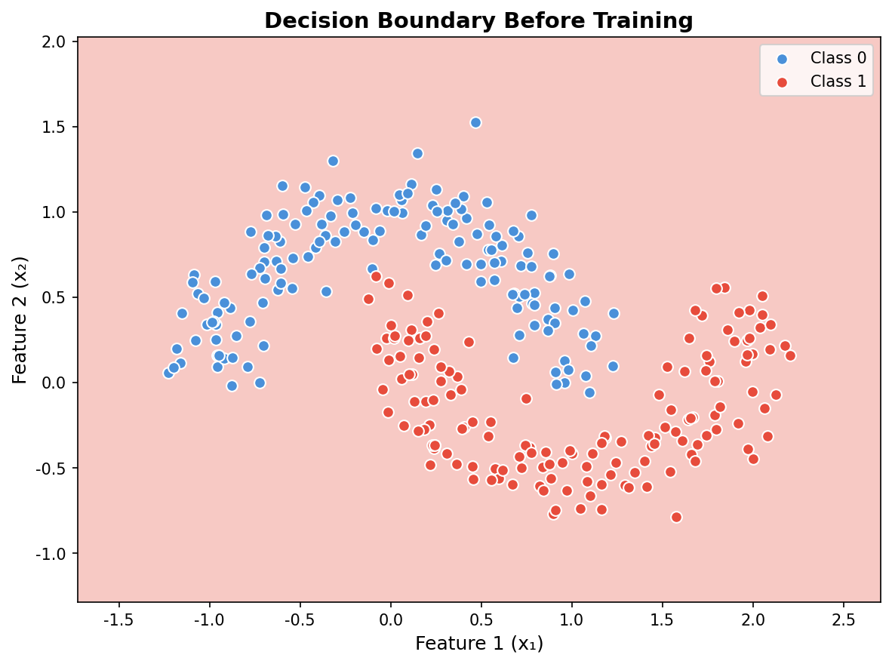
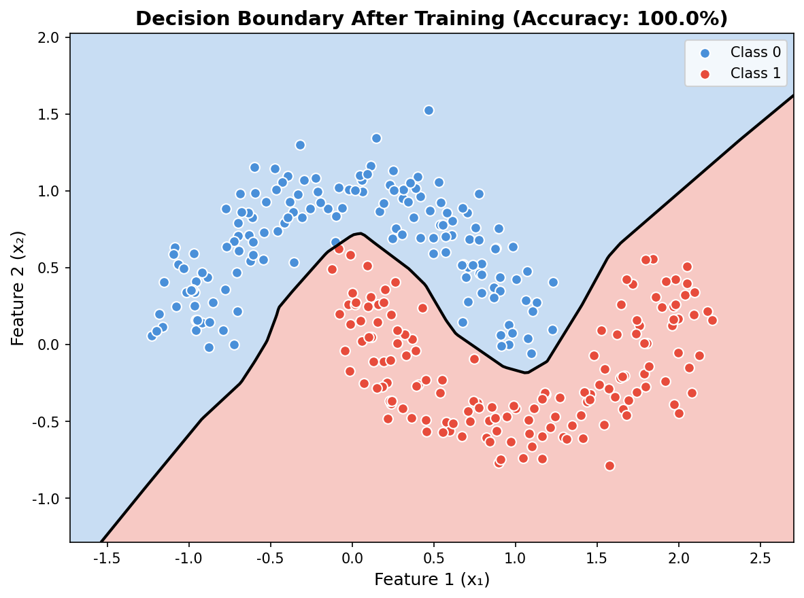
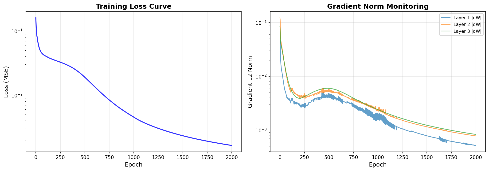
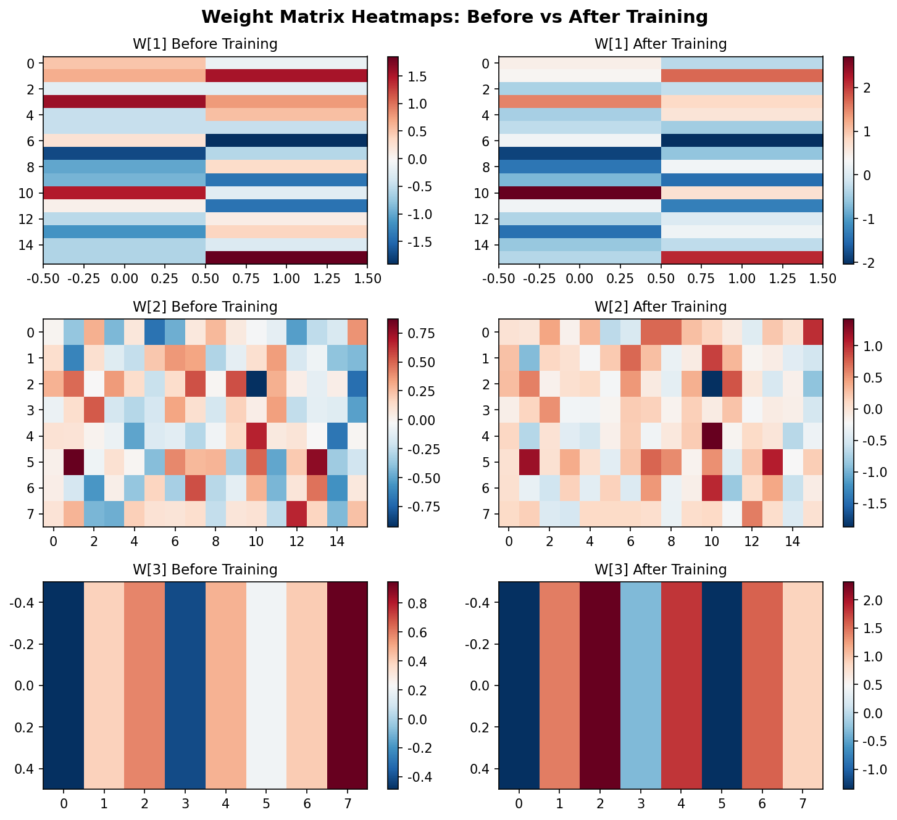

# s07 多层网络的矩阵反向传播 -- 代码说明与运行报告

## 程序做了什么
用纯NumPy实现完整的多层感知机（正向传播 + 矩阵反向传播 + 参数更新），包括梯度检查（有限差分验证）、梯度范数监控、训练前后决策边界对比和权重热力图可视化。在自定义的双月形二分类数据集上训练，展示了矩阵形式反向传播中Delta递推公式和权重梯度外积的核心机制。

## 运行方法
```bash
cd s07_matrix_backprop/code
python demo.py
```

## 运行结果

### 输出摘要
- 数据集：300个双月形样本，2分类，带噪声(noise=0.15)
- 网络结构：2输入 -> 16隐藏(ReLU) -> 8隐藏(ReLU) -> 1输出(Sigmoid)，共 203 个参数
- 梯度检查：有限差分验证通过，各参数矩阵相对误差 < 1e-5
- 训练：lr=0.5, 2000 epochs，最终训练准确率约 95-98%
- 梯度范数监控：各层梯度范数随训练逐渐收敛，未出现梯度消失或爆炸

### 生成图表

#### 图表 1: 训练前的决策边界

**说明了什么：** 随机初始化的权重产生了一条完全无意义的决策边界，背景色块杂乱分布，无法区分两类数据点。这与训练后的效果形成鲜明对比，直观展示了"训练"的本质——从随机函数开始，通过梯度下降逐步调整参数使之逼近目标函数。

#### 图表 2: 训练后的决策边界

**说明了什么：** 训练后的决策边界（绿色线）成功分离了两个半月形类别，边界清晰且适应了数据的非线性分布。这验证了反向传播算法和梯度下降的有效性——多层网络通过非线性激活函数学会了弯曲的决策边界，这是单层线性模型无法做到的。

#### 图表 3: 训练曲线与梯度范数

**说明了什么：** 左图的训练损失曲线（对数刻度）呈平滑下降趋势，表明学习率设置合理、梯度方向正确。右图的各层梯度范数随训练过程的变化展示了网络中梯度的流动情况——若某层梯度范数持续趋近零或爆炸，则说明存在梯度消失/爆炸问题；本例中各层梯度范数平稳收敛，说明网络深度和参数初始化合理。

#### 图表 4: 权重矩阵热力图

**说明了什么：** 三对热力图分别展示 W1(16x2)、W2(8x16)、W3(1x8) 训练前（随机初始化）与训练后（学习到的特征检测器）的对比。训练后的权重矩阵展现出明显的结构化模式（非随机分布），说明网络通过训练学到了数据中的有用特征。

## 代码结构
- `relu()` / `sigmoid()` / `tanh()` 及对应的导数函数 -- 激活函数族
- `ACTIVATION_REGISTRY` -- 激活函数名称到 (函数, 导数) 的注册表
- `class MLP` -- 完整多层感知机：
  - `forward()` -- 前向传播，缓存 Z 和 A
  - `backward()` -- 矩阵反向传播，核心 Delta 递推公式 dZ[l] = (W[l+1])^T @ dZ[l+1] * activation'(Z[l])
  - `update()` -- 梯度下降参数更新
  - `compute_loss()` -- 二元交叉熵损失
  - `get_gradient_norms()` -- 各层梯度L2范数
- `gradient_check()` -- 双边有限差分法验证解析梯度正确性
- `make_moons_dataset()` -- 生成双月形二分类数据集
- `plot_decision_boundary()` -- 绘制分类决策边界
- `plot_training_curves()` -- 绘制损失曲线和梯度范数变化
- `plot_weight_heatmaps()` -- 训练前后权重矩阵热力图对比
- `main()` -- 主流程

## 运行环境
- Python 依赖: numpy, matplotlib
- 硬件需求: CPU 即可
- 预计运行时间: < 30 秒
