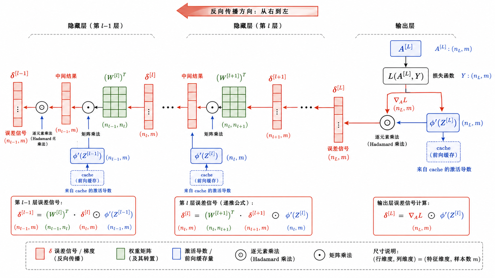
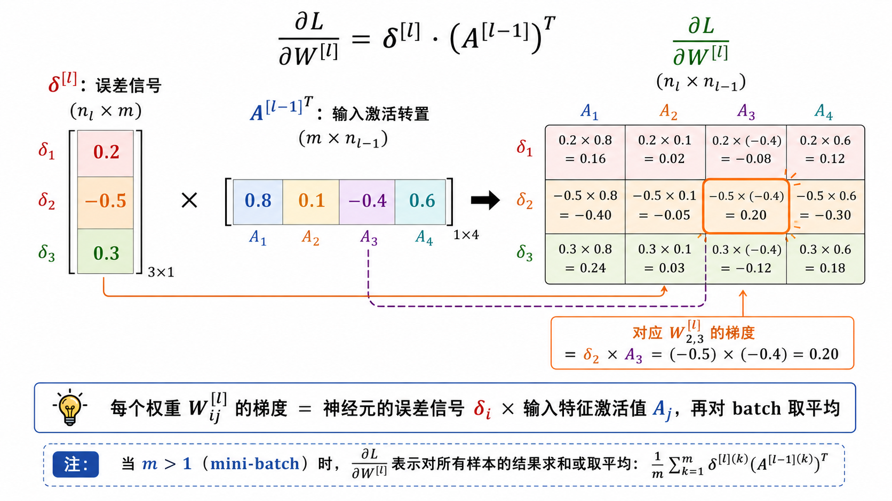
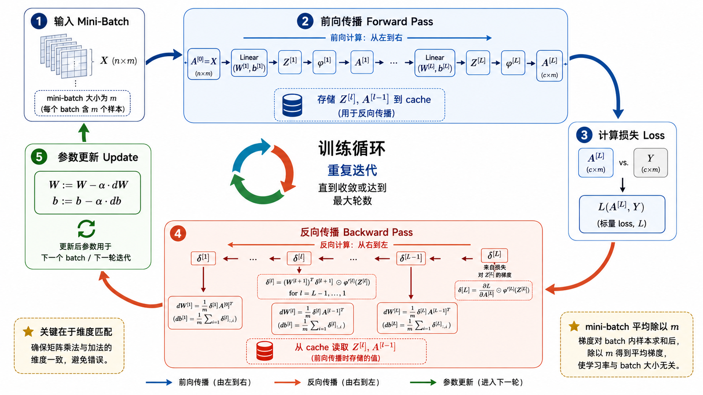
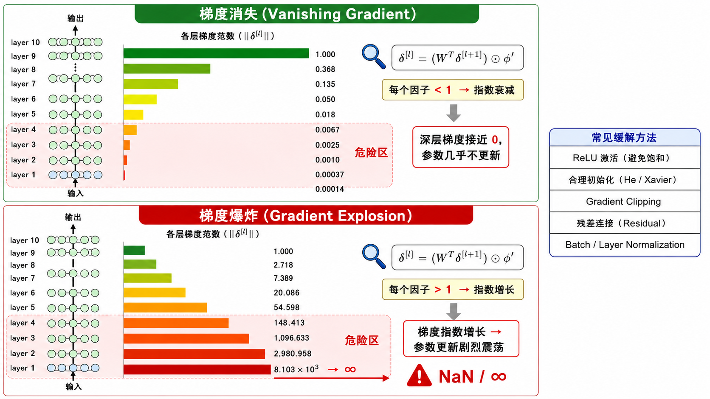

# s07 多层网络的矩阵反传

> $\delta$ 递推公式、mini-batch 平均与完整训练循环 —— 把反向传播扩展到真实的多层网络

---

## 一、从标量到矩阵：为什么要用矩阵形式？

在 [s06 反向传播与链式法则](../s06_backprop_chain_rule/) 中，我们用标量神经元的例子（$z = wx + b$）理解了反向传播的基本原理。但真实网络中的每个神经元并不是孤立的——同一层的所有神经元共享输入，我们自然希望用**矩阵运算**批量处理。

对于第 $l$ 层的完整前向传播：

$$
Z^{[l]} = W^{[l]} A^{[l-1]} + b^{[l]}
$$

$$
A^{[l]} = \phi^{[l]}(Z^{[l]})
$$

其中：
- $A^{[l-1]}$ 的形状是 $(n^{[l-1]}, m)$，$n^{[l-1]}$ 是输入维度，$m$ 是 batch size
- $W^{[l]}$ 的形状是 $(n^{[l]}, n^{[l-1]})$
- $b^{[l]}$ 的形状是 $(n^{[l]}, 1)$（通过广播加到每一列）
- $Z^{[l]}$ 和 $A^{[l]}$ 的形状都是 $(n^{[l]}, m)$

> 注意：我们使用**大写字母**（$Z, A, W$）表示矩阵，以区别于标量形式。$A^{[0]} = X$ 是输入数据矩阵。

矩阵形式的好处是可以用高效的 BLAS/LAPACK 库（如 NumPy、cuBLAS）来计算，远比逐神经元循环快得多。同时在数学上也更简洁——用几个矩阵公式就能描述整个网络的梯度流。



---

## 二、$\delta$ 记号：误差信号的核心抽象

在矩阵形式中，我们引入一个极其重要的中间量——$\delta^{[l]}$：

$$
\delta^{[l]} = \frac{\partial L}{\partial Z^{[l]}}
$$

$\delta^{[l]}$ 代表**损失对第 $l$ 层线性输出 $Z^{[l]}$ 的偏导数**。可以理解为"第 $l$ 层在 $Z^{[l]}$ 处应该往哪个方向调整"的**误差信号**。

为什么引入 $\delta$？因为它提供了一个简洁的**递推关系**。一旦我们算出了 $\delta^{[l+1]}$，就能用统一的公式算出 $\delta^{[l]}$，而不需要每次都从头推导链式法则。这使得反向传播的代码实现变得非常干净。

$\delta^{[l]}$ 的形状与 $Z^{[l]}$ 相同：$(n^{[l]}, m)$——即该层每个神经元对每个样本都有一个误差信号。

---

## 三、输出层的 $\delta^{[L]}$：起点的计算

反向传播从输出层开始。对于最后一层 $L$，$\delta^{[L]}$ 的计算取决于损失函数和激活函数的组合。

**通用公式**：

$$
\delta^{[L]} = \nabla_{A^{[L]}} L \odot \phi'^{[L]}(Z^{[L]})
$$

其中 $\odot$ 表示逐元素相乘（Hadamard 积）。$\nabla_{A^{[L]}} L$ 是损失对输出激活的梯度——损失函数决定了这一项。

### 常见损失函数的 $\nabla_{A^{[L]}} L$

**MSE 损失**（回归）：$L = \frac{1}{2m} \sum (A^{[L]} - Y)^2$

$$
\nabla_{A^{[L]}} L = \frac{1}{m}(A^{[L]} - Y)
$$

**二元交叉熵**（二分类，配合 sigmoid 输出）：$L = -\frac{1}{m} \sum [Y \log A^{[L]} + (1-Y)\log(1-A^{[L]})]$

$$
\nabla_{A^{[L]}} L = \frac{1}{m} \cdot \frac{A^{[L]} - Y}{A^{[L]}(1 - A^{[L]})}
$$

> **重要**：当输出层同时使用 sigmoid 激活和二元交叉熵损失时，$\delta^{[L]}$ 有一个极其简洁的形式：$\delta^{[L]} = \frac{1}{m}(A^{[L]} - Y)$。这是因为 sigmoid 导数中的 $A(1-A)$ 和交叉熵梯度中的 $A(1-A)$ 恰好约掉。这也是为什么这个组合被广泛使用——梯度形式非常干净，训练更稳定。

---

## 四、隐藏层的 $\delta^{[l]}$：核心递推公式

对于隐藏层（$l = L-1, L-2, \dots, 1$），$\delta^{[l]}$ 由后一层的误差信号和当前层的局部导数共同决定：

$$
\delta^{[l]} = \left(W^{[l+1]}\right)^T \delta^{[l+1]} \odot \phi'^{[l]}(Z^{[l]})
$$

让我们逐项理解这个公式：

1. **$(W^{[l+1]})^T \delta^{[l+1]}$**：将第 $l+1$ 层的误差信号通过**转置**的权重矩阵传回第 $l$ 层。这一步本质上是"责任分配"——"第 $l+1$ 层的每个神经元有多少责任，应该追溯到第 $l$ 层的哪些神经元"。

2. **$\phi'^{[l]}(Z^{[l]})$**：第 $l$ 层激活函数在 $Z^{[l]}$ 处的逐元素导数。这个值在前向传播时已经可以算好（取决于 $Z^{[l]}$），但通常反传时才计算，以节省显存。

3. **$\odot$**（Hadamard 积）：逐元素相乘。注意这不是矩阵乘法——是对应位置的元素直接相乘。

### 维度验证

确保矩阵乘法维度正确，是调试反向传播最重要的技巧之一：

- $W^{[l+1]}$ 的形状：$(n^{[l+1]}, n^{[l]})$
- $(W^{[l+1]})^T$ 的形状：$(n^{[l]}, n^{[l+1]})$
- $\delta^{[l+1]}$ 的形状：$(n^{[l+1]}, m)$
- $(W^{[l+1]})^T \delta^{[l+1]}$ 的形状：$(n^{[l]}, m)$
- $\phi'(Z^{[l]})$ 的形状：$(n^{[l]}, m)$
- 最终 $\delta^{[l]}$ 的形状：$(n^{[l]}, m)$

维度完美匹配。**如果你手写反向传播时维度对不上，八成是忘了转置 $W$。**

---

## 五、参数梯度的计算

有了每层的 $\delta^{[l]}$ 后，参数梯度就很简单了：

### 权重梯度

$$
\frac{\partial L}{\partial W^{[l]}} = \frac{1}{m} \cdot \delta^{[l]} \left(A^{[l-1]}\right)^T
$$

这是 $\delta^{[l]}$ 与 $A^{[l-1]}$ 的**外积**（经 mini-batch 平均）。

- $\delta^{[l]}$ 的形状：$(n^{[l]}, m)$——每行是该层一个神经元对 $m$ 个样本的误差信号
- $(A^{[l-1]})^T$ 的形状：$(m, n^{[l-1]})$——每列是第 $l-1$ 层一个神经元对 $m$ 个样本的激活值
- 乘积 $\delta^{[l]}(A^{[l-1]})^T$ 的形状：$(n^{[l]}, n^{[l-1]})$——与 $W^{[l]}$ 的形状完全一致

直观理解：$W^{[l]}_{ij}$（第 $l$ 层第 $i$ 个神经元与第 $l-1$ 层第 $j$ 个神经元之间的权重）的梯度，等于"第 $l$ 层第 $i$ 个神经元的误差信号"乘以"第 $l-1$ 层第 $j$ 个神经元的激活值"，再对所有样本取平均。

### 偏置梯度

$$
\frac{\partial L}{\partial b^{[l]}} = \frac{1}{m} \sum_{i=1}^{m} \delta^{[l]}_i
$$

其中 $\delta^{[l]}_i$ 是第 $i$ 个样本对应的误差信号列向量。实际实现中，对 $\delta^{[l]}$ 按列（axis=1）求和再除以 $m$。



---

## 六、完整的矩阵反向传播伪代码

将以上公式组织成可执行的算法：

```text
输入: 参数 W[1..L], b[1..L]
输入: 一个 mini-batch X (shape: n_in × m), 标签 Y
超参数: 学习率 α

# ============ 前向传播 ============
A[0] = X                               # 输入层
for l = 1 to L:
    Z[l] = W[l] @ A[l-1] + b[l]        # 线性变换
    A[l] = φ[l](Z[l])                   # 激活函数
    缓存 Z[l] 和 A[l-1]

Loss = 损失函数(A[L], Y)

# ============ 反向传播 ============
# 输出层
δ[L] = ∇_A L ⊙ φ'[L](Z[L])

# 隐藏层（从后往前）
for l = L-1 downto 1:
    δ[l] = (W[l+1])^T @ δ[l+1] ⊙ φ'[l](Z[l])

# 参数梯度
for l = 1 to L:
    dW[l] = (1/m) · δ[l] @ (A[l-1])^T
    db[l] = (1/m) · sum(δ[l], axis=1)

# ============ 参数更新 ============
for l = 1 to L:
    W[l] = W[l] - α · dW[l]
    b[l] = b[l] - α · db[l]
```



---

## 七、梯度检查：用有限差分验证你的实现

手写反向传播最容易出错。梯度检查（Gradient Checking）是一种通过数值方法验证解析梯度的技术。

### 双边有限差分法

对于一个标量参数 $\theta$，用数值方法估计梯度：

$$
\frac{\partial L}{\partial \theta}
\approx
\frac{L(\theta + \epsilon) - L(\theta - \epsilon)}{2\epsilon}
$$

其中 $\epsilon$ 是一个很小的值（通常取 $10^{-7}$）。

### 检查步骤

1. 对所有参数 $W^{[l]}, b^{[l]}$ 做前向传播，然后反向传播算出解析梯度
2. 对每个参数，用有限差分法数值估计梯度
3. 比较两者的**相对误差**：

$$
\text{relative error} = \frac{\| \text{grad}_\text{analytic} - \text{grad}_\text{numeric} \|_2}
{\| \text{grad}_\text{analytic} \|_2 + \| \text{grad}_\text{numeric} \|_2}
$$

- 相对误差 $< 10^{-7}$：实现大概率正确
- 相对误差 $\approx 10^{-5}$：可能有小错误，需要检查
- 相对误差 $> 10^{-3}$：几乎肯定有 bug

> **注意**：梯度检查的速度非常慢（每个参数需要两次额外的前向传播），只能在开发调试时用于小网络和少量样本。训练中不要使用。

---

## 八、梯度消失与梯度爆炸

从中间层的递推公式可以清楚地看到问题的根源：

$$
\delta^{[l]} = \left(W^{[l+1]}\right)^T \delta^{[l+1]} \odot \phi'^{[l]}(Z^{[l]})
$$

梯度在反向传播时，每一步都要乘上**权重矩阵的转置**和**激活函数的导数**。经过多层累积后：

### 梯度消失 (Vanishing Gradient)

当大多数因子的模都小于 1 时，梯度会指数级衰减：

$$
\|\delta^{[l]}\| \approx \|\delta^{[L]}\| \cdot \prod_{k=l+1}^{L} \|W^{[k]}\| \cdot \|\phi'^{[k]}\|
$$

- **Sigmoid 和 Tanh** 的导数在饱和区接近 0，是梯度消失的主要元凶。
- 早期层的梯度接近零，参数几乎不更新，网络学不到深层特征。
- **症状**：前面层的梯度范数远小于后面层，loss 下降极慢。

### 梯度爆炸 (Gradient Explosion)

当很多因子的模大于 1 时，梯度指数级增长：

- 梯度会迅速增长到极大的值，导致参数更新步长巨大。
- **症状**：loss 突然变成 NaN，或者在正常值和极大值之间剧烈震荡。

### 解决方案一览

| 问题 | 解决方案 |
|------|---------|
| Sigmoid/Tanh 饱和 → 梯度消失 | 使用 ReLU 及其变体（导数为 0 或 1，无饱和区） |
| 权重初始化不当 → 梯度消失/爆炸 | He 初始化（ReLU）或 Xavier 初始化（tanh/sigmoid） |
| 深层网络梯度消失 | 残差连接（ResNet）、Batch/Layer Normalization |
| 梯度爆炸 | 梯度裁剪（Gradient Clipping）：$\|g\| > \text{threshold}$ 时缩放 |
| 两者都有 | 适当的学习率和优化器选择（下一节 s08 详细讨论） |



---

## 九、从公式到代码实现

在 `code/demo.py` 中，我们将实现一个完整的 MLP 类，包含：

1. **`__init__`**：He 初始化权重矩阵，零初始化偏置
2. **`forward`**：逐层前向传播，将所有 $Z^{[l]}$ 和 $A^{[l-1]}$ 存入 cache
3. **`backward`**：从 $\delta^{[L]}$ 出发，依次计算 $\delta^{[l]}$、$dW^{[l]}$、$db^{[l]}$
4. **`update`**：用计算出的梯度更新所有参数

关键实现细节：

### 前向传播 cache

```python
# 每层的 cache 存储:
cache = {
    "Z": Z,         # 用于计算 φ'(Z)
    "A_prev": A_prev,  # 用于计算 dW = δ @ A_prev^T
}
```

### 反向传播中的维度匹配

```python
# 隐藏层的 δ 递推
dZ = (W_next.T @ dZ_next) * activation_derivative(Z)
#   ^^^^^^^^^^^^^^^^^^^^      ^^^^^^^^^^^^^^^^^^^^^^^^
#   (n[l], n[l+1]) @ (n[l+1], m)    (n[l], m)
#   形状: (n[l], m)                  形状: (n[l], m)
#   逐元素相乘 → (n[l], m) ✓

# 权重梯度
dW = dZ @ A_prev.T / m
#    ^^^^^^^^^^^^^^^
#    (n[l], m) @ (m, n[l-1]) = (n[l], n[l-1]) ✓
```

---

## 十、本节小结

| 概念 | 一句话 |
|------|--------|
| $\delta^{[l]}$ | 损失对第 $l$ 层线性输出的梯度——反向传播的核心中间量 |
| $\delta^{[L]}$ 起手式 | $\nabla_A L \odot \phi'(Z^{[L]})$——由损失函数和输出激活决定 |
| $\delta^{[l]}$ 递推 | $(W^{[l+1]})^T \delta^{[l+1]} \odot \phi'(Z^{[l]})$——从后向前传递 |
| 权重梯度 $dW^{[l]}$ | $\frac{1}{m} \delta^{[l]} (A^{[l-1]})^T$——误差信号与输入的外积 |
| 偏置梯度 $db^{[l]}$ | $\frac{1}{m} \sum \delta^{[l]}$——误差信号的均值 |
| 梯度检查 | 用有限差分验证解析梯度——开发时的重要调试手段 |
| 梯度消失/爆炸 | 深层网络中梯度的两种极端行为——初始化、激活函数和结构设计共同影响 |

> 下一节 [s08 优化器：从 SGD 到 Adam](../s08_optimizers_sgd_to_adam/) 将开始讨论"有了梯度之后怎么更新"——为什么朴素 SGD 不够好，以及 Momentum、RMSProp 和 Adam 分别解决了什么问题。

## 📥 Code

| File | View | Download |
|------|------|----------|
| demo.py | [Open](./code-demo) | <a href="../code/s07_matrix_backprop/demo.py" target="_blank" download>Download</a> |
| exercise.py | [Open](./code-exercise) | <a href="../code/s07_matrix_backprop/exercise.py" target="_blank" download>Download</a> |

