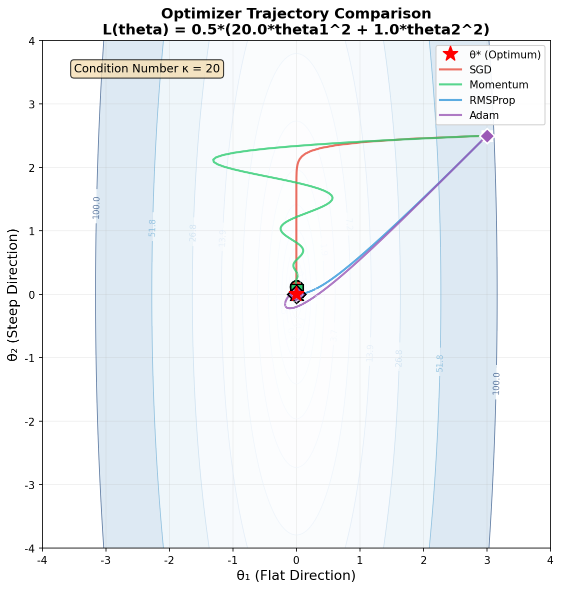
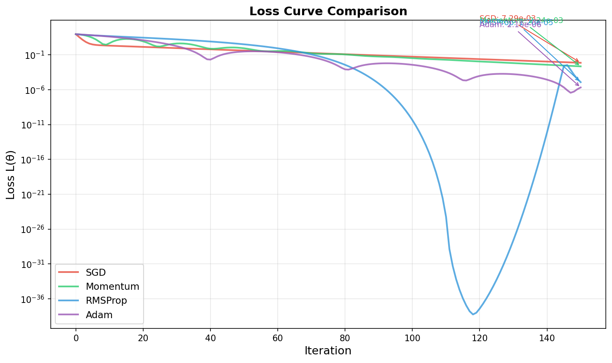
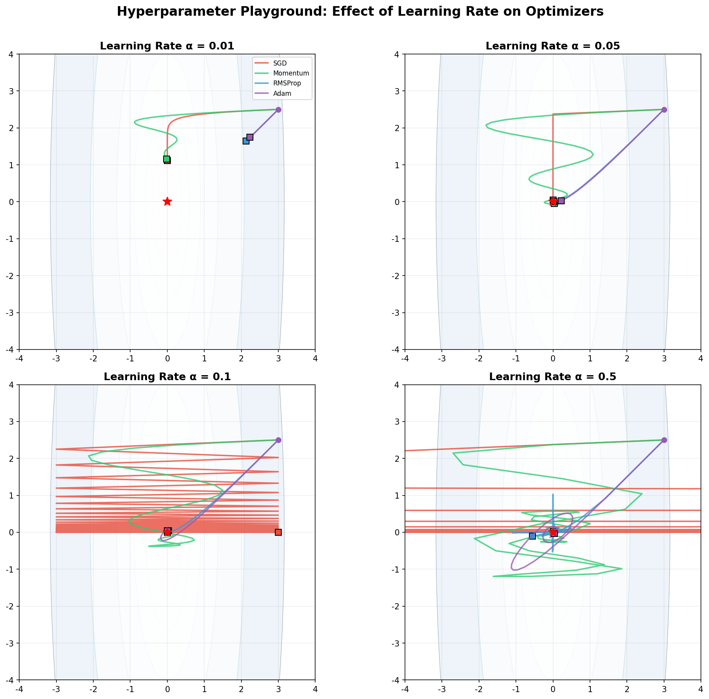
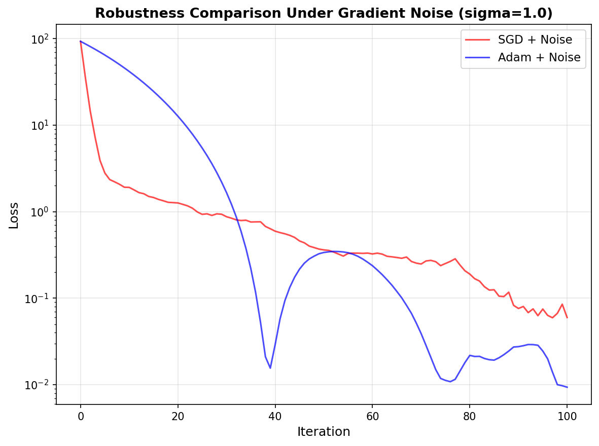

# s08 优化器：从SGD到Adam -- 代码说明与运行报告

## 程序做了什么
在狭长峡谷形二维损失地形（L(theta) = 0.5 * (20*theta1^2 + theta2^2)，条件数 kappa=20）上可视化对比 SGD、Momentum、RMSProp、Adam 四种优化器的优化轨迹、损失下降曲线，以及超参数游乐场（不同学习率的效果）。额外展示 Adam 对梯度噪声的鲁棒性远优于 SGD。

## 运行方法
```bash
cd s08_optimizers_sgd_to_adam/code
python demo.py
```

## 运行结果

### 输出摘要
- 损失地形：二维椭球面，theta1方向曲率20（陡峭），theta2方向曲率1（平缓），条件数=20
- 初始点：(3.0, 3.0)，最优解：(0, 0)，最优损失=0
- SGD：在陡峭方向来回震荡（之字形），收敛慢，最终损失较高
- Momentum：利用历史梯度平滑了震荡，收敛速度明显快于SGD
- RMSProp：自适应地调整每个方向的学习率，在平缓方向加速
- Adam：结合Momentum和RMSProp优势，收敛最快最稳
- 噪声鲁棒性：梯度加噪声后，Adam仍能平稳收敛，SGD剧烈抖动

### 生成图表

#### 图表 1: 优化器轨迹对比

**说明了什么：** 损失等高线（椭圆，陡峭方向窄、平缓方向宽）上四种优化器的轨迹。SGD（蓝）呈典型之字形——在陡峭方向反复过冲，在平缓方向进展缓慢。Adam（红）轨迹最平滑，直接沿最优路径向中心收敛。这张图直观揭示了为什么SGD在条件数大的损失地形上表现差——梯度指向最陡下降方向，但最优路径往往不在最陡方向上。

#### 图表 2: 损失下降曲线

**说明了什么：** 对数刻度下的损失-迭代步数曲线。Adam在约20步内将损失降到接近零，SGD在200步后仍有明显损失。Momentum和RMSProp居中。曲线清晰展示了动量法和自适应学习率如何显著加速收敛——这是实践中很少使用纯SGD的原因。

#### 图表 3: 超参数游乐场

**说明了什么：** 4x4网格展示四种学习率(0.01/0.05/0.1/0.5)下各优化器的轨迹。低学习率时所有优化器都收敛慢；高学习率时SGD发散（震荡幅度越来越大），而Adam即使在大学习率下也保持稳定——这归功于自适应学习率和偏差修正机制。

#### 图表 4: 噪声鲁棒性对比

**说明了什么：** 梯度加入标准差1.0的高斯噪声后，Adam的轨迹仍平滑收敛，SGD的轨迹则剧烈抖动、几乎无法前进。Adam的鲁棒性来自其二阶矩估计（v）的平滑作用——相当于在每个方向上自适应地降低噪声方向的学习率。这对实际训练中mini-batch引入的随机梯度噪声至关重要。

## 代码结构
- `class LossLandscape` -- 二维二次型损失函数 L=0.5*(a*theta1^2 + b*theta2^2)，含`gradient()`方法
- `class SGDOptimizer` -- theta = theta - lr * grad
- `class MomentumOptimizer` -- m = beta*m + (1-beta)*grad, theta = theta - lr*m
- `class RMSPropOptimizer` -- v = beta*v + (1-beta)*grad^2, theta = theta - lr*grad/(sqrt(v)+eps)
- `class AdamOptimizer` -- 含偏差修正的完整Adam（m_hat, v_hat）
- `run_optimizer()` -- 运行优化器并记录轨迹和损失
- `plot_contour_comparison()` -- 等高线图上绘制所有优化器轨迹
- `plot_loss_curves()` -- 各优化器损失-步数曲线
- `plot_hyperparameter_playground()` -- 4种学习率 x 4种优化器的轨迹网格
- `main()` -- 主流程

## 运行环境
- Python 依赖: numpy, matplotlib
- 硬件需求: CPU 即可
- 预计运行时间: < 10 秒
