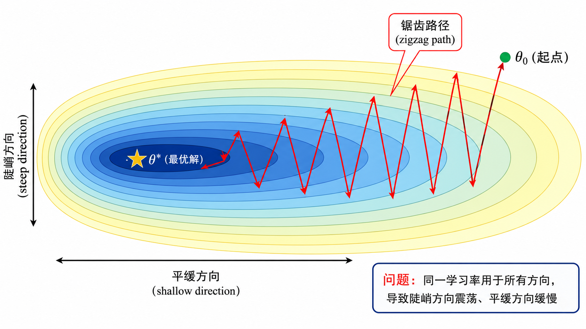
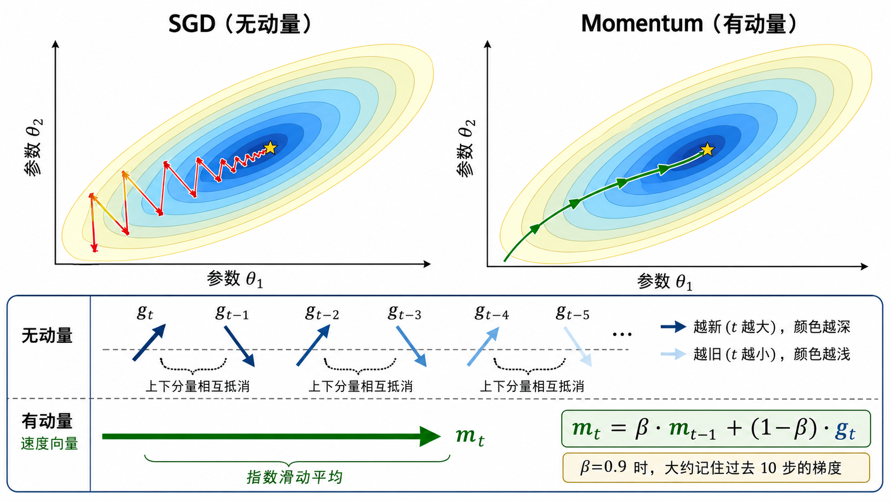
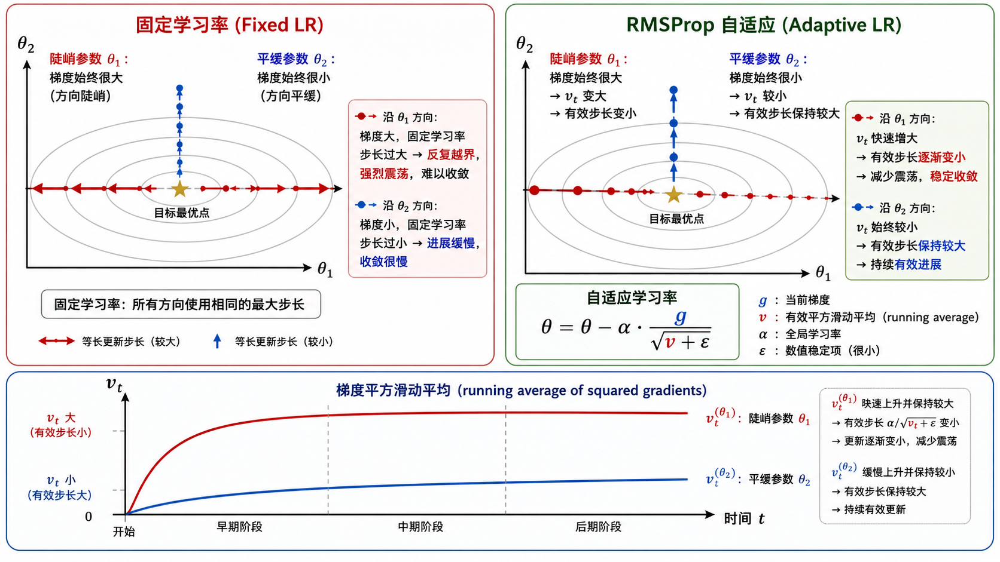
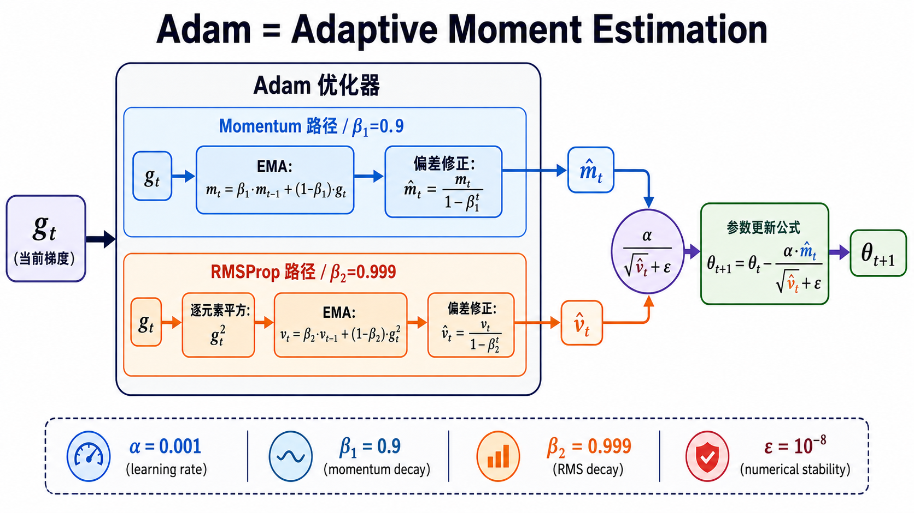

# s08 优化器：从 SGD 到 Adam

> 拿到了梯度，怎么用？Momentum、RMSProp、Adam 一步步解决梯度下降的困境

---

## 一、回顾：梯度下降的基本公式

在 [s07 多层网络的矩阵反传](../s07_matrix_backprop/) 中，我们学会了如何计算每个参数的梯度。现在的问题是：有了梯度 $g_t = \nabla_\theta L(\theta_t)$，我们应该怎么更新参数？

最基本的**随机梯度下降**（Stochastic Gradient Descent, SGD）更新公式是：

$$
\theta_{t+1} = \theta_t - \alpha g_t
$$

其中 $\alpha$ 是学习率（learning rate），$g_t$ 是当前 mini-batch 上的梯度。

这行公式简单优美，但在实践中会遇到一系列问题。本节的目标就是：**理解每个问题是什么，以及 Momentum、RMSProp、Adam 分别如何解决它们**。

---

## 二、朴素 SGD 的四大问题

### 问题 1：同一学习率，不同参数尺度

神经网络的不同层、甚至同一层的不同参数，它们的梯度尺度可能天差地别：
- 靠近输出的层梯度通常较大
- 某些参数的梯度可能只有 $10^{-6}$，而另一些参数的梯度可能是 $10^3$

如果对所有参数使用相同的学习率 $\alpha$，就会出现：有些参数更新过快（甚至震荡），有些参数更新过慢（几乎不动）。

### 问题 2：Mini-batch 噪声导致方向抖动

真实的梯度应该是所有训练数据上的平均。但我们每次只能用一个 mini-batch 来估计，这个估计带有噪声。噪声会让更新方向在每次迭代中随机抖动，而不是平滑地指向最小值。

### 问题 3：狭长峡谷中的锯齿震荡

很多损失函数在高维空间中的形状类似于**狭长的峡谷**（elongated valley）——在某些方向上曲率很大（梯度很大），在另一些方向上曲率很小（梯度很小）。SGD 在这种地形上的表现是：

- 在陡峭方向上来回震荡（一步跨太大，下一步又跨回来）
- 在平缓方向上进展极慢（步长相对太小）
- 总体路径呈现锯齿状（zigzag）

### 问题 4：学习率调度的两难

学习率太大：训练初期快速下降，但后期可能震荡甚至发散。
学习率太小：训练稳定但极为缓慢。
理想情况是：训练初期用较大的学习率快速探索，后期用小学习率精细收敛——这就需要学习率调度策略。

---

## 三、Momentum：给优化器加一个"惯性"

Momentum 的灵感来自物理学：一个球滚下山坡时，不会在每一步都改变方向——它的速度具有惯性，沿历史方向继续前进。

### 数学定义

Momentum 引入了一个**速度** $m_t$（也叫一阶矩估计），它是指数滑动平均（Exponential Moving Average, EMA）的历史梯度：

$$
m_t = \beta m_{t-1} + (1 - \beta) g_t
$$

参数更新变为：

$$
\theta_{t+1} = \theta_t - \alpha m_t
$$

其中 $\beta$ 通常取 0.9。

### 直观理解

- **$m_t$ 是"长期的平均方向"**：如果最近几步的梯度方向一致，$m_t$ 会积累一个较大的值，让参数快速前进。
- **震荡方向互相抵消**：如果在某个方向上来回震荡，正负梯度交替出现，$m_t$ 会自动让这些震荡平滑掉。
- **$\beta$ 控制记忆长度**：$\beta=0.9$ 意味着当前梯度只占 10% 的权重，过去梯度占 90%。大致可以理解为"记住了过去 $1/(1-\beta) \approx 10$ 步的梯度"。

### Momentum 的效果

Momentum 解决了"方向抖动"的问题——更新路径变得更平滑，在狭长峡谷中震荡减少，收敛速度加快。但它**没有**解决"不同参数应该用不同步长"的问题。

---

## 四、RMSProp：给每个参数自适应步长

RMSProp（Root Mean Square Propagation）的思路完全不同：它不关心方向是否平滑，而是关心**每个参数的历史梯度有多大**，然后据此**自适应地调整每个参数的有效学习率**。

### 数学定义

RMSProp 维护梯度**平方**的指数滑动平均：

$$
v_t = \beta v_{t-1} + (1 - \beta) g_t \odot g_t
$$

注意这里的 $g_t \odot g_t$ 是逐元素平方。$v_t$ 是一个与参数同形的向量，每个分量记录了对应参数的历史梯度平方的平均值。

参数更新变为：

$$
\theta_{t+1} = \theta_t - \alpha \frac{g_t}{\sqrt{v_t} + \epsilon}
$$

### 直观理解

- 如果某个参数的历史梯度很大 → $\sqrt{v_t}$ 大 → 有效步长 $\alpha / \sqrt{v_t}$ 小 → 防止在这个方向震荡
- 如果某个参数的历史梯度很小 → $\sqrt{v_t}$ 小 → 有效步长 $\alpha / \sqrt{v_t}$ 大 → 加速在这个方向前进
- $\epsilon$ 是一个极小值（通常 $10^{-8}$），防止分母为零

### RMSProp 的效果

RMSProp 解决了"不同参数需要不同步长"的问题。在狭长峡谷中，陡峭方向的步长被自动压小，平缓方向的步长被自动放大——优化路径不再锯齿震荡。

但它**没有**像 Momentum 那样平滑更新方向——它仍然使用原始梯度 $g_t$（而不是平滑后的 $m_t$）来指示方向。

---

## 五、Adam：Momentum + RMSProp = 自适应矩估计

Adam 的全称是 **Ada**ptive **M**oment Estimation。顾名思义，它同时拥有 Momentum 的方向平滑和 RMSProp 的自适应步长。

### 数学定义

Adam 同时维护两个指数滑动平均：

**一阶矩**（均值，用于估计方向）：

$$
m_t = \beta_1 m_{t-1} + (1 - \beta_1) g_t
$$

**二阶矩**（未中心化的方差，用于估计尺度）：

$$
v_t = \beta_2 v_{t-1} + (1 - \beta_2) g_t \odot g_t
$$

然后对两者做**偏差修正**（详见 [s09 Adam 深度解析](../s09_adam_deep_dive/)）：

$$
\hat{m}_t = \frac{m_t}{1 - \beta_1^t}
$$

$$
\hat{v}_t = \frac{v_t}{1 - \beta_2^t}
$$

最终的参数更新——这就是 **Adam 的核心公式**：

$$
\theta_{t+1} = \theta_t - \alpha \frac{\hat{m}_t}{\sqrt{\hat{v}_t} + \epsilon}
$$

### 拆解这行公式

这行公式可以解读为三句话：

1. **$\hat{m}_t$ 决定方向**：长期来看应该往哪个方向走（Momentum 的贡献）
2. **$\sqrt{\hat{v}_t}$ 决定步长缩放**：每个参数方向上的有效步长有多大（RMSProp 的贡献）
3. **$\alpha$ 是全局学习率**：控制总体的更新幅度

### Adam 为什么好用？

- **上手容易**：默认超参数（$\alpha=0.001, \beta_1=0.9, \beta_2=0.999$）在大多数任务上就能工作得很好
- **对梯度尺度不敏感**：无论梯度是 $10^{-6}$ 还是 $10^3$，自适应步长都会自动调整
- **收敛快**：结合了方向平滑和自适应步长，训练初期的收敛速度通常远快于 SGD
- **对超参数鲁棒**：相比 SGD 对学习率极其敏感，Adam 在较宽的学习率范围内都能工作

---

## 六、四种优化器的直观对比

### 对比表

| 方法 | 核心记忆 | 是否自适应步长 | 直觉 |
|------|---------|--------------|------|
| **SGD** | 不记历史 | 否 | 当前梯度指哪走哪——像盲人下山 |
| **Momentum** | 记梯度平均方向 $m_t$ | 否 | 给更新方向加入惯性——像滚下山坡的球 |
| **RMSProp** | 记梯度平方平均 $v_t$ | 是 | 梯度大的方向步长变小——像在陡坡减速 |
| **Adam** | 同时记 $m_t$ 和 $v_t$ | 是 | 方向更稳 + 步长自适应——集两者之长 |

### 在二维损失地形上的表现

在狭长峡谷形的 2D 损失函数上（如 $L(\theta_1, \theta_2) = a\theta_1^2 + b\theta_2^2$，其中 $a \gg b$），四种优化器的行为截然不同：

- **SGD**：沿陡峭方向剧烈震荡，沿平缓方向缓慢前行，路径呈锯齿形
- **Momentum**：路径更平滑，震荡明显减少，但步长在所有方向上一致
- **RMSProp**：陡峭方向震荡极小（步长被压小），平缓方向进展快（步长被放大）
- **Adam**：兼具平滑的路径和自适应的步长，通常最快到达最小值

> 在 `code/demo.py` 中，我们可视化地展示了这四种优化器在同一损失地形上的轨迹对比。

---

## 七、从算法演进看设计思想

回顾这四个优化器的演进历程，可以发现一条清晰的设计脉络：

1. **SGD 是最朴素的**：相信每一步的梯度，直接往梯度反方向走。
2. **Momentum 发现**："只看当前一步不够，应该参考历史方向"——引入了**一阶矩**（均值）。
3. **RMSProp 发现**："不同参数不应该用同一个步长，历史梯度大的参数步子应该小一点"——引入了**二阶矩**（未中心化方差）。
4. **Adam 发现**："为什么不两者结合？"——同时用一阶矩定方向、二阶矩缩步长。

> 每一个改进都不是凭空出现的，而是针对前一个方法的具体痛点。理解了这种演进，你就真正理解了优化器设计的核心思想。

---

## 八、优化器的选择指南

### 什么时候用 SGD + Momentum？

- 当你对超参数调优有足够耐心，愿意精心调整学习率计划
- 在某些视觉任务（如图像分类）中，精心调度的 SGD+Momentum 的泛化性能可能优于 Adam
- 计算资源有限时（SGD 占用的显存最少，不需要存储 $m_t$ 和 $v_t$）

### 什么时候用 Adam？

- 大多数深度学习任务的**默认选择**
- 当你需要快速原型验证，不想在优化器调参上花太多时间
- 训练 Transformer、GAN、强化学习等对优化器敏感的任务
- 梯度稀疏的场景（如 NLP 中的词嵌入训练）

### 什么时候用 AdamW？

- 当你需要权重衰减的正则化效果（详见 s09）
- 现代 Transformer 和大模型训练的标准配置
- AdamW 是 Adam 在权重衰减方面的修正版，大多数场景下优先于 Adam

---

## 九、本节小结

| 概念 | 一句话 |
|------|--------|
| SGD 的困境 | 同学习率、噪声抖动、狭长峡谷震荡、学习率难调 |
| Momentum 的 $m_t$ | 梯度的指数滑动平均——给更新方向加惯性 |
| RMSProp 的 $v_t$ | 梯度平方的指数滑动平均——给每个参数自适应步长 |
| Adam | $m_t$ 定方向 + $v_t$ 缩步长 + 偏差修正 |
| $\beta_1, \beta_2$ | 分别控制一阶矩和二阶矩的记忆长度 |
| 优化器选择 | Adam(或AdamW) 先跑通，再考虑精细调 SGD |

> 下一节 [s09 Adam 深度解析与训练实战](../s09_adam_deep_dive/) 将深入 Adam 的内部机制：偏差修正的数学原理、AdamW 为什么更好、以及如何在实际训练中诊断和调试优化器。

## 📥 Code

| File | View | Download |
|------|------|----------|
| demo.py | [Open](./code-demo) | <a href="../code/s08_optimizers_sgd_to_adam/demo.py" target="_blank" download>Download</a> |
| exercise.py | [Open](./code-exercise) | <a href="../code/s08_optimizers_sgd_to_adam/exercise.py" target="_blank" download>Download</a> |

