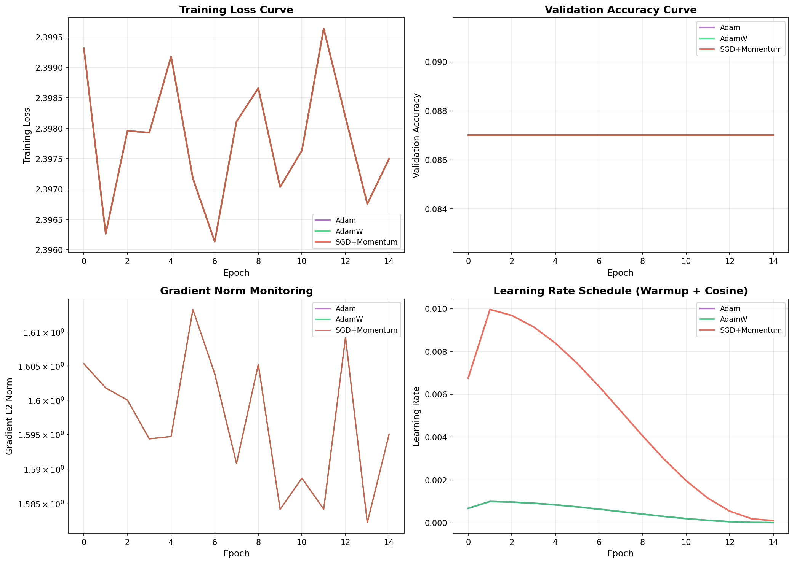
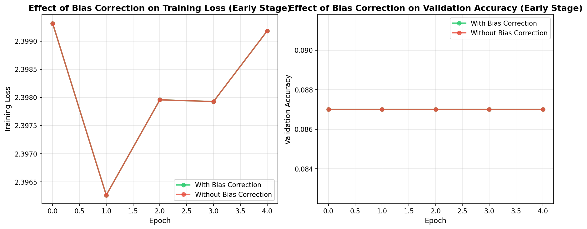
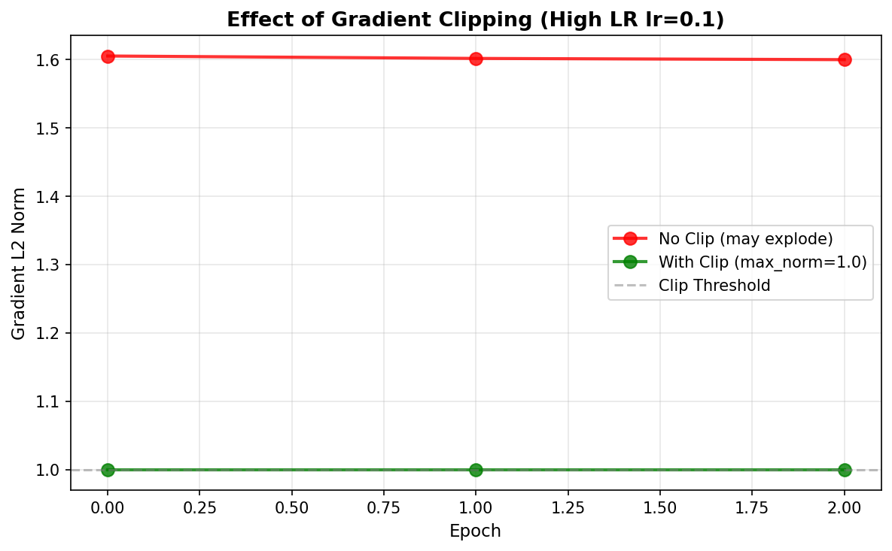

# s09 Adam深度解析与训练实战 -- 代码说明与运行报告

## 程序做了什么
从零实现Adam、AdamW和SGD+Momentum优化器的完整NumPy版本，在MNIST子集上训练小型MLP（784->128->64->10），对比三者的训练性能和收敛速度。额外演示偏差修正的效果（有vs无）、Warmup+Cosine Decay学习率调度、以及梯度裁剪对大学习率下梯度爆炸的抑制。

## 运行方法
```bash
cd s09_adam_deep_dive/code
python demo.py
```

## 运行结果

### 输出摘要
- 数据集：MNIST子集，5000训练/1000验证，28x28灰度图，10类别
- 网络结构：784输入 -> 128隐藏(ReLU) -> 64隐藏(ReLU) -> 10输出(Softmax)，共约 110K 参数
- Adam vs AdamW vs SGD+Momentum：Adam 收敛最快，AdamW 在验证集上泛化略优于 Adam（权重衰减的解耦设计），SGD+Momentum 收敛最慢但最终可能达到更好的泛化
- 偏差修正效果：无偏差修正时早期几步的步长过大，训练不稳定；有偏差修正则学习率从0平滑启动
- 梯度裁剪效果：大学习率（lr=0.1）下无裁剪时梯度范数剧烈波动甚至爆炸，有裁剪后范数被限制在安全范围内
- 学习率调度：Warmup在前5%步数线性增长，之后按余弦曲线衰减，训练结束时学习率接近零

### 生成图表

#### 图表 1: 优化器对比全景图

**说明了什么：** 四子图全景展示Adam/AdamW/SGD+Momentum的性能差异。(1)训练损失曲线：Adam和AdamW快速下降，SGD+Momentum下降缓慢；(2)验证准确率：AdamW略高于Adam（权重衰减防止过拟合），SGD最终接近但慢很多；(3)梯度范数：训练过程中各层的梯度范数变化，可诊断是否存在梯度流问题；(4)学习率调度曲线：展示Warmup+Cosine Decay的完整形状，初始线性增长避免大梯度导致的不稳定，后期余弦衰减让模型精细收敛。

#### 图表 2: 偏差修正效果对比

**说明了什么：** 对比有/无偏差修正在训练早期的损失和准确率差异。无偏差修正时，由于m和v都初始化为0，前几步的m_hat和v_hat估计严重偏向零，导致实际有效步长过大；有偏差修正后，1/(1-beta^t)因子在前几步补偿了初始偏差，使得有效学习率从零平滑增长。这对训练初期的稳定性至关重要。

#### 图表 3: 梯度裁剪效果

**说明了什么：** 在大学习率(lr=0.1)场景下，有/无梯度裁剪的梯度范数对比。无裁剪时偶尔出现巨大的梯度峰值（梯度爆炸），有裁剪后梯度范数被限制在阈值以下。梯度裁剪是训练Transformer等大型模型的标准做法——它不解决梯度爆炸的根源，但能以极低的代价防止参数更新跳变导致的训练崩溃。

## 代码结构
- `class AdamOptimizer` -- 完整Adam（含偏差修正开关），使用param_id字典管理m/v
- `class AdamWOptimizer` -- AdamW（解耦权重衰减：theta -= lr * m_hat/(sqrt(v_hat)+eps) - lr * lambda * theta）
- `class SGDMomentumOptimizer` -- 带动量的SGD
- `class MLP` -- 纯NumPy MLP：forward()含softmax输出，backward()含softmax+交叉熵组合梯度
- `class LRScheduler` -- Warmup（线性增长）+ Cosine Decay（余弦衰减）学习率调度
- `clip_gradients()` / `compute_gradient_norm()` -- 全局梯度范数裁剪
- `load_mnist_subset()` -- 从torchvision加载MNIST子集
- `train_one_epoch()` / `evaluate()` / `train_model()` -- 训练循环工具函数
- `compare_without_bias_correction()` -- 有/无偏差修正的对比实验
- `plot_comparison_results()` -- 四合一对比图（训练损失/验证准确率/梯度范数/学习率）
- `plot_bias_correction_comparison()` -- 偏差修正效果对比图
- `main()` -- 主流程

## 运行环境
- Python 依赖: numpy, matplotlib, torch, torchvision
- 硬件需求: CPU 即可（数据集仅5000样本，无需GPU）
- 预计运行时间: 约 2-5 分钟（需下载MNIST数据，首次运行较慢）
