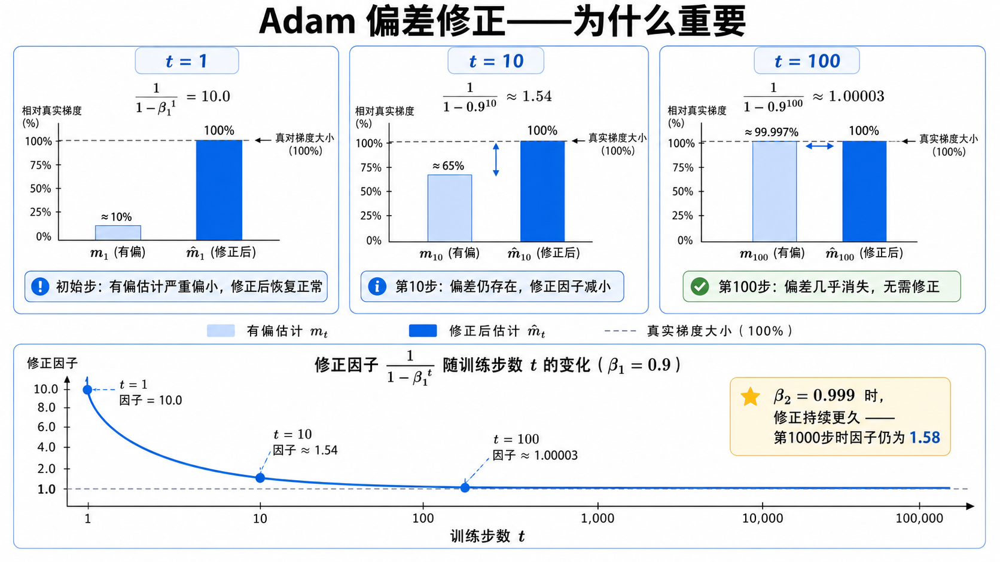
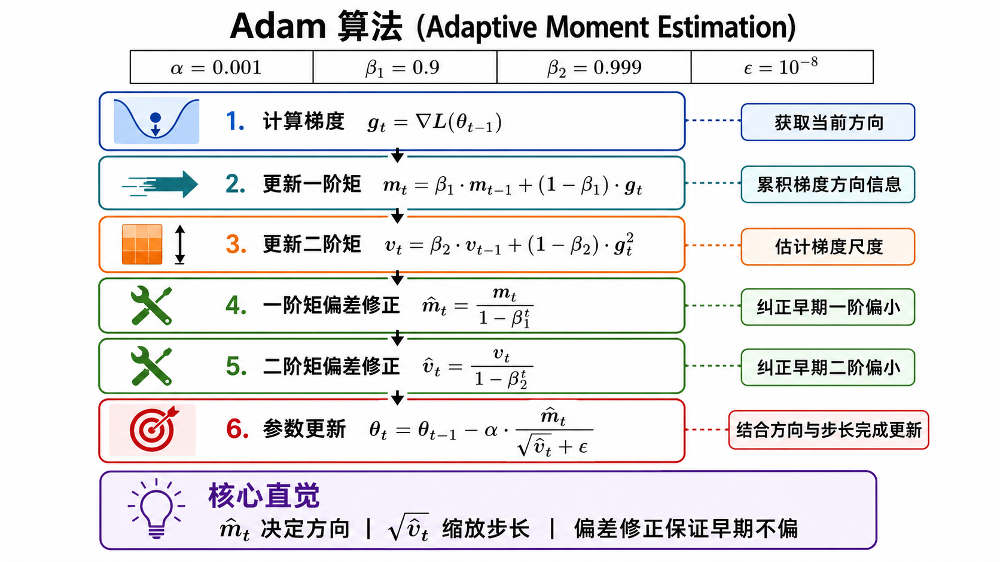
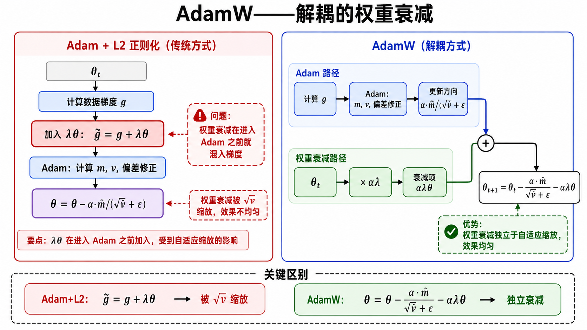
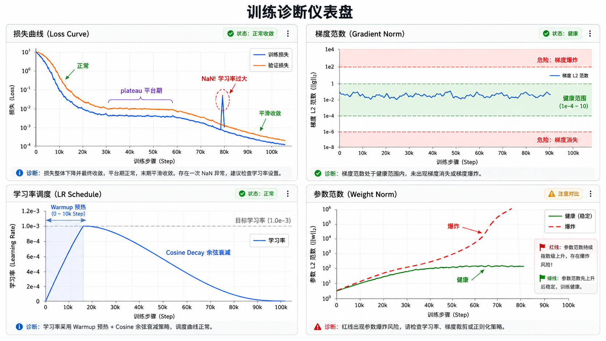

# s09 Adam 深度解析与训练实战

> 偏差修正、AdamW、学习率调度、梯度诊断——把 Adam 用对、用好的完整指南

---

## 一、回顾：Adam 的核心公式

在 [s08 优化器：从 SGD 到 Adam](../s08_optimizers_sgd_to_adam/) 中，我们知道了 Adam 同时维护一阶矩 $m_t$ 和二阶矩 $v_t$：

$$
m_t = \beta_1 m_{t-1} + (1 - \beta_1) g_t
$$

$$
v_t = \beta_2 v_{t-1} + (1 - \beta_2) g_t \odot g_t
$$

参数更新（带偏差修正）：

$$
\theta_{t+1} = \theta_t - \alpha \frac{\hat{m}_t}{\sqrt{\hat{v}_t} + \epsilon}
$$

本节深入探讨 Adam 中那些容易被忽略但至关重要的细节：偏差修正为什么必要、AdamW 为什么更好、以及如何在实际训练中诊断和调试优化器。

---

## 二、偏差修正：Adam 最精巧的设计

### 问题：从零初始化会引入偏差

Adam 的一阶矩和二阶矩都从零开始：

$$
m_0 = 0, \quad v_0 = 0
$$

在训练的最初几步，这会导致 $m_t$ 和 $v_t$ 系统地**偏小**。

例如，第一步更新后（$t=1$）：

$$
m_1 = \beta_1 \cdot 0 + (1 - \beta_1) g_1 = (1 - \beta_1) g_1
$$

如果 $\beta_1 = 0.9$，那么 $m_1 = 0.1 g_1$。也就是说，第一步的动量估计只保留了真实梯度的 **10%**。这会让训练初期步长过小，收敛缓慢。

### 偏差修正的数学

$m_t$ 可以展开为历史梯度的加权和：

$$
m_t = (1 - \beta_1) \sum_{i=1}^{t} \beta_1^{t-i} g_i
$$

这个加权和的**所有权重之和**不是 1，而是：

$$
\sum_{i=1}^{t} (1 - \beta_1) \beta_1^{t-i} = 1 - \beta_1^t
$$

为了得到一个无偏估计，我们需要除以这个权重和：

$$
\hat{m}_t = \frac{m_t}{1 - \beta_1^t}
$$

同理，对于二阶矩：

$$
\hat{v}_t = \frac{v_t}{1 - \beta_2^t}
$$

### 直观理解

- $t=1$ 时，$1 - \beta_1^1 = 0.1$，$\hat{m}_1 = m_1 / 0.1 = g_1$，**完美修正**。
- $t=10$ 时，$1 - 0.9^{10} \approx 0.65$，修正幅度变小但仍有影响。
- $t=100$ 时，$1 - 0.9^{100} \approx 0.99997$，几乎不需要修正——初始化的影响已经完全消失。

对于 $\beta_2 = 0.999$，修正效果持续更久：$1 - 0.999^{1000} \approx 0.63$，即使在 1000 步后仍有明显修正。

> **偏差修正不是可选的**。没有偏差修正的 Adam 在训练初期会有明显的"慢启动"现象。几乎所有深度学习框架的 Adam 实现都默认开启了偏差修正。



---

## 三、完整 Adam 算法（伪代码）

将前面的所有讨论汇总，以下是 Adam 的完整算法流程：

```text
算法: Adam (Adaptive Moment Estimation)

输入:
  α   = 0.001          # 学习率 (步长)
  β₁  = 0.9            # 一阶矩指数衰减率
  β₂  = 0.999          # 二阶矩指数衰减率
  ε   = 10⁻⁸           # 数值稳定常数
  θ₀                    # 初始参数向量

初始化:
  m₀ ← 0               # 一阶矩向量
  v₀ ← 0               # 二阶矩向量
  t  ← 0               # 时间步计数器

while θ_t 未收敛:
    t ← t + 1
    g_t ← ∇_θ L_t(θ_{t-1})                           # 步骤1: 计算梯度

    m_t ← β₁ · m_{t-1} + (1 - β₁) · g_t              # 步骤2: 更新一阶矩
    v_t ← β₂ · v_{t-1} + (1 - β₂) · g_t²             # 步骤3: 更新二阶矩

    m̂_t ← m_t / (1 - β₁^t)                            # 步骤4: 一阶矩偏差修正
    v̂_t ← v_t / (1 - β₂^t)                            # 步骤5: 二阶矩偏差修正

    θ_t ← θ_{t-1} - α · m̂_t / (√v̂_t + ε)             # 步骤6: 参数更新
end while

返回 θ_t  # 优化后的参数
```

这个只有六步的算法，是当今绝大多数深度学习训练的默认选择。



---

## 四、超参数指南：每个值都在做什么？

| 超参数 | 常用值 | 作用 | 调参建议 |
|--------|--------|------|---------|
| $\alpha$ (lr) | $10^{-3}$ | 全局学习率，控制整体更新幅度 | 最需要调的参数。太小收敛慢，太大可能发散。可从 $10^{-3}$ 开始二分搜索 |
| $\beta_1$ | $0.9$ | 一阶矩衰减率，控制"惯性"的记忆长度 | 通常不需要调。减小到 0.5 可以让模型对近期梯度更敏感 |
| $\beta_2$ | $0.999$ | 二阶矩衰减率，控制梯度尺度估计的平滑程度 | 稀疏特征场景可以适当降低（如 0.99）。过高会导致自适应太"慢热" |
| $\epsilon$ | $10^{-8}$ | 数值稳定常数，防止除以零 | 通常不需要调。某些场景下提升到 $10^{-4}$ 可以增加训练稳定性 |

### 记忆长度的直观理解

对于指数滑动平均 $m_t = \beta m_{t-1} + (1-\beta)g_t$，有效记忆长度约为 $\frac{1}{1-\beta}$ 步：

- $\beta_1 = 0.9$：约 10 步的梯度记忆——近期方向占主导。
- $\beta_2 = 0.999$：约 1000 步的梯度平方记忆——尺度估计非常平滑。

---

## 五、AdamW：为什么权重衰减要解耦

### 传统 L2 正则化的问题

深度学习常用权重衰减（Weight Decay）来控制模型复杂度，防止过拟合。传统做法是在损失函数中加 L2 正则项：

$$
L_{\text{total}} = L_{\text{data}} + \frac{\lambda}{2} \|\theta\|_2^2
$$

这等价于梯度中多出一项：

$$
g_t \leftarrow g_t + \lambda \theta_t
$$

**在 SGD 中，这没问题**——因为 SGD 的更新是 $\theta \leftarrow \theta - \alpha(g + \lambda\theta)$，等价于 $\theta \leftarrow (1 - \alpha\lambda)\theta - \alpha g$，与"每步按比例缩小参数"的效果相同。

### Adam 中的问题

**但在 Adam 中，梯度会被 $\sqrt{\hat{v}_t} + \epsilon$ 逐元素缩放**。如果把权重衰减混在梯度里，正则项也会被这个自适应缩放机制扭曲：

- 梯度大的参数：$\sqrt{\hat{v}_t}$ 大 → 有效权重衰减被缩小
- 梯度小的参数：$\sqrt{\hat{v}_t}$ 小 → 有效权重衰减被放大

**结果**：L2 正则化的效果不再均匀，不同参数的衰减力度不一致。

### AdamW 的解耦方案

AdamW（Loshchilov & Hutter, 2019）的做法是：**把权重衰减从梯度更新中独立出来**：

$$
\theta_{t+1} = \theta_t - \alpha \frac{\hat{m}_t}{\sqrt{\hat{v}_t} + \epsilon} - \alpha \lambda \theta_t
$$

可以理解为：**先按 Adam 的方向走一步（自适应步长），再额外把参数向零拉一点（固定比例）**。

这样做的好处：
- 权重衰减强度对所有参数一致，不受 $\hat{v}_t$ 影响
- 正则化效果与学习率解耦——调学习率不会意外地改变正则化强度
- 在现代 Transformer 和大模型训练中，AdamW 比传统 Adam+L2 表现更好

> **一句话总结**：Adam 的 L2 正则化是"把权重衰减混进梯度，再被自适应缩放扭曲"；AdamW 是"自适应更新和权重衰减各管各的"。



---

## 六、学习率调度：warmup + cosine decay

### 为什么需要学习率调度？

固定学习率有两个问题：
1. **训练初期**：模型参数是随机初始化的，梯度的方向和尺度估计都不准确。如果一开始就用大学习率，容易出现不稳定。
2. **训练后期**：模型接近收敛，需要更精细的调整。持续使用大学习率会在最优解附近震荡，无法精确收敛。

### Warmup：让训练"缓慢起步"

Warmup 的思路是在训练的最初几千步，将学习率从 0（或一个很小的值）线性增加至目标值：

$$
\alpha_t = \alpha_{\text{target}} \cdot \frac{t}{t_{\text{warmup}}}, \quad t \leq t_{\text{warmup}}
$$

为什么需要 warmup？
- 模型参数刚开始是随机的，Adam 的 $m_t$ 和 $v_t$ 全是零，梯度估计极不准确。
- 如果 $\beta_2 = 0.999$，二阶矩估计 $v_t$ 需要很多步才能稳定——warmup 给这个"预热"过程留出时间。
- 在 Transformer 训练中，没有 warmup 几乎一定会导致训练初期的 loss 爆炸。

### Cosine Decay：让学习率优雅地归零

训练后期，学习率按照余弦曲线衰减：

$$
\alpha_t = \alpha_{\text{min}} + \frac{1}{2}(\alpha_{\text{max}} - \alpha_{\text{min}})\left(1 + \cos\left(\pi \frac{t}{T}\right)\right)
$$

余弦衰减的特点是：
- 训练早期衰减缓慢（接近平坦），保持较大的学习率充分探索
- 训练中期加速衰减
- 训练末期接近最小值，平滑地进入精细收敛阶段

### 常见的组合：Warmup + Cosine

```
lr
^
|    /‾‾‾‾‾‾‾‾‾‾‾‾‾‾‾‾\___
|   /                      \___
|  /                           \___
| /                                \___
|/______________________________________> steps
|<warmup>|<----- cosine decay ----->|
```

这种组合在 BERT、GPT、ViT 等几乎所有现代大模型训练中都是标准配置。

---

## 七、梯度裁剪：防止爆炸的最后防线

即使使用了 Adam，在某些极端情况下（如训练初期、长序列 RNN、某些不稳定的损失函数），梯度仍然可能爆炸到极大值。

### 按范数裁剪 (Gradient Norm Clipping)

最常用的梯度裁剪方式：计算全局梯度范数，如果超过阈值，按比例缩放所有梯度：

$$
\tilde{g} = \begin{cases}
g & \text{if } \|g\|_2 \leq \text{max\_norm} \\
g \cdot \dfrac{\text{max\_norm}}{\|g\|_2} & \text{if } \|g\|_2 > \text{max\_norm}
\end{cases}
$$

其中 $\|g\|_2$ 是所有参数梯度的全局 L2 范数：

$$
\|g\|_2 = \sqrt{\sum_i \|g_i\|_2^2}
$$

默认的裁剪阈值通常设为 $1.0$。这是一个"先有方案再调"的参数——如果发现梯度范数始终远小于 1.0，说明不需要裁剪；如果梯度范数经常爆发，可能需要降低阈值或检查训练设置。

---

## 八、训练诊断：如何判断训练是否健康

### 梯度范数监控

这是最重要的诊断指标之一。在 PyTorch 中：

```python
total_norm = 0.0
for p in model.parameters():
    if p.grad is not None:
        param_norm = p.grad.detach().data.norm(2)
        total_norm += param_norm.item() ** 2
total_norm = total_norm ** 0.5
```

**健康范围**：一般在 $10^{-4}$ 到 $10$ 之间。具体取决于模型大小和任务。

**危险信号**：
- 梯度范数 $\to 0$（如 $< 10^{-7}$）：梯度消失，模型学不到东西。检查激活函数、初始化、网络深度。
- 梯度范数 $\to \infty$（如 $> 10^3$）：梯度爆炸。降低学习率、开启梯度裁剪。
- 梯度范数突然跳到 NaN：极可能是学习率太大。减半学习率重试。

### 常见训练故障排查表

| 现象 | 可能原因 | 排查方向 |
|------|---------|---------|
| loss 直接变 NaN | 学习率太大、梯度爆炸、除零、数据异常 | 降低 lr、开启梯度裁剪、检查数据和 mixed precision |
| loss 几乎不下降 | lr 太小、梯度被截断、参数未加入优化器 | 打印梯度范数，检查 requires_grad 和 optimizer 参数列表 |
| 训练 loss 降但验证 loss 升 | 过拟合、权重衰减太弱 | 增大 weight decay、早停、数据增强 |
| 更新方向很抖 | batch 太小、lr 太大 | 增大 batch 或梯度累积，降低 lr |
| 前面层梯度接近 0 | 激活饱和、初始化不佳 | 检查激活分布，使用残差连接和 LayerNorm |
| 收敛缓慢 | lr 太小、warmup 太久 | 增大 lr、缩短 warmup、检查 loss 是否在平稳下降 |



---

## 九、现代训练最佳实践

综合前面所有讨论，以下是训练深度网络的推荐配置：

### 推荐默认配置

```python
# 优化器
optimizer = AdamW(model.parameters(), lr=1e-3, betas=(0.9, 0.999),
                  weight_decay=0.01, eps=1e-8)

# 学习率调度
scheduler = CosineAnnealingLR(optimizer, T_max=total_steps,
                               eta_min=1e-6)
# 配合 warmup（前 5-10% 的训练步数）
```

### 通用原则

1. **先跑通再调优**：用 Adam/AdamW 默认参数快速得到基线，确认数据、模型、损失函数没问题。
2. **监控梯度范数**：每次训练都记录梯度范数，这是发现问题的第一道防线。
3. **学习率是最重要的超参数**：从默认值 $10^{-3}$ 开始，必要时用学习率搜索（grid search 或 learning rate range test）。
4. **权重衰减和 lr 一起调**：AdamW 中两者解耦，通常 weight_decay 在 $10^{-4}$ 到 $10^{-1}$ 之间。
5. **大 batch 需要大 lr**：batch size 翻倍，学习率通常可以翻倍（线性缩放法则）。
6. **使用梯度裁剪**：特别是 RNN/Transformer 训练，`max_norm=1.0` 是安全的默认值。

---

## 十、本节小结

| 概念 | 一句话 |
|------|--------|
| 偏差修正 | 除以 $1-\beta^t$，补偿从 0 初始化引入的偏小估计 |
| AdamW | 将权重衰减从梯度中解耦，避免被自适应缩放扭曲 |
| Warmup | 训练初期线性增加学习率，给 Adam 的状态估计预热时间 |
| Cosine Decay | 学习率按余弦曲线衰减，训练末期精细收敛 |
| 梯度裁剪 | 当全局梯度范数超阈值时按比例缩放——防止梯度爆炸的最后防线 |
| 梯度范数监控 | 最重要的训练诊断指标——及时发现消失、爆炸或其他异常 |

> 至此，"深度学习基础"阶段（s05-s09）完成。我们从前向传播的计算图出发，理解了反向传播的链式法则，掌握了矩阵形式的完整反向传播推导，学会了从 SGD 到 Adam 的优化器演进，最后深入 Adam 的每个设计细节。这些知识构成了理解和调试任何深度学习训练流程的基础。
