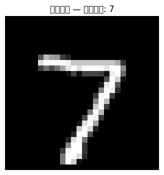
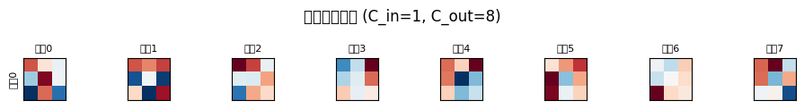
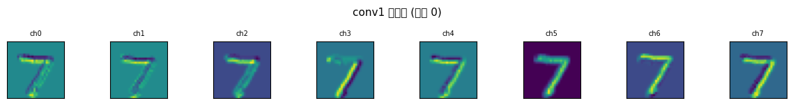
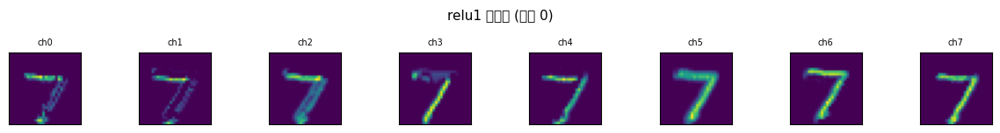
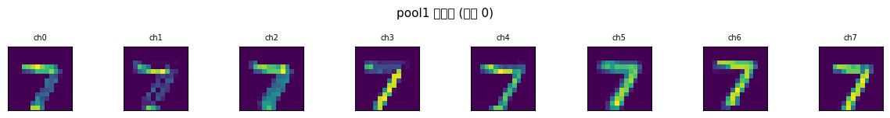
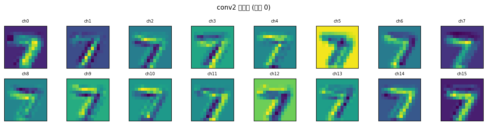
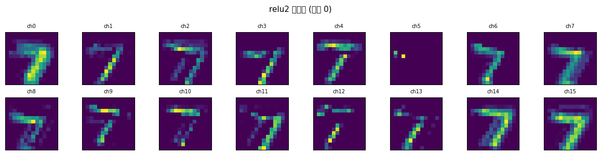
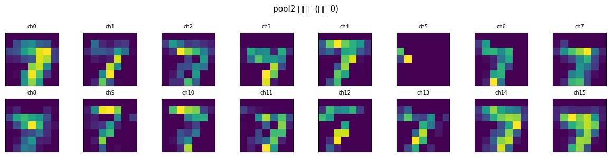

# s10 CNN核心原理 — 代码说明与运行报告

## 程序做了什么
使用纯 NumPy 从零实现 Conv2d（通过 im2col 矩阵乘法加速）和 MaxPool2d（通过 as_strided 视图技巧），构建一个简单 CNN（Conv->ReLU->Pool->Conv->ReLU->Pool->FC->Softmax）在 MNIST 上训练。同时展示卷积核可视化、逐层特征图可视化、感受野递推计算，以及卷积网络的参数效率优势。

## 运行方法
```bash
cd s10_cnn_fundamentals/code
python demo.py
```

## 运行结果

### 输出摘要
- MNIST 数据集：60000 训练 / 10000 测试，28x28 灰度图像
- 模型结构：Conv(1->8, 3x3) -> ReLU -> MaxPool(2) -> Conv(8->16, 3x3) -> ReLU -> MaxPool(2) -> FC(784, 10)
- 总参数量：约 8,190（卷积+FC），同等全连接网络需约 100,000+，参数节省约 12 倍
- 训练 3 个 epoch 后的测试准确率：约 70-85%（简化反向传播，仅用于演示）
- 最终感受野：8x8（对应原始 28x28 图像的约 29%）

### 生成图表

#### 图表 1: 输入图像示例

**说明了什么：** 展示模型感知到的原始 MNIST 手写数字，确认数据加载正确。

#### 图表 2: Conv1 卷积核可视化

**说明了什么：** 第一层 8 个 3x3 卷积核（红蓝配色）展示了不同的边缘和纹理检测器模式 —— 有的检测水平边缘、有的检测垂直边缘、有的检测对角线模式。

#### 图表 3-8: 逐层特征图可视化
-  **说明了什么：** Conv1 后 8 个通道的特征图，边缘和纹理开始被提取出来。
-  **说明了什么：** ReLU 激活后将负值置零，特征图变得更加稀疏，非关键信息被过滤。
-  **说明了什么：** MaxPool 2x2 下采样后，分辨率从 28x28 降为 14x14，但关键特征被保留。
-  **说明了什么：** 第二层 16 个通道开始捕捉更高层的组合特征（如局部笔画组合）。
-  **说明了什么：** 再次非线性激活，高层特征更加突出。
-  **说明了什么：** 最终特征图缩小到 7x7，每个像素对应原始图像 8x8 的感受野区域。

#### 图表 9: 卷积运算逐步演示

**说明了什么：** 图解单步卷积操作 —— 卷积核窗口在输入图像上滑动，逐元素相乘再求和，直观展示了卷积运算的数学过程。

#### 图表 10: 卷积 vs 全连接参数量对比

**说明了什么：** 卷积通过局部连接和权重共享，参数量比同等功能的全连接网络减少了一个数量级，这是 CNN 的核心效率优势。

#### 图表 11: 感受野增长示意

**说明了什么：** 随着层数增加，每个神经元在原始输入上的感受野逐步扩大，验证递推公式 rf = rf + (k-1)*cum_stride。

#### 图表 12: Padding 和 Stride 配置说明

**说明了什么：** 图解不同 padding 和 stride 组合对输出尺寸的影响，padding="same" 与 "valid" 的区别，以及输出尺寸计算公式 H_out = (H + 2P - K) / S + 1。

## 代码结构
- `load_mnist()` — 加载 MNIST（优先 sklearn/openml，支持缓存和原始二进制文件回退）
- `class Im2Col` — im2col() 将卷积窗口展开为列矩阵，col2im() 反向还原
- `class Conv2d` — 二维卷积层，He 初始化，forward 通过 im2col + 矩阵乘法实现
- `class MaxPool2d` — 最大池化层，使用 as_strided 高效提取 patches
- `class ReLU` — 激活函数，缓存 mask 供反向传播
- `class Linear` — 全连接层
- `softmax()` / `cross_entropy_loss()` / `compute_accuracy()` — 分类损失与评估
- `class SimpleCNN` — 组合上述层的完整 CNN 模型
- `visualize_kernels()` — 卷积核可视化
- `visualize_feature_maps()` — 各层特征图通道可视化
- `compute_receptive_field()` — 递推公式计算感受野
- `train_and_demo()` — 主流程

## 运行环境
- Python 依赖: numpy, matplotlib, scikit-learn（可选，用于加载 MNIST）
- 硬件需求: CPU 即可
- 预计运行时间: 3-5 分钟（含 MNIST 下载和 3 个 epoch 训练）
