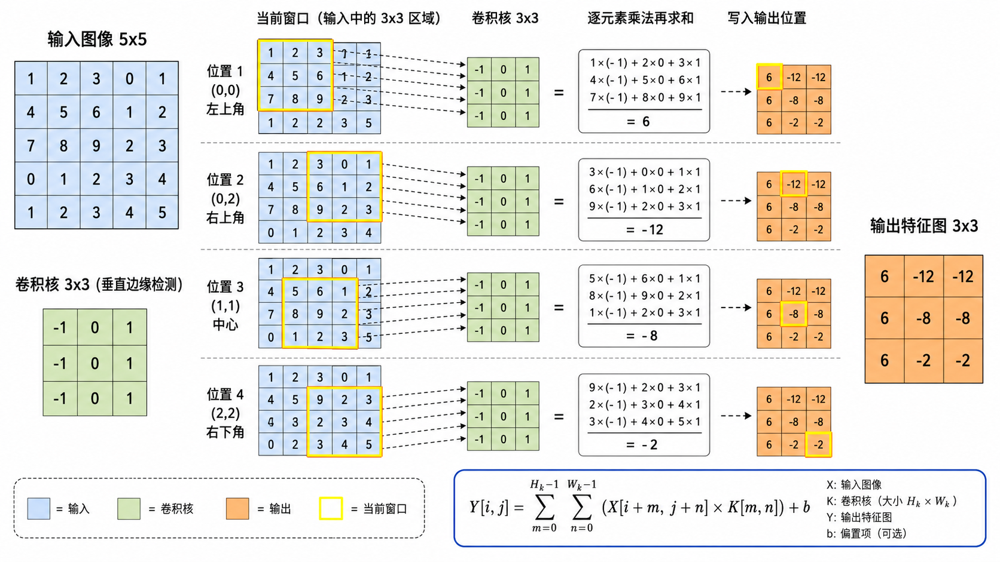
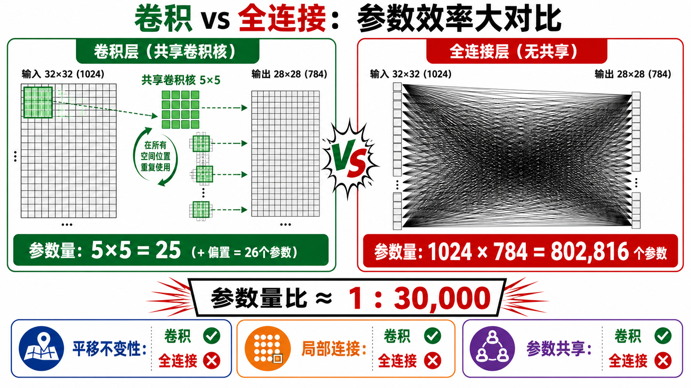
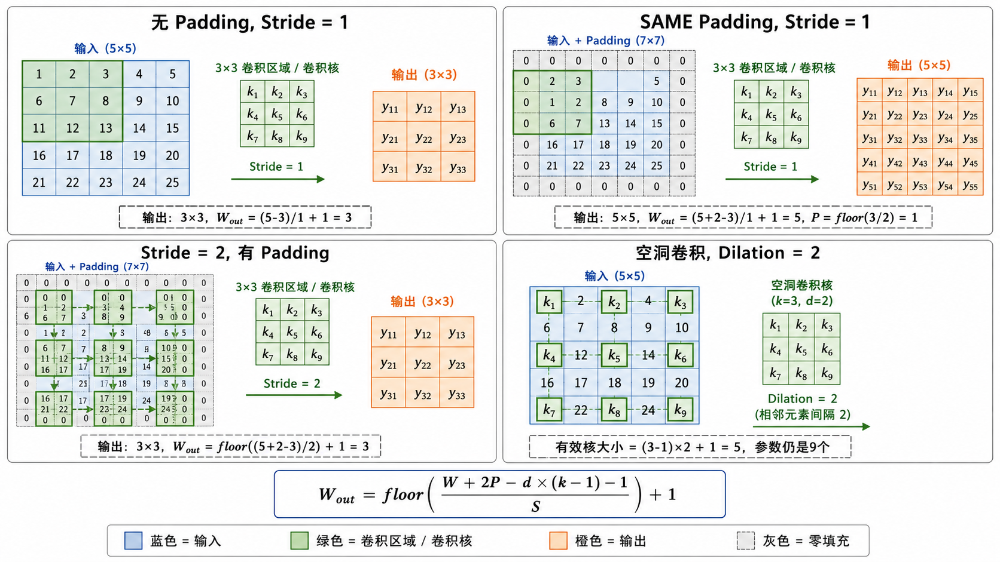
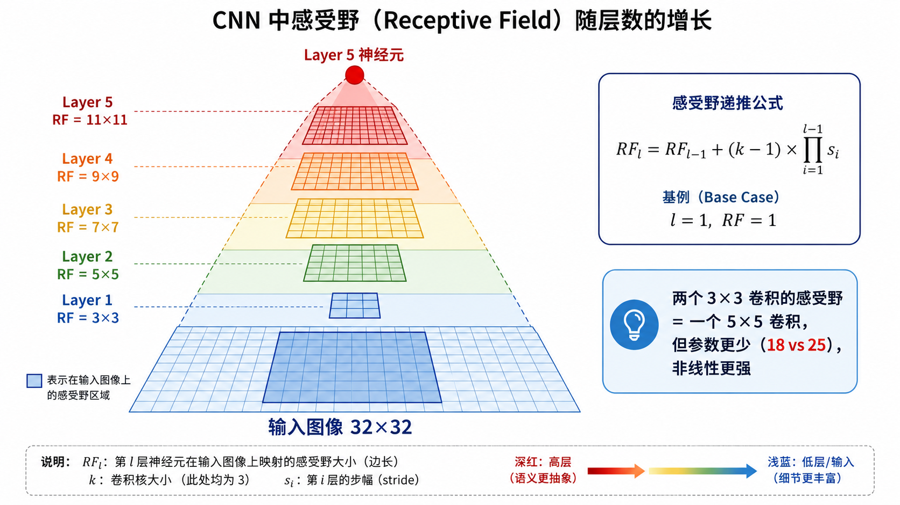

# s10 CNN 核心原理：卷积与感受野

> 从零理解卷积操作 —— 为什么卷积神经网络能"看懂"图像

---

## 一、为什么用卷积处理图像？

传统的全连接神经网络处理图像时，面临两个根本问题。假设一张 $32 \times 32$ 的 RGB 图像，输入维度为 $32 \times 32 \times 3 = 3072$。如果第一层有 1000 个神经元，那么权重矩阵的大小就是 $1000 \times 3072 \approx 300$ 万个参数。这仅仅是一层，而且对于稍微大一点的图像（如 $224 \times 224 \times 3 = 150528$），参数量会暴涨到上亿级别，根本无法训练。

然而，卷积操作天然地利用了图像的三个重要先验，完美解决了这些问题：

**1. 平移不变性（Translation Invariance）**

一只猫出现在图像的左上角还是右下角，它都是猫。卷积核在图像上滑动，无论目标移动到哪个位置，同一个卷积核都能检测到它。这是卷积的核心设计理念——**权值共享**：一个 $3 \times 3$ 的卷积核只有 9 个参数，但它被应用在图像的所有位置。

**2. 局部连接（Local Connectivity）**

图像中相距较远的像素之间通常没有直接的语义关联。一个边缘检测器只需要看局部的 $3 \times 3$ 或 $5 \times 5$ 区域，不需要看全图。卷积的局部感受野正是对这一现象的建模。

**3. 参数共享（Parameter Sharing）**

同一个特征（如"水平边缘"）可能在图像的任意位置出现。卷积核在整个图像上共享权重，使得检测"水平边缘"只需要学一组参数，而非为每个位置单独学习。

> **一句话总结**：卷积层将全连接层的 $O(H^2 W^2)$ 参数量降到了 $O(K^2 C_{in} C_{out})$，其中 $K$ 是卷积核大小（通常 3 或 5），与输入尺寸无关。



---

## 二、卷积操作：从数学到直观

### 2.1 二维卷积的数学定义

给定输入图像 $X \in \mathbb{R}^{H \times W}$ 和卷积核 $K \in \mathbb{R}^{k \times k}$，输出特征图 $Y$ 在位置 $(i, j)$ 的值定义为：

$$
Y[i, j] = \sum_{m=0}^{k-1} \sum_{n=0}^{k-1} X[i+m, j+n] \cdot K[m, n] + b
$$

其中 $b$ 是偏置项。

### 2.2 直观理解：滑动窗口

卷积核就像一个"探测器"，在输入图像上从左到右、从上到下滑动。每次停在一个位置，就做一次**逐元素乘法再求和**：

1. 把 $3 \times 3$ 的卷积核"盖"在图像的 $3 \times 3$ 区域上
2. 对应位置的 9 对数字相乘
3. 把 9 个乘积加起来，得到输出特征图上的一个像素值
4. 卷积核向右滑动一格（步长），重复以上过程

这个过程类似于信号处理中的**互相关**（Cross-Correlation）操作——深度学习中的"卷积"严格来说是互相关，因为卷积核没有翻转。但在实际使用中，大家统一称之为卷积。



---

## 三、Padding、Stride 与输出尺寸

### 3.1 Padding（填充）

如果不做 padding，每次卷积都会使输出尺寸缩小。对于 $H \times W$ 的输入和 $k \times k$ 的卷积核：

- **VALID padding（无填充）**：输出尺寸为 $(H - k + 1) \times (W - k + 1)$
- **SAME padding（等尺寸）**：在输入边缘填充 $P = \lfloor k/2 \rfloor$ 圈零值，使得输出尺寸与输入相同：$H \times W$

SAME padding 的命名非常直观——输入输出保持相同尺寸。对于 $3 \times 3$ 卷积核，需要在四周各填充 1 个像素（$P=1$）；对于 $5 \times 5$ 卷积核，需要填充 $P=2$。

### 3.2 Stride（步长）

步长 $S$ 控制卷积核每次滑动的距离。$S=1$ 时卷积核每次移动一个像素，$S=2$ 时每次移动两个像素，输出尺寸减半。

### 3.3 Dilation（空洞卷积）

空洞卷积通过在卷积核元素之间插入"空洞"（零值）来扩大感受野，而不增加参数数量。对于 dilation rate $d$，有效卷积核大小为 $(k-1)d + 1$。

**通用输出尺寸公式**：对于输入尺寸 $W$、卷积核大小 $k$、padding $P$、stride $S$、dilation $d$：

$$
W_{out} = \left\lfloor \frac{W + 2P - d \cdot (k-1) - 1}{S} \right\rfloor + 1
$$

当 $d=1$ 时退化为标准形式：

$$
W_{out} = \left\lfloor \frac{W + 2P - k}{S} \right\rfloor + 1
$$



---

## 四、池化（Pooling）：降维与不变性

池化层不包含可学习的参数，它通过固定的下采样操作缩小特征图的尺寸。

### 4.1 最大池化（Max Pooling）

在 $k \times k$ 窗口内取最大值。最大池化保留了"最显著的特征是否出现"这一信息，而忽略其精确位置。

```
输入 2×2 区域：        最大池化输出：
[1, 3]                  9
[7, 9]
```

### 4.2 平均池化（Average Pooling）

在 $k \times k$ 窗口内取平均值。平均池化保留了区域内的整体强度信息，对噪声更鲁棒，但会模糊显著特征。

### 4.3 池化的作用

1. **降维**：$2 \times 2$ 池化（stride=2）将特征图尺寸减半，减少后续层的计算量
2. **平移不变性**：输入微小平移时，池化后的输出可能完全不变——这有助于分类任务的鲁棒性
3. **增大感受野**：不需要增加卷积核大小，就能让深层神经元看到更大的输入区域

---

## 五、感受野（Receptive Field）

### 5.1 什么是感受野？

在 CNN 中，某一层特征图上的一个神经元的值，由输入图像上的某一区域决定。这个区域就是该神经元的**感受野**。

- 第 1 层（$3 \times 3$ 卷积）：每个神经元看到输入图像的 $3 \times 3$ 区域
- 第 2 层（再做一个 $3 \times 3$ 卷积）：每个神经元看到输入图像的 $5 \times 5$ 区域
- 第 3 层：感受野扩大到 $7 \times 7$

### 5.2 感受野的递推公式

设第 $l$ 层的卷积核大小为 $k_l$，步长为 $s_1, s_2, ..., s_l$。第 $l$ 层神经元在原图上的感受野大小 $RF_l$ 递推如下：

$$
RF_l = RF_{l-1} + (k_l - 1) \times \prod_{i=1}^{l-1} s_i
$$

其中 $RF_0 = 1$。

> **直觉**：每加一层卷积，感受野以 $(k-1)$ 为步长线性增长（在原始图像尺度上）。而池化的步长会加速感受野的扩张——一个 $2 \times 2$ 池化（stride=2）会直接使感受野翻倍。

### 5.3 感受野为什么重要？

- **分类任务**：高层神经元需要足够大的感受野来覆盖整个目标物体
- **语义分割**：需要同时拥有大感受野（全局上下文）和小感受野（精细边界）
- **目标检测**：需要在不同尺度上检测不同大小的目标

> 小卷积核堆叠 vs 大卷积核：两个 $3 \times 3$ 卷积（感受野 $5 \times 5$，参数 $18$）可以替代一个 $5 \times 5$ 卷积（感受野 $5 \times 5$，参数 $25$），且非线性更强。这就是 VGG 的设计哲学。



---

## 六、多通道卷积

真实图像有多个通道（如 RGB 三通道），而 CNN 的每一层也会输出多个特征图（多个通道）。

### 6.1 输入通道→输出通道

一个卷积层的**卷积核是 3D 的**：形状为 $(C_{out}, C_{in}, k, k)$。

对于第 $j$ 个输出通道 $(j = 1, ..., C_{out})$：

$$
Y[j, :, :] = \sum_{c=0}^{C_{in}-1} X_c \circledast K_{j, c} + b_j
$$

符号 $\circledast$ 表示 2D 卷积。这意味着每个输出通道是**所有输入通道的卷积结果之和**——卷积核在空间维度上是 2D 的，在通道维度上做了一次全连接。

换句话说，一个 $C_{in}$ 通道的输入经过 $C_{out}$ 个卷积核后，产生 $C_{out}$ 个通道的输出。每个卷积核需要处理所有 $C_{in}$ 个输入通道。

### 6.2 1×1 卷积（Pointwise Convolution）

$1 \times 1$ 卷积是一个特殊但极其重要的操作。它在空间上不做任何聚合（只看一个像素），但会混合所有输入通道：

$$
Y[j, :, :] = \sum_{c=0}^{C_{in}-1} W_{j, c} \cdot X_c + b_j
$$

$1 \times 1$ 卷积的三个关键用途：

1. **通道降维/升维**：将 256 通道的输入降到 64 通道，大幅减少后续 $3 \times 3$ 卷积的计算量
2. **跨通道信息融合**：在每个空间位置上独立地混合通道信息，等价于逐像素的全连接
3. **增加非线性**：$1 \times 1$ Conv + ReLU 相当于在不增加感受野的情况下增加网络的表达能力

这是 GoogLeNet Inception 模块和 ResNet Bottleneck 设计的核心工具。

---

## 七、卷积层的计算量与参数量

对于一个卷积层，设输入大小为 $(C_{in}, H, W)$，输出大小为 $(C_{out}, H_{out}, W_{out})$，卷积核大小为 $k \times k$：

### 参数量

$$
\text{Params} = C_{out} \times C_{in} \times k \times k + C_{out}
$$

最后的 $+C_{out}$ 是偏置项。

### 计算量（FLOPs）

每次卷积有 $k^2$ 次乘法（和一次加法），每个输出位置都要做一次，共 $C_{out} \times C_{in} \times H_{out} \times W_{out}$ 个位置：

$$
\text{FLOPs} \approx 2 \times C_{out} \times C_{in} \times k^2 \times H_{out} \times W_{out}
$$

因子 2 是因为每次乘法通常伴随一次加法（Multiply-Add 算一次）。

> **对比全连接层**：假设输入为 $C_{in} \times H \times W$ 的展开向量，全连接到 $C_{out} \times H_{out} \times W_{out}$ 需要约 $C_{in} C_{out} H W H_{out} W_{out}$ 个参数——是卷积层的 $H_{out} W_{out}$ 倍。对于 $32 \times 32$ 的输入，这个倍数轻松达到成百上千。

---

## 八、Im2Col：卷积的矩阵乘法实现

在底层实现中，卷积通常被转化为矩阵乘法（GEMM）来利用 GPU 的并行计算能力。这个转化过程叫做 **im2col**（image to column）：

1. 提取输入中每一个"将被卷积核覆盖的小块"（patches），每个 patch 的大小是 $C_{in} \times k \times k$
2. 将所有 patches 排列成一个矩阵 $\tilde{X}$，形状为 $(H_{out} \times W_{out}, C_{in} \times k \times k)$
3. 将卷积核展开成矩阵 $\tilde{K}$，形状为 $(C_{in} \times k \times k, C_{out})$
4. 做一次矩阵乘法：$\tilde{Y} = \tilde{X} \cdot \tilde{K}$，再 reshape 为输出形状 $(C_{out}, H_{out}, W_{out})$

这就是为什么现代深度学习框架中的卷积操作能跑得这么快——底层调用的是高度优化的 GEMM 库（如 cuBLAS、MKL）。

---

## 九、本节小结

| 概念 | 一句话 |
|------|--------|
| 卷积的动机 | 利用图像的平移不变性、局部连接和参数共享，大幅降低参数量 |
| 卷积操作 | 卷积核在输入上滑动，每次做逐元素乘法再求和 |
| Padding | 在输入边缘填零，控制输出尺寸（VALID 无填充，SAME 保持尺寸） |
| Stride | 卷积核滑动步长，控制下采样程度 |
| 池化 | 无参数的下采样（最大池化保留显著特征，平均池化保留整体信息） |
| 感受野 | 深层神经元对应到原始输入上的区域大小，随层数单调增长 |
| 多通道 | $C_{in}$ 输入 × $C_{out}$ 个 3D 卷积核 → $C_{out}$ 输出通道 |
| 1×1 卷积 | 逐像素的跨通道线性混合，用于升降维和通道交互 |
| 计算量 | $O(C_{in} C_{out} k^2 H_{out} W_{out})$，与输出分辨率成正比 |

> 下一节 [s11 经典架构演进](../s11_cnn_architectures/) 将展示这些基本组件如何被组装成 LeNet、AlexNet、VGG、ResNet 等里程碑式的网络架构，以及它们各自的创新点在哪里。

## 📥 Code

| File | View | Download |
|------|------|----------|
| demo.py | [Open](./code-demo) | <a href="../code/s10_cnn_fundamentals/demo.py" target="_blank" download>Download</a> |
| exercise.py | [Open](./code-exercise) | <a href="../code/s10_cnn_fundamentals/exercise.py" target="_blank" download>Download</a> |

## 参考

1. LeCun, Y., Bottou, L., Bengio, Y., & Haffner, P. (1998). Gradient-Based Learning Applied to Document Recognition. *Proceedings of the IEEE*. (LeNet-5) [[doi:10.1109/5.726791](http://yann.lecun.com/exdb/publis/pdf/lecun-98.pdf)]
2. Fukushima, K. (1980). Neocognitron: A Self-organizing Neural Network Model for a Mechanism of Pattern Recognition. *Biological Cybernetics*. (CNN 前身)

