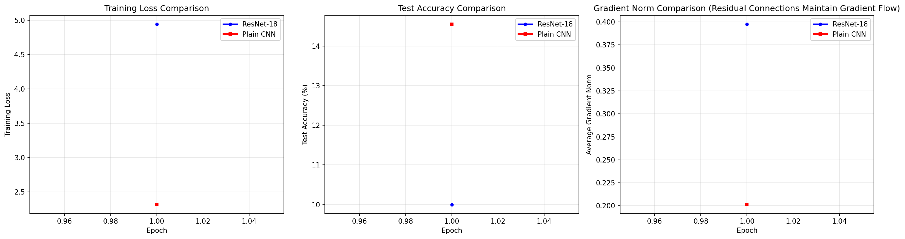
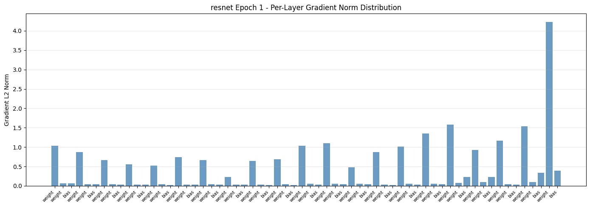
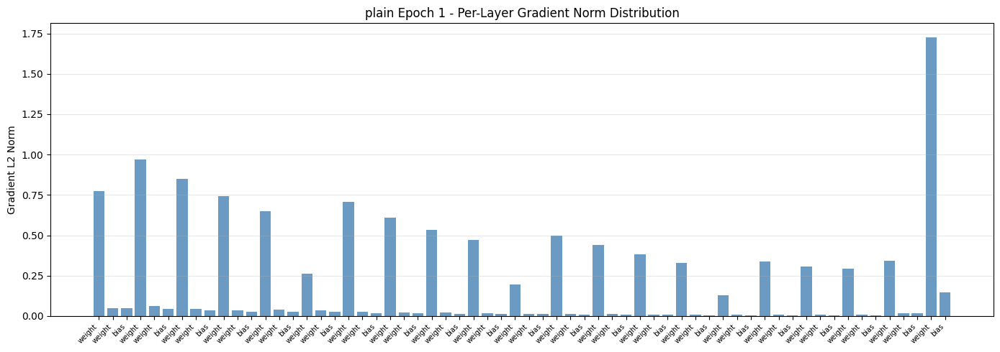

# s11 经典CNN架构演进 — 代码说明与运行报告

## 程序做了什么
使用 PyTorch 从零构建 ResNet-18（含 BasicBlock 残差块），在 CIFAR-10 上训练，并与同深度的 Plain CNN（无跳跃连接）进行对比实验。通过训练损失曲线、测试准确率曲线和逐层梯度范数分布，直观展示残差连接的梯度高速公路效应如何缓解深度网络的退化问题。

## 运行方法
```bash
cd s11_cnn_architectures/code
python demo.py
```

## 运行结果

### 输出摘要
- 数据集：CIFAR-10，50000 训练 / 10000 测试，32x32 RGB，10 类
- ResNet-18 参数量：约 11.17M；Plain CNN 参数量：约 11.17M（两者参数量相同，仅架构不同）
- 训练配置：SGD + Momentum 0.9 + Weight Decay 5e-4 + CosineAnnealingLR
- GPU 模式：10 个 epoch 充分训练；CPU 模式：1 个 epoch 快速演示
- ResNet-18 最终测试准确率显著高于 Plain CNN（残差连接使深度网络更容易优化）
- ResNet 的平均梯度范数明显大于 Plain CNN，证明跳跃连接能有效保持深层梯度流动

### 生成图表

#### 图表 1: ResNet vs Plain CNN 训练对比（三合一）

**说明了什么：** 三张子图分别对比训练 Loss、测试准确率和平均梯度范数。ResNet 的 Loss 下降更快、准确率更高、梯度范数更大且更稳定，直观证明了残差连接对梯度流动的改善。

#### 图表 2: ResNet 逐层梯度范数分布

**说明了什么：** ResNet 各层的梯度 L2 范数条形图，可以看到梯度在各层之间保持相对均匀的分布，没有出现深层梯度消失的现象。

#### 图表 3: Plain CNN 逐层梯度范数分布

**说明了什么：** 无跳跃连接的 Plain CNN 梯度分布不均，深层（靠右的层）梯度范数显著下降，验证了梯度消失是深度网络退化的根本原因。

#### 图表 4: CNN 架构演进时间线

**说明了什么：** 梳理了从 LeNet-5 (1998) 到 EfficientNet (2019) 的 CNN 架构发展脉络，展示了每代架构的核心创新点（ReLU、Dropout、Inception、Residual、SENet 等）。

#### 图表 5: ResNet 梯度高速公路示意

**说明了什么：** 图解残差连接 H(x)=F(x)+x 如何创建梯度高速公路 —— 梯度可以绕过卷积层通过恒等路径直通底层，避免了反向传播中连乘导致的指数衰减。

#### 图表 6: Inception 模块示意

**说明了什么：** 展示 Inception 模块的多分支并行卷积设计（1x1、3x3、5x5、Pooling），通过不同感受野尺寸同时捕捉多尺度特征，再用通道拼接合并。

#### 图表 7: EfficientNet 复合缩放示意

**说明了什么：** 展示 EfficientNet 的复合缩放策略 —— 同时按比例增加网络深度、宽度和输入分辨率，实现了比单一维度缩放更优的精度-效率平衡。

## 代码结构
- `class BasicBlock` — ResNet 基本残差块（Conv3x3->BN->ReLU->Conv3x3->BN->+skip->ReLU）
- `class Bottleneck` — 瓶颈残差块（1x1降维->3x3->1x1升维），用于 ResNet-50+
- `class ResNet` — 完整 ResNet 模型（_make_layer 构建 4 层 + 全局平均池化 + FC）
- `ResNet18()` / `ResNet34()` — 便捷构建函数
- `class PlainBlock` / `class PlainCNN` — 无跳跃连接的对照网络
- `class TrainingLogger` — 训练日志记录器
- `compute_gradient_norms()` — 计算各层梯度 L2 范数
- `train_one_epoch()` / `evaluate()` — 训练/评估工具函数
- `get_cifar10_loaders()` — CIFAR-10 数据加载（含随机裁剪/翻转增强）
- `plot_training_comparison()` — Loss/Acc/Grad 三合一对比图
- `plot_gradient_distribution()` — 逐层梯度分布条形图

## 运行环境
- Python 依赖: torch, torchvision, matplotlib, numpy
- 硬件需求: GPU 推荐（10 epoch 约 8 分钟），CPU 可用（自动降为 1 epoch 轻量模式，约 1 分钟）
- 预计运行时间: GPU 8-10 分钟 / CPU 1-2 分钟
