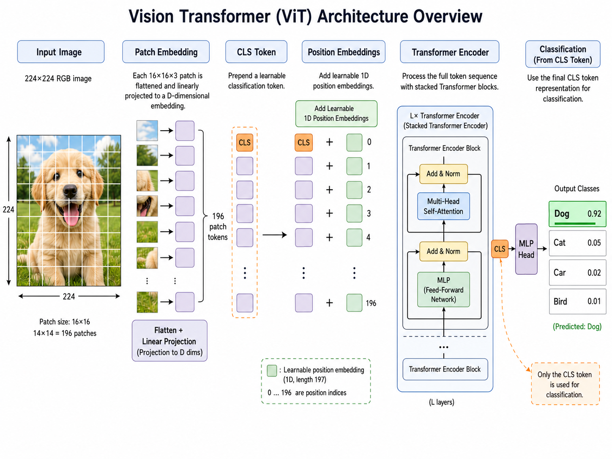
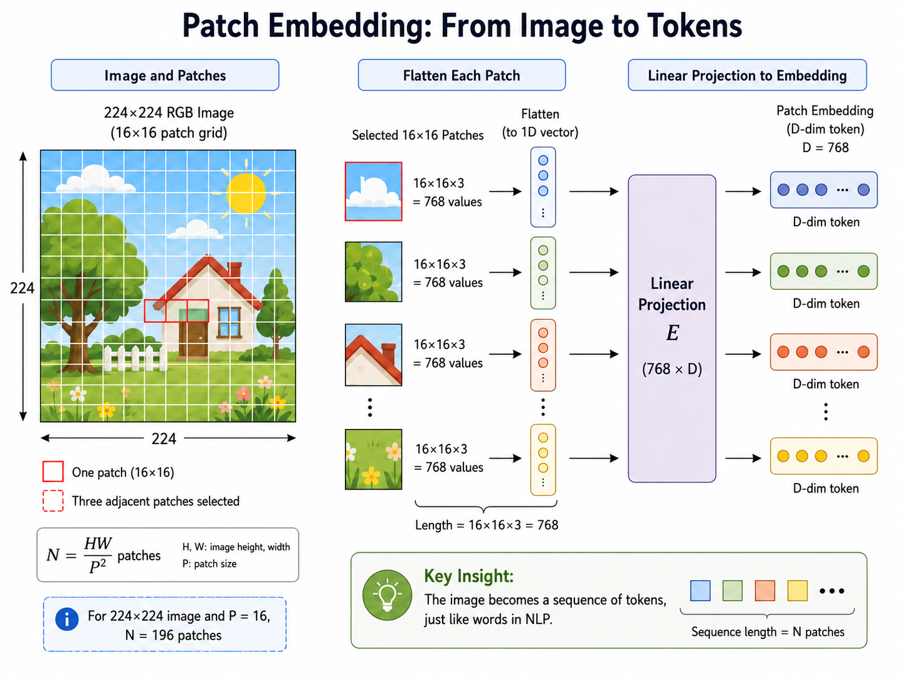
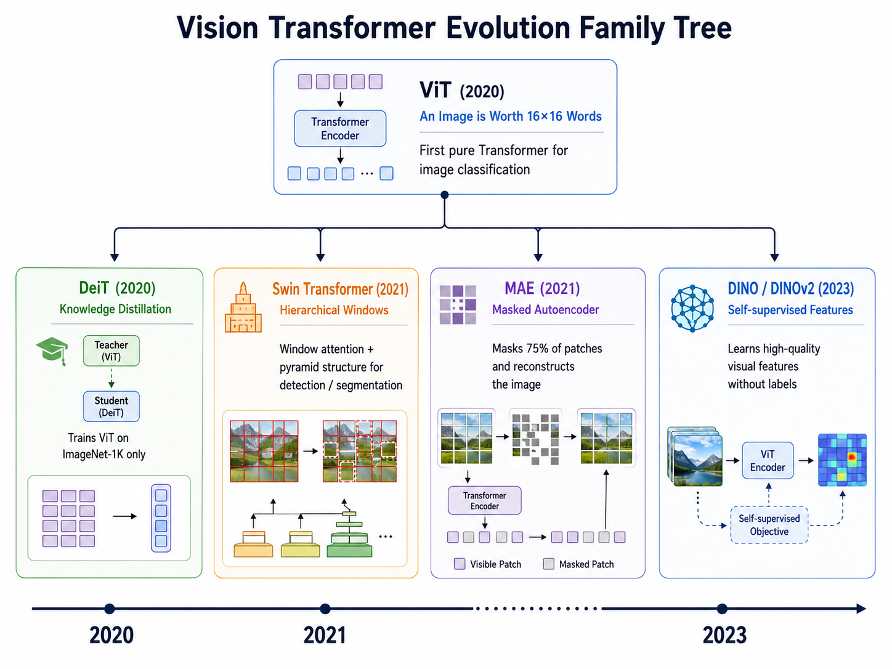
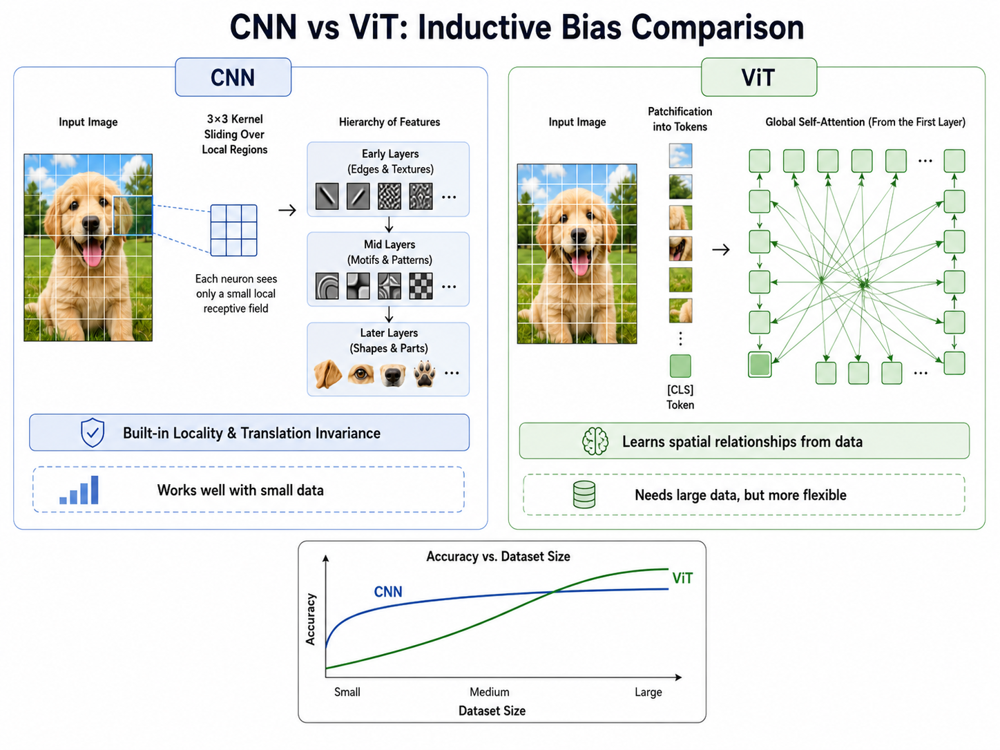

# s11b Vision Transformer：当 Transformer 遇见图像

> 2020 年，Google 用一篇《An Image is Worth 16x16 Words》证明：把图像切成 patch 当词序列，扔进标准 Transformer，就能超越 CNN。

---

## 1. CNN 的局限与 Transformer 的机会

从 LeNet（1998）到 EfficientNet（2019），卷积神经网络统治了计算机视觉整整二十年。CNN 之所以成功，很大程度上归功于两个内置的**归纳偏置**（inductive bias）：

1. **局部性**（locality）：卷积核只关注局部邻域（$3 \times 3$ 或 $5 \times 5$），假设图像中相邻像素比远距离像素更有关系
2. **平移不变性**（translation invariance）：同一个卷积核在图像各处共享权重，无论物体在左上角还是右下角，检测方式都一样

这些归纳偏置在数据量有限的场景下是巨大的优势——模型不需要从零学习"相近像素有关联"这个常识，开箱即用。但这也是 CNN 的"紧箍咒"：**局部连接意味着浅层卷积核看不到全局关系**，必须通过堆叠很多层来逐步扩大感受野；而权重共享虽然高效，却也限制了模型对不同区域采用不同处理策略的灵活性。

与此同时，NLP 领域经历了翻天覆地的变化。2017 年的 Transformer 架构完全抛弃了 RNN 的循环结构，仅靠**自注意力机制**（self-attention）让序列中每个位置同时关注所有其他位置。BERT（2018）和 GPT 系列（2018-2020）证明了 Transformer 在大规模文本数据上的表征学习能力远超 LSTM。

这引出了一个自然的问题：**如果 Transformer 在 NLP 中如此成功，我们能不能把它用到图像上？**

之前也有人尝试——比如 Image Transformer（2018）用自注意力生成图像像素，但复杂度是 $O(n^2)$ 于像素数，只能处理小图。关键在于：如何降低序列长度？

答案就是 **Patch**。

---

## 2. ViT 核心思想：图像就是一个 Patch 序列

Vision Transformer（ViT，Dosovitskiy et al., 2020）的洞见极其简洁，几乎可以说是"暴力"：

> **把图像切成一个个小方块（patch），每个 patch 当作 NLP 中的一个"词"，然后把整串 patch 扔进标准 Transformer 编码器。**



不需要修改 Transformer 的任何结构，不需要卷积，不需要特殊的视觉归纳偏置——整个模型就是一个纯 Transformer。

### 2.1 整体流程

给定一张 $H \times W \times C$ 的 RGB 图像（典型：$224 \times 224 \times 3$）：

**Step 1 — Patch Embedding**：将图像均匀切成 $P \times P \times C$ 大小的 patch（典型 $P=16$），得到 $N = \frac{HW}{P^2}$ 个 patch（即 $14 \times 14 = 196$ 个）。每个 patch 展平为 $P^2 \cdot C = 16 \times 16 \times 3 = 768$ 维向量，再用一个可学习的线性层映射到 $D$ 维嵌入空间。

**Step 2 — CLS Token + Position Embedding**：在序列开头拼接一个可学习的 `[class]` token（记为 $\mathbf{x}_{\text{class}}$），类似于 BERT 的 `[CLS]`。然后对所有 $N+1$ 个 token 加上可学习的 1D 位置编码 $\mathbf{E}_{\text{pos}} \in \mathbb{R}^{(N+1) \times D}$。

**Step 3 — Transformer Encoder**：将序列送入 $L$ 层标准 Transformer 编码器，每层包含多头自注意力（MSA）和 MLP，均使用 Pre-Norm 残差连接。

**Step 4 — Classification Head**：取 `[class]` token 的最终输出 $\mathbf{z}_L^0$，通过一个 MLP 头输出分类 logits。

### 2.2 数学公式

完整的前向传播可以用以下公式描述：

**输入预处理：**

$$
\begin{aligned}
\mathbf{x}_p^i &= \text{Flatten}(\text{Patch}_i) \cdot \mathbf{E}, \quad i = 1, 2, \dots, N \\[4pt]
\mathbf{z}_0 &= [\mathbf{x}_{\text{class}};\; \mathbf{x}_p^1\mathbf{E};\; \mathbf{x}_p^2\mathbf{E};\; \dots;\; \mathbf{x}_p^N\mathbf{E}] + \mathbf{E}_{\text{pos}}
\end{aligned}
$$

其中 $\mathbf{E} \in \mathbb{R}^{(P^2 \cdot C) \times D}$ 是 patch embedding 投影矩阵，$\mathbf{E}_{\text{pos}} \in \mathbb{R}^{(N+1) \times D}$ 是位置编码。

**第 $l$ 层 Transformer 编码器：**

$$
\begin{aligned}
\mathbf{z}'_l &= \text{MSA}\big(\text{LN}(\mathbf{z}_{l-1})\big) + \mathbf{z}_{l-1} \\[4pt]
\mathbf{z}_l &= \text{MLP}\big(\text{LN}(\mathbf{z}'_l)\big) + \mathbf{z}'_l
\end{aligned}
$$

其中多头自注意力的计算为：

$$
\text{MSA}(\mathbf{z}) = \text{Concat}(\text{head}_1, \dots, \text{head}_h)\mathbf{W}^O
$$

$$
\text{head}_j = \text{Attention}(\mathbf{z}\mathbf{W}_j^Q, \mathbf{z}\mathbf{W}_j^K, \mathbf{z}\mathbf{W}_j^V)
$$

$$
\text{Attention}(\mathbf{Q}, \mathbf{K}, \mathbf{V}) = \text{softmax}\!\left(\frac{\mathbf{Q}\mathbf{K}^\top}{\sqrt{d_k}}\right)\mathbf{V}
$$

**分类输出：**

$$
\mathbf{y} = \text{MLP}_{\text{head}}\big(\text{LN}(\mathbf{z}_L^0)\big)
$$

其中 $\mathbf{z}_L^0$ 是 `[class]` token 在第 $L$ 层的输出。

### 2.3 一个关键细节：为什么用 1D 位置编码而不是 2D？

直觉上，图像有明确的 2D 空间结构，应该使用 2D 位置编码（行编码 + 列编码）。但 ViT 的实验表明：**1D 和 2D 位置编码的效果几乎没有差异**。这是因为模型可以通过学习到的位置嵌入隐式地推断 2D 空间关系——Transformer 有足够的能力自己学。

### 2.4 模型规格

ViT 论文提供了三种主要规格，与 BERT 的命名风格一致：

| 模型 | 层数 $L$ | 隐藏维度 $D$ | MLP 维度 | 头数 | 参数量 |
|------|---------|-------------|---------|------|--------|
| ViT-Base | 12 | 768 | 3072 | 12 | 86M |
| ViT-Large | 24 | 1024 | 4096 | 16 | 307M |
| ViT-Huge | 32 | 1280 | 5120 | 16 | 632M |

> 注意：这些参数量与 BERT 几乎完全相同——这正是"不改 Transformer"的结果。ViT 的 Transformer 编码器与 BERT 的 Transformer 编码器在数学上完全一样。

---

## 3. Patch Embedding：从像素到 Token



Patch Embedding 是 ViT 中唯一与 NLP 不同的组件，也是它"连接两个世界"的桥梁。让我们深入其数学细节。

### 3.1 操作分解

给定图像 $\mathbf{I} \in \mathbb{R}^{H \times W \times C}$，patch 尺寸为 $P$：

1. **切分**：将图像切分为 $N = (H/P) \times (W/P)$ 个互不重叠的 patch。每个 patch 的形状为 $P \times P \times C$。

2. **展平**：将每个 patch 展开为一个 1D 向量 $\mathbf{x}_p^i \in \mathbb{R}^{P^2 \cdot C}$。对于 ViT-Base（$P=16$），$P^2 \cdot C = 256 \times 3 = 768$。

3. **线性投影**：通过一个可学习的投影矩阵 $\mathbf{E} \in \mathbb{R}^{(P^2 C) \times D}$ 将每个 patch 向量映射到 $D$ 维嵌入空间：
   $$
   \text{token}_i = \mathbf{x}_p^i \cdot \mathbf{E}
   $$

4. **序列化**：将所有 token 排列为一个序列 $\in \mathbb{R}^{N \times D}$。

### 3.2 实现：Conv2d 技巧

在实践中，patch embedding 不需要手动切分再投影。一个更优雅（且更高效）的实现是使用**卷积**：

$$
\text{PatchEmbed}(\mathbf{I}) = \text{Conv2d}(C_{\text{in}}=3, C_{\text{out}}=D, \text{kernel\_size}=P, \text{stride}=P)(\mathbf{I})
$$

这个 Conv2d 的 kernel 大小和 stride 都设为 $P$，意味着它在图像上以 $P \times P$ 的窗口滑动，步长也是 $P$——正好实现了"切 patch + 线性投影"两个操作。输出形状为 $D \times (H/P) \times (W/P)$，将其展平并转置即得到 $(N, D)$ 的 token 序列。

### 3.3 CLS Token 和位置编码

在 token 序列构造完成后，ViT 做了两个额外的操作：

**CLS Token**：在序列开头拼接一个可学习的参数 $\mathbf{x}_{\text{class}} \in \mathbb{R}^{D}$。这个 token 在 Transformer 各层中与其他 patch token 一样参与自注意力计算，因此它可以在整个图像上聚合信息。最终分类时只取它的输出——这是一个优雅的设计：让模型自己学会把分类信息"沉淀"到这个特殊 token 中。

**位置编码**：由于自注意力本身不具备顺序感知能力（它是排列等变的），需要给每个 token 注入位置信息。ViT 使用**可学习的 1D 位置编码** $\mathbf{E}_{\text{pos}} \in \mathbb{R}^{(N+1) \times D}$，直接与 token 相加：

$$
\mathbf{z}_0 = [\mathbf{x}_{\text{class}}; \mathbf{x}_p^1; \dots; \mathbf{x}_p^N] + \mathbf{E}_{\text{pos}}
$$

训练完成后，位置编码 $\mathbf{E}_{\text{pos}}$ 会自然呈现出 2D 空间结构——相近位置的编码向量更相似，说明模型确实从 1D 序列中"领悟"出了 2D 空间。

---

## 4. ViT vs CNN：归纳偏置的博弈



ViT 和 CNN 的根本差异在于它们对视觉世界的"先验假设"不同。

### 4.1 归纳偏置对比

| 维度 | CNN | ViT |
|------|-----|-----|
| **局部性** | 内置（$3 \times 3$ 卷积核） | 无。需要从数据中学习"近处有关联" |
| **平移等变性** | 内置（权重共享 + 滑动窗口） | 无。位置关系由位置编码提供，不是结构保证 |
| **全局感受野** | 需要多层堆叠才能获得 | 第一层即可（自注意力全体交互） |
| **数据效率** | 高。少量标记数据即可 | 低。需要极大量数据才能弥补归纳偏置的缺失 |
| **可扩展性** | 相对受限 | 极强。随数据量增长性能持续提升，不像 CNN 那样趋于饱和 |
| **计算复杂度** | $O(k^2 \cdot C_{\text{in}} \cdot C_{\text{out}} \cdot HW)$ | $O(N^2 \cdot D + N \cdot D^2)$，其中 $N$ 为 patch 数 |

### 4.2 数据尺度是关键变量

ViT 论文中有一个核心发现：

- **在小数据集上**（如 ImageNet-1K，130 万张）：ViT 不如同等规模的 CNN（如 ResNet）。因为没有局部性先验，模型需要自己从零学，数据不够。
- **在中等数据集上**（如 ImageNet-21K，1400 万张）：ViT 与 CNN 持平或略优。
- **在大数据集上**（如 JFT-300M，3 亿张）：ViT 全面超越 CNN，表现出**未饱和**的扩展性。

这揭示了一个深刻的 trade-off：**归纳偏置 = 数据效率 + 灵活性上限之间的权衡**。

- CNN 的强归纳偏置使它在小数据时"起点高"，但这些假设也限制了它对长尾模式的学习能力
- ViT 几乎没有任何视觉特定的归纳偏置，起点低，但**上限高**——给足够的数据和参数量，它能学到比 CNN 更灵活、更通用的视觉表征

### 4.3 什么时候用 ViT？什么时候用 CNN？

**优先使用 CNN 的场景**：
- 数据量有限（数万到数十万张图像）
- 对实时性要求极高的边缘设备
- 需要精确定位的结构化任务（CNN 的特征图天然保留空间结构）

**优先使用 ViT 的场景**：
- 有大规模训练数据（百万级以上）
- 有强大的预训练模型可用（ImageNet-21K 或更大的预训练）
- 需要统一架构处理多模态（文本 + 图像 → 同一个 Transformer）

> 在实际工程中，一个实用的策略是：如果数据量<10 万张，用 CNN 从零训练；如果数据量>10 万张，用预训练 ViT 微调。

---

## 5. ViT 进化树



ViT 只是一个起点。后续研究从不同角度对它进行了改进和扩展，形成了一个庞大的 ViT "家族"。

### 5.1 DeiT (2020)：让 ViT 在 ImageNet-1K 上也能用

ViT 的最大痛点是需要海量数据（如 JFT-300M）预训练。Facebook 的 **DeiT**（Data-efficient Image Transformers）通过**知识蒸馏**解决了这个问题：用一个预训练的 CNN（作为 teacher）来指导 ViT 的训练，只用一个额外的蒸馏 token 和蒸馏损失。DeiT 只用 ImageNet-1K（无需 ImageNet-21K 或 JFT）就达到了与 CNN 竞争的性能。

核心公式：在原有分类损失上增加蒸馏损失 $\mathcal{L}_{\text{distill}} = \text{KL}(\text{softmax}(z_s/T), \text{softmax}(z_t/T))$，其中 $z_s$ 是学生（ViT）的输出，$z_t$ 是教师（CNN）的输出，$T$ 是温度参数。

### 5.2 Swin Transformer (2021)：为密集预测而生

原始 ViT 输出的是固定分辨率的特征图（所有 patch 在每层保持相同数量），不适合需要多尺度特征图的检测和分割任务。微软的 **Swin Transformer** 引入了两个关键设计：

- **窗口注意力**（Window Attention）：将特征图划分为不重叠的窗口，自注意力只在窗口内计算，将复杂度从 $O(N^2)$ 降为 $O(N \cdot W^2)$（$W$ 是窗口大小）
- **层级结构**：像 CNN 一样逐步下采样，构建特征金字塔，与 FPN/Mask R-CNN 等检测分割架构无缝对接

Swin Transformer 获得了 ICCV 2021 最佳论文奖（马尔奖）。

### 5.3 MAE (2021)：BERT 式的自监督 ViT

Kaiming He 等人的 **MAE**（Masked Autoencoder）将 BERT 的"掩码语言模型"思想搬到了视觉：随机遮挡图像的 75% patch，让 ViT 编码器只看到剩余的 25%（节省大量计算），然后用一个轻量级解码器尝试重建被遮挡的 patch。这个看似简单的任务迫使 ViT 学习到了极高质量的视觉表征。

MAE 的巧思在于：图像的信息密度远低于文本，遮掉 75% 的 patch 并不妨碍理解图像内容——这正是自监督学习在视觉上成功的秘诀。

### 5.4 DINO / DINOv2 (2021-2023)：自监督的巅峰

Meta AI 的 **DINO** 和 **DINOv2** 系列通过自蒸馏（student-teacher 框架，无标签训练）让 ViT 学到了令人惊叹的特征表示。DINO 的注意力图能自动分割出图像中的物体——整个过程没有接触到任何分割标注。DINOv2 更进一步，在亿级图像上训练，产生的视觉特征可以零样本迁移到图像检索、深度估计、语义对应等多种下游任务。

> DINOv2 被视为视觉领域的"GPT 时刻"——一个足够大的自监督 ViT 可以学会通用的视觉表示，无需微调即可应用于多种任务。

---

## 6. 实战：ViT vs CNN on CIFAR-10

本章节配套的 `vit_demo.py` 演示代码从三个方面展示了 ViT 的特性：

**1. 从零实现 ViT**：代码以 ~200 行 PyTorch 完整实现了 Patch Embedding、多头自注意力、Transformer Encoder Block 和 SimpleViT 模型，不依赖任何预训练库。阅读这份代码可以让你彻底理解 ViT 的内部机制。

**2. 三模型对比**：
- **SimpleViT（从零训练）**：展示纯 ViT 在小数据集上的表现
- **ResNet-18（从零训练）**：CNN 基线，展示归纳偏置优势
- **ViT-B/16（预训练 + 微调）**：展示预训练如何弥补 ViT 的数据需求

**3. 关键结果预期**：
- SimpleViT 从零训练在 CIFAR-10（仅 5 万张训练图像）上通常只能达到 60-75% 准确率
- ResNet-18 从零训练可以达到 85-92%
- 预训练 ViT-B/16 微调后可达 95%+

**4. CPU 友好设计**：代码自动检测 GPU 可用性。CPU 模式下使用小型 ViT（embed_dim=192, depth=4），3 个 epoch 快速演示。GPU 模式下使用更大模型和更多 epoch 获得有意义的结果。

**5. 生成图表**：
- `vit_accuracy_comparison.png`：模型准确率柱状图
- `vit_training_curves.png`：训练 Loss 和测试准确率变化曲线

运行方式：
```bash
cd s11b_vit/code
python vit_demo.py
```

---

## 7. ViT 为什么改变了计算机视觉

ViT 的意义远远超越了"又一个 SOTA 模型"。它是一个**范式转换**的信号。

### 7.1 统一架构

在 ViT 之前，CV 和 NLP 是两套完全不同的方法论：CV 用卷积、池化、全连接；NLP 用 RNN、LSTM、Attention。ViT 证明了一件关键的事：**Transformer 可以不加修改地处理图像**。

这意味着我们可以用同一套架构处理所有模态——文本、图像、视频、音频、蛋白质结构。这个统一性为多模态模型（如 CLIP、LLaVA、GPT-4V）奠定了基础。当 Vision Encoder 和 Language Model 共享同一种"语言"（Transformer block），它们的输出可以自然地拼接、交叉注意力、联合优化。

### 7.2 CLIP 和视觉-语言对齐

OpenAI 的 **CLIP**（Contrastive Language-Image Pre-training）使用 ViT 作为图像编码器，与文本编码器并行训练，通过对比学习将图像和文本映射到同一个嵌入空间。CLIP 展示了 ViT 的另一个关键能力：**它的特征空间比 CNN 更加"语义化"**，与文本特征空间的对齐更加自然。

这是 CNN 难以做到的——CNN 的特征偏底层（纹理、边缘），而 ViT 通过自注意力学习的特征天然带有更强的语义关联。

### 7.3 从 ViT 到多模态大模型

现代的多模态大模型几乎都采用 ViT 作为视觉 backbone：

- **Flamingo / OpenFlamingo**：ViT + Perceiver Resampler → 注入语言模型
- **LLaVA**：ViT-L → 线性投影 → 输入 LLaMA
- **GPT-4V**：据推测使用 ViT 编码图像，输出 token 直接拼接到文本 token 序列中
- **Gemini**：Google 的视觉编码器同样是 ViT 变体

可以说，ViT 不仅是图像分类的里程碑，更是**通往通用多模态智能的钥匙**。

### 7.4 未来展望

ViT 仍在快速进化中。几个值得关注的方向：

- **更高效的注意力机制**：Flash Attention、Linear Attention 等将复杂度从 $O(N^2)$ 进一步降低
- **更好的位置编码**：RoPE（旋转位置编码）从 NLP 迁移到视觉，带来了更好的长度泛化能力
- **ViT + 扩散模型**：DiT（Diffusion Transformer）用 ViT 替代 U-Net 作为扩散模型的 backbone，在图像和视频生成领域表现优异
- **任意分辨率**：FlexiViT、NaViT 等研究了如何让 ViT 处理任意分辨率和长宽比的输入

---

## 本章总结

Vision Transformer 的故事是一个关于"简单 vs 精致"的寓言：

1. 卷积神经网络用 20 年时间积累了大量精巧的设计——局部连接、权重共享、池化、多尺度特征金字塔、残差连接——每一个都是针对视觉问题量身的优化。
2. ViT 几乎抛弃了所有视觉特定的设计，只保留了最纯粹的自注意力。它用一个极其简单的假设（"图像 = patch 序列"）连接了 CV 和 NLP 两个领域。
3. 这个"简单"换来了"通用"——当数据和参数量足够大时，通用性比精巧设计更有价值。

ViT 给我们最大的启示或许是：**在数据和算力充沛的时代，简单且可扩展的架构往往优于精巧但受限的架构。** CNN 没有过时（ConvNeXt 证明了现代化 CNN 仍然强大），但 Transformer 已经成为连接视觉、语言和更多模态的共同语言。

> 下一节 [s13 图像生成](../s13_image_generation/) 将从"理解图像"转向"创造图像"——GAN 的对抗博弈、VAE 的潜空间和扩散模型的渐进去噪。

---

## 参考

- Dosovitskiy, A., et al. "An Image is Worth 16x16 Words: Transformers for Image Recognition at Scale." *ICLR 2021*. [[arXiv:2010.11929](https://arxiv.org/abs/2010.11929)]
- Touvron, H., et al. "Training data-efficient image transformers & distillation through attention." *ICML 2021*. (DeiT) [[arXiv:2012.12877](https://arxiv.org/abs/2012.12877)]
- Liu, Z., et al. "Swin Transformer: Hierarchical Vision Transformer using Shifted Windows." *ICCV 2021*. [[arXiv:2103.14030](https://arxiv.org/abs/2103.14030)]
- He, K., et al. "Masked Autoencoders Are Scalable Vision Learners." *CVPR 2022*. (MAE) [[arXiv:2111.06377](https://arxiv.org/abs/2111.06377)]
- Caron, M., et al. "Emerging Properties in Self-Supervised Vision Transformers." *ICCV 2021*. (DINO) [[arXiv:2104.14294](https://arxiv.org/abs/2104.14294)]
- Oquab, M., et al. "DINOv2: Learning Robust Visual Features without Supervision." 2023. [[arXiv:2304.07193](https://arxiv.org/abs/2304.07193)]
- Radford, A., et al. "Learning Transferable Visual Models From Natural Language Supervision." *ICML 2021*. (CLIP) [[arXiv:2103.00020](https://arxiv.org/abs/2103.00020)]

---

## 📥 Code

| File | View | Download |
|------|------|----------|
| vit_demo.py | [Open](./code-demo) | <a href="../code/s11b_vit/vit_demo.py" target="_blank" download>Download</a> |

