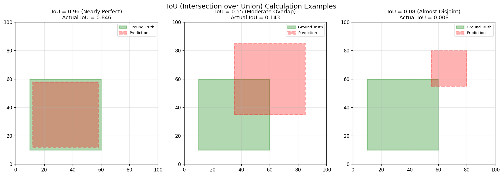

# s12 目标检测 — 代码说明与运行报告

## 程序做了什么
从零实现 IoU（交并比）计算和 NMS（非极大值抑制）算法，并使用 YOLOv8 nano 模型进行目标检测推理，对比 NMS 处理前后的检测结果。通过 IoU 可视化示例展示三种重叠程度的场景，通过 NMS 测试用例验证算法正确性，完整展示目标检测流水线中两个核心后处理步骤。

## 运行方法
```bash
cd s12_object_detection/code
python demo.py
```

## 运行结果

### 输出摘要
- IoU 测试：完全重叠 IoU=1.0 ✓，完全不重叠 IoU=0.0 ✓，部分重叠 IoU≈0.143 ✓
- NMS 测试：输入 5 个框（3 个重叠 + 1 个独立），NMS 后正确保留 2 个框
- YOLOv8 推理：使用 yolov8n.pt（nano 版本，约 3.2M 参数），COCO 80 类检测
- NMS 能有效去除同一物体上的重复检测框，显著提升检测结果的可读性

### 生成图表

#### 图表 1: IoU 计算示例（三种场景）

**说明了什么：** 对比三种 IoU 场景 —— 几乎完美重叠（IoU≈0.96）、中等重叠（IoU≈0.55）、几乎不重叠（IoU≈0.08），直观展示 IoU 如何量化两个边界框的重合程度。

#### 图表 2: R-CNN 系列演进

**说明了什么：** 梳理两阶段检测器从 R-CNN 到 Faster R-CNN 的演进，核心改进是从选择性搜索到 RPN（区域提议网络）的端到端训练化。

#### 图表 3: YOLO 网格预测示意

**说明了什么：** 展示 YOLO 将图像划分为 SxS 网格，每个网格预测 B 个边界框和类别概率，解释了单阶段检测器如何一次性完成定位和分类。

#### 图表 4: IoU 几何原理

**说明了什么：** 图解 IoU = 交集面积 / 并集面积的计算原理，标注了交集区域和并集区域的几何关系。

#### 图表 5: NMS 算法流程图

**说明了什么：** 展示 NMS 算法的完整流程 —— 按置信度排序 -> 取高分框 -> 计算 IoU -> 移除重叠框 -> 重复，直到没有剩余框。

## 代码结构
- `compute_iou()` — 单对边界框的 IoU 计算（交集/并集）
- `compute_iou_batch()` — 向量化批量 IoU（一对多，利用 numpy 广播）
- `nms()` — 非极大值抑制：按置信度降序 -> 取高分框 -> 批量 IoU -> 移除重复
- `xyxy_to_xywh()` / `xywh_to_xyxy()` — 边界框格式转换（左上+右下 <-> 中心+宽高）
- `yolo_output_to_pixel()` — YOLO 归一化坐标转像素坐标
- `draw_detections()` — 在图像上绘制边界框、类别标签和置信度
- `test_iou_calculation()` / `test_nms()` — IoU 和 NMS 的测试验证函数
- `visualize_iou_examples()` — 三种重叠程度的 IoU 可视化
- `download_test_images()` / `run_yolo_detection()` — YOLOv8 推理及结果可视化

## 运行环境
- Python 依赖: numpy, matplotlib, ultralytics（YOLO 推理，可选）, opencv-python（图像读取，可选）
- 硬件需求: CPU 即可（YOLO 推理在 CPU 上较慢但可用）
- 预计运行时间: 1-3 分钟（不含模型下载）
