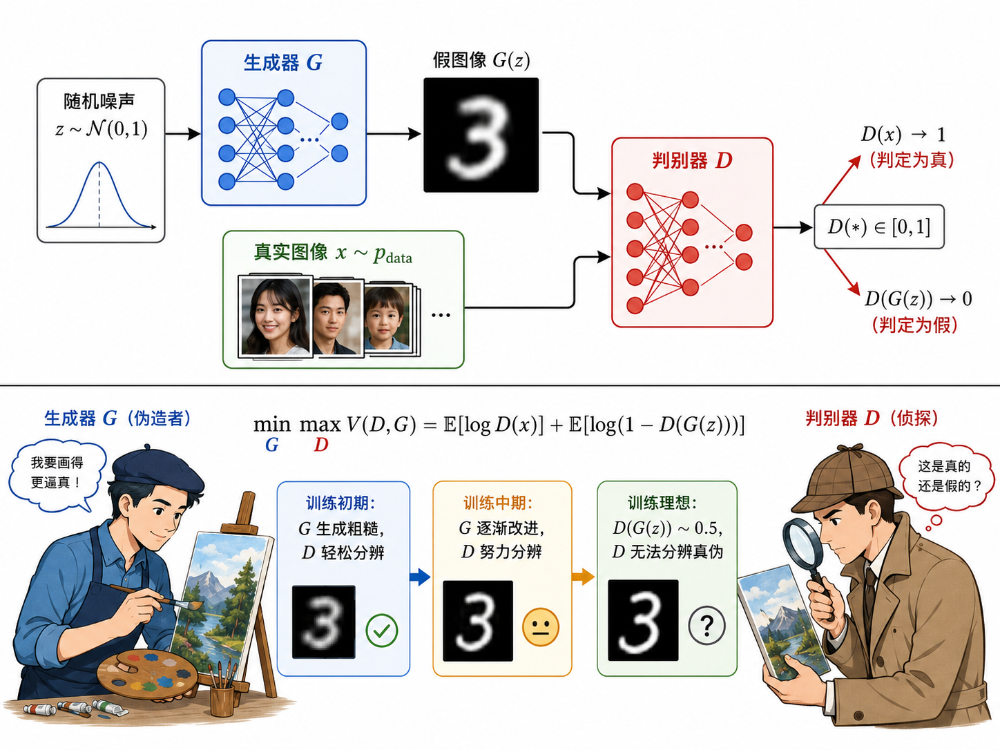
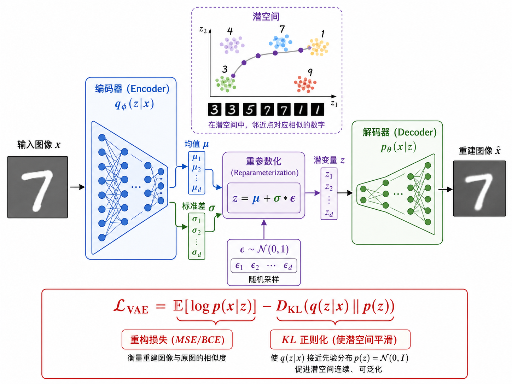
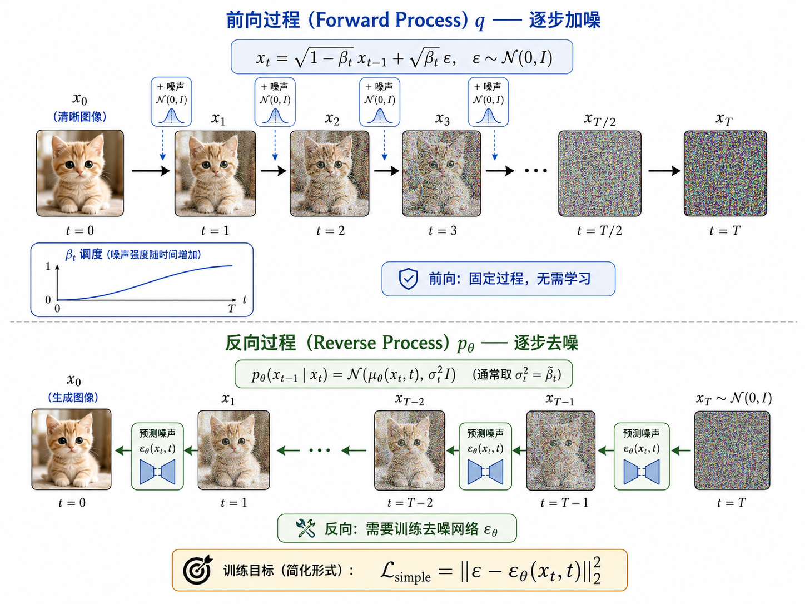
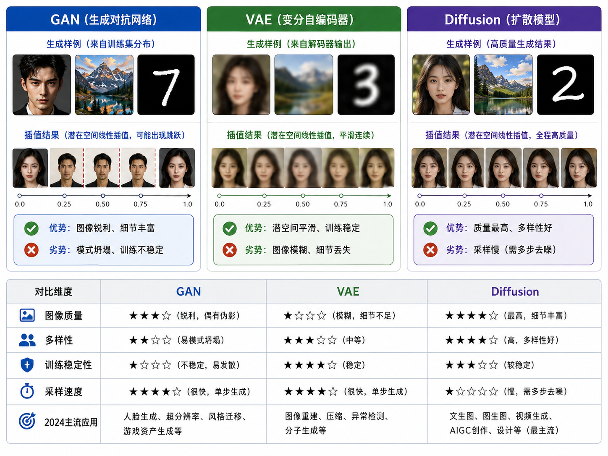

# s13 图像生成：GAN、VAE 与扩散模型

> 让神经网络"创造"图像 —— 三种生成范式的原理与对比

---

## 一、生成模型的目标

图像生成的核心是**学习数据分布 $p(x)$**。给定训练样本 $\{x_1, x_2, ..., x_N\}$（如 MNIST 手写数字），生成模型的目标是学会一个新的分布 $p_\theta(x)$，使得 $p_\theta(x) \approx p_{\text{data}}(x)$。

一旦学好了 $p_\theta(x)$，我们就可以从中**采样**：每次从 $p_\theta(x)$ 中抽取一个样本，就得到一张新的、逼真的图像。

三种主流方法以完全不同的方式逼近 $p(x)$：

| 方法 | 建模方式 | 采样方式 |
|------|---------|---------|
| GAN | 隐式（不需要显式 $p(x)$） | 从噪声 $z$ 经生成器映射到图像 |
| VAE | 显式（优化 ELBO） | 从学到的潜变量后验中采样 |
| Diffusion | 显式（最小化去噪误差） | 从纯噪声逐步去噪恢复图像 |

---

## 二、GAN：生成对抗网络 (2014)

### 2.1 核心思想：博弈论

GAN 由两个网络组成，它们相���对抗、共同进化：

- **生成器 $G$**：接收随机噪声 $z \sim p_z$（通常是高斯分布），输出一张假图像 $G(z)$。目标是"骗过"判别器。
- **判别器 $D$**：接收一张图像（可能是真的也可能是假的），输出一个概率 $D(x) \in [0, 1]$ 表示图像为真的概率。目标是正确区分真假。

### 2.2 数学形式：Minimax Game

GAN 的训练是一个极小极大博弈：

$$
\min_G \max_D V(D, G) = \mathbb{E}_{x \sim p_{\text{data}}}[\log D(x)] + \mathbb{E}_{z \sim p_z}[\log(1 - D(G(z)))]
$$

拆解这行公式：
- **$\mathbb{E}_{x \sim p_{\text{data}}}[\log D(x)]$**：判别器看到真实图像时，希望输出接近 1（真实），即 $\log D(x)$ 尽可能大。
- **$\mathbb{E}_{z \sim p_z}[\log(1 - D(G(z)))]$**：判别器看到假图像 $G(z)$ 时，希望输出接近 0（虚假），即 $\log(1 - D(G(z)))$ 尽可能大。
- **生成器的目标相反**：希望 $D(G(z))$ 接近 1，即 $\log(1 - D(G(z)))$ 尽可能**小**。

### 2.3 训练过程

GAN 采用交替训练策略：

1. **训练判别器**：固定 $G$，优化 $D$ 以更好地区分真假
2. **训练生成器**：固定 $D$，优化 $G$ 以生成更逼真的图像
3. 交替重复，直到 $G$ 生成的图像足以以假乱真

理论上，当 $D(x) = \frac{1}{2}$ 对所有 $x$ 成立时（即判别器完全无法区分），生成器达到了最优——此时 $G(z) \sim p_{\text{data}}$。

### 2.4 GAN 的训练困难

GAN 训练出了名的不稳定，主要问题包括：

- **模式坍塌（Mode Collapse）**：生成器学会了"作弊"——不管输入什么 $z$，都输出相同的少数几张看起来逼真的图像。生成的分布只覆盖了真实分布的少数几个模式。
- **梯度消失**：当判别器太强时，$D(G(z)) \approx 0$，$\log(1 - D(G(z))) \approx 0$，生成器的梯度几乎为 0，无法学习。
- **训练振荡**：$G$ 和 $D$ 的博弈可能不会收敛，而是在不同策略间来回振荡。

---

## 三、VAE：变分自编码器 (2013)

### 3.1 核心思想：潜变量建模

VAE 假设图像是由一个低维潜变量 $z$ 通过某种方式"生成"的：$p(x) = \int p(x|z) p(z) dz$。

由于这个积分在大多数情况下不可解，VAE 转而优化一个下界（ELBO, Evidence Lower Bound）：

$$
\mathcal{L}_{\text{VAE}} = \underbrace{\mathbb{E}_{q_\phi(z|x)}[\log p_\theta(x|z)]}_{\text{重构损失（重建 fidelity）}} - \underbrace{D_{\text{KL}}(q_\phi(z|x) \| p(z))}_{\text{KL 散度（潜空间正则化）}}
$$

- **$q_\phi(z|x)$ (Encoder)**：将输入 $x$ 编码为潜变量分布参数 $(\mu, \sigma)$
- **$p_\theta(x|z)$ (Decoder)**：从潜变量 $z$ 重建出图像 $\hat{x}$

### 3.2 重参数化技巧

VAE 的一个关键创新是**重参数化技巧（Reparameterization Trick）**。

如果直接从 $\mathcal{N}(\mu, \sigma^2)$ 采样 $z$，采样操作是不可微的，梯度无法从 decoder 传回 encoder。重参数化技巧将采样分解为：

$$
z = \mu + \sigma \odot \varepsilon, \quad \varepsilon \sim \mathcal{N}(0, 1)
$$

这样 $z$ 对 $\mu$ 和 $\sigma$ 是可微的，梯度可以顺利通过。$\varepsilon$ 是随机性来源，$\mu$ 和 $\sigma$ 是 encoder 的输出参数。

### 3.3 VAE 的优缺点

- **优点**：潜空间平滑、有结构，两个相近的 $z$ 值产生相似的图像，可以做插值（interpolation）；训练稳定。
- **缺点**：生成的图像往往较模糊。这是因为 VAE 优化的是逐像素的 MSE/BCE 重构损失，导致网络倾向于输出像素值的"平均值"——多个可能的模式被平均掉，产生模糊效果。

---

## 四、扩散模型 (2020+)

### 4.1 核心思想：渐进去噪

扩散模型的灵感来源于非平衡热力学。它包含两个过程：

**前向过程（Forward Process）$q$**：向图像逐步添加高斯噪声，经过 $T$ 步后变成纯噪声。

$$
q(x_t | x_{t-1}) = \mathcal{N}(x_t; \sqrt{1 - \beta_t} x_{t-1}, \beta_t \mathbf{I})
$$

其中 $\beta_t$ 是噪声调度（noise schedule），通常从 $\beta_1 \approx 10^{-4}$ 线性增长到 $\beta_T \approx 0.02$。

**反向过程（Reverse Process）$p_\theta$**：学习一个去噪网络 $\epsilon_\theta$，从纯噪声 $x_T$ 开始，逐步去除噪声，恢复出清晰的图像。

$$
p_\theta(x_{t-1} | x_t) = \mathcal{N}(x_{t-1}; \mu_\theta(x_t, t), \Sigma_\theta(x_t, t))
$$

### 4.2 DDPM 的训练目标

Denoising Diffusion Probabilistic Models (DDPM) 的核心发现是：反向过程的训练可以简化为一个**噪声预测任务**：

$$
\mathcal{L}_{\text{simple}} = \mathbb{E}_{t, x_0, \epsilon} \left[ \|\epsilon - \epsilon_\theta(\sqrt{\bar{\alpha}_t} x_0 + \sqrt{1 - \bar{\alpha}_t} \epsilon, t)\|^2 \right]
$$

翻译成通俗语言：
1. 从训练集中取一张图像 $x_0$
2. 随机选一个时间步 $t$
3. 按照前向过程的公式给 $x_0$ 加噪声，得到 $x_t = \sqrt{\bar{\alpha}_t} x_0 + \sqrt{1 - \bar{\alpha}_t} \epsilon$
4. 训练网络 $\epsilon_\theta$ 从 $x_t$ 中预测出所加的噪声 $\epsilon$
5. 这就是一个简单的回归任务！

### 4.3 采样（推理）

训练完成后，生成图像的过程是从纯噪声出发，一步步反向去噪：

1. $x_T \sim \mathcal{N}(0, \mathbf{I})$（纯噪声）
2. For $t = T, T-1, ..., 1$:
   - $x_{t-1} = \frac{1}{\sqrt{\alpha_t}}(x_t - \frac{1 - \alpha_t}{\sqrt{1 - \bar{\alpha}_t}} \epsilon_\theta(x_t, t)) + \sigma_t z$
3. 输出 $x_0$（生成的图像）

这个过程通常需要数百甚至上千步，这也是扩散模型生成速度慢的原因。

---

## 五、Stable Diffusion (2022)

Stable Diffusion 将扩散模型从三个维度做了关键改进：

1. **潜空间扩散（Latent Diffusion）**：不像 DDPM 那样在像素空间做扩散，而是先训练一个 VAE 将图像压缩到潜空间，在潜空间中做扩散过程。这将计算量降低了一个数量级。
2. **文本条件（Text Conditioning）**：将文本 prompt 通过 CLIP 文本编码器转为嵌入向量，通过交叉注意力（Cross-Attention）注入到去噪 U-Net 中。这使得生成过程可以受文本控制。
3. **Classifier-Free Guidance**：同时训练条件模型和无条件模型，在推理时通过 $ \hat{\epsilon}_\theta(x_t, c) = \epsilon_\theta(x_t, \varnothing) + w \cdot (\epsilon_\theta(x_t, c) - \epsilon_\theta(x_t, \varnothing)) $ 增强文本控制力度。

---

## 六、三种方法的对比

| 特性 | GAN | VAE | Diffusion |
|------|-----|-----|-----------|
| **生成质量** | 高（锐利） | 较低（模糊） | 极高（锐利+多样） |
| **多样性** | 低（模式坍塌） | 高（覆盖整个分布） | 高（覆盖整个分布） |
| **训练稳定性** | 极不稳定 | 稳定 | 稳定 |
| **采样速度** | 快（一次前向） | 快（一次前向） | 慢（数百步→数十步） |
| **潜空间** | 无显式潜空间 | 有结构的潜空间 | 固定维度的噪声空间 |
| **理论基础** | 博弈论/极小极大 | 变分推断/ELBO | 随机微分方程/得分匹配 |

三种方法各有千秋：
- **GAN** 适合需要高速推理且对锐度要求高的场景（如实时视频特效）。
- **VAE** 适合需要平滑潜空间和结构化的场景（如潜在空间插值、属性编辑）。
- **Diffusion** 是当前生成质量的标杆（Stable Diffusion, DALL-E 3, Midjourney），但推理速度仍然是瓶颈。

---

## 七、本节小结

| 概念 | 一句话 |
|------|--------|
| GAN | 生成器与判别器的对抗博弈，$\min_G \max_D V(D,G)$ |
| 模式坍塌 | GAN 生成器只学会生成少数模式，多样性不足 |
| VAE | 编码器→潜变量→解码器，优化 ELBO = 重构损失 + KL 散度 |
| 重参数化 | $z = \mu + \sigma \odot \varepsilon$，使采样可微 |
| 扩散模型前向 | 逐步加高斯噪声，$q(x_t|x_{t-1})$ |
| 扩散模型反向 | 学习去噪网络从噪声恢复图像 |
| DDPM 训练 | 预测所加噪声 $\epsilon$，简单回归任务 |
| Stable Diffusion | 在潜空间做扩散 + 文本交叉注意力引导 |
| 采样速度 | GAN/VAE 快（单次前向），Diffusion 慢（迭代去噪） |

> 至此，我们完成了从图像分类（s10/s11）到目标检测（s12）再到图像生成（s13）的完整旅程。这三个方向构成了计算机视觉的核心支柱：**识别、定位、创造**。

## 📥 Code

| File | View | Download |
|------|------|----------|
| demo.py | [Open](./code-demo) | <a href="../code/s13_image_generation/demo.py" target="_blank" download>Download</a> |
| exercise.py | [Open](./code-exercise) | <a href="../code/s13_image_generation/exercise.py" target="_blank" download>Download</a> |

