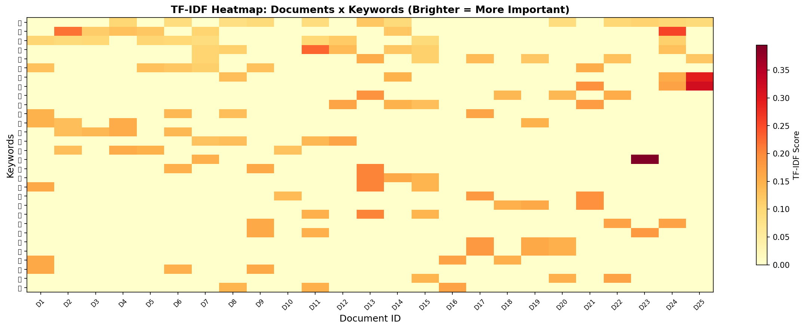
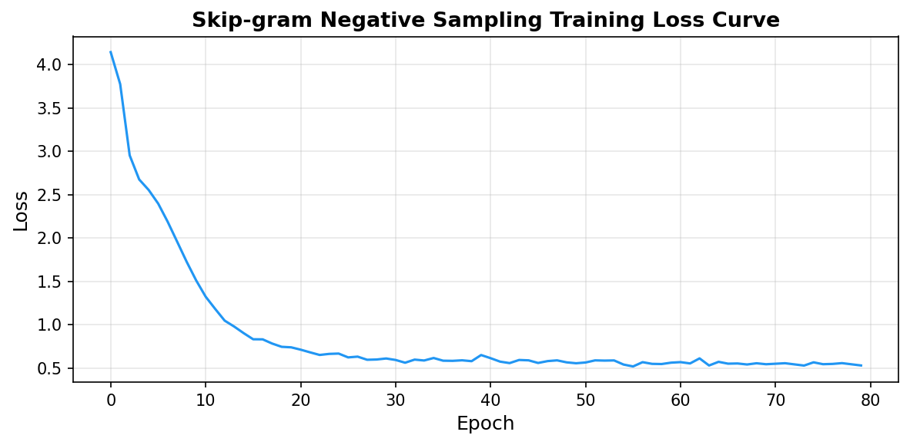
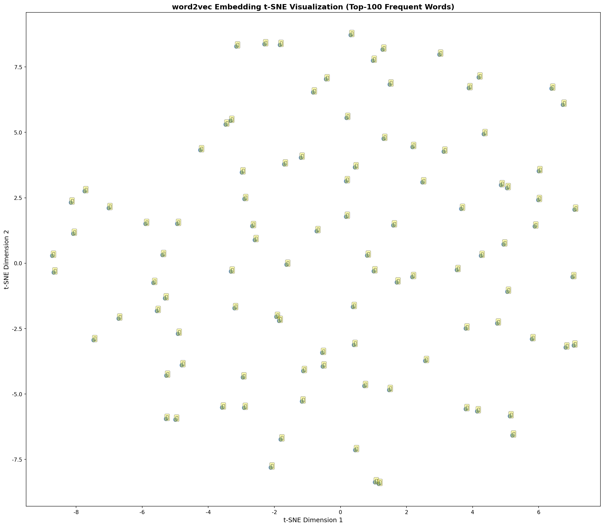

# s14 文本表示 — 代码说明与运行报告

## 程序做了什么
从零实现两种经典文本表示方法：TF-IDF（词频-逆文档频率，基于统计的稀疏表示）和 word2vec Skip-gram + 负采样（基于神经网络的稠密词向量）。在中文语料库（25 篇文档，覆盖体育/科技/教育/经济/医疗 5 个主题）上进行演示，通过 TF-IDF 热力图、t-SNE 词向量可视化、近义词查询和类比推理直观对比两种方法的表达能力差异。

## 运行方法
```bash
cd s14_text_representation/code
python demo.py
```

## 运行结果

### 输出摘要
- 语料库：25 篇中文文档，5 个主题（体育/科技/教育/经济/医疗各 5 篇）
- 词汇表大小：约 250+ 个独特汉字
- TF-IDF：为每篇文档提取 Top-3 关键词，如"足球(0.xxx)、比赛(0.xxx)、体育(0.xxx)"
- Skip-gram 训练：窗口大小 2，负采样 5 个，词向量维度 64，训练 80 个 epoch
- 近义词查询效果：同一领域的词（如"足"与"篮"、"学"与"习"）余弦相似度显著高于跨领域词对
- 类比推理：由于语料库较小，效果有限，但展示了方法原理

### 生成图表

#### 图表 1: TF-IDF 热力图

**说明了什么：** 横轴为 25 篇文档，纵轴为 TF-IDF 总分最高的 30 个关键词，颜色深浅表示该词对该文档的重要性。可以清晰看到同一主题的文档（如连续 5 篇体育类）共享类似的关键词模式，验证了 TF-IDF 在文档主题聚类上的有效性。

#### 图表 2: Skip-gram 训练损失曲线

**说明了什么：** 负采样训练 80 个 epoch 的损失持续下降，模型从随机初始化逐步学会区分正样本（真实上下文词）和负样本（随机采样词）。

#### 图表 3: word2vec 词向量 t-SNE 可视化

**说明了什么：** 高频 Top-100 词在 2D 空间的分布。语义相关的词（如同属体育领域的"足/球/篮/赛"、教育领域的"学/教/课/习"）在空间中自然地聚集在一起，验证了 word2vec 能通过上下文学习到词的语义相似性。

#### 图表 4: One-hot vs 稠密嵌入对比

**说明了什么：** 对比 one-hot 编码（维度=词汇量，稀疏且无语义）和词嵌入（低维稠密向量，语义相近的词向量也相近），说明 word2vec 将高维稀疏空间压缩为低维语义空间的核心思想。

#### 图表 5: Skip-gram 架构示意

**说明了什么：** 图解 Skip-gram 模型的训练流程 —— 输入中心词，输出预测上下文词，通过输入/输出两个嵌入矩阵学习词向量。

#### 图表 6: 词向量算术运算

**说明了什么：** 展示 word2vec 最著名的特性 —— 词向量支持语义算术运算，如"国王 - 男人 + 女人 = 女王"，说明语义关系被编码在向量的方向差异中。

#### 图表 7: TF-IDF 计算过程

**说明了什么：** 图解 TF（词频）= 词出现次数/文档总词数，IDF（逆文档频率）= log(总文档数/包含该词的文档数)，以及两者相乘得到 TF-IDF 权重的完整计算过程。

## 代码结构
- `CORPUS` / `tokenize()` — 内置中文语料库和分词函数
- `compute_tf()` / `compute_idf()` — TF-IDF 的 TF 和 IDF 计算
- `build_skipgram_pairs()` — 构建 Skip-gram (中心词, 上下文词) 训练对
- `class SkipGramDataset` — 负采样训练数据集（每正样本配 5 个负样本）
- `class SkipGramNegSampling` — Skip-gram 模型：in_embeddings + out_embeddings
- `train_skipgram()` — 训练循环
- `cosine_similarity()` / `find_nearest_neighbors()` — 近义词查询
- `word_analogy()` — 词类比推理（a - b + c = ?）
- `tfidf_cosine_similarity()` — 文档级 TF-IDF 相似度

## 运行环境
- Python 依赖: numpy, torch, matplotlib, scikit-learn（t-SNE 降维）
- 硬件需求: CPU 即可（GPU 可选，自动检测）
- 预计运行时间: 1-2 分钟
