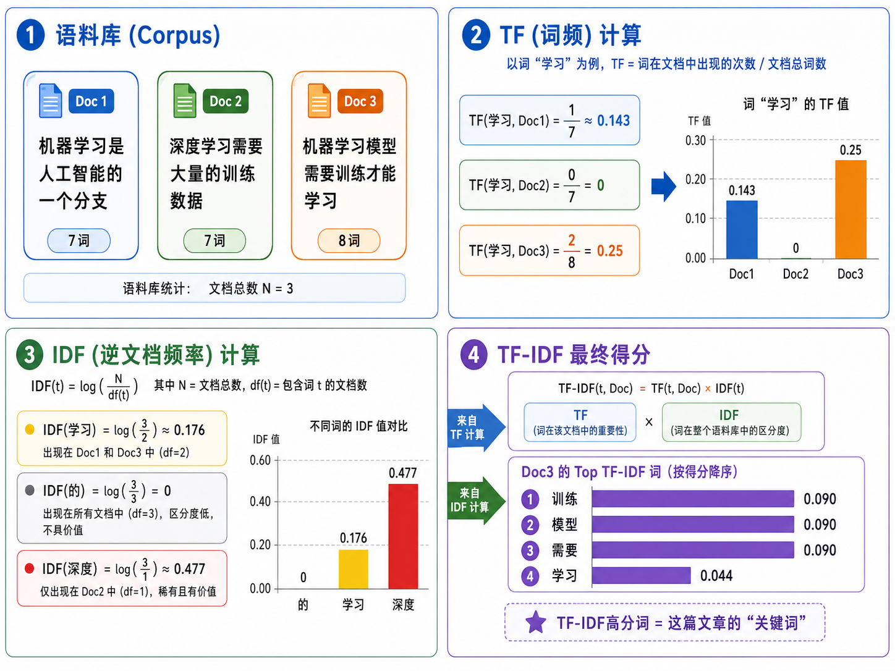
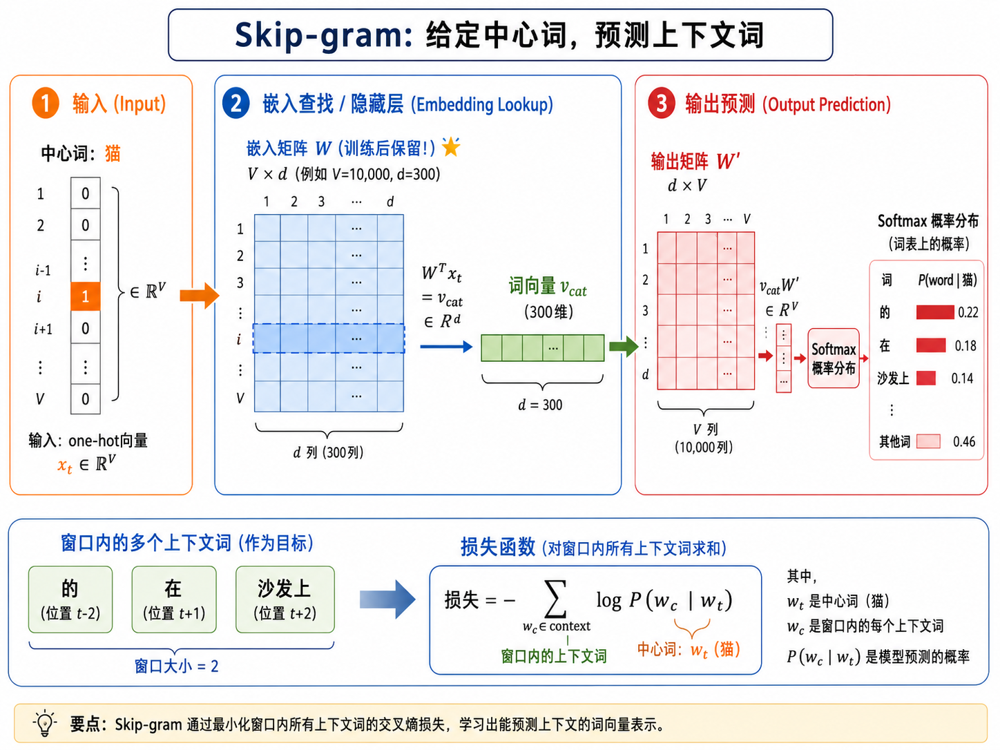
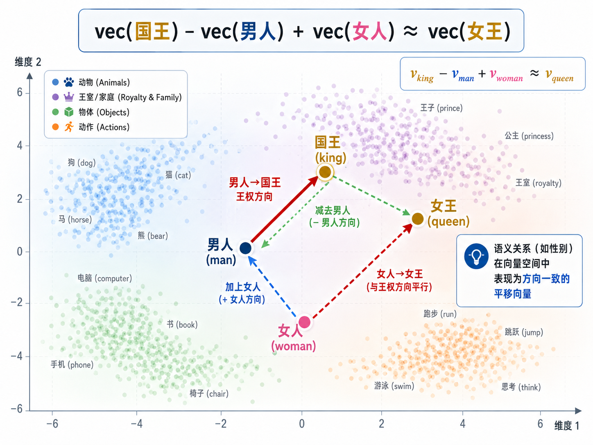

# s14 文本表示：从词袋到 word2vec

> 机器看不懂文字，只懂数字——如何把离散的符号变成有语义的连续向量？

---

## 一、文本为什么难表示？

文本是人类知识最主要的载体，但对机器来说却是最难处理的数据形式之一。与图像不同——图像天然就是像素值的矩阵，三维数组结构规整——文本有三个根本性的挑战：

**1. 离散性**：语言由离散的符号（字、词）组成。"猫"和"狗"是两个独立的符号，不像实数那样有天然的数值关系。$3.5$ 和 $3.6$ 很接近，但"猫"和"狗"之间没有一个天然的"距离"。

**2. 可变长度**：不同的句子有不同的长度。"猫。"是一个词，"一只黑色的猫正蹲在窗台上看着外面的鸟。"是十几个词。图像可以通过 resize 统一尺寸，文本不能简单地拉伸或压缩。

**3. 语义的组合性**：单词的含义取决于上下文。"苹果很好吃"和"苹果发布了新手机"里的"苹果"是同一个符号，但含义完全不同。如何让向量既捕获单词本身的含义，又能根据上下文动态变化？

> **核心目标**：把离散、变长、上下文相关的文本符号，映射为固定维度、包含语义信息的连续向量（embedding）。这些向量之间可以用距离和方向来度量语义关系。


---

## 二、One-Hot 编码：最简单但最无效

最直接的思路：给我一个大小为 $V$ 的词汇表，用一个长度为 $V$ 的向量来表示每个词——该词在词汇表中的索引位置为 1，其余全为 0。

$$
\text{onehot}(\text{"猫"}) = [0, 0, 0, 1, 0, 0, \dots, 0] \in \mathbb{R}^{V}
$$

这个方案有三个致命缺陷：

| 问题 | 说明 |
|------|------|
| **维度灾难** | 词汇表大小 $V$ 通常是 50,000 ~ 500,000。50 万个维度中只有一个 1，极度稀疏。 |
| **语义零信息** | 任意两个词的 one-hot 向量的点积都是 0（如果是不同的词），余弦相似度也为 0。$\text{cos}(\text{猫}, \text{狗}) = \text{cos}(\text{猫}, \text{桌子}) = 0$——模型认为"猫"与"狗"的关系和"猫"与"桌子"的关系一样远。 |
| **无法泛化** | 每个词是完全独立的离散符号，模型无法利用"猫"和"猫科动物"之间的相关性。 |

虽然 one-hot 不能直接用作最终表示，但它是文本向量化的"引言"——所有 NLP 模型的输入层本质上都是通过一个 embedding lookup 矩阵，把 one-hot 稀疏向量映射为稠密向量。这也是 word2vec 的核心机制。

---

## 三、词袋模型（BoW）与 TF-IDF

### 3.1 Bag of Words

BoW 把一篇文章表示为一个长度为 $V$ 的向量，第 $i$ 维是该文档中第 $i$ 个词出现的次数：

$$
\text{BoW}(d) = [c(w_1, d), c(w_2, d), \dots, c(w_V, d)]
$$

BoW 抛弃了词序（"词袋"——把文档当成一个装词的袋子，摇晃之后顺序就丢了），但保留了词频信息。对于一个文本分类任务（如垃圾邮件检测），BoW 往往已经足够好——"免费"、"中奖"这些词的出现频率已经能很好地指示垃圾邮件。

### 3.2 TF-IDF：给词频加权

BoW 的问题是高频但无信息量的词（如"的"、"了"、"是"）会主导表示。TF-IDF 通过两个因子解决这个问题：

**词频（Term Frequency）**：一个词在一篇文档中出现的次数除以文档总词数。

$$
\text{TF}(w, d) = \frac{c(w, d)}{\sum_{w'} c(w', d)}
$$

**逆文档频率（Inverse Document Frequency）**：一个词在整个文档集中的稀有程度的对数取反。

$$
\text{IDF}(w) = \log \frac{N}{|\{d: w \in d\}|}
$$

$$
\text{TF-IDF}(w, d) = \text{TF}(w, d) \times \text{IDF}(w)
$$

- 如果一个词在一篇文档中出现频繁（高 TF）但很少在其他文档中出现（高 IDF），那它对该文档的描述力很强。
- 如果一个词在所有文档中都出现（如"的"），它的 IDF 接近 $\log(1) = 0$，TF-IDF 得分几乎为零。

> **TF-IDF 适用于**：文本分类、关键词抽取、信息检索。局限性：仍然丢弃词序，且无法捕获语义相似性。"人工智能"和"机器学习"的 TF-IDF 向量可能完全不同，尽管它们语义高度相关。



---

## 四、分布式假设：词的含义由上下文决定

1957 年，英国语言学家 John Rupert Firth 提出了 NLP 领域最核心的思想之一：

> **"You shall know a word by the company it keeps."**
> ——一个词的含义，由它周围的词（上下文）决定。

这意味着，如果两个词频繁出现在相似的上下文中，它们的含义应该是相似的。

- "猫"和"狗"经常出现在相似的上下文里：\_\_\_ 躺在沙发上，\_\_\_ 喜欢吃肉，\_\_\_ 是宠物 → 所以它们的向量应该靠近。
- "猫"和"微积分"几乎不出现在相同的上下文中 → 它们的向量应该远离。

这个简单的思想，构成了所有现代词嵌入方法的理论基础——word2vec、GloVe、FastText，乃至 BERT 和 GPT 的预训练，本质上都是在利用**词的上下文分布来学习词的语义表示**。

---

## 五、word2vec：从离散到连续

2013 年，Tomas Mikolov 等人在 Google 提出了 word2vec，这是 NLP 历史上最重要的技术之一。word2vec 提出了两种互补的架构：

### 5.1 CBOW（Continuous Bag of Words）

**目标**：给定上下文词，预测中心词。

- 输入：窗口内所有上下文词的 one-hot 向量的平均值（"词袋"）
- 输出：中心词的概率分布
- 优点：训练快，对常见词效果好
- 缺点：对罕见词效果不如 Skip-gram

### 5.2 Skip-gram

**目标**：给定中心词，预测上下文词。

- 输入：中心词的 one-hot 向量
- 输出：每个上下文词的概率分布
- 优点：在罕见词上表现更好，生成的嵌入质量更高
- 缺点：训练更慢（每个中心词需要预测多个上下文词）

Skip-gram 在实践中更常用，因为它的嵌入质量通常更好。下面我们详细拆解 Skip-gram 的训练过程。



---

## 六、Skip-gram 的数学细节

### 6.1 模型结构

给定中心词 $w_t$，预测窗口内上下文词 $w_{t+j}$（$j \in \{-k, \dots, -1, 1, \dots, k\}$）：

**输入层**：中心词 $w$ 的 one-hot 向量 $x \in \mathbb{R}^{V}$

**隐藏层**（embedding lookup）：

$$
v_w = W^\top x \in \mathbb{R}^{d}
$$

其中 $W \in \mathbb{R}^{V \times d}$ 是**输入嵌入矩阵**（这就是训练后我们要保留的——每一行 $W_i$ 就是词汇表中第 $i$ 个词的词向量）。

**输出层**：用另一个嵌入矩阵 $W' \in \mathbb{R}^{d \times V}$（输出嵌入矩阵），计算每个词的得分：

$$
\text{scores} = W'^\top v_w \in \mathbb{R}^{V}
$$

用 softmax 转换为概率：

$$
P(w_o \mid w_t) = \frac{\exp(\text{score}_{w_o})}{\sum_{w \in V} \exp(\text{score}_{w})}
$$

### 6.2 负采样：让训练变得可行

上面的 softmax 需要对整个词汇表 $V$ 求和——$V$ 可能是几万到几十万——每一步训练都要做一次这个求和，计算量太大了。

**负采样**（Negative Sampling）把这个问题从"$V$ 分类"变成了"$K+1$ 个二分类"：

- 对每个正样本 $(w_t, w_c)$（$w_c$ 是真实上下文词），随机采样 $K$ 个负样本词（不是上下文的词）
- 对每个词对 $(w_t, w_o)$，模型只需判断：$w_o$ 是 $w_t$ 的真实上下文词吗？（二分类）

**负采样损失函数**：

$$
\mathcal{L} = -\log \sigma(v_{w_t} \cdot u_{w_c}) - \sum_{i=1}^{K} \mathbb{E}_{w_i \sim P_n(w)} \left[ \log \sigma(-v_{w_t} \cdot u_{w_i}) \right]
$$

- $v_{w_t}$：中心词的输入向量
- $u_{w_c}$：上下文词的输出向量
- $\sigma$：sigmoid 函数
- $P_n(w)$：噪声分布（通常取词频的 $3/4$ 次方）
- 第一项：鼓励正样本得分高（sigmoid 输出接近 1）
- 第二项：鼓励负样本得分低（sigmoid 输出接近 0）

---

## 七、类比推理：国王 - 男人 + 女人 = 女王

word2vec 最令人惊叹的特性是它在向量空间中捕捉**语义关系**的能力。一个经典的例子：

$$
\vec{v}_{\text{king}} - \vec{v}_{\text{man}} + \vec{v}_{\text{woman}} \approx \vec{v}_{\text{queen}}
$$



为什么向量加法能表示语义关系？

**直觉解释**：在训练过程中，模型学习用向量方向来编码语言规律。比如有一类词对的关系是"性别"（king↔queen, man↔woman, actor↔actress），它们对应向量空间中的**同一条位移方向**。当训练数据中有足够多这样的词对，这个方向就在向量空间中"凝固"为一种结构。

更一般地，word2vec 能捕捉的类比关系包括：

| 关系类型 | 示例 |
|---------|------|
| 性别 | king - man + woman = queen |
| 时态 | go - went + walked = walk |
| 国家-首都 | Paris - France + Italy = Rome |
| 单复数 | cat - cats + dogs = dog |
| 比较级 | good - better + big = bigger |

这在向量几何中的含义是：语义关系被编码为**平移向量**。这种特性使得 word2vec 不仅仅是一个语言模型组件，更成了理解词义分布结构的分析工具。

---

## 八、从 word2vec 到上下文嵌入

word2vec 是一次革命，但它有一个根本局限：**每个词只有一个固定的向量**。

这意味着：
- "苹果"在"苹果很好吃"和"苹果发布了新手机"中，得到的是完全相同的向量。
- 同形异义词（如"行"的两种读音和含义）无法区分。

### 上下文嵌入（Contextual Embeddings）

2018 年以后，ELMo、BERT、GPT 等预训练模型引入了**上下文相关的嵌入**：

- 不再是"每个词一个固定向量"
- 而是"每个词在不同上下文中产生不同的向量"
- "我**行**走在路上"和"这**行**代码有 bug"中的"行"会得到不同的表示

> BERT 的本质：用 Transformer 的双向自注意力机制，让每个词的表示都融合了整句话中所有其他词的信息。这将在 s16 和 s17 中详细展开。

---

## 九、本节小结

| 方法 | 维度 | 稠密 | 语义 | 词序 | 上下文 |
|------|------|------|------|------|--------|
| One-Hot | $V$（超大） | No | No | Yes | No |
| BoW | $V$（超大） | No | No | No | No |
| TF-IDF | $V$（超大） | No | 部分（重要性） | No | No |
| word2vec | $d$（~300） | Yes | Yes | N/A | 固定窗口 |
| BERT/GPT | $d$（~768+） | Yes | Yes | Yes | 完全上下文 |

**核心思想演进**：

```
One-Hot（每个词是独立符号）
  → BoW（统计词频，丢弃词序）
    → TF-IDF（给词频加权，抑制常见词）
      → word2vec（通过上下文学习稠密语义向量）
        → 上下文嵌入（每个词在不同上下文中有不同表示）
```

> 下一节 [s15 序列模型](../s15_sequence_models/) 将讨论如何**处理文本的时序结构**——RNN、LSTM、GRU 这些能读取变长序列并捕捉长距离依赖的模型，正是文本理解的关键基础设施。

## 📥 Code

| File | View | Download |
|------|------|----------|
| demo.py | [Open](./code-demo) | <a href="../code/s14_text_representation/demo.py" target="_blank" download>Download</a> |
| exercise.py | [Open](./code-exercise) | <a href="../code/s14_text_representation/exercise.py" target="_blank" download>Download</a> |

