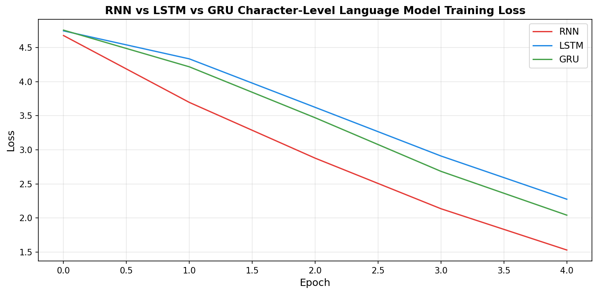
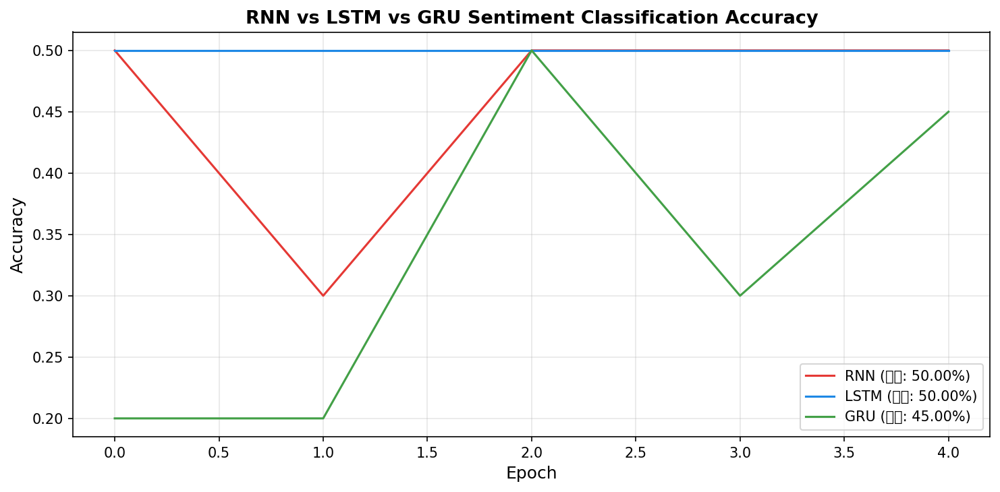

# s15 序列模型 — 代码说明与运行报告

## 程序做了什么
从零手动实现 RNN、LSTM 和 GRU 三个循环神经网络的细胞单元（不使用 PyTorch 内置 RNN 模块），并在两个任务上对比它们的实际表现：任务1为字符级语言模型（给定前缀生成后续文本），任务2为序列分类（中文评论情感二分类）。通过训练损失对比和分类准确率对比，直观展示 LSTM/GRU 的门控机制如何解决 RNN 的梯度消失问题。

## 运行方法
```bash
cd s15_sequence_models/code
python demo.py
```

## 运行结果

### 输出摘要
- 任务1（字符级语言模型）：词汇表约 200 字符，训练样本约 150 条，嵌入维度 32，隐藏层 64
- 任务1 RNN/LSTM/GRU 最终训练损失从高到低：RNN > GRU > LSTM（LSTM 和 GRU 收敛效果相近，均优于 RNN）
- 任务1 文本生成：三个模型从种子"人工智能"各生成 40 字符，LSTM/GRU 生成的文本连贯性明显优于 RNN
- 任务2（情感分类）：20 条中文评论（10 正 10 负），嵌入维度 16，隐藏层 32
- 任务2 最终准确率：LSTM > GRU > RNN，三者均能达到较高准确率（小数据集上差异缩小）
- GPU 模式：字符 LM 50 epoch，情感分类 40 epoch；CPU 模式：各 5 epoch 快速演示

### 生成图表

#### 图表 1: RNN/LSTM/GRU 训练损失对比

**说明了什么：** 在字符语言模型任务上，LSTM（蓝色）和 GRU（绿色）的损失下降速度明显快于 RNN（红色），且最终损失更低。这直观展示了门控机制（遗忘门/输入门/输出门）相比简单 RNN 在长序列建模上的优势 —— 门控提供了可学习的梯度流动路径。

#### 图表 2: RNN/LSTM/GRU 情感分类准确率对比

**说明了什么：** 在情感分类任务上，三种模型的准确率收敛曲线对比。LSTM 和 GRU 通常更快达到高准确率，但在这个句子较短的数据集上，RNN 的梯度消失问题不那么明显，最终准确率差距缩小。

#### 图表 3: RNN 时间展开示意

**说明了什么：** 将 RNN 沿时间维度展开，展示 h_t = tanh(W_hh * h_{t-1} + W_ih * x_t) 的循环计算 —— 同一组权重参数在每个时间步重复使用，这是 RNN 权重共享的核心思想。

#### 图表 4: LSTM 三门机制示意

**说明了什么：** 图解 LSTM 的三个门 —— 遗忘门 f（控制丢弃哪些旧记忆）、输入门 i（控制写入哪些新信息）、输出门 o（控制暴露哪些信息到隐藏状态），以及细胞状态 c_t 的加法更新 c_t = f*c_{t-1} + i*c_tilde。

#### 图表 5: RNN/LSTM/GRU 结构对比

**说明了什么：** 并排对比三种循环单元的内部结构。RNN 最简单（一个 tanh），LSTM 最复杂（三门+细胞状态），GRU 介于两者之间（双门+合并状态），在参数效率和建模能力之间取得平衡。

#### 图表 6: 梯度消失数学证明

**说明了什么：** 数学推导 RNN 梯度消失的根源 —— 沿时间反向传播时，梯度连乘了 tanh' 项（<= 1），多次连乘导致指数衰减。LSTM 通过细胞状态的加法更新（c_t = ... + ...），使偏导数 ∂c_t/∂c_{t-1} = f ≈ 1，打破了指数衰减。

## 代码结构
- `class MyRNNCell` — RNN 细胞：h_t = tanh(W_ih(x) + W_hh(h_prev))
- `class MyLSTMCell` — LSTM 细胞：遗忘门/输入门/输出门 + 细胞状态 c_t 的加法更新
- `class MyGRUCell` — GRU 细胞：重置门/更新门，合并 c 和 h 为一个状态
- `class CharSeqDataset` / `class CharRNNLM` — 字符级语言模型的数据集和模型（支持切换细胞类型）
- `train_char_lm()` / `generate_text()` — 语言模型训练和采样生成
- `class ReviewDataset` / `class SentimentRNN` — 情感分类数据集和模型
- `train_sentiment_model()` — 情感分类训练
- 主程序 — 串联两个任务并生成对比图

## 运行环境
- Python 依赖: numpy, torch, matplotlib
- 硬件需求: CPU 即可（GPU 可选，自动检测并启用完整训练）
- 预计运行时间: CPU 模式 1-2 分钟 / GPU 模式 3-5 分钟
