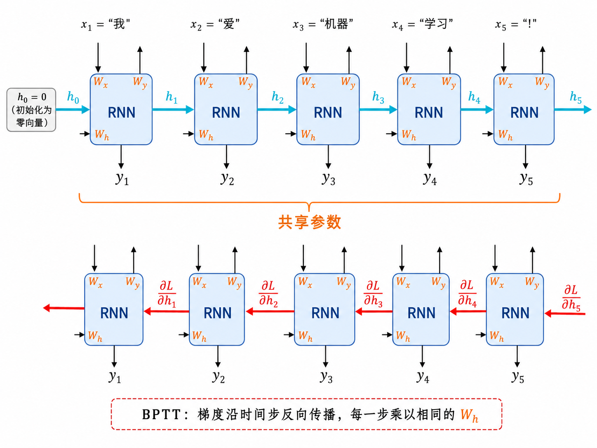
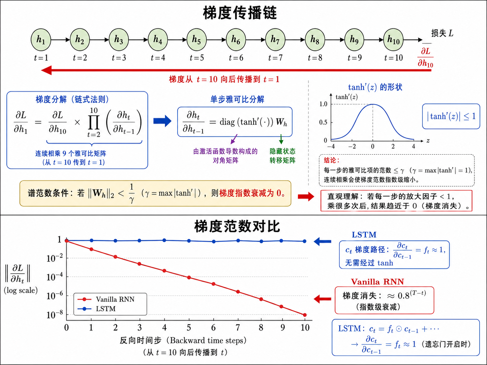
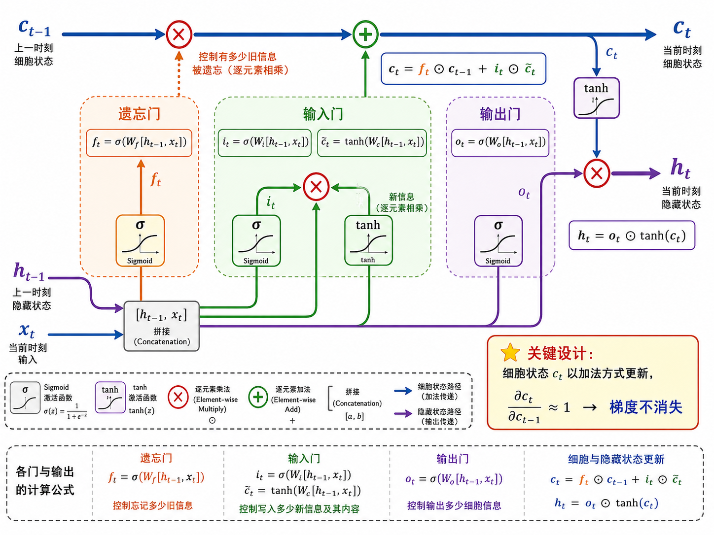
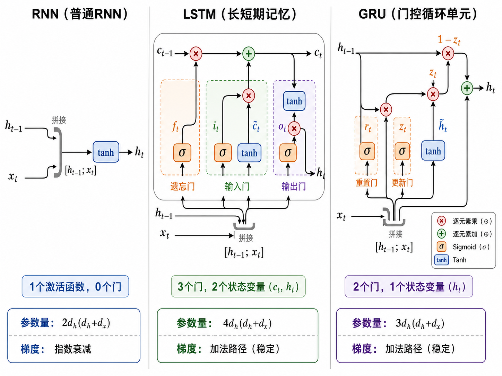

# s15 序列模型：RNN → LSTM → GRU

> 文本是有顺序的——"我爱你"和"你爱我"是两回事。序列模型专门处理这种时序数据。

---

## 一、为什么序列需要专门的模型？

传统的全连接网络（MLP）和卷积网络（CNN）在处理序列数据时有根本性的局限：

**MLP 的问题**：
- 输入维度固定——无法处理变长序列
- 每个输入位置独立处理——"我/爱/你"三个词分别进入三层神经元，没有时序关联
- 参数与位置绑定——第 1 个词的权重只能学第 1 个位置的特征

**CNN 的问题**：
- 卷积核有固定感受野——只能看到局部上下文
- 虽然可以通过堆叠层增大感受野，但长距离依赖仍然难以建模
- 不是为序列专门设计的，缺乏显式的时序记忆机制

**序列模型的核心需求**：
1. 变长输入处理能力
2. 参数**跨时间步共享**（同一套参数处理不同位置）
3. 显式的**记忆机制**，能捕捉长距离依赖
4. 输入顺序敏感

循环神经网络（RNN）通过一个优雅的循环结构同时满足了以上所有需求。

---

## 二、RNN：循环的魔力

### 2.1 核心公式

RNN 的核心是一个在时间上反复执行的"细胞"：

$$
h_t = \tanh(W_h h_{t-1} + W_x x_t + b)
$$

- $h_t \in \mathbb{R}^{d_h}$：时间步 $t$ 的**隐藏状态**（hidden state），是网络的"记忆"
- $h_{t-1}$：上一个时间步的隐藏状态——携带了历史信息
- $x_t \in \mathbb{R}^{d_x}$：当前时间步的输入
- $W_h \in \mathbb{R}^{d_h \times d_h}$：隐藏状态到隐藏状态的权重矩阵（**循环连接**）
- $W_x \in \mathbb{R}^{d_h \times d_x}$：输入到隐藏状态的权重矩阵
- $\tanh$：激活函数，将状态压缩到 $(-1, 1)$ 之间，防止数值爆炸

> **核心直觉**：$h_t$ 的内容是 $x_t$（当前输入）和 $h_{t-1}$（历史记忆）的加权组合。这就像人在阅读时——每读一个词，大脑都会结合刚才记住的信息来理解当前内容。

### 2.2 时间展开（Unrolling）

同一个 RNN 细胞（同一套参数 $W_h, W_x$）在不同时间步被反复调用。如果把时间维度展开，它就像一个深层的全连接网络——每一层对应一个时间步，但所有层**共享参数**：

```
x_1 → [RNN] → h_1 → [RNN] → h_2 → [RNN] → h_3 → ... → h_T
         ↑共享W_h,Wx↑      ↑共享W_h,Wx↑
```

这种参数共享是 RNN 能处理变长序列的关键——不管序列多长，都用同一套参数，模型大小不随序列长度增长。



### 2.3 BPTT：沿时间反向传播

训练 RNN 时，梯度需要沿着时间步往回传播，这叫做**通过时间的反向传播**（Backpropagation Through Time, BPTT）。

损失 $L$ 关于参数 $W_h$ 的梯度需要累加所有时间步的贡献：

$$
\frac{\partial L}{\partial W_h} = \sum_{t=1}^{T} \frac{\partial L_t}{\partial W_h}
$$

而 $\frac{\partial L_t}{\partial W_h}$ 又依赖于更早时间步的 $h$：

$$
\frac{\partial L}{\partial h_1} = \frac{\partial L}{\partial h_T} \cdot \prod_{t=2}^{T} \frac{\partial h_t}{\partial h_{t-1}}
$$

其中 $\frac{\partial h_t}{\partial h_{t-1}} = \text{diag}(\tanh'(z_t)) \cdot W_h$。因为 $\tanh'$ 的值在 $(0, 1]$ 之间，连乘的结果呈**指数衰减**——这就是**梯度消失**的根源。



---

## 三、LSTM：带三个门的记忆细胞

### 3.1 为什么需要门？

RNN 的梯度消失本质是因为**信息以乘法的方式在时间中传播**。每一步的隐藏状态既有用信息也有无用信息，而 $\tanh$ 的非线性不断压缩信息。我们需要一种机制来"选择性地"记住和遗忘信息。

LSTM（Long Short-Term Memory，长短期记忆网络，Hochreiter & Schmidhuber, 1997）引入了**细胞状态**（cell state）$c_t$ 和三个**门**（gate）。

### 3.2 细胞状态：一条信息高速公路

$c_t$ 是 LSTM 最核心的创新。它在时间上以**加法**的方式传递：

$$
c_t = f_t \odot c_{t-1} + i_t \odot \tilde{c}_t
$$

- $f_t$：遗忘门（forget gate），控制哪些旧信息需要丢弃
- $i_t$：输入门（input gate），控制哪些新信息需要写入
- $\tilde{c}_t$：候选细胞状态，由当前输入产生的新信息
- $\odot$：逐元素乘法

因为 $c_t = c_{t-1} + \text{(新信息)}$ 的形式（当 $f_t=1$ 时），细胞状态在时间上的梯度可以**无损**地传播：

$$
\frac{\partial c_t}{\partial c_{t-1}} = f_t \approx 1
$$

这就是 LSTM 解决梯度消失的关键——给信息流动留了一条不必经过非线性激活的"高速公路"。

### 3.3 三个门的完整公式

**遗忘门** — 决定丢弃细胞状态中的哪些信息：

$$
f_t = \sigma(W_f \cdot [h_{t-1}, x_t] + b_f)
$$

**输入门** — 决定把哪些新信息存入细胞状态：

$$
i_t = \sigma(W_i \cdot [h_{t-1}, x_t] + b_i)
$$

**候选细胞状态** — 由当前输入产生的新信息候选：

$$
\tilde{c}_t = \tanh(W_c \cdot [h_{t-1}, x_t] + b_c)
$$

**细胞状态更新** — 遗忘旧信息，加入新信息：

$$
c_t = f_t \odot c_{t-1} + i_t \odot \tilde{c}_t
$$

**输出门** — 决定输出隐藏状态的哪些部分：

$$
o_t = \sigma(W_o \cdot [h_{t-1}, x_t] + b_o)
$$

$$
h_t = o_t \odot \tanh(c_t)
$$

其中 $\sigma$ 是 sigmoid 函数（输出在 $(0,1)$ 之间），$\tanh$ 将值压缩到 $(-1, 1)$，$[h_{t-1}, x_t]$ 表示向量拼接。



### 3.4 门的直觉

| 门 | 作用 | 直觉 |
|----|------|------|
| 遗忘门 $f_t$ | $f_t \approx 0$: 遗忘旧信息 | "读到句号，清空前文状态" |
| 输入门 $i_t$ | $i_t \approx 1$: 写入新信息 | "遇到主语，更新句法角色" |
| 输出门 $o_t$ | 筛选哪些信息输出到 $h_t$ | "只输出当前需要的特征" |

> LSTM 就像一个有条理的学生做笔记：遗忘门决定擦掉笔记中不再重要的部分，输入门决定写下新的知识点，输出门决定在回答问题时提取笔记的哪部分。

---

## 四、GRU：LSTM 的精简版

Cho et al. (2014) 提出 GRU（Gated Recurrent Unit），将 LSTM 的三个门精简为两个，并且去掉了独立的细胞状态：

**重置门**（reset gate）— 控制忽略多少历史信息：

$$
r_t = \sigma(W_r \cdot [h_{t-1}, x_t])
$$

**更新门**（update gate）— 控制保留多少旧状态 vs 写入多少新状态：

$$
z_t = \sigma(W_z \cdot [h_{t-1}, x_t])
$$

**候选隐藏状态**— 用重置门过滤后的历史 + 当前输入：

$$
\tilde{h}_t = \tanh(W_h \cdot [r_t \odot h_{t-1}, x_t])
$$

**最终隐藏状态**— 更新门做线性插值：

$$
h_t = (1 - z_t) \odot h_{t-1} + z_t \odot \tilde{h}_t
$$

GRU 的核心直觉是 $z_t$（更新门）同时做了 LSTM 遗忘门和输入门的工作。当 $z_t \approx 0$ 时，$h_t \approx h_{t-1}$（保留全部历史）；当 $z_t \approx 1$ 时，$h_t \approx \tilde{h}_t$（完全更新为新状态）。

---

## 五、RNN vs LSTM vs GRU 对比

| 特性 | RNN | LSTM | GRU |
|------|-----|------|-----|
| 门数量 | 0 | 3 | 2 |
| 状态变量 | $h_t$ | $h_t$, $c_t$ | $h_t$ |
| 梯度传播 | 指数衰减 | 加法路径（稳定） | 加法路径（稳定） |
| 参数量 | $2d_h(d_h+d_x)$ | $4d_h(d_h+d_x)$ | $3d_h(d_h+d_x)$ |
| 训练速度 | 快 | 慢 | 中等 |
| 长序列表现 | 差 | 最好 | 好 |
| 典型场景 | 简单时序预测 | 机器翻译、复杂序列 | 当 LSTM 太大时替代 |



---

## 六、双向 RNN

标准 RNN/LSTM/GRU 只能从左到右处理序列——$t$ 时刻的隐藏状态只包含 $t$ 之前的信息。但在很多 NLP 任务中，$t$ 时刻的输出需要**同时**利用左右两侧的上下文。

双向 RNN（Bidirectional RNN）同时运行两个独立的循环网络：

- **前向** RNN：从左到右处理，$\overrightarrow{h_t} = \text{RNN}(x_t, \overrightarrow{h_{t-1}})$
- **后向** RNN：从右到左处理，$\overleftarrow{h_t} = \text{RNN}(x_t, \overleftarrow{h_{t+1}})$
- **拼接输出**：$h_t = [\overrightarrow{h_t}; \overleftarrow{h_t}]$

双向 RNN 在序列标注（NER、词性标注）和文本分类中极其有效。但无法用于自回归生成（因为你无法看到"未来"的词）。

---

## 七、RNN vs Transformer：时代的交替

2017 年 Transformer 出现后，RNN 系模型在 NLP 中的主导地位逐渐被取代。但这并不意味着 RNN 不再重要：

| 场景 | 选择 |
|------|------|
| 长序列（>2048 tokens）且追求最优效果 | Transformer（全局自注意力） |
| 流式/实时处理、逐时间步推理 | RNN/LSTM（自然支持） |
| 计算资源受限 | GRU（参数少、推理快） |
| 时间序列预测（金融、传感器） | LSTM（仍广泛使用） |
| 学习 RNN 原理、BPTT、门控机制 | 必须掌握（本章重点） |

> **学习价值**：RNN→LSTM→GRU→Transformer 这条技术演进路线的每一步都解决了一个明确的问题。只有理解了每一步"为什么"，才能真正理解 Transformer 的注意力机制"好在哪里"。

---

## 八、本节小结

| 概念 | 一句话总结 |
|------|-----------|
| RNN | 参数共享的循环结构，用 $h_t$ 建模时序依赖 |
| BPTT | 梯度沿时间反向传播，连乘导致梯度消失 |
| LSTM 遗忘门 $f_t$ | sigmoid 输出 0~1，控制丢弃哪些旧信息 |
| LSTM 输入门 $i_t$ | sigmoid 输出 0~1，控制写入哪些新信息 |
| LSTM 输出门 $o_t$ | sigmoid 输出 0~1，控制暴露哪些信息 |
| 细胞状态 $c_t$ | 加法更新的信息高速路，$\partial c_t/\partial c_{t-1} \approx 1$ |
| GRU | LSTM 精简版：合并 $c_t$ 和 $h_t$，双门机制 |
| 双向 RNN | 前向+后向处理，适合标注任务 |
| Transformer | s16 主题，注意力取代循环连接 |

> 下一节 [s16 Attention 与 Transformer](../s16_attention_transformer/) 将讨论：序列模型的 seq2seq 架构遇到什么瓶颈，注意力机制如何优雅地解决它，并最终催生了取代 RNN 的全新范式。

## 📥 Code

| File | View | Download |
|------|------|----------|
| demo.py | [Open](./code-demo) | <a href="../code/s15_sequence_models/demo.py" target="_blank" download>Download</a> |
| exercise.py | [Open](./code-exercise) | <a href="../code/s15_sequence_models/exercise.py" target="_blank" download>Download</a> |

## 参考

1. Hochreiter, S. & Schmidhuber, J. (1997). Long Short-Term Memory. *Neural Computation*. (LSTM) [[doi:10.1162/neco.1997.9.8.1735](https://doi.org/10.1162/neco.1997.9.8.1735)]
2. Cho, K., et al. (2014). Learning Phrase Representations using RNN Encoder-Decoder for Statistical Machine Translation. *EMNLP 2014*. (GRU) [[arXiv:1406.1078](https://arxiv.org/abs/1406.1078)]
3. Sutskever, I., Vinyals, O., & Le, Q. V. (2014). Sequence to Sequence Learning with Neural Networks. *NeurIPS 2014*. (Seq2Seq) [[arXiv:1409.3215](https://arxiv.org/abs/1409.3215)]

