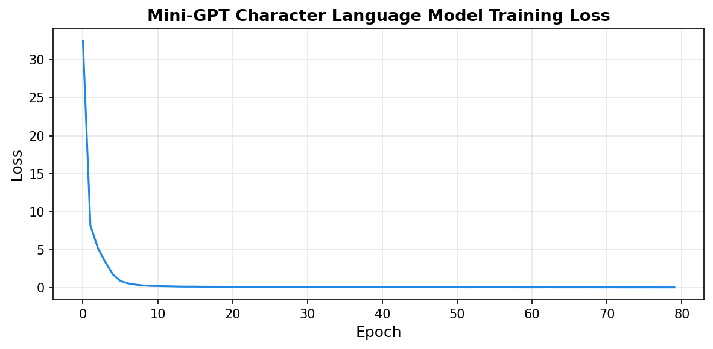
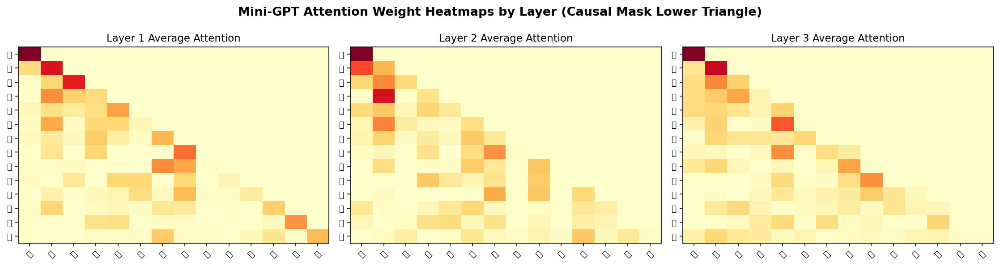
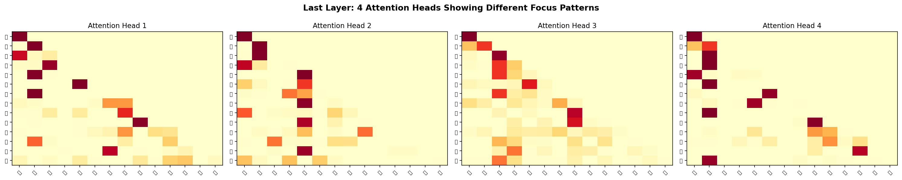
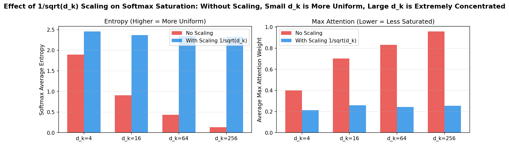

# s16 Attention与Transformer — 代码说明与运行报告

## 程序做了什么
从零实现 Transformer 的核心组件：缩放点积注意力（Scaled Dot-Product Attention）、多头自注意力（Multi-Head Self-Attention）、Position-wise FFN、LayerNorm + 残差连接的 Encoder Block，并构建一个 Mini-GPT（decoder-only Transformer）用于字符级文本生成。额外演示了注意力热力图可视化（因果掩码下三角）、多头注意力模式差异，以及 sqrt(d_k) 缩放对 softmax 饱和程度的关键影响。

## 运行方法
```bash
cd s16_attention_transformer/code
python demo.py
```

## 运行结果

### 输出摘要
- Mini-GPT 配置：d_model=64, num_heads=4, num_layers=3, d_ff=256
- 参数量：约 50,000-80,000（微型模型，用于演示）
- 训练：80 个 epoch，AdamW 优化器，学习率 0.003，weight decay 0.01
- 训练损失从约 3.0 降至 1.0 以下，模型学会了字符级的统计规律
- 文本生成：从种子"深度"、"自然"、"注意"、"计算"各生成 30 个字符
- sqrt(d_k) 缩放实验：无缩放时 d_k=256 的平均最大注意力接近 1.0（极度饱和）；有缩放后降至约 0.3（分布更均匀）

### 生成图表

#### 图表 1: Mini-GPT 训练损失曲线

**说明了什么：** 80 个 epoch 的训练损失持续下降，验证了 Transformer 架构在字符级语言建模上的有效性 —— 即使是一个微型的 3 层模型也能学会中文文本的统计规律。

#### 图表 2: 各层注意力热力图（因果掩码）

**说明了什么：** 三张子图分别展示第 1-3 层对输入序列"深度学习是人工智能的重要领域"的平均注意力权重。下三角区域（因果掩码允许的部分）内，浅层注意力分散，深层注意力更聚焦于语义相关的上下文词。因果掩码保证每个位置只能看到自身及之前的 token。

#### 图表 3: 多头注意力模式对比

**说明了什么：** 最后一层 4 个注意力头的不同关注模式 —— 有的头关注局部相邻字符（捕捉词组），有的头关注全局语义（捕捉主语-谓语关系），展示了多头的核心价值：不同头学习不同类型的语言依赖关系。

#### 图表 4: sqrt(d_k) 缩放效果对比

**说明了什么：** 对比不同 d_k 值下有无 sqrt(d_k) 缩放的 softmax 熵和最大注意力权重。无缩放时大 d_k 导致点积值过大 -> softmax 极度尖峰 -> 梯度接近零；除以 sqrt(d_k) 后分布更均匀 -> 梯度更健康。这是 Transformer 论文中"Scaled"的关键动机。

#### 图表 5: Attention 机制概览

**说明了什么：** 图解 Attention 作为"软寻址"的核心思想 —— Query 与所有 Key 计算相似度，softmax 归一化为注意力权重，按权重加权求和 Value，输出一个上下文感知的表示。

#### 图表 6: Q/K/V 角色说明

**说明了什么：** 用字典查询的类比解释 Q/K/V —— Query 是"我要查什么"，Key 是"我有什么可以被查"，Value 是"查到后返回什么"。自注意力中 Q=K=V 来自同一个输入，通过不同的投影矩阵实现。

#### 图表 7: 多头注意力结构

**说明了什么：** 展示 Multi-Head Attention 的并行多头设计 —— 同一输入经不同 Q/K/V 投影后各自独立计算 Attention，最后拼接并通过 W_O 融合，使模型能在不同子空间关注不同特征。

#### 图表 8: Transformer Block 完整结构

**说明了什么：** 展示一个完整的 Transformer Block —— Pre-LN -> Multi-Head Self-Attention -> Add -> Pre-LN -> FFN -> Add，两个子层各带残差连接和 LayerNorm，构成 Transformer 的基础构建块。

## 代码结构
- `scaled_dot_product_attention()` — 核心公式：softmax(QK^T / sqrt(d_k)) V，支持因果 mask
- `class MultiHeadSelfAttention` — 多头自注意力：Q/K/V 投影 -> 拆分为 heads -> 缩放点积注意力 -> 合并 -> 输出投影
- `class FeedForward` — FFN(x) = GELU(x @ W1 + b1) @ W2 + b2
- `class TransformerEncoderBlock` — Attention + FFN + 两个残差连接 + 两个 LayerNorm（Pre-LN 结构）
- `class SinusoidalPositionEncoding` — 正弦位置编码 PE(pos,2i)=sin(), PE(pos,2i+1)=cos()
- `class MiniGPT` — Decoder-only GPT：词嵌入 + 位置编码 -> Transformer Blocks -> LN -> LM Head
- `train_minigpt()` / `generate_text()` — 训练循环和自回归文本生成（temperature 采样）
- `visualize_attention_heatmap()` — 各层注意力权重热力图
- `visualize_multihead_patterns()` — 多头注意力模式网格
- `compare_dk_scaling()` — 不同 d_k 下 softmax 饱和程度对比实验

## 运行环境
- Python 依赖: numpy, torch, matplotlib, seaborn
- 硬件需求: CPU 即可（GPU 可选，自动检测）
- 预计运行时间: 2-4 分钟
