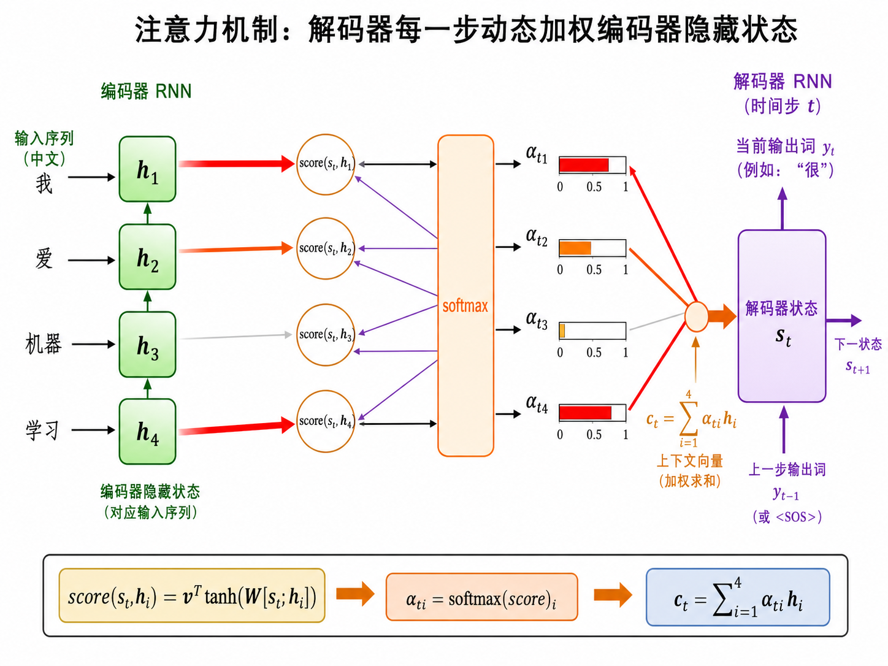
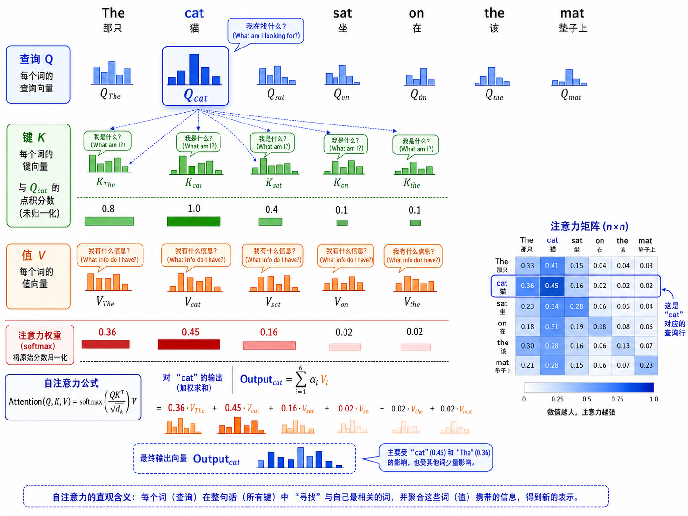
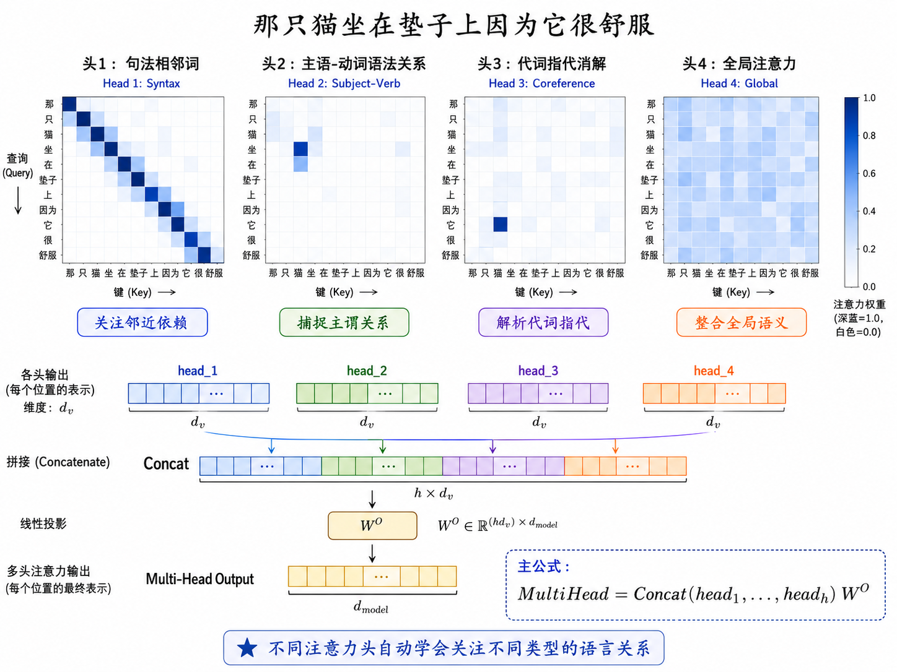

# s16 Attention 与 Transformer

> 注意力就是你告诉我"看哪"，我去看。Transformer 让每个词同时"看"所有词——不需要一步一步传递信息。

---

## 一、Seq2Seq 的瓶颈

s15 介绍了 RNN/LSTM 构建的 seq2seq（序列到序列）模型：编码器将整个输入序列压缩为一个固定长度的上下文向量 $c$，解码器再从这个向量中恢复出输出序列。

这里有一个根本的信息瓶颈：

$$
c = \text{Encoder}(x_1, x_2, \dots, x_T) \quad \in \mathbb{R}^{d_h}
$$

无论输入序列多长——一句话还是一整篇文章——编码器都必须把所有信息塞进一个固定维度（几百维）的向量里。类比一下：你要把一本 300 页的小说总结成一个 10 字的标题。信息压缩比太高，必然有大量信息丢失。

这在短句翻译中还好，但在长句翻译中效果急剧下降。2014 年 Bahdanau 等人发现，与其让解码器只看最后一帧（$c = h_T$），不如让它每一步都能**动态地回顾**编码器的所有隐藏状态。

---

## 二、Attention：让解码器"回头看"

### 2.1 核心思想

在每个解码时间步 $t$，模型不是只用一个固定的上下文向量 $c$，而是计算一个**加权平均**的上下文向量 $c_t$：

$$
c_t = \sum_{i=1}^{T} \alpha_{ti} h_i
$$

其中 $h_i$ 是编码器在第 $i$ 个位置的隐藏状态，$\alpha_{ti}$ 是注意力权重——表示在解码第 $t$ 步时，应该"看"输入的第 $i$ 个位置多少。

> **直觉**：你在做同声传译时，听到"the agreement on the European Economic Area was signed in August 1992"——翻译"被签署"时需要回头关注"agreement"，翻译"1992年8月"时需要关注"August 1992"。每个输出词对应的输入关注点是不同的。

### 2.2 Bahdanau 注意力（加法注意力）

最早的注意力机制（Bahdanau et al., 2015）使用一个小的前馈网络来计算注意力得分：

$$
\text{score}(h_t^{\text{dec}}, h_i^{\text{enc}}) = v^\top \tanh(W_a \cdot [h_t^{\text{dec}}; h_i^{\text{enc}}])
$$

$$
\alpha_{ti} = \text{softmax}(\text{score}(h_t^{\text{dec}}, h_i^{\text{enc}}))_i = \frac{\exp(\text{score}_{ti})}{\sum_{j} \exp(\text{score}_{tj})}
$$

其中 $W_a$ 和 $v$ 是可学习的参数，$[\cdot ; \cdot]$ 表示向量拼接。

### 2.3 Luong 注意力（乘法注意力）

Luong et al. (2015) 提出了更简洁的乘法形式：

**Dot**：$\text{score}(h_t, h_i) = h_t^\top h_i$

**General**：$\text{score}(h_t, h_i) = h_t^\top W h_i$

**Concat**（类似 Bahdanau）：$\text{score}(h_t, h_i) = v^\top \tanh(W[h_t; h_i])$

乘法注意力计算更快（矩阵乘法高度优化），所以后来的 Transformer 也采用了点积的形式。



---

## 三、Self-Attention："Attention is All You Need"

2017年，Vaswani 等人在论文《Attention is All You Need》中提出了 Transformer 架构，完全抛弃了循环连接，只用注意力机制处理序列。其核心创新是**自注意力**（Self-Attention）：

> 序列中的每个词都对同一序列中的所有词计算注意力——每个词"看"所有其他词。

### 3.1 Q、K、V：查询、键、值

自注意力将每个输入词 $x_i$ 通过三个可学习的线性投影，映射为三个向量：

- **Query（查询）** $q_i = W^Q x_i$："我在找什么？"——当前词需要什么信息
- **Key（键）** $k_i = W^K x_i$："我（作为信息源）是什么？"——每个词作为信息源的标签
- **Value（值）** $v_i = W^V x_i$："如果被选中，我提供什么信息？"——每个词携带的实际内容

注意力计算的过程可以理解为**字典查询**：
1. 用 Query 去匹配所有的 Key（点积计算相似度）
2. 用 softmax 归一化为注意力权重
3. 用权重对 Value 做加权求和

> 这个机制借鉴了信息检索中的 Query-Key-Value 范式——但一切都在同一个向量空间中端到端地学习。

### 3.2 Scaled Dot-Product Attention

$$
\text{Attention}(Q, K, V) = \text{softmax}\left(\frac{QK^\top}{\sqrt{d_k}}\right) V
$$

逐维度解释（假设 batch=1）：

- $Q \in \mathbb{R}^{n \times d_k}$：$n$ 个输入位置的 Query 矩阵
- $K \in \mathbb{R}^{n \times d_k}$：$n$ 个输入位置的 Key 矩阵
- $QK^\top \in \mathbb{R}^{n \times n}$：注意力得分矩阵——第 $i$ 行第 $j$ 列表示第 $i$ 个词对第 $j$ 个词的"关注程度"
- $\text{softmax}$ 在每一行上做归一化——每个词对序列中所有词的注意力权重和为 1
- $\frac{1}{\sqrt{d_k}}$：缩放因子（见下一小节）
- $\times V$：用注意力权重对 Values 加权求和，得到最终的输出 (n, d_v)



### 3.3 为什么要除以 $\sqrt{d_k}$？

当 $d_k$ 很大时（如 64 或 128），点积 $q \cdot k$ 的值也会很大（因为 $q \cdot k = \sum_{i=1}^{d_k} q_i k_i$，每一项都是均值 0 的随机变量，和的方差为 $d_k$）。

softmax 函数在大值区域非常陡峭——如果某些得分远超其他得分，softmax 会输出一个极度尖锐的分布（接近 one-hot）。这导致两个问题：

1. **梯度消失**：softmax 的梯度在饱和区接近 0
2. **注意力过于集中**：模型只关注一两个位置，失去了"综合"多个信息源的能力

除以 $\sqrt{d_k}$ 将点积的标准差控制为 1，使 softmax 的输入保持在梯度良好的区域。

> 这个设计在 Transformer 论文中只有一句话，但它是注意力机制能够稳定训练的关键细节。

### 3.4 因果掩码（Causal Mask）

在自回归生成（如 GPT）中，$t$ 时刻的输出只能依赖 $t$ 时刻之前的输入——不能"偷看"未来的词。这通过在注意力矩阵 $QK^\top$ 上施加一个**上三角掩码**来实现：

$$
\text{MaskedAttention}(Q, K, V) = \text{softmax}\left(\frac{QK^\top}{\sqrt{d_k}} + M\right) V
$$

其中 $M$ 是一个矩阵，$M_{ij} = -\infty$（实际上是一个很大的负数如 -1e9）当 $j > i$，否则 $M_{ij} = 0$。这样，softmax 之后，未来位置 ($j > i$) 的权重变成 0。

---

## 四、多头注意力（Multi-Head Attention）

单一注意力头可能只关注一种模式（如句法关系），但语言中有多种类型的关系需要捕捉。多头注意力并行地运行 $h$ 个独立的注意力"头"，每个头有自己独立的 $W^Q, W^K, W^V$ 投影：

$$
\text{head}_i = \text{Attention}(Q W_i^Q, K W_i^K, V W_i^V), \quad i = 1, \dots, h
$$

所有头的输出拼接后再通过一个线性投影：

$$
\text{MultiHead}(Q, K, V) = \text{Concat}(\text{head}_1, \dots, \text{head}_h) W^O
$$

其中 $W_i^Q, W_i^K \in \mathbb{R}^{d_{\text{model}} \times d_k}$，$W_i^V \in \mathbb{R}^{d_{\text{model}} \times d_v}$，$W^O \in \mathbb{R}^{h d_v \times d_{\text{model}}}$。通常 $d_k = d_v = d_{\text{model}} / h$，这样多头注意力的总计算量和单头大致相同。

> 不同头能学会关注不同的模式：有的头关注句法结构，有的头关注共指关系，有的头关注语义关联。这也是 Transformer 可解释性研究的重要入口。



---

## 五、位置编码

自注意力最大的局限是：它**天然对位置不敏感**。把句子中的词顺序打乱，注意力输出的 vector set 完全相同（只是排列顺序不同）——因为注意力是对称的，$\text{Attention}(Q, K, V)$ 中没有任何位置信息。

### 5.1 正弦位置编码（Sinusoidal）

原始 Transformer 中使用正弦/余弦函数编码位置：

$$
PE_{(pos, 2i)} = \sin\left(\frac{pos}{10000^{2i / d_{\text{model}}}}\right)
$$

$$
PE_{(pos, 2i+1)} = \cos\left(\frac{pos}{10000^{2i / d_{\text{model}}}}\right)
$$

其中 $pos$ 是位置索引，$i$ 是维度索引。不同频率的正弦波让模型能区分不同的位置，而且由于三角函数的性质，模型容易学习相对位置关系——$PE(pos+k)$ 可以表示为 $PE(pos)$ 的线性函数。

### 5.2 可学习位置嵌入

Bert、GPT 等后续模型通常使用**可学习的位置嵌入**（Learned Positional Embedding）：每个位置 0, 1, 2, ... 随机初始化一个向量，随模型一起训练。这在效果上通常与正弦编码相当，但需要为最大序列长度预分配参数。

---

## 六、Transformer Block 的完整结构

一个 Transformer 层包含两个主要子层：

```
输入 x
  ↓
LayerNorm
  ↓
多头自注意力 (Multi-Head Self-Attention)
  ↓
残差连接 (Add: x + Attention(x))
  ↓
LayerNorm
  ↓
前馈网络 (FFN: Linear → ReLU/GELU → Linear)
  ↓
残差连接 (Add: 与上一个残差输出相加)
  ↓
输出
```

**关键设计选择**：

1. **LayerNorm 在前**（Pre-LN）：原始论文是 Post-LN（归一化在加法之后），但后来的实践（GPT-2+）发现 Pre-LN 训练更稳定。

2. **FFN 维度**：通常 $d_{\text{ff}} = 4 \times d_{\text{model}}$，即 FFN 先将维度扩大 4 倍再缩小回来。这个"瓶颈"结构让 FFN 有足够的容量存储知识。

3. **残差连接**：每个子层后都有残差连接（$x + \text{Sublayer}(x)$）。残差连接让梯度可以直通底层，是训练深层 Transformer（几十到几百层）的关键。


---

## 七、BERT vs GPT：两种架构变体

完整的原始 Transformer 是 **编码器-解码器**（Encoder-Decoder）结构，适用于 seq2seq 任务（机器翻译）。但后续发展出了两种更为主流的变体：

| 架构 | 注意力类型 | 代表模型 | 典型任务 |
|------|-----------|---------|---------|
| Encoder-only | 双向自注意力（看到两侧） | BERT | 分类、NER、QA |
| Decoder-only | 因果自注意力（只能向左看） | GPT | 文本生成 |
| Encoder-Decoder | 编码器双向 + 解码器因果 | T5, BART | 翻译、摘要 |

> BERT 和 GPT 的详细对比，见 [s17 预训练范式](../s17_pretrained_models/)。

---

## 八、本节小结

| 概念 | 一句话总结 |
|------|-----------|
| Seq2Seq 瓶颈 | 固定维度向量无法承载长序列的全部信息 |
| 注意力机制 | 每一步动态加权所有编码器隐藏状态 |
| Self-Attention | 序列内部的每个词关注所有其他词 |
| Q/K/V | 查询匹配键，按权重聚合值——字典查询范式 |
| $\sqrt{d_k}$ 缩放 | 控制点积方差，防止 softmax 饱和 |
| 多头注意力 | 并行多组 QKV 投影，捕捉不同类型的关系 |
| 位置编码 | 注入序列位置信息——正弦函数或可学习嵌入 |
| Transformer Block | LN → Attention → Add → LN → FFN → Add |
| Pre-LN | LayerNorm 在子层之前，训练更稳定 |
| 因果掩码 | 防止看到未来信息，用于自回归生成 |

> 下一节 [s17 预训练范式](../s17_pretrained_models/) 将讨论：Transformer 如何催生了大规模预训练——BERT 和 GPT 分别代表了两种训练范式，以及预训练如何彻底改变了 NLP。

## 📥 Code

| File | View | Download |
|------|------|----------|
| demo.py | [Open](./code-demo) | <a href="../code/s16_attention_transformer/demo.py" target="_blank" download>Download</a> |
| exercise.py | [Open](./code-exercise) | <a href="../code/s16_attention_transformer/exercise.py" target="_blank" download>Download</a> |

