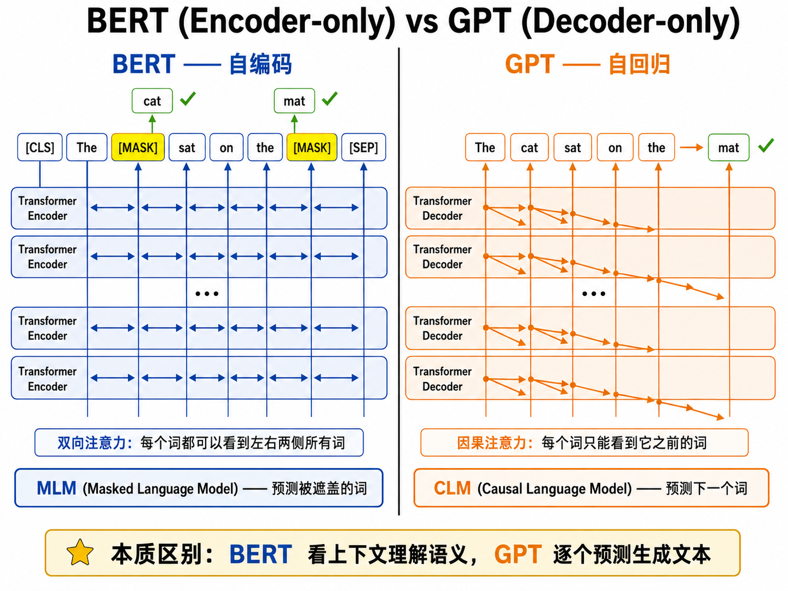
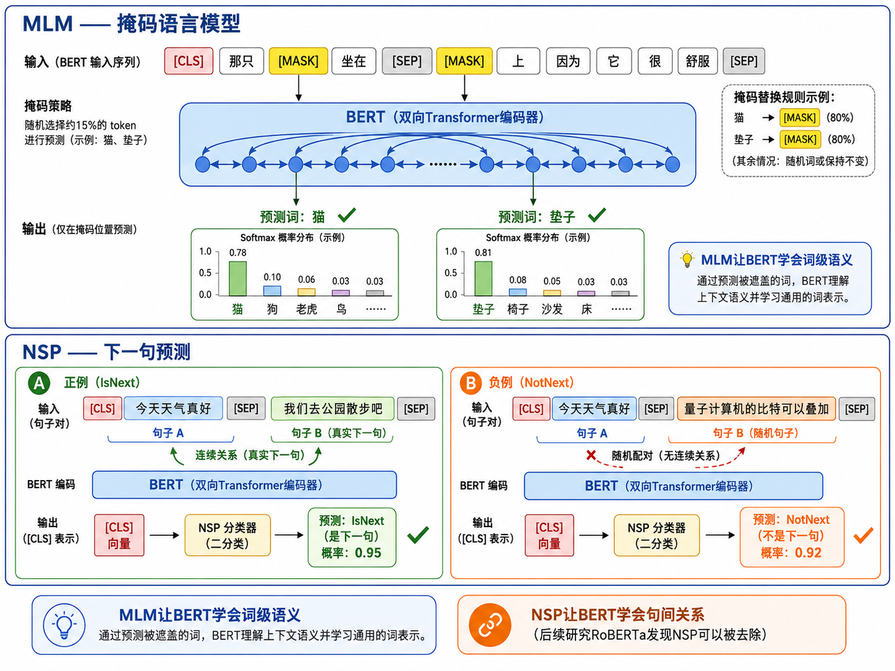
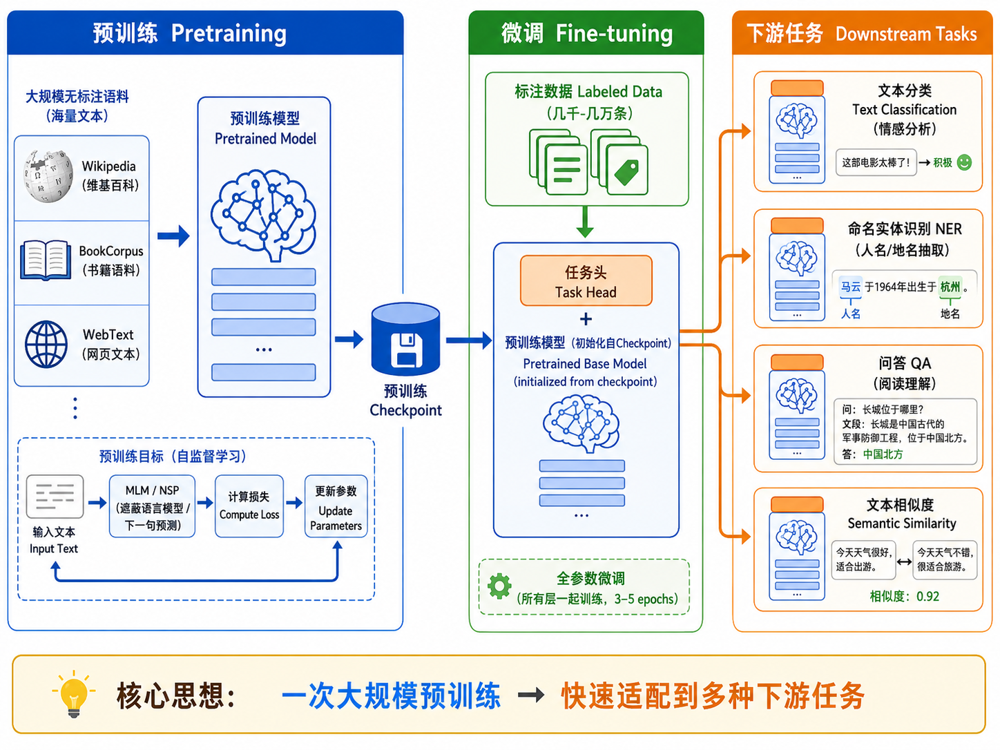
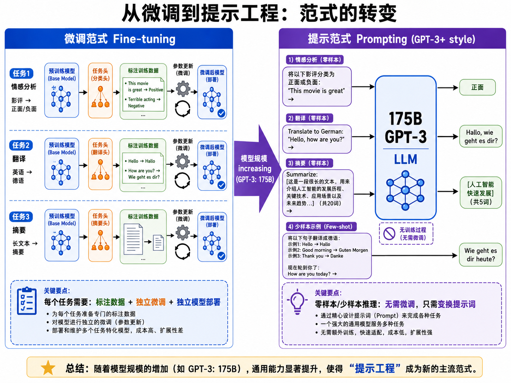

# s17 预训练范式：BERT 与 GPT

> 在 ImageNet 上预训练的 ResNet 可以用来识别猫狗照片——NLP 也需要类似的"预训练再微调"范式。BERT 和 GPT 是两座里程碑。

---

## 一、迁移学习来到 NLP

在计算机视觉领域，迁移学习早已是标准做法：在 ImageNet 上预训练一个 ResNet，然后把最后几层换成任务相关的分类头，在目标数据集上微调（finetune）几个 epoch 就能达到很好的效果。

但在 NLP 中，迁移学习直到 2018 年才真正起飞。原因在于：文本标注数据通常很稀缺，而大量未标注的文本数据（网页、书籍、维基百科）唾手可得。如果能用这些无标注数据预训练一个"通晓语言"的模型，再在各式各样的下游任务上微调，就能极大地降低对标注数据的依赖。

2018 年发生了两件关键的事：

| 时间 | 事件 | 意义 |
|------|------|------|
| 2018.06 | OpenAI 发布 GPT-1 | 首次展示大规模单向语言模型预训练 + 微调的有效性 |
| 2018.10 | Google 发布 BERT | 引入双向预训练和 MLM，在 11 项 NLP 任务上刷新纪录 |

这两篇论文开启了 NLP 的"预训练时代"。

---

## 二、两种范式：自编码 vs 自回归

预训练语言模型按训练目标可分为两大类：

### 2.1 自回归（Auto-Regressive）—— GPT 路线

自回归模型以**从左到右**的方式预测下一个 token：

$$
P(x) = \prod_{t=1}^{T} P(x_t \mid x_{<t})
$$

- **训练目标**：因果语言模型（Causal Language Model, CLM）
- **注意方式**：因果掩码——第 $t$ 个 token 只能看到 $t$ 之前的 token
- **代表**：GPT-1/2/3/4, LLaMA, Qwen
- **优势**：天然适合文本生成（从左往右一个一个输出）
- **劣势**：每个 token 只能利用左侧上下文，不能同时利用右侧信息

### 2.2 自编码（Auto-Encoding）—— BERT 路线

自编码模型通过**随机遮盖**输入的一部分 token，让模型从两侧的上下文中预测被遮盖的 token：

- **训练目标**：掩码语言模型（Masked Language Model, MLM）
- **注意方式**：双向注意力——每个 token 可以看到左右两侧的所有 token
- **代表**：BERT, RoBERTa, DeBERTa
- **优势**：双向上下文让模型对文本的理解更全面，适合理解类任务
- **劣势**：无法直接用于文本生成（不是自回归的）



---

## 三、BERT：双向编码器

### 3.1 两个预训练任务

**任务一：掩码语言模型（MLM）**

随机将 15% 的输入 token 替换为 `[MASK]`，让模型预测被遮盖的原始 token。

具体策略（防止预训练-微调的不匹配）：
- 选中的 15% 中，80% 替换为 `[MASK]`
- 10% 替换为随机 token
- 10% 保持不变（但模型仍需预测它）

> 为什么不全用 `[MASK]`？因为微调阶段的输入中没有 `[MASK]` token（例如你做分类任务时输入的是正常文本）。混入一定比例的随机替换和原词，迫使模型不能"看到 `[MASK]` 就无脑复制"，而是从上下文中真正理解语义。

**任务二：下一句预测（NSP）**

输入是两句拼接在一起：`[CLS] 句子A [SEP] 句子B [SEP]`。模型需要判断 B 是否是 A 的下一句（二分类）。

- NSP 让模型学习句子间的关系，对自然语言推理（NLI）和问答（QA）任务有帮助
- 但后来的研究（RoBERTa, Liu et al. 2019）发现去掉 NSP 反而效果更好——仅 MLM 就足够

### 3.2 特殊 Token

```
[CLS] 今 天 天 气 真 好 [SEP] 我 们 去 公 园 吧 [SEP]
```

- `[CLS]`：分类 token，其最终隐藏状态用于句子级别分类任务
- `[SEP]`：分隔 token，用于分隔不同的句子/段落
- `[MASK]`：掩码 token，MLM 任务中用于遮盖需要预测的词

### 3.3 BERT 的输入表示

BERT 的输入是三种嵌入的和：

$$
\text{Input} = \text{TokenEmbed}(token) + \text{SegmentEmbed}(segment) + \text{PositionEmbed}(position)
$$

- **Token Embedding**：词的语义表示
- **Segment Embedding**：标记 token 属于句子 A 还是句子 B
- **Position Embedding**：可学习的位置编码



---

## 四、GPT：自回归解码器

### 4.1 训练目标

GPT 的训练目标很简单——给定前面的 token，预测下一个：

$$
\mathcal{L}_{\text{GPT}} = -\sum_{t=1}^{T} \log P(x_t \mid x_1, x_2, \dots, x_{t-1}; \theta)
$$

由于因果掩码的存在，模型在预测 $x_t$ 时只能看到 $x_{<t}$。这是"标准的"语言模型训练方式，但 GPT 把它放在了 Transformer decoder 架构上，并规模化到惊人的程度。

### 4.2 GPT 系列演进

| 模型 | 时间 | 参数 | 关键特点 |
|------|------|------|---------|
| GPT-1 | 2018.06 | 117M | 12 层 decoder，证明单向预训练可行 |
| GPT-2 | 2019.02 | 1.5B | 48 层，"zero-shot"能力初现 |
| GPT-3 | 2020.05 | 175B | "In-context learning"，prompt工程取代微调 |
| GPT-4 | 2023.03 | 未知（>1T估计） | 多模态，推理能力跃升 |

### 4.3 GPT-3 的范式转变

GPT-3 最重要的贡献是展示了**规模本身就是一种能力**——当你把模型放大到 175B 参数，你不再需要为每个下游任务做微调。你只需要在 prompt 中给几个示例（few-shot），模型就能"理解"任务要求并给出合理的回答。

这就是从"预训练 + 微调"到"预训练 + 提示工程"的范式转变。

---

## 五、预训练-微调 Pipeline

一个典型的 NLP 任务如何利用预训练模型：

```
阶段1: 预训练 (Pretraining)
  海量无标注文本 (Wikipedia + BookCorpus + ...)
    → MLM 或 CLM 训练
      → 预训练模型 checkpoint

阶段2: 微调 (Finetuning)
  预训练模型 checkpoint + 任务标注数据
    → 添加任务特定的"头"
      → 所有层一起微调
        → 任务专用模型
```

**常见的下游任务头**：

| 任务类型 | 添加的头 | BERT 上的实现 |
|---------|---------|--------------|
| 文本分类 | 全连接层 | 取 `[CLS]` 向量 → FC → softmax |
| 命名实体识别 (NER) | Token 分类器 | 每个 token 向量 → FC → N 类分类 |
| 问答 (QA) | 跨度预测 | 预测答案起始位置和结束位置 |
| 文本生成 | 无需额外头 | 自回归解码（仅 GPT） |

> 在 BERT 上微调文本分类通常只需要 2-4 个 epoch 就能达到很好的效果。这就是预训练的力量——模型已经"懂"语言了，只需要调整它去执行特定任务。



---

## 六、BERT vs GPT：全面对比

| 维度 | BERT | GPT |
|------|------|-----|
| 架构 | Encoder-only | Decoder-only |
| 注意力 | 双向（看到全部） | 单向/因果（只看左边） |
| 预训练 | MLM + NSP | CLM（下一词预测） |
| 输入 | `[CLS] ... [SEP] ... [SEP]` | 自然文本序列 |
| 生成能力 | 无法生成连贯文本 | 天然适合生成 |
| 理解能力 | 更强（双向） | 较弱（单向） |
| 典型任务 | 分类、NER、QA、相似度 | 对话、续写、翻译、代码生成 |
| 代表大小 | BERT-base: 110M, BERT-large: 340M | GPT-3: 175B, GPT-4: >1T |

---

## 七、从微调到提示工程

GPT-3 之后，NLP 的使用方式发生了根本变化：

**经典微调**：
1. 准备每个任务几千到几万条标注数据
2. 在每条数据上训练模型几个 epoch
3. 每个任务得到一个不同的模型

**提示工程（Prompting）**：
1. 编写自然语言指令（prompt）
2. 在 prompt 中可选地放置几个示例（few-shot）
3. 模型一次推理完成，无需训练

到 GPT-3.5/ChatGPT 时代，更进一步发展为**指令微调**（Instruction Tuning）：用（指令，回复）对做 SFT + RLHF，让模型学会"遵循指令"——此时用户只需要用自然语言描述任务，不需要做任何训练。



---

## 八、本节小结

| 概念 | 一句话总结 |
|------|-----------|
| 预训练 | 在海量无标注文本上学通用语言知识 |
| 微调 | 在少量标注数据上调整模型到特定任务 |
| MLM | BERT 的训练目标：预测被遮盖的词 |
| CLM | GPT 的训练目标：预测下一个词 |
| `[CLS]` | BERT 的句子级聚合 token |
| 双向注意力 | BERT 的核心优势：同时看上下文 |
| 因果掩码 | GPT 的核心约束：不能看未来 |
| In-context learning | GPT-3 的能力：通过 prompt 中的示例学会任务 |
| 指令微调 | ChatGPT 的能力基础：学会遵循自然语言指令 |

> 下一节 [s18 大语言模型](../s18_large_language_models/) 将讨论：为什么更大的模型会"涌现"出小模型没有的能力？Scaling Law 告诉我们什么？以及 RLHF 和 DPO 如何让大模型变得可控。

## 📥 Code

| File | View | Download |
|------|------|----------|
| demo.py | [Open](./code-demo) | <a href="../code/s17_pretrained_models/demo.py" target="_blank" download>Download</a> |
| exercise.py | [Open](./code-exercise) | <a href="../code/s17_pretrained_models/exercise.py" target="_blank" download>Download</a> |

## 参考

1. Devlin, J., Chang, M.-W., Lee, K., & Toutanova, K. (2019). BERT: Pre-training of Deep Bidirectional Transformers for Language Understanding. *NAACL 2019*. [[arXiv:1810.04805](https://arxiv.org/abs/1810.04805)]
2. Radford, A., et al. (2018). Improving Language Understanding by Generative Pre-Training. (GPT-1) [[OpenAI](https://openai.com/research/language-unsupervised)]
3. Radford, A., et al. (2019). Language Models are Unsupervised Multitask Learners. (GPT-2) [[OpenAI](https://openai.com/research/better-language-models)]
4. Brown, T., et al. (2020). Language Models are Few-Shot Learners. *NeurIPS 2020*. (GPT-3) [[arXiv:2005.14165](https://arxiv.org/abs/2005.14165)]
5. Liu, Y., et al. (2019). RoBERTa: A Robustly Optimized BERT Pretraining Approach. [[arXiv:1907.11692](https://arxiv.org/abs/1907.11692)]

