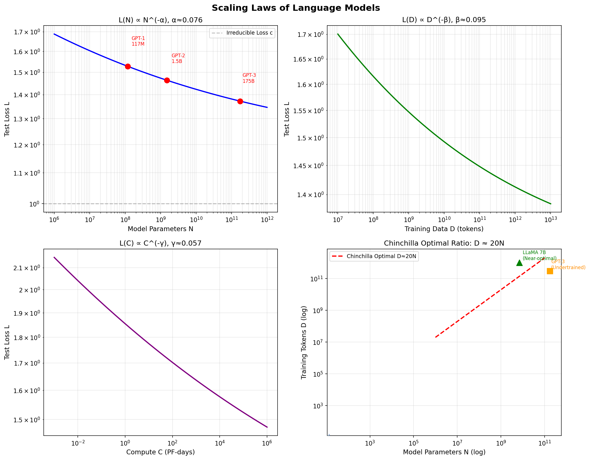
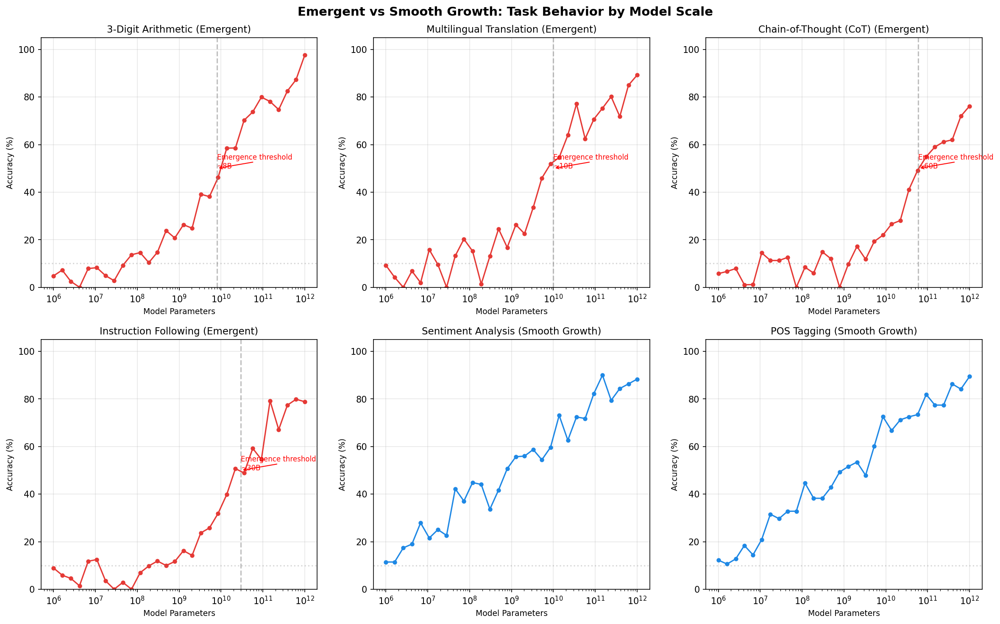
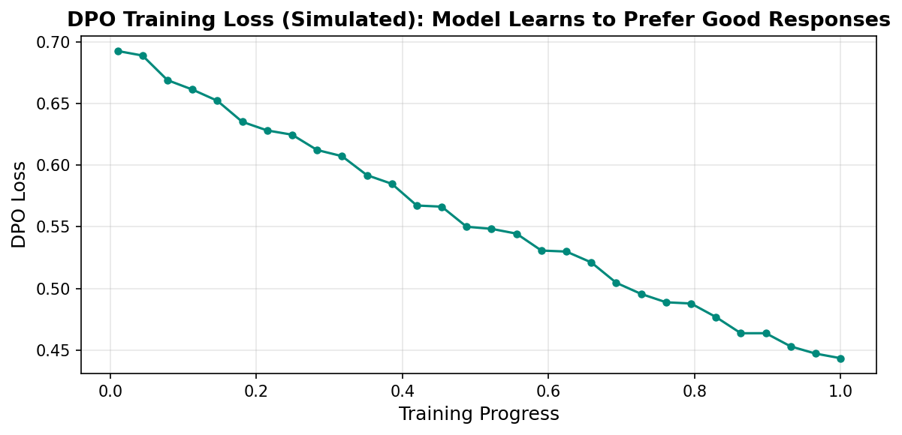
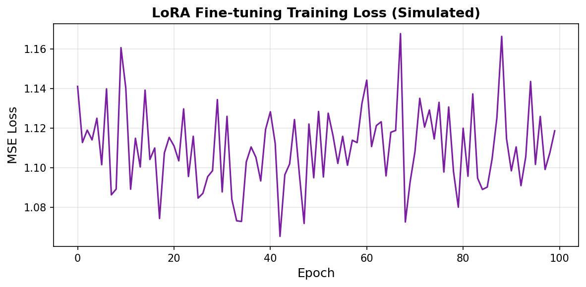

# s18 大语言模型 -- 代码说明与运行报告

## 程序做了什么
演示大语言模型的四个核心概念：Scaling Law 幂律下降规律（Kaplan + Chinchilla 最优配比 D=20N）、涌现行为的 sigmoid 相位转变模拟（小模型随机+跨阈值跃升）、DPO 直接偏好优化的损失函数实现与数值示例、以及 LoRA 低秩微调的概念演示（参数对比 + 模拟训练）。

## 运行方法
```bash
cd s18_large_language_models/code
python demo.py
```

## 运行结果

### 输出摘要
- 展示了 Kaplan Scaling Law 公式 L(N,D) = a/N^alpha + b/D^beta + c 的计算示例：7B 模型 + 300B tokens vs 7B + 1.4T tokens (Chinchilla 最优) 的损失对比
- 涌现行为模拟展示了 4 个涌现任务（3位加减法、多语言翻译、CoT推理、指令遵循）和 2 个非涌现任务（情感分析、词性标注）的准确率曲线
- DPO 损失数值对比：正确偏好场景 Loss 较小，错误偏好场景 Loss 较大
- LoRA 参数量对比：全参数 16.8M vs LoRA(r=16) 131K，减少 128x

### 生成图表

#### 图表 1: Scaling Laws 综合图

**说明了什么：** 四合一图表展示了损失随模型参数量 N、数据量 D、计算量 C 的幂律下降趋势，以及 Chinchilla 最优配比 D=20N 等高线图（GPT-3 欠训练，LLaMA 7B 接近最优）。

#### 图表 2: 涌现能力对比

**说明了什么：** 6 个子图对比涌现任务（sigmoid 相位转变，小模型 random 水平 -> 跨阈值后大幅跃升）与平滑增长任务（随模型大小线性提升）。标志性涌现阈值在 ~10B 参数量附近。

#### 图表 3: DPO 训练损失曲线

**说明了什么：** 模拟 DPO 训练过程中损失逐步下降，反映模型从无法区分偏好到学会偏好好回答的优化过程。DPO 直接从偏好对数据学习，无需显式训练奖励模型。

#### 图表 4: LoRA 微调训练损失

**说明了什么：** 模拟 LoRA 微调在某回归任务上的 MSE 损失下降曲线，展示低秩适配矩阵 BA 在冻结原权重 W 的情况下仍能有效学习新任务。

#### 图片资源: 概念图解
- `18-01-scaling-laws.png` -- Scaling Law 关键公式与数据配比示意图
- `18-02-emergent-abilities.png` -- 涌现能力定义与 BigBench 等基准测试示意图
- `18-03-rlhf-pipeline.png` -- RLHF 三阶段流程（SFT -> RM -> PPO）架构图
- `18-04-dpo-vs-rlhf.png` -- DPO vs RLHF 训练范式对比图解

## 代码结构
- `kaplan_loss()` / `chinchilla_optimal_D()` -- Kaplan 幂律损失函数与 Chinchilla 最优配比
- `simulate_emergence()` -- 涌现行为的 sigmoid 模型模拟
- `dpo_loss()` -- DPO 损失函数实现：L = -log sigma(beta * (log pi_w/ref_w - log pi_l/ref_l))
- `class LoRALinear` -- 简化的 LoRA 线性层：h = Wx + (alpha/r) * B A x
- `main()` -- 主流程（Part 1: Scaling Law 可视化、Part 2: 涌现模拟、Part 3: DPO 演示、Part 4: LoRA 演示）

## 运行环境
- Python 依赖: numpy, torch, matplotlib
- 硬件需求: CPU 即可
- 预计运行时间: ~2 分钟
