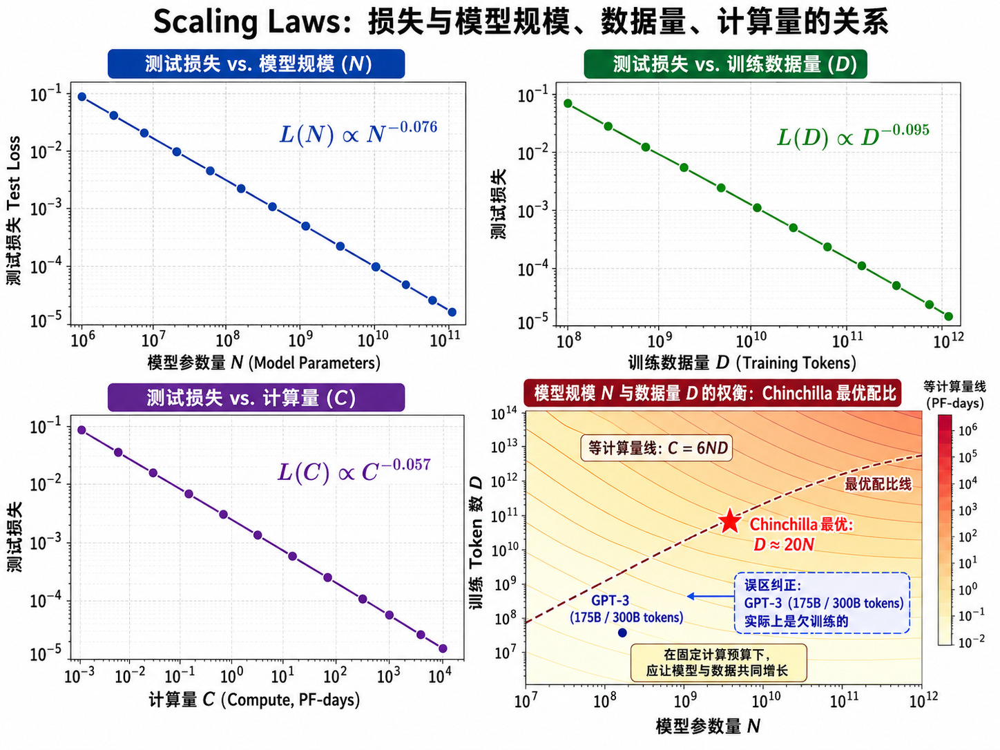
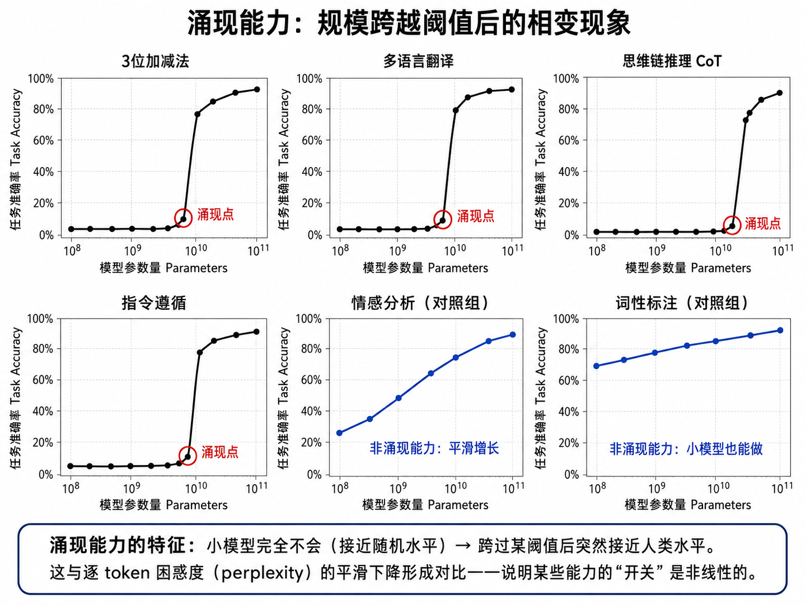
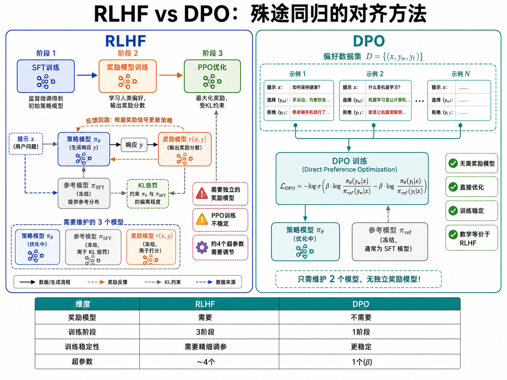
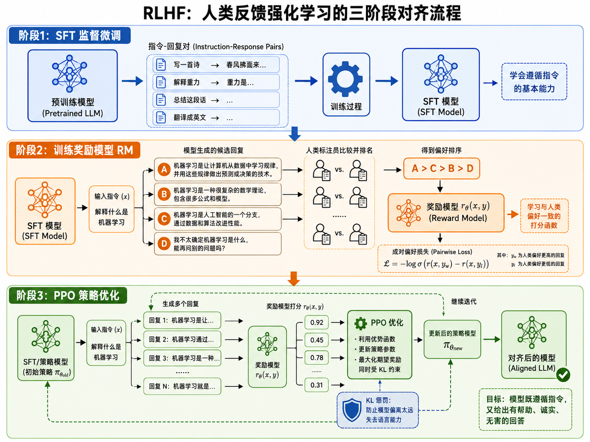

# s18 大语言模型：Scaling、涌现与对齐

> 当模型参数从 1 亿涨到 1000 亿，它不再只是"更准确"——它开始拥有了小模型完全不具备的能力。这就是涌现。

---

## 一、什么是"大"语言模型？

"大"不只是形容词。在LLM的语境中，它通常意味着三个维度的"大"：

| 维度 | GPT-1 (2018) | GPT-3 (2020) | GPT-4 (2023) |
|------|-------------|-------------|-------------|
| 参数量 | 117M | 175B | >1T（估计） |
| 训练数据 | ~5GB | ~570GB | 未公开（TB级） |
| 训练算力 | ~0.1 petaflop/s-day | ~3640 petaflop/s-day | 未公开 |

为什么"大"重要？因为经验表明：**更大的模型不仅在已知任务上更准确，而且会涌现出小模型完全没有的新能力**。这是 LLM 最吸引人也最令人困惑的特性。

---

## 二、Scaling Laws：越大越好，但要配比得当

### 2.1 Kaplan Scaling Law

Kaplan et al. (2020) 在 OpenAI 的研究发现，语言模型的损失（perplexity）随模型大小、数据量、计算量三个变量的增长呈**幂律下降**：

$$
L(N) = \left(\frac{N_c}{N}\right)^{\alpha_N}, \quad L(D) = \left(\frac{D_c}{D}\right)^{\alpha_D}
$$

更一般的形式：

$$
L(N, D) = \frac{a}{N^{\alpha}} + \frac{b}{D^{\beta}} + c
$$

其中 $N$ 是模型参数量，$D$ 是训练数据量（token 数），$c$ 是不可约减的损失（irreducible loss，由数据本身的熵决定）。

> **幂律的含义**：损失按 $N^{-\alpha}$ 下降意味着——每次你把参数量翻倍，损失的下降幅度是固定的（比例而非绝对值）。这在 log-log 图上是一条直线。

### 2.2 Chinchilla 最优配比

2022 年 DeepMind 的 Chinchilla 论文指出了一个重要修正：Kaplan 认为计算量固定时应该优先增加参数量，但 Chinchilla 发现**数据和参数应该同步增长**。Chinchilla 的最优配比是：

$$
D_{\text{opt}} \approx 20 \times N_{\text{params}}
$$

即：用 70B 参数的模型，应该喂给它约 1.4T tokens 的训练数据。相比之下，GPT-3（175B 参数，约 300B tokens 训练数据）实际上是"欠训练"的——如果把同样的算力分给一个参数更少但数据更多的模型，效果会更好。

> 这就是为什么 LLaMA (7B-65B) 和 Chinchilla (70B) 用更少的参数就超越了 GPT-3 的效果——它们训练了更多的数据。

---

## 三、涌现能力：量变引起质变

### 3.1 什么是涌现？

涌现（Emergence）是指：某些能力在模型规模达到某个阈值之前几乎完全不存在（表现为随机水平），但一旦越过这个阈值，性能急剧跃升到接近完美的水平。

Wei et al. (2022) 在 Google 的研究中系统性地记录了这些涌现能力：

| 能力 | 涌现阈值（约） | 描述 |
|------|---------------|------|
| 3 位数加减法 | ~10B | 小模型完全不会，大模型突然就会了 |
| 多语言翻译 | ~10B | 训练数据中没有平行的翻译对 |
| 思维链推理 (CoT) | ~60B | 能"一步步思考"并给出推理过程 |
| 指令遵循 | ~60B | 理解并执行用自然语言描述的指令 |
| 代码生成 | ~10B | 能理解和生成编程语言代码 |

### 3.2 为什么涌现？

涌现的本质根源尚无定论，但目前有以下解释：

**解释一：度量方式**：不是模型能力在"突变"，而是我们用的评估指标（如准确率）是非线性的。对模型来说，perplexity（逐 token 的困惑度）可能一直在平滑改善，但当它跨过某个临界点，任务的准确率就会从"猜不对"突变到"猜对了"。

**解释二：组合泛化**：大模型有足够的容量去学习"技能的组合"。翻译能力 = 语言理解 + 生成能力 + 跨语言对齐，这三个子技能在小模型中都已存在，但直到模型足够大，它们才能被"组合"成一个新技能。

**解释三：记忆与模式匹配**：更大模型、更多数据意味着模型见过更多模式。当模型记住了足够多的"加法例子"，它"看起来"就会做加法——尽管模型内部可能并没有学到抽象的加法规则。

---

## 四、预训练数据：质量 > 数量

LLM 的训练数据从哪来？

| 数据源 | 占比（典型） | 特点 |
|--------|------------|------|
| Common Crawl（网页抓取） | 60-80% | 量大但噪声多，需要大量过滤 |
| 书籍 | 5-10% | 质量高、长文本，利于理解叙事 |
| 代码（GitHub等） | 5-15% | 提升推理能力（代码天然有逻辑结构） |
| 学术论文 | 2-5% | 高质量专业知识 |
| 维基百科 | 1-3% | 结构化知识，多语言 |
| 对话/论坛 | 1-3% | 自然对话风格 |

**数据过滤至关重要**：原始网页数据包含大量重复、低质、有害内容。LLaMA 和 GPT-4 等模型使用了复杂的数据过滤 pipeline（去重、质量分类、有害内容过滤），这些过滤流程是模型质量的关键但通常不公开。

> 业界共识：高质量的小数据集 > 低质量的大数据集。这也是为什么 LLaMA 用 ~1T tokens 的高质量数据就能达到很好的效果。

---

## 五、指令微调：让模型学会"听话"

预训练只能让模型学会"续写文本"——给它"写一篇关于AI的文章"，它可能继续写"的提纲如下..."而不是真的写一篇文章。**指令微调**（Instruction Tuning）解决了这个问题：

### SFT（Supervised Fine-Tuning）

收集大量（指令，期望回复）对，在预训练模型上做监督微调：

- 数据格式：`Human: {指令}\n\nAssistant: {期望的回复}`
- 只在 Assistant 部分计算损失（Human 部分不参与 loss）
- 数据多样性很重要：包括问答、写作、总结、代码、翻译、头脑风暴等任务

SFT 后的模型学会了"遵循指令"的行为模式——但这还只是第一步。SFT 模型可能给出有帮助但有害的回答，或者给出不准确的回答。

---

## 六、对齐：RLHF 与 DPO

### 6.1 为什么需要对齐？

"SFT 后的模型会按要求写一篇关于如何制造炸弹的文章——它在'遵循指令'方面做得很好，但这很危险。"

对齐（Alignment）的目标是让模型的输出符合人类价值观：**有帮助**（helpful）、**诚实**（honest）、**无害**（harmless）。

### 6.2 RLHF（Reinforcement Learning from Human Feedback）

RLHF 分三个阶段：

**阶段 1 — SFT**：如前所述，用高质量的（指令，回复）对做监督微调。

**阶段 2 — 训练奖励模型**：
- 让 SFT 模型对同一个 prompt 生成多个回答
- 人类标注者对回答进行排序（A > B > C > D）
- 用这些偏好数据训练一个奖励模型 $r_\theta(x, y)$，使其能预测人类对回答的偏好

$$
\mathcal{L}_{\text{reward}} = -\mathbb{E}_{(x, y_w, y_l) \sim D} [\log \sigma(r_\theta(x, y_w) - r_\theta(x, y_l))]
$$

其中 $y_w$ 是人类偏好的回答（winner），$y_l$ 是较差的回答（loser）。

**阶段 3 — PPO 优化**：
- 用奖励模型给 SFT 模型的输出打分
- 用 PPO（Proximal Policy Optimization）算法优化模型参数，最大化奖励分数
- 同时加入 KL 惩罚，防止模型偏离 SFT 模型太远失去语言能力

$$
\mathcal{L}_{\text{PPO}} = \mathbb{E}[r_\theta(x, y) - \beta \cdot \text{KL}(\pi_{\text{new}}(y|x) \| \pi_{\text{SFT}}(y|x))]
$$

### 6.3 DPO（Direct Preference Optimization）

RLHF 的问题在于：
- 需要单独训练一个奖励模型（额外的参数和训练步骤）
- PPO 训练不稳定（需要调 4 个超参数）
- 在整个 pipeline 中，奖励模型可能不准确（reward hacking）

DPO（Rafailov et al., 2023）提出了一种更优雅的方案：**直接从偏好数据优化策略，不需要独立的奖励模型**。

DPO 的损失函数：

$$
\mathcal{L}_{\text{DPO}} = -\mathbb{E}_{(x, y_w, y_l) \sim D} \left[ \log \sigma \left( \beta \log \frac{\pi_\theta(y_w | x)}{\pi_{\text{ref}}(y_w | x)} - \beta \log \frac{\pi_\theta(y_l | x)}{\pi_{\text{ref}}(y_l | x)} \right) \right]
$$

直观理解：
- $\pi_\theta$：正在优化的策略模型
- $\pi_{\text{ref}}$：参考模型（通常是 SFT 模型，训练过程中冻结）
- $\beta$：控制偏离参考模型的程度
- 如果 $\pi_\theta$ 对好回答的概率比参考模型高，且对差回答的概率比参考模型低，则损失小

---

## 七、LLM 的实用技术概览

### 7.1 Prompt Engineering（提示工程）

- **Zero-shot**：直接给指令，不给示例
- **Few-shot**：在 prompt 中提供几个（输入，输出）示例
- **Chain-of-Thought (CoT)**：在 prompt 中加入"让我们一步步思考"，引导模型展示推理过程
- **角色扮演**：在 system prompt 中设定角色身份（如"你是一个专业的 Python 程序员"）

### 7.2 RAG（检索增强生成）

LLM 的知识截止于训练数据。RAG 通过外部知识库来弥补这一缺陷：
1. 将知识库文档向量化并存到向量数据库
2. 用户提问时，检索最相关的文档片段
3. 将检索结果和用户问题一起送入 LLM
4. LLM 结合检索到的信息生成回答

（详见 s23 RAG 与 Agent）

### 7.3 LoRA（低秩适配）

全参数微调 175B 的模型需要巨大的显存（数百 GB）。LoRA 通过**低秩矩阵分解**，只训练极少数额外参数（通常是原模型参数的 0.1%-1%），就能达到接近全参数微调的效果。

核心思想：不修改原始权重 $W$，而是在旁边附加一个低秩更新 $\Delta W = BA$，其中 $B \in \mathbb{R}^{d \times r}$，$A \in \mathbb{R}^{r \times k}$，$r$ 远小于 $d$ 和 $k$（通常 $r=8$ 或 $16$）。

---

## 八、本节小结

| 概念 | 一句话总结 |
|------|-----------|
| Scaling Law | 损失随参数/数据/计算量呈幂律下降 $L \propto N^{-\alpha}$ |
| Chinchilla 最优 | 训练 token 数应该约等于 20 倍参数量 |
| 涌现能力 | 某些能力在模型规模跨过阈值后突然出现 |
| SFT | 用（指令，回复）对做监督微调，让模型学会遵循指令 |
| 奖励模型 | 学习预测人类偏好，为 PPO 提供奖励信号 |
| RLHF | SFT → 奖励模型 → PPO 优化，三阶段对齐 pipeline |
| DPO | 直接从偏好数据优化策略，无需独立的奖励模型 |
| LoRA | 低秩适配，用极少参数实现高效的模型微调 |

> s18 是 NLP 路线（s14-s18）的终点。从这里出发，你可以探索 s22（多模态）、s23（RAG 与 Agent）和 s24（部署与推理优化）。
