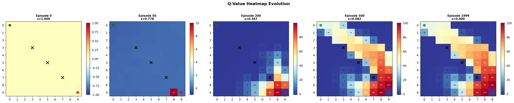
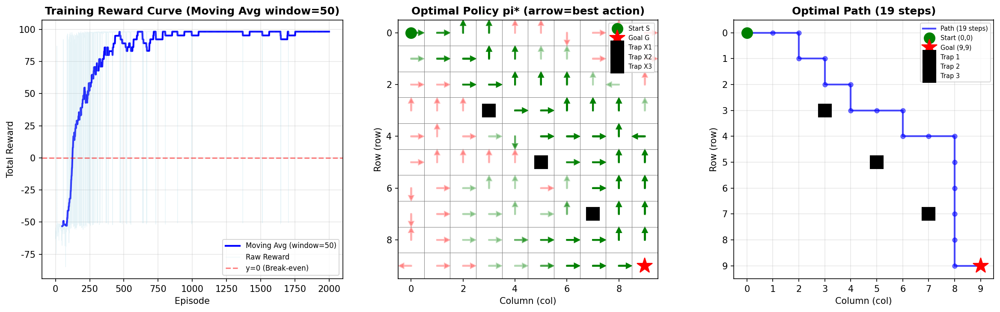
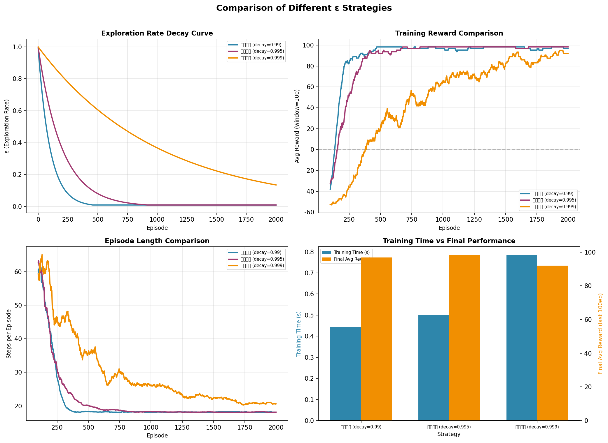
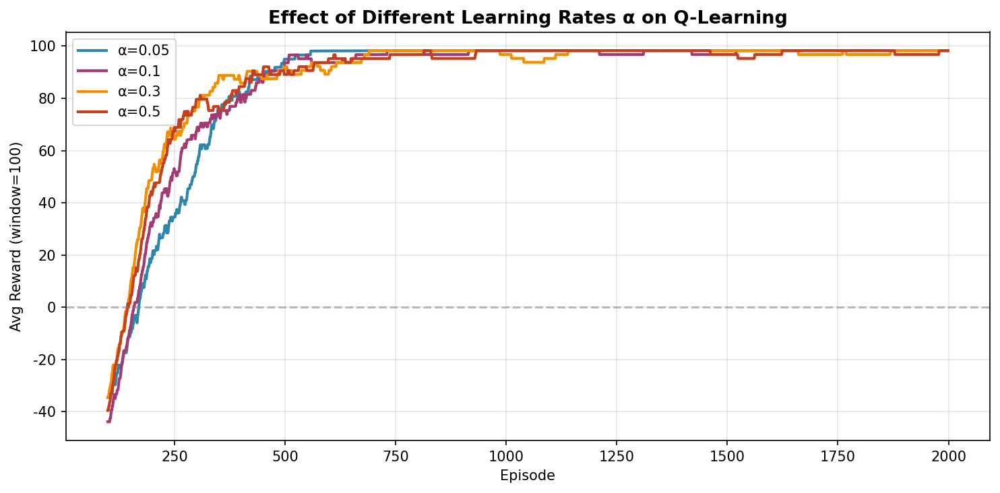

# s19 强化学习入门：MDP 与 Q-Learning -- 代码说明与运行报告

## 程序做了什么
从零实现 10x10 GridWorld 环境和 Q-Learning 表格方法 Agent，演示 TD 更新公式 Q(s,a) += alpha * (r + gamma * max Q(s',a') - Q(s,a)) 的迭代收敛过程，并进行 epsilon 衰减策略（快速/中等/慢速）和学习率（0.05-0.5）的消融对比实验。

## 运行方法
```bash
cd s19_rl_qlearning/code
python demo.py
```

## 运行结果

### 输出摘要
- 环境: 10x10 网格，起点 (0,0)，终点 (9,9)，3 个陷阱位于对角线 (3,3)/(5,5)/(7,7)，每步惩罚 -0.1
- Agent 配置: alpha=0.1, gamma=0.95, epsilon_init=1.0->min=0.01, decay=0.995
- 训练 2000 episode 后收敛，打印最优路径长度和最终 100 episode 平均奖励
- Epsilon 对比实验: 快速衰减(0.99) 早利用但可能次优，中等(0.995) 均衡，慢速(0.999) 探索充分但收敛慢
- 学习率对比实验: 太小(0.05) 学习慢，适中(0.1) 最佳，太大(0.5) 可能不稳定

### 生成图表

#### 图表 1: Q 值热力图演化

**说明了什么：** 6 个快照（Episode 0/50/200/500/1000/2000）展示了 Q 值从全零初始化到终点附近出现高值、再向起点反向传播的 TD 价值传播过程。红=高 Q，蓝=低 Q。

#### 图表 2: 训练结果总览

**说明了什么：** 三合一图：训练奖励曲线（奖励从负值逐步攀升至收敛）、最优策略箭头（每个格子显示 argmax Q 的方向）、最优路径轨迹（从起点到终点避开陷阱的最短路径）。

#### 图表 3: Epsilon 衰减策略对比

**说明了什么：** 快速衰减(0.99) 探索不足奖励收敛早但可能次优，中等衰减(0.995) 平衡探索利用，慢速衰减(0.999) 长时间探索奖励攀升慢。四子图对比了 epsilon 曲线、奖励、episode 长度、训练时间。

#### 图表 4: 学习率对比

**说明了什么：** alpha=0.05 学习过慢收敛延迟，alpha=0.1 效果好且稳定，alpha=0.5 初始波动大但最终也收敛。展示了 Q-Learning 对学习率在一定范围内的鲁棒性。

#### 图片资源: 概念图解
- `19-01-rl-loop.png` -- 强化学习 Agent-Environment 交互循环示意图
- `19-02-mdp-components.png` -- MDP 五元组 (S,A,P,R,gamma) 组件图解
- `19-03-qtable-learning.png` -- Q-Table 结构与 TD 更新公式示意图
- `19-04-exploration-vs-exploitation.png` -- 探索与利用的 trade-off 概念图解

## 代码结构
- `class GridWorld` -- 网格世界环境：状态转移、奖励计算、边界/陷阱/终点判断
- `class QLearningAgent` -- Q-Learning Agent：Q-Table、epsilon-贪婪、TD 更新、epsilon 衰减
- `train_agent()` -- 训练循环：记录奖励/路径/Q 表快照、滑动窗口检测收敛
- `extract_optimal_path()` -- 按 argmax Q 提取最优策略路径
- `plot_q_vs_episodes()` -- Q 值热力图演化快照
- `plot_epsilon_comparison()` -- 不同 epsilon 衰减策略的四子图综合对比
- `plot_learning_rate_comparison()` -- 不同学习率的收敛曲线对比
- `plot_training_overview()` -- 训练奖励+策略+路径的综合可视化
- `main()` -- 主流程（实验1: 基础训练、实验2: epsilon 对比、实验3: 学习率对比）

## 运行环境
- Python 依赖: numpy, matplotlib
- 硬件需求: CPU 即可
- 预计运行时间: ~1-2 分钟（2000 episode + 对比实验）
