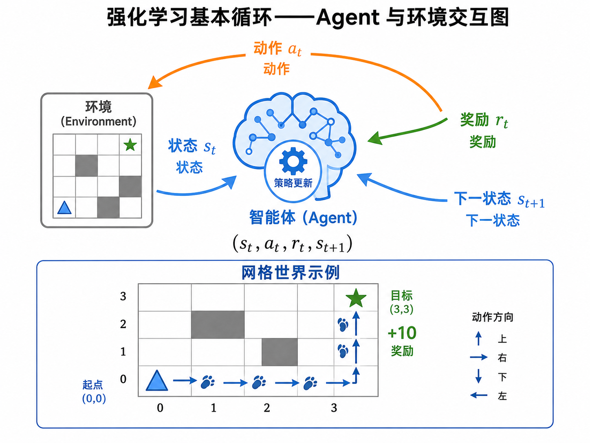
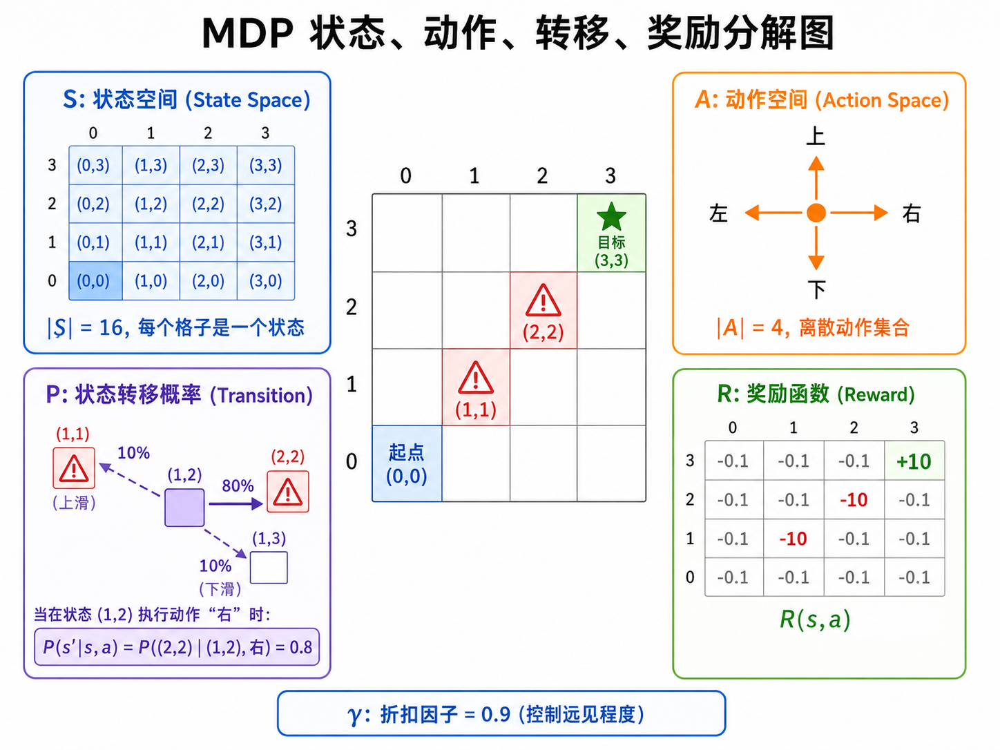
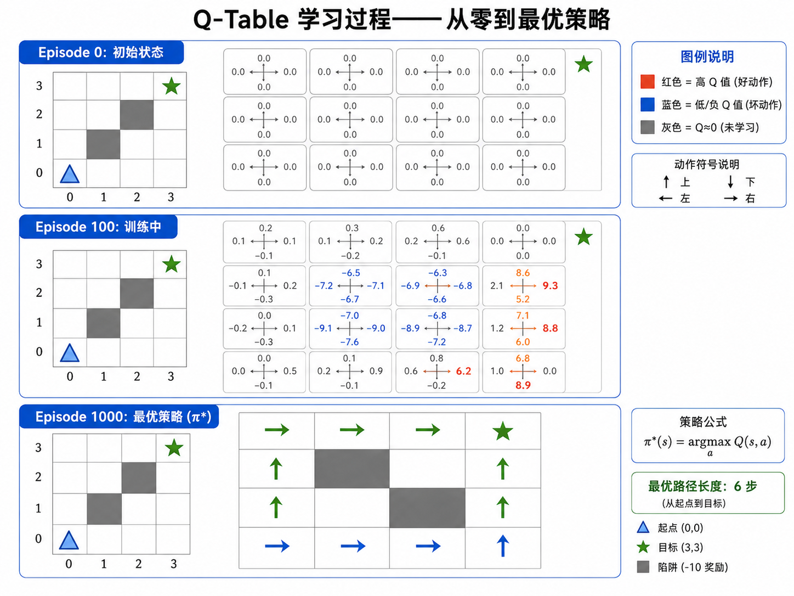
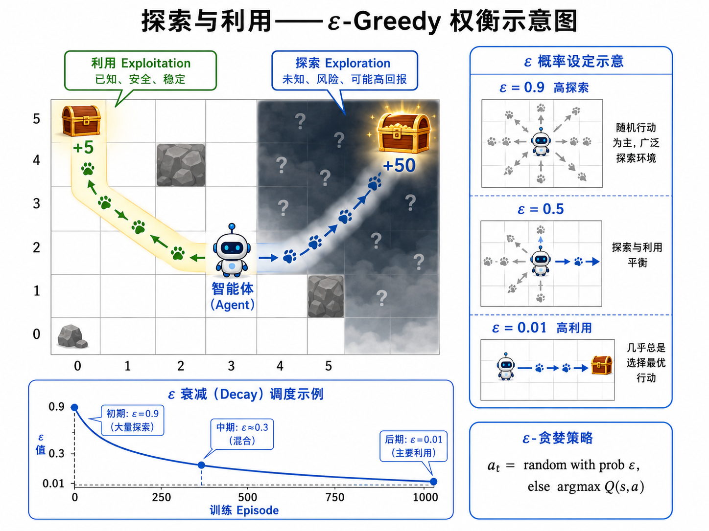

# s19 强化学习入门：MDP 与 Q-Learning

> 从零理解强化学习 —— Agent 如何通过"试错"学会最优策略

---

## 一、什么是强化学习？

强化学习（Reinforcement Learning, RL）是机器学习的第三大范式。与监督学习和无监督学习不同，强化学习研究的是**智能体（Agent）如何在与环境的交互中学习最优行为策略**。

用一个比喻来理解：教一个小孩骑自行车。你不会告诉他在每个瞬间应该以多少牛顿的力踩踏、车把应该偏转多少度。你只能说"骑得好"或者"摔倒了再来"。小孩通过反复尝试，自己摸索出保持平衡的策略。这就是强化学习的精神——**从交互中学习，从延迟的奖励中学习，从试错中学习**。

强化学习的三个关键特征：

1. **没有正确答案，只有奖励信号**：Agent 不知道每个状态下的"正确动作"是什么，只能根据环境返回的奖励值（标量）来判断行为的好坏。
2. **动作有长期后果**：一个动作的好坏可能不会立即显现。比如下棋时，弃子（立即损失）可能在十步之后带来胜利（巨大奖励）。
3. **探索与利用的权衡**：Agent 需要在"做已知好的事"（利用）和"尝试未知的事"（探索）之间找到平衡。

### 1.1 与监督学习的对比

| 维度 | 监督学习 | 强化学习 |
|------|---------|---------|
| **训练信号** | 标签（正确答案） | 奖励（标量，可能延迟） |
| **数据来源** | 事先准备好 | 交互中产生 |
| **目标** | 泛化到新样本 | 最大化累积奖励 |
| **反馈时机** | 即时 | 可能延迟 |
| **数据分布** | 静态 | 取决于 Agent 行为（非稳态） |
| **典型应用** | 图像分类、语音识别 | 游戏、机器人、对话系统 |

> 强化学习中，Agent 的行为会影响它看到的数据——这使数据分布不再是静止的，给优化带来了额外的挑战。



---

## 二、强化学习的基本框架

### 2.1 Agent-Environment 交互循环

强化学习问题被形式化为一个循环交互过程。在每个离散时间步 $t$：

1. Agent 观察到环境的当前状态 $s_t \in \mathcal{S}$
2. Agent 选择一个动作 $a_t \in \mathcal{A}$
3. 环境返回一个奖励信号 $r_t = R(s_t, a_t)$ 和下一个状态 $s_{t+1} \sim P(\cdot | s_t, a_t)$
4. Agent 根据 $(s_t, a_t, r_t, s_{t+1})$ 更新自己的策略
5. $t \leftarrow t+1$，回到步骤 1

整个过程产生一条轨迹（Trajectory）：

$$
\tau = (s_0, a_0, r_0, s_1, a_1, r_1, s_2, \ldots)
$$

Agent 的目标是最大化累计奖励（Return）：

$$
G_t = r_t + \gamma r_{t+1} + \gamma^2 r_{t+2} + \cdots = \sum_{k=0}^{\infty} \gamma^k r_{t+k}
$$

其中 $\gamma \in [0, 1]$ 是**折扣因子**（Discount Factor），控制 Agent 有多看重未来的奖励：
- $\gamma = 0$：Agent 只看眼前的奖励（myopic，鼠目寸光）
- $\gamma = 1$：Agent 同等看重所有未来奖励（farsighted，远见卓识）
- 通常设 $\gamma = 0.95 \sim 0.99$

### 2.2 马尔可夫决策过程（MDP）

强化学习的数学基础是**马尔可夫决策过程**（Markov Decision Process）。一个 MDP 由五元组定义：

$$
\mathcal{M} = (\mathcal{S}, \mathcal{A}, P, R, \gamma)
$$

- **$\mathcal{S}$：状态空间** — 所有可能状态的集合。可以是离散的（如棋盘格）或连续的（如机器人关节角度）
- **$\mathcal{A}$：动作空间** — 所有可能动作的集合。离散动作（上下左右）或连续动作（力矩值）
- **$P(s'|s, a)$：状态转移概率** — 在状态 $s$ 执行动作 $a$ 后，转移到状态 $s'$ 的概率。马尔可夫性质：下一步只取决于当前状态和动作，与历史无关
- **$R(s, a)$：奖励函数** — 在状态 $s$ 执行动作 $a$ 后获得的即时奖励
- **$\gamma$：折扣因子** — 对未来奖励的折扣系数

> **马尔可夫性质**： "The future is independent of the past given the present." 知道当前状态就足够了，不需要记住之前发生了什么。这个假设极大地简化了问题，虽然在实际中并不总是成立，但实践证明它足够好用。



---

## 三、策略与价值函数

### 3.1 策略（Policy）

策略 $\pi$ 定义了 Agent 的行为方式。它回答的问题是："在状态 $s$ 下，我应该采取什么动作？"

- **确定性策略**：$\pi(s) = a$ —— 给定状态，输出唯一动作
- **随机性策略**：$\pi(a|s) = \Pr(A_t = a | S_t = s)$ —— 给定状态，输出动作的概率分布

策略是强化学习的核心——我们最终想要的就是一个最优策略 $\pi^*$。

### 3.2 价值函数（Value Function）

价值函数衡量的是"某个状态（或状态-动作对）有多好"，其中"好"定义为未来累计奖励的期望。

**状态价值函数** $V^\pi(s)$：从状态 $s$ 出发，一直遵循策略 $\pi$，能获得的期望累计奖励：

$$
V^\pi(s) = \mathbb{E}_\pi \left[ \sum_{k=0}^{\infty} \gamma^k r_{t+k+1} \mid s_t = s \right]
$$

**动作价值函数** $Q^\pi(s, a)$：在状态 $s$ 执行动作 $a$，之后一直遵循策略 $\pi$，能获得的期望累计奖励：

$$
Q^\pi(s, a) = \mathbb{E}_\pi \left[ \sum_{k=0}^{\infty} \gamma^k r_{t+k+1} \mid s_t = s, a_t = a \right]
$$

$V$ 和 $Q$ 的关系：

$$
V^\pi(s) = \sum_{a \in \mathcal{A}} \pi(a|s) \cdot Q^\pi(s, a)
$$

直观理解：状态的价值 = 所有可能动作的价值按策略概率加权求和。

### 3.3 贝尔曼方程（Bellman Equation）

贝尔曼方程是强化学习中最重要的递归关系。它把当前状态（或状态-动作对）的价值，分解为即时奖励加上下一状态（打折后的）价值：

对于 $Q$ 函数，**贝尔曼最优方程**为：

$$
Q^*(s, a) = R(s, a) + \gamma \sum_{s' \in \mathcal{S}} P(s' | s, a) \cdot \max_{a' \in \mathcal{A}} Q^*(s', a')
$$

这个方程的直觉是：最优的 $Q$ 值 = 立即获得的奖励 + 打折后的最佳未来价值。如果我们知道所有状态-动作对的最优 $Q$ 值，那么最优策略就是：

$$
\pi^*(s) = \arg\max_{a \in \mathcal{A}} Q^*(s, a)
$$

---

## 四、Q-Learning：从表格开始

### 4.1 为什么是 Q-Learning？

Q-Learning 是 Watkins 在 1989 年提出的经典算法。它有三个核心特性：

1. **Model-Free（无模型）**：不需要知道环境的状态转移概率 $P(s'|s, a)$，只需要从交互中采样
2. **Off-Policy（异策略）**：学习最优策略 $Q^*$，但可以用任意行为策略（如 $\varepsilon$-greedy）来收集经验
3. **Temporal Difference（时序差分）**：结合了蒙特卡洛（采样完整轨迹）和动态规划（自举/bootstrapping）的优点

### 4.2 Q-Table

当状态空间和动作空间都是离散且较小时，我们可以用一个**查找表**来存储每个状态-动作对的 $Q$ 值：

```
Q[s][a] = 该状态-动作对的估计价值
```

例如，一个 $10 \times 10$ 的网格世界，有 4 个动作（上下左右），Q-Table 的大小就是 $100 \times 4 = 400$ 个条目。

### 4.3 Q-Learning 更新规则

核心更新公式（即**TD 更新**）：

$$
Q(s, a) \leftarrow Q(s, a) + \alpha \left[ r + \gamma \cdot \max_{a'} Q(s', a') - Q(s, a) \right]
$$

逐项解释：

- $\alpha$（学习率）：控制每次更新有多"相信"新信息（$\alpha=1$ 完全替换，$\alpha=0$ 不学习）
- $r + \gamma \max Q(s', a')$：**TD 目标**——我们"认为" $(s,a)$ 应该值多少
- $r + \gamma \max Q(s', a') - Q(s, a)$：**TD 误差**——当前估计离目标的差距
- 乘以 $\alpha$ 后加到原来值上：朝着目标走一小步

> 这里的 $\max_{a'} Q(s', a')$ 体现了 off-policy 特性——我们用最优策略来选择下一个动作，但实际执行的动作由行为策略决定。

### 4.4 Q-Learning 算法流程

```
初始化 Q(s, a) = 0，对所有 s ∈ S, a ∈ A
重复（每个 episode）：
    初始化状态 s
    重复（每步）：
        以 ε-贪婪策略选择 a（对当前 Q 值的估计）
        执行 a，观察到奖励 r 和下一状态 s'
        Q(s, a) ← Q(s, a) + α [r + γ·max_{a'} Q(s', a') - Q(s, a)]
        s ← s'
    直到 s 为终止状态
```



---

## 五、探索 vs 利用：ε-贪婪策略

强化学习面临一个根本困境：**探索（Exploration）** 与 **利用（Exploitation）** 的权衡。

- **利用**：选择当前 $Q$ 值最高的动作——最大化短期奖励
- **探索**：随机选择一个动作——收集更多信息，可能找到更好的长期策略

如果只利用不探索，Agent 可能永远发现不了更好的策略。如果只探索不利用，Agent 永远不会享受它学到的东西。

### ε-贪婪策略（ε-Greedy）

这是最简单也最常用的探索策略：

$$
a_t = \begin{cases}
\text{随机动作} & \text{以概率 } \varepsilon \\
\arg\max_a Q(s, a) & \text{以概率 } 1 - \varepsilon
\end{cases}
$$

实践中，通常让 $\varepsilon$ 随时间衰减（Decay）：

$$
\varepsilon = \max(\varepsilon_{\min}, \varepsilon_{\text{init}} \times \text{decay}^t)
$$

- 训练初期：$\varepsilon$ 很大（如 0.9），Agent 大量探索
- 训练后期：$\varepsilon$ 很小（如 0.01），Agent 主要利用学到的知识



---

## 六、网格世界实例：从数字建立直觉

让我们通过一个具体的 $4 \times 4$ 网格世界，手算 Q-Learning 的几步更新，建立对算法的直觉。

### 6.1 环境设置

```
网格世界 (4×4):
+-----+-----+-----+-----+
| S(0,0)|     |     |     |     ← 起点在 (0,0)
+-----+-----+-----+-----+
|     |  X  |     |     |     ← (1,1) 是陷阱 (-10 奖励)
+-----+-----+-----+-----+
|     |     |  X  |     |     ← (2,2) 是陷阱 (-10 奖励)
+-----+-----+-----+-----+
|     |     |     |  G  |     ← (3,3) 是目标 (+10 奖励)
+-----+-----+-----+-----+

每步奖励: -0.1 (鼓励走最短路径)
折扣因子 γ = 0.9
学习率 α = 0.1
```

### 6.2 执行一次更新

假设 Agent 当前在 $(2,2)$（陷阱上方，还没触发），选择动作"右"：

- 当前状态 $s = (2,2)$，动作 $a = ``\text{右}"$
- 执行后：Agent 移动到 $(2,3)$，奖励 $r = -0.1$（步数惩罚）
- 假设当前 $Q((2,2), ``\text{右}") = 0.5$，$Q((2,3), \cdot) = [0.3, 0.8, 0.1, 0.6]$（上下左右）

计算更新：

$$
\begin{aligned}
\text{TD 目标} &= r + \gamma \cdot \max_{a'} Q(s', a') \\
               &= -0.1 + 0.9 \times 0.8 \\
               &= -0.1 + 0.72 = 0.62
\end{aligned}
$$

$$
\begin{aligned}
\text{TD 误差} &= 0.62 - 0.5 = 0.12
\end{aligned}
$$

$$
\begin{aligned}
Q_{\text{new}}((2,2), ``\text{右}") &= 0.5 + 0.1 \times 0.12 \\
                                       &= 0.512
\end{aligned}
$$

Agent 学到了一点点——向右走比之前认为的好了一点点（因为 $(2,3)$ 有一个还算不错的 Q 值）。

### 6.3 多步传播

Agent 在第 100 个 Episode 中到达了目标 $(3,3)$，奖励 $r = +10$：

- $s = (3,2)$，$a = ``\text{右}"$，$s' = (3,3)$，$r = 10$
- 假设 $Q((3,2), ``\text{右}") = 1.5$
- $\max_{a'} Q((3,3), a') = 0$（终止状态，没有下一步动作）

$$
Q_{\text{new}}((3,2), ``\text{右}") = 1.5 + 0.1 \times [10 + 0.9 \times 0 - 1.5] = 2.35
$$

$Q((3,2), ``\text{右}")$ 从 1.5 涨到了 2.35——大幅提升，因为这个动作能直接到达目标。

在第 200 个 Episode 中，这个价值会通过贝尔曼备份传播回更早的状态：$(3,1)$ 知道向右到 $(3,2)$ 能得到好价值，$(3,0)$ 知道向右到 $(3,1)$ 能得好价值……以此类推，最终从起点 $(0,0)$ 开始，每个状态的最优动作方向都指向目标。

> 这就是 Q-Learning 之美：奖励信号像涟漪一样，从目标逐步扩散回整个状态空间。

---

## 七、Q-Learning 的局限性

虽然 Q-Learning 优雅且有效，但它有几个根本限制：

1. **状态空间爆炸**：当状态连续（如机器人位置）或高维（如图像像素）时，Q-Table 不可行
2. **离散动作**：Q-Learning 天然处理离散动作，连续动作需要额外技巧
3. **泛化困难**：表格方法无法在状态之间泛化——即使两个状态很相似，也必须分别学习它们的 Q 值
4. **收敛速度**：在大状态空间中，需要海量交互才能填满 Q-Table

> 这些限制直接引出了下一节的主题——**深度强化学习**：用神经网络代替 Q-Table，实现从状态到 Q 值的泛化映射。

---

## 八、本节小结

| 概念 | 一句话 |
|------|--------|
| 强化学习 | Agent 通过与环境交互、接收延迟奖励来学习最优策略 |
| MDP | 用 (S, A, P, R, γ) 五元组建模决策问题 |
| 策略 $\pi$ | 定义在每个状态下选择什么动作 |
| 价值函数 $V^\pi(s)$ | 从状态 $s$ 出发，遵循 $\pi$ 的期望累计奖励 |
| Q 函数 $Q^\pi(s,a)$ | 在状态 $s$ 执行 $a$，之后遵循 $\pi$ 的期望累计奖励 |
| 贝尔曼方程 | 将价值递归地表达为即时奖励 + 未来折扣价值 |
| Q-Learning | 无模型、异策略的 TD 学习算法，用表格存储 Q 值 |
| TD 更新 | Q(s,a) += α[r + γ·max Q(s',a') - Q(s,a)] |
| ε-贪婪 | 以 ε 概率探索，以 1-ε 概率利用 |
| 探索 vs 利用 | RL 的核心困境：收集新信息 vs 利用已知信息 |

> 下一节 [s20 深度强化学习：DQN 与 Policy Gradient](../s20_deep_rl/) 将展示如何用神经网络突破 Q-Table 的维度限制，处理连续状态空间和大规模问题。
