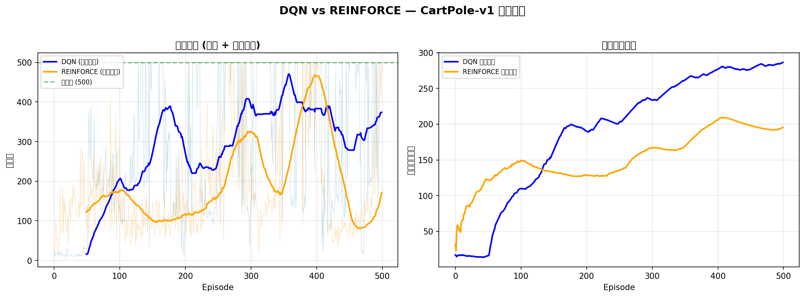
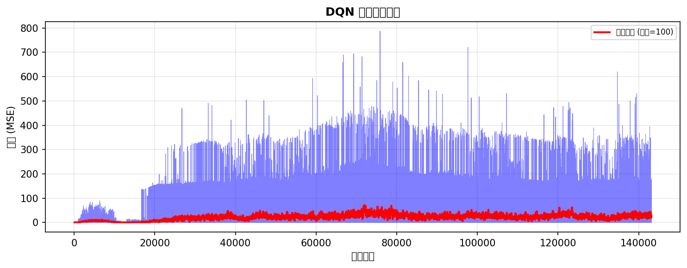
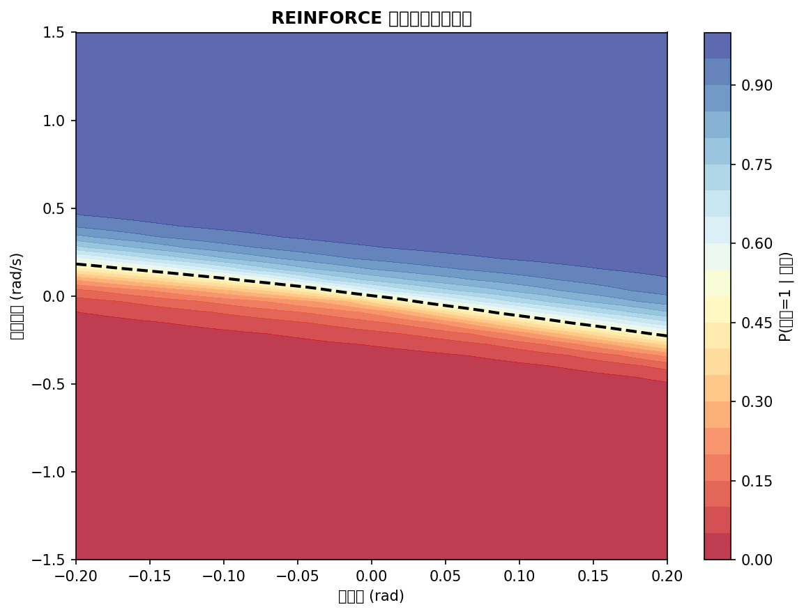

# s20 深度强化学习：DQN 与策略梯度 -- 代码说明与运行报告

## 程序做了什么
在 OpenAI Gymnasium 的 CartPole-v1 环境上从零实现并对比两种经典深度 RL 算法：DQN（Deep Q-Network，含经验回放缓冲区 + 目标网络固定 + epsilon 衰减）和 REINFORCE（Monte Carlo 策略梯度，含回报标准化降方差）。训练 500 episode 后可视化奖励曲线、DQN 损失曲线和 REINFORCE 策略决策边界。

## 运行方法
```bash
cd s20_deep_rl/code
python demo.py
```

## 运行结果

### 输出摘要
- 环境: CartPole-v1，状态 4 维（位置/速度/角度/角速度），动作 2 个（左推/右推），最高分 500
- DQN 超参数: lr=0.001, gamma=0.99, epsilon 1.0->0.01, buffer=10000, batch=64, target_update=100
- REINFORCE 超参数: lr=0.001, gamma=0.99
- 训练 500 episode 后输出两种算法最后 100 episode 平均奖励和达到 475+ 的次数
- 对比总结: DQN 样本效率高（经验回放）、仅离散动作；REINFORCE 方差高但可处理连续动作

### 生成图表

#### 图表 1: DQN vs REINFORCE 训练对比

**说明了什么：** 双图对比：左图展示两种算法的原始奖励（浅色）与滑动平均（深色），REINFORCE 方差明显大于 DQN；右图展示累计平均奖励，DQN 上升更稳定。绿色虚线标记 500 分满分线。

#### 图表 2: DQN 损失曲线

**说明了什么：** DQN 训练中的 TD 误差（MSE Loss），初期损失高对应探索阶段的随机动作，随训练进行损失整体下降。红色的滑动平均线展示了损失的整体下降趋势。

#### 图表 3: REINFORCE 策略热力图

**说明了什么：** 在 CartPole 的（角度, 角速度）平面上可视化学到的策略 P(动作=1|状态)。黑色虚线是 0.5 等概率决策边界，展示了策略网络在状态空间中如何切换推左/推右。

#### 图片资源: 概念图解
- `20-01-dqn-architecture.png` -- DQN 网络架构与双网络（在线+目标）示意图
- `20-02-experience-replay.png` -- 经验回放缓冲区打破时序相关性的原理图
- `20-03-policy-gradient.png` -- 策略梯度方法的数学原理与 REINFORCE 算法流程图
- `20-04-actor-critic.png` -- Actor-Critic 架构（结合 DQN 价值估计与策略梯度）示意图

## 代码结构
- `class ReplayBuffer` -- 经验回放缓冲区：FIFO 双端队列，随机采样 mini-batch
- `class QNetwork` -- Q 值网络：FC(4->128->128->2)，输出每个动作的 Q(s,a)
- `class DQNAgent` -- DQN Agent：epsilon-贪婪、经验存储与训练、目标网络定期同步
- `class PolicyNetwork` -- 策略网络：FC(4->128->128->2) + Softmax，输出动作概率分布
- `class REINFORCEAgent` -- REINFORCE Agent：随机采样动作、存储 log_prob、episode 结束后 Monte Carlo 更新
- `train_dqn()` / `train_reinforce()` -- 训练循环（支持新旧 gymnasium API）
- `plot_training_comparison()` -- DQN vs REINFORCE 奖励对比曲线
- `plot_dqn_loss()` -- DQN 损失曲线
- `plot_reinforce_policy()` -- REINFORCE 策略在状态空间中的动作概率热力图
- `main()` -- 主流程（实验1: DQN、实验2: REINFORCE、实验3: 对比可视化）

## 运行环境
- Python 依赖: numpy, torch, matplotlib, gymnasium (或 gym)
- 硬件需求: CPU 即可（GPU 可选加速）
- 预计运行时间: ~3-5 分钟（两个算法各 500 episode）
