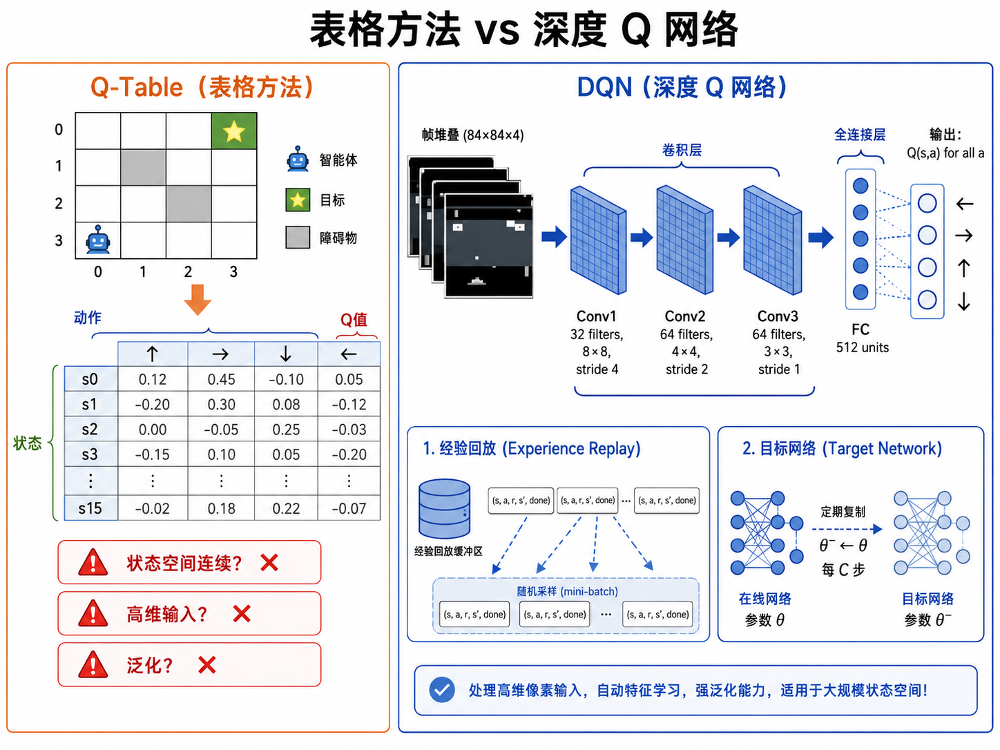
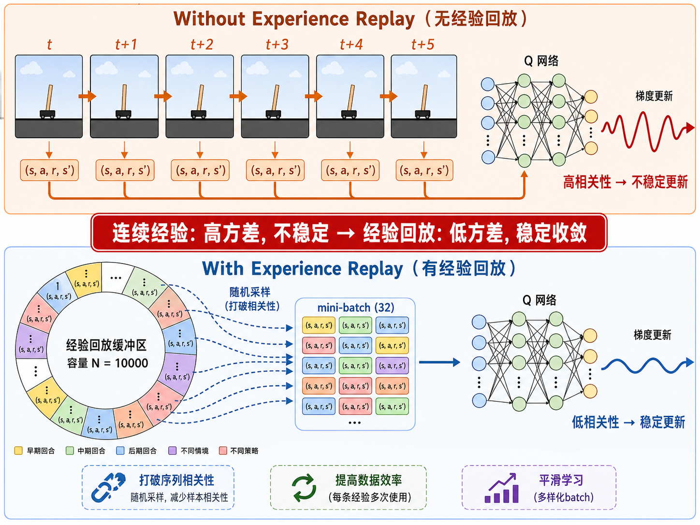
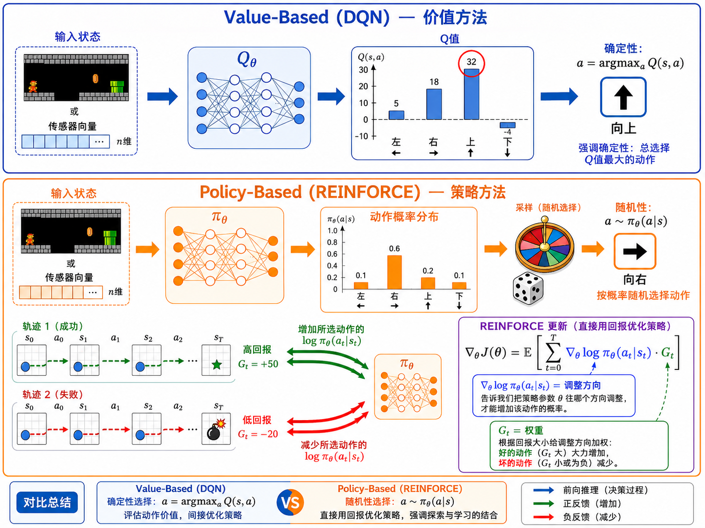
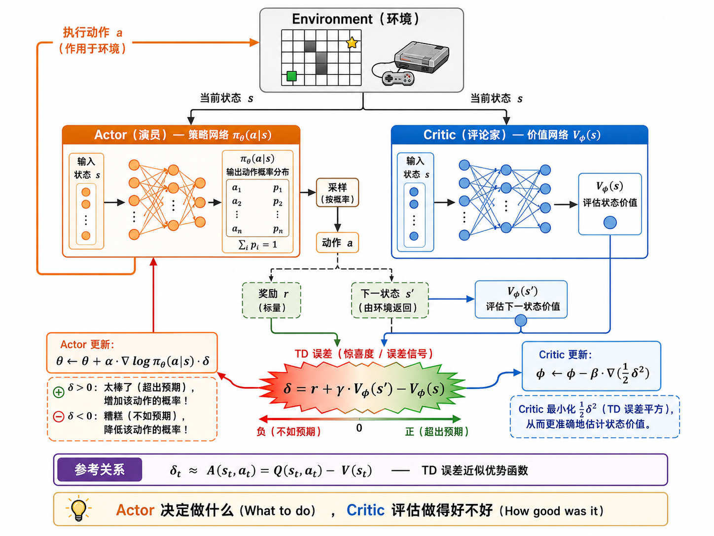

# s20 深度强化学习：DQN 与 Policy Gradient

> 从表格到神经网络 —— 当强化学习遇见深度学习

---

## 一、Q-Table 的末日：从离散到连续

上一节我们学习了 Q-Learning，它在 GridWorld（$10 \times 10 = 100$ 个状态）上表现很好。但现实世界中的任务远没有那么简单：

- **自动驾驶**：传感器数据（摄像头 + 雷达 + GPS）= 连续高维向量 → 状态空间是 $\mathbb{R}^n$，不可能建表
- **Atari 游戏**：$210 \times 160 \times 3$ 像素 = 100800 维，如果用表格存储，宇宙中的所有原子都不够
- **机器人控制**：关节角度、速度、力矩都是连续值 → 状态和动作都是连续空间

面对连续/高维状态空间，**表格方法的三个核心假设全部崩溃**：

1. **状态枚举**：无法列出所有可能状态（连续空间有无穷多个）
2. **独立学习**：无法在相似状态之间共享经验（看到一张略微偏移的图片，Q-Table 完全不知如何应对）
3. **内存需求**：状态数 × 动作数的表格在百万量级就不可行

**解决方案**：用一个可微的函数逼近器（神经网络）来近似 $Q(s, a)$，而非存储离散的查找表。这就是 **Deep Q-Network（DQN）** 的核心思想。

> 函数逼近 = 泛化。神经网络学会了"语义相似的状态应该有相似的 Q 值"，从而大幅减少所需经验。



---

## 二、Deep Q-Network (DQN)

### 2.1 从 Q-Table 到 Q-Network

Q-Learning 使用 $Q(s, a)$ 表格，DQN 使用参数化函数 $Q_{\theta}(s, a)$：

| 方式 | 表示 | 查询 |
|------|------|------|
| Q-Table | `Q[state_idx][action_idx]` | 直接查表，$O(1)$ |
| DQN | $Q_{\theta}(s, a)$ 神经网络 | 前向传播一次，$O(|\theta|)$ |

DQN 的输入是状态 $s$（可以是原始像素、传感器向量等），输出是所有可能动作的 Q 值：

$$
Q_{\theta}(s) = [Q_{\theta}(s, a_1), Q_{\theta}(s, a_2), \ldots, Q_{\theta}(s, a_n)]
$$

这样，一次前向传播就能得到所有动作的 Q 值，效率极高。

### 2.2 DQN 两大创新

直接将 Q-Learning 的更新规则套用到神经网络上会导致严重的训练不稳定。DeepMind 在 2013 年的奠基性工作中引入了两个关键创新：

#### 创新 1：经验回放（Experience Replay）

神经网络训练通常假设样本是独立同分布（i.i.d.）的。但强化学习的经验是顺序产生的——连续的 $(s_t, a_t, r_t, s_{t+1})$ 之间高度相关。如果你用连续的样本来训练神经网络，更新方向会过度受到最近经验的影响。

经验回放的解决方案：维护一个**重放缓冲区** $\mathcal{D} = \{(s, a, r, s')\}$，存储最近的 $N$ 条经验（例如 $N = 10000$）。每次更新时，从缓冲区中**随机采样**一个小批量（mini-batch）。这样做的三个好处：

1. **打破相关性**：随机采样让每个 batch 中的经验来自不同时间和策略，近似 i.i.d.
2. **提高数据效率**：每条经验可以被反复使用多次，而不是用过即弃
3. **平滑学习**：从多样化的经验中学习，减少策略振荡



#### 创新 2：目标网络（Target Network）

Q-Learning 的 TD 目标中包含 $\max_{a'} Q(s', a')$。如果同一个网络既产生预测值 $Q(s, a)$ 又产生目标值 $Q(s', a')$，那么更新 $Q_{\theta}$ 会同时改变目标和预测——就像追逐自己尾巴的狗，导致训练发散。

DQN 的解决方案：维护两个网络：
- **在线网络**（Online Network）$Q_{\theta}$：用于选择动作和计算当前 Q 值，**每一步都更新**
- **目标网络**（Target Network）$Q_{\theta^{-}}$：用于计算 TD 目标中的 $\max_{a'} Q(s', a')$，**每隔 $C$ 步才从在线网络复制一次权重**（$\theta^{-} \leftarrow \theta$）

### 2.3 DQN 损失函数

DQN 的损失函数就是一个回归问题——让 $Q_{\theta}(s, a)$ 逼近 TD 目标：

$$
\mathcal{L}(\theta) = \mathbb{E}_{(s,a,r,s') \sim \mathcal{D}} \left[ \left( r + \gamma \cdot \max_{a'} Q_{\theta^{-}}(s', a') - Q_{\theta}(s, a) \right)^2 \right]
$$

其中：
- $Q_{\theta}(s, a)$：在线网络的输出（当前预测）
- $Q_{\theta^{-}}(s', a')$：目标网络的输出（稳定目标）
- 注意：**梯度只通过在线网络反向传播**，目标网络被视为常数

### 2.4 DQN 算法流程

```
初始化在线网络 Q_θ，目标网络 Q_θ⁻ = Q_θ
初始化经验回放缓冲区 D（容量 N）

重复（每个 episode）：
    初始化状态 s
    重复（每步）：
        以 ε-贪婪策略选择动作 a（基于 Q_θ）
        执行 a，观察 r 和 s'
        将 (s, a, r, s') 存入 D
        从 D 中随机采样 mini-batch B
        计算 TD 目标: y = r + γ·max_{a'} Q_θ⁻(s', a')  （如果 s' 是终止态，y = r）
        计算损失: L = (1/|B|)·Σ (y - Q_θ(s,a))²
        执行梯度下降更新 θ
        每隔 C 步: θ⁻ ← θ
        s ← s'
```

---

## 三、Policy Gradient：直接学习策略

### 3.1 价值方法的局限性

DQN 属于**基于价值**的方法——它学习 Q 函数，再由 Q 函数推导出策略（$\pi(s) = \arg\max_a Q(s, a)$）。这在离散动作空间中工作得很好，但有几个根本限制：

1. **确定性策略**：$\arg\max$ 产生的策略是确定的——在同一个状态下永远选择同一个动作，这在某些场景（如博弈）中是可被对手利用的
2. **连续动作困难**：当动作空间是连续的（如机器人关节力矩），需要在整个动作空间中取 $\arg\max$，这是个优化问题本身
3. **策略改进的平滑性**：Q 值的微小变化可能导致策略的剧烈变化（$\arg\max$ 不连续）

**基于策略**的方法绕过了 Q 值这个中间层，直接参数化并优化策略 $\pi_{\theta}(a|s)$。

### 3.2 REINFORCE 算法

REINFORCE 是最经典的策略梯度算法。核心思路：

定义目标函数 $J(\theta)$ 为期望累计奖励：

$$
J(\theta) = \mathbb{E}_{\tau \sim \pi_{\theta}} \left[ \sum_{t} r_t \right]
$$

策略梯度定理告诉我们：

$$
\nabla_{\theta} J(\theta) = \mathbb{E}_{\tau \sim \pi_{\theta}} \left[ \sum_{t=0}^{T} \nabla_{\theta} \log \pi_{\theta}(a_t | s_t) \cdot G_t \right]
$$

其中 $G_t = \sum_{k=t}^{T} \gamma^{k-t} r_k$ 是从时间步 $t$ 开始的累计回报（Return）。

**直觉解释**：
- $\nabla_{\theta} \log \pi_{\theta}(a_t | s_t)$：告诉我们应该如何调整参数来**增加**选择动作 $a_t$ 的概率
- $G_t$：加权因子——如果 $G_t$ 很大（好的动作序列），大力增加概率；如果 $G_t$ 很小（坏的动作序列），小幅增加甚至减少概率

REINFORCE 的算法流程：
```
初始化策略网络 π_θ
重复（每个 episode）：
    用 π_θ 采样一条完整轨迹 τ = (s_0, a_0, r_0, ..., s_T)
    计算每一步的回报 G_t
    更新: θ ← θ + α Σ_t ∇_θ log π_θ(a_t|s_t) · G_t
```

REINFORCE 的缺点是高方差——不同轨迹的累计回报可能相差巨大。这引出了 Actor-Critic 方法。



---

## 四、Actor-Critic 方法

### 4.1 为什么需要 Critic？

REINFORCE 用完整的累计回报 $G_t$ 作为每个动作的"好坏"信号。但这引入了高方差——有些轨迹碰巧好（幸运的探索），有些碰巧差，但 REINFORCE 会同等对待。

**解决方案**：不要用原始的 $G_t$，而用一个学习到的价值函数来做更准确的评估——这就是 **Critic**。

Actor-Critic 架构包含两个网络：

- **Actor $\pi_{\theta}(a|s)$**：策略网络，决定做什么（演员）
- **Critic $V_{\phi}(s)$**：价值网络，评估刚才做得怎么样（评论家）

### 4.2 优势函数

我们不直接使用 $G_t$，而是使用**优势函数（Advantage Function）**：

$$
A(s, a) = Q(s, a) - V(s)
$$

优势函数衡量的是："执行动作 $a$ 比在状态 $s$ 下的平均水平好多少"。使用优势函数可以大幅降低梯度的方差。

在实践中，优势函数的估计使用 **TD 误差** $\delta_t$：

$$
\delta_t = r_t + \gamma V(s_{t+1}) - V(s_t)
$$

Actor 用 $\delta_t$ 来更新策略，Critic 用 $\delta_t^2$ 来更新价值函数。

### 4.3 A2C / A3C

- **A2C（Advantage Actor-Critic）**：同步版本，多个 worker 并行采样，收集完所有梯度后一次性更新
- **A3C（Asynchronous Advantage Actor-Critic）**：异步版本，每个 worker 独立采样、计算梯度并更新全局网络，无需等待其他 worker

Actor-Critic 方法结合了两种方法的优点：
- 从策略梯度继承：可以直接输出随机策略、处理连续动作
- 从价值方法继承：利用 bootstrapping 降低方差、提高样本效率



---

## 五、三种方法的对比

| 维度 | Value-Based (DQN) | Policy-Based (REINFORCE) | Actor-Critic (A2C) |
|------|-------------------|-------------------------|-------------------|
| **学习对象** | Q 函数 $Q_{\theta}(s,a)$ | 策略 $\pi_{\theta}(a|s)$ | 策略 $\pi_{\theta}$ + 价值 $V_{\phi}$ |
| **策略类型** | 确定性（$\arg\max Q$） | 随机性（概率分布） | 随机性（概率分布） |
| **动作空间** | 离散 | 离散 + 连续 | 离散 + 连续 |
| **样本效率** | 高（经验回放） | 低（on-policy） | 中等 |
| **方差** | 低（bootstrapping） | 高（Monte Carlo） | 低（advantage） |
| **偏差** | 有偏（bootstrapping） | 无偏（Monte Carlo） | 有偏（bootstrapping） |
| **稳定性** | 需目标网络 | 需 baseline | 需同时训练两个网络 |
| **典型应用** | Atari 游戏 | 简单控制任务 | 复杂连续控制 |

> 没有一种方法在所有场景下都最优。选择取决于动作空间的类型、样本获取成本、以及是否需要随机策略。

---

## 六、从 Atari 到 AlphaGo：深度 RL 的里程碑

理解深度强化学习的完整版图，有必要快速回顾它的关键里程碑：

- **2013**: DQN (DeepMind) — 首次用 CNN + Q-Learning 在 Atari 2600 游戏上达到人类水平，发表于 NIPS 2013
- **2015**: DQN Nature 版 — 加入目标网络和经验回放，发表于 Nature，标志着"从像素到动作"的端到端学习成为现实
- **2016**: AlphaGo (DeepMind) — 结合深度策略网络（SL + RL）和蒙特卡洛树搜索，击败李世石。RL 部分是 Policy Gradient + 自我对弈
- **2017**: PPO (OpenAI) — Proximal Policy Optimization，用裁剪目标函数实现稳定更新，成为最广泛使用的 RL 算法之一
- **2019**: OpenAI Five / AlphaStar — 在 Dota 2 和星际争霸 2 上达到职业水平，展示 RL 在复杂多智能体场景中的潜力
- **2022**: RLHF — 强化学习被用于对齐大语言模型（通过人类反馈），成为 ChatGPT 成功的核心要素

> AlphaGo 的 RL 部分本质上就是 Policy Gradient：用自我对弈（self-play）产生数据，用 REINFORCE 风格的梯度优化策略网络。而 RLHF 则是 PPO 在大语言模型上的直接应用。

---

## 七、本节小结

| 概念 | 一句话 |
|------|--------|
| DQN | 用神经网络 $Q_{\theta}(s)$ 近似 Q 值，处理高维连续状态 |
| 经验回放 | 从缓冲区随机采样历史经验，打破序列相关性 |
| 目标网络 | 冻结目标 Q 值的计算网络，防止训练振荡 |
| 策略梯度 | 直接优化策略 $\pi_{\theta}$，通过 $\nabla \log \pi$ 加权回报更新 |
| REINFORCE | 最基础的策略梯度算法，用完整轨迹的累计回报 $G_t$ |
| Actor-Critic | Actor（策略）+ Critic（价值），用优势函数降方差 |
| 优势函数 | $A(s,a) = Q(s,a) - V(s)$，衡量"比平均好多少" |
| A2C | 同步多 worker 的 Actor-Critic，用 $n$ 步回报 + 优势函数 |

> 下一节 [s21 RLHF：当强化学习遇见大模型](../s21_rlhf/) 将展示 PPO 和 DPO 如何被用于对齐大语言模型，这是深度强化学习在当今最重要的应用。

## 📥 Code

| File | View | Download |
|------|------|----------|
| demo.py | [Open](./code-demo) | <a href="../code/s20_deep_rl/demo.py" target="_blank" download>Download</a> |
| exercise.py | [Open](./code-exercise) | <a href="../code/s20_deep_rl/exercise.py" target="_blank" download>Download</a> |

## 参考

1. Mnih, V., et al. (2015). Human-level control through deep reinforcement learning. *Nature*. (DQN) [[doi:10.1038/nature14236](https://doi.org/10.1038/nature14236)]
2. Williams, R. J. (1992). Simple Statistical Gradient-Following Algorithms for Connectionist Reinforcement Learning. *Machine Learning*. (REINFORCE) [[doi:10.1007/BF00992696](https://doi.org/10.1007/BF00992696)]
3. Mnih, V., et al. (2016). Asynchronous Methods for Deep Reinforcement Learning. *ICML 2016*. (A3C) [[arXiv:1602.01783](https://arxiv.org/abs/1602.01783)]
4. Schulman, J., et al. (2017). Proximal Policy Optimization Algorithms. (PPO) [[arXiv:1707.06347](https://arxiv.org/abs/1707.06347)]
5. Silver, D., et al. (2016). Mastering the game of Go with deep neural networks and tree search. *Nature*. (AlphaGo) [[doi:10.1038/nature16961](https://doi.org/10.1038/nature16961)]

