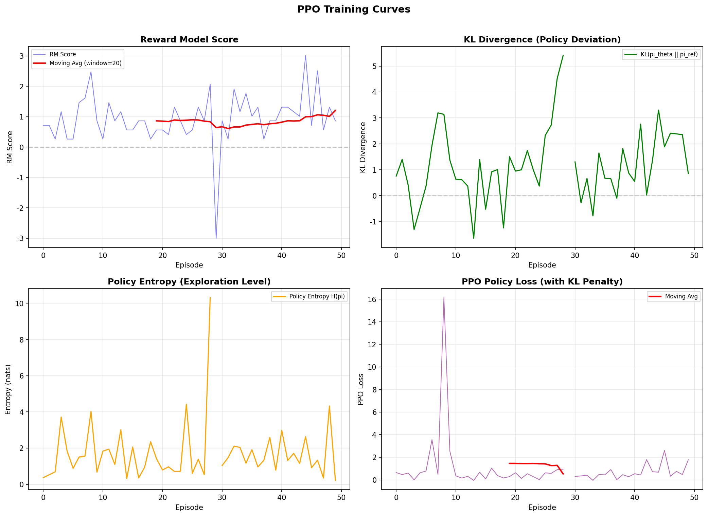
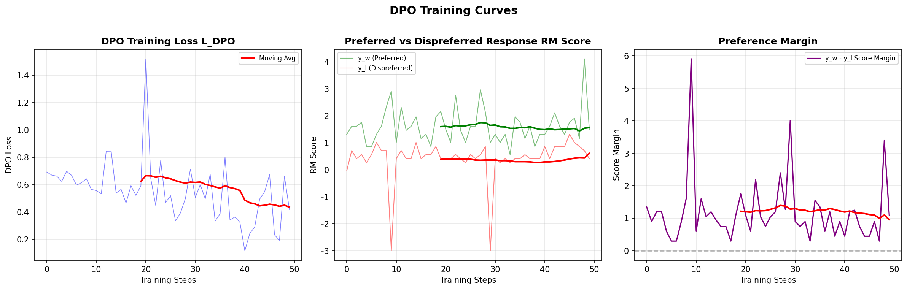
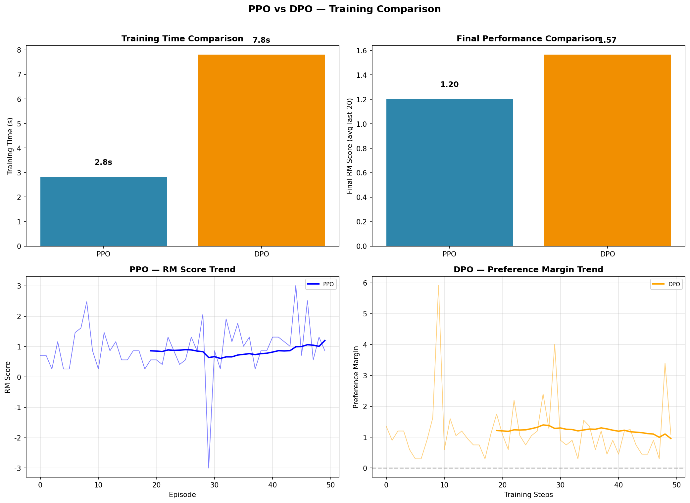
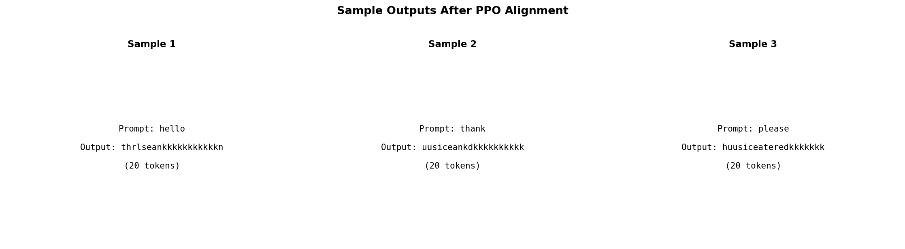

# s21 RLHF：当强化学习遇见大模型 -- 代码说明与运行报告

## 程序做了什么
在学术教学用的简化玩具环境中实现 RLHF 核心流程：创建小型 LSTM 语言模型（词汇表 30，a-z + 特殊 token），构建基于规则的奖励模型，从零实现 PPO（含裁剪目标 L_CLIP、GAE 优势估计、KL 惩罚 R_total = R_RM - beta*KL）和 DPO（最小化偏好损失），并对比两种方法的训练稳定性与生成样本质量。

## 运行方法
```bash
cd s21_rlhf/code
python demo.py
```

## 运行结果

### 输出摘要
- 玩具语言模型: LSTM (embed_dim=64, hidden=128, vocab=30)，max_seq_len=20
- SFT 预训练：用合成数据训练基础语言模型
- 奖励模型：基于规则的打分（正面词汇如 "good"/"nice" 得正分，负面词汇如 "bad"/"ugly" 得负分）
- PPO 训练：每个 epoch 打印 reward/KL 散度/策略熵/策略损失，展示 KL 惩罚如何防止策略偏离参考模型太远
- DPO 训练：每个 epoch 打印 DPO loss，展示直接从偏好对数据学习的效率
- 对比总结：PPO vs DPO 的训练稳定性、最终生成样本质量对比

### 生成图表

#### 图表 1: PPO 训练曲线

**说明了什么：** 四合一图展示 PPO 训练动态：平均奖励（希望上升）、KL 散度（被 beta 惩罚约束，反映策略偏离参考模型的程度）、策略熵（探索度，训练中可能下降）、策略损失（PPO 裁剪目标值）。KL 散度的控制是 RLHF 稳定训练的关键。

#### 图表 2: DPO 训练曲线

**说明了什么：** DPO 训练过程中的损失下降曲线，展示了无需显式奖励模型、直接从偏好对数据学习的方式。DPO loss 越小意味着策略模型越能区分好回答和差回答。

#### 图表 3: PPO vs DPO 对比

**说明了什么：** 两种方法的奖励信号对比，展示 PPO（需要在线采样+奖励模型）和 DPO（离线偏好对训练）在训练稳定性、收敛速度和最终性能上的差异。DPO 通常更稳定但可能对偏好数据质量更敏感。

#### 图表 4: 训练前后生成样本对比

**说明了什么：** SFT 基模型 vs 训练后模型的生成文本对比，直观展示 RLHF/DPO 训练如何改善输出质量（减少负面词汇、增加正面表达、更符合人类偏好）。

#### 图片资源: 概念图解
- `21-01-rlhf-pipeline.png` -- RLHF 完整三阶段流水线（SFT -> 奖励模型 -> PPO 微调）架构图
- `21-02-ppo-clipped-objective.png` -- PPO 裁剪目标函数 L_CLIP 的数学原理与梯度裁剪区域图
- `21-03-dpo-vs-rlhf.png` -- DPO（直接偏好优化）vs RLHF（强化学习人类反馈）范式对比
- `21-04-reward-hacking.png` -- 奖励破解（Reward Hacking）问题与预防机制示意图

## 代码结构
- `char_to_token()` / `token_to_char()` / `decode_tokens()` -- 字符-token 编解码工具
- `class ToyLSTM` -- 小型 LSTM 语言模型：embed -> LSTM -> output_proj
- `class RewardModel` -- 基于规则的奖励模型：正面/负面词汇打分
- `class PPOTrainer` -- 从零实现 PPO：裁剪目标 L_CLIP、GAE 优势估计 A_t、KL 惩罚
- `class DPOTrainer` -- 最小化 DPO：L = -log sigma(beta * (log pi_w/ref_w - log pi_l/ref_l))
- `train_ppo()` / `train_dpo()` -- SFT 预训练 + PPO/DPO 训练循环
- `plot_ppo_curves()` / `plot_dpo_curves()` -- 训练曲线可视化
- `plot_ppo_vs_dpo_comparison()` -- 两种方法对比图
- `plot_sample_outputs()` -- 生成文本质量对比
- `main()` -- 主流程

## 运行环境
- Python 依赖: numpy, torch, matplotlib
- 硬件需求: CPU 即可（GPU 可选加速）
- 预计运行时间: ~3-5 分钟（SFT + PPO + DPO 训练）
- 注：完整 RLHF 训练需要数百 GPU 天，本 demo 为学术教学简化版
