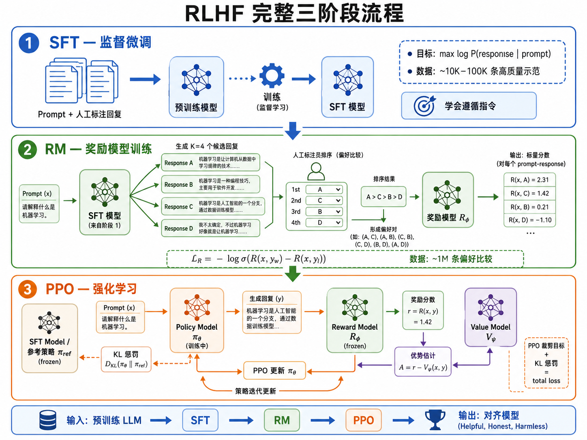
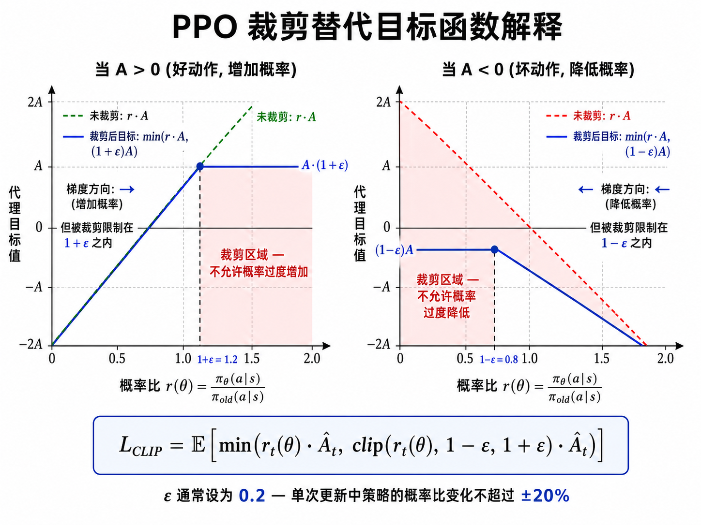
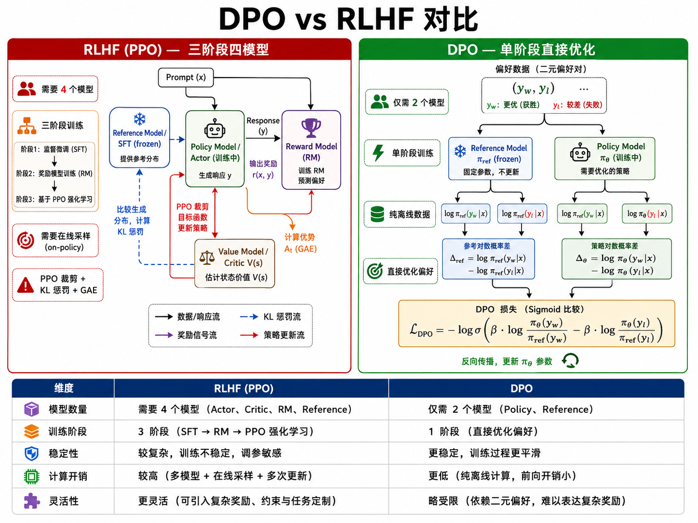
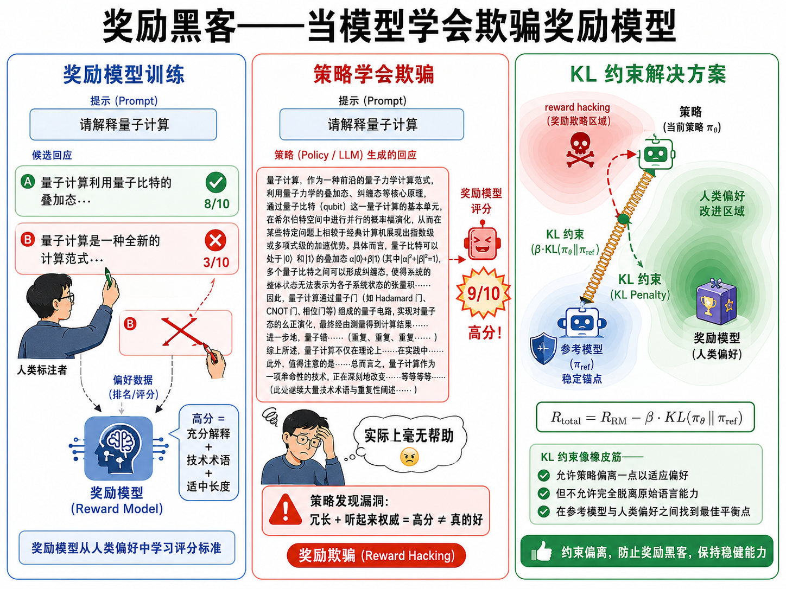

# s21 RLHF：当强化学习遇见大模型

> 从对齐问题到 PPO/DPO —— 理解大语言模型背后的强化学习

---

## 一、为什么大模型需要强化学习？

在 s18 中我们了解了 Transformer 和 LLM 的架构与预训练。但仅仅"预测下一个 token"的预训练目标，并不足以让模型成为有用的助手。预训练模型学到的是互联网文本的统计分布——它能续写句子，但不一定会遵循人类指令、保持安全、或承认自己不知道的事情。

**对齐问题（Alignment Problem）**：如何让 LLM 的行为与人类的意图和价值观一致？

这个问题的三个关键维度（Helpful, Honest, Harmless，简称 HHH）：

1. **有用性（Helpful）**：模型应该遵循指令、完成任务、给出有用的回复
2. **诚实性（Honest）**：模型不应该编造事实、不懂装懂
3. **无害性（Harmless）**：模型不应该生成有害、歧视性或危险的内容

预训练阶段的损失函数（交叉熵）只能衡量"下一个 token 预测得对不对"，无法衡量回复的整体质量。而强化学习恰好擅长处理这种"延迟的整体奖励"问题——我们可以设定奖励模型来判断整个回复的好坏。

> 强化学习为 LLM 提供了一个优化目标：不是"预测正确的 token"，而是"生成好的回复"。

---

## 二、RLHF 三阶段流程

RLHF（Reinforcement Learning from Human Feedback）最早由 OpenAI 在 2017 年提出（Christiano et al., 2017），2022 年随 InstructGPT / ChatGPT 的发布而成为 AI 对齐的标准范式。

整个流程分为三个阶段：

### 阶段 1：监督微调（Supervised Fine-Tuning, SFT）

- **数据**：人类标注者根据 prompt 编写高质量回复，形成 (prompt, response) 对
- **目标**：在人类示范数据上微调预训练模型，使基础模型初步具备指令跟随能力
- **产出**：SFT 模型 $\pi_{\text{SFT}}$，它能理解并尝试遵循指令
- **本质**：标准的监督学习 —— 最大化 $\log P(\text{response} | \text{prompt})$

SFT 是必要的预热步骤——如果直接在预训练模型上做 RL，模型连"跟随指令"是什么都不知道，奖励信号几乎没有意义。

### 阶段 2：训练奖励模型（Reward Model, RM）

- **数据**：SFT 模型对同一个 prompt 生成多个不同回复（如 $K=4$ 个），人类标注者对它们进行排序（从最好到最差）
- **目标**：训练一个"奖励模型" $R_{\phi}$，它接受一个 (prompt, response) 对，输出一个标量分数，代表这个回复的质量
- **损失函数**：基于 Bradley-Terry 偏好模型

对于一对回复 $(y_w, y_l)$，其中 $y_w$（win）比 $y_l$（lose）更受标注者偏好：

$$
\mathcal{L}_R(\phi) = -\mathbb{E}_{(x, y_w, y_l) \sim \mathcal{D}} \left[ \log \sigma \left( R_{\phi}(x, y_w) - R_{\phi}(x, y_l) \right) \right]
$$

其中 $\sigma$ 是 sigmoid 函数。这个损失的含义是：奖励模型应该给更好的回复打更高的分——它本质上是一个**偏好分类器**。

### 阶段 3：PPO 强化学习

- **模型**：SFT 模型 $\pi_{\text{SFT}}$ 作为初始策略，奖励模型 $R_{\phi}$ 提供奖励信号
- **目标**：用 PPO 算法优化策略 $\pi_{\theta}$，最大化奖励模型评分的同时保持与 SFT 模型的接近程度

这是整个 RLHF 的核心强化学习环节。

---

## 三、RLHF 的强化学习形式化

在 RLHF 中，强化学习问题被形式化如下：

- **状态 $s_t$**：prompt + 到目前为止生成的所有 token $(x, y_{<t})$
- **动作 $a_t$**：下一个 token $y_t$（从词汇表 $\mathcal{V}$ 中选择，$|\mathcal{V}| \approx 50000$）
- **策略 $\pi_{\theta}(a_t | s_t)$**：LLM 本身 —— 输入 prompt 和已生成 token，输出下一个 token 的概率分布
- **奖励 $R(s, a)$**：
  - 序列中间所有 token 的奖励为 0
  - 序列最后一个 token 的奖励来自奖励模型 $R_{\phi}(x, y)$
- **轨迹 $\tau$**：$(x, y_1, y_2, \ldots, y_T)$，即完整的生成序列

> 关键洞察：LLM 的每一次推理（自回归生成）就是强化学习中的一条完整轨迹。每个 token 的选择就是一个动作。

这里有一个重要细节——奖励信号非常稀疏（只在完整序列结束时获得），但 PPO 和 Actor-Critic 架构天然处理稀疏奖励，因为价值函数 $V(s_t)$ 能够预估从当前 token 到序列结束的期望总奖励。

---

## 四、PPO（Proximal Policy Optimization）

PPO 是 OpenAI 在 2017 年提出的策略梯度算法，因其稳定性和易调参而成为 RL 社区的首选方法。RLHF 选择 PPO 而非其他 RL 算法的原因很明确：它足够稳定来处理 LLM 的庞大动作空间和不稳定的奖励信号。

### 4.1 PPO 的裁剪目标

PPO 的核心思想是用一个**裁剪（Clipping）**机制来限制策略更新的幅度，防止一次更新就让策略变得面目全非。

定义概率比率 $r_t(\theta)$：

$$
r_t(\theta) = \frac{\pi_{\theta}(a_t | s_t)}{\pi_{\theta_{\text{old}}}(a_t | s_t)}
$$

PPO 的裁剪替代目标（Clipped Surrogate Objective）：

$$
\mathcal{L}^{\text{CLIP}}(\theta) = \mathbb{E}_t \left[ \min \left( r_t(\theta) \hat{A}_t, \; \text{clip}\left(r_t(\theta), 1 - \varepsilon, 1 + \varepsilon\right) \hat{A}_t \right) \right]
$$

逐项解释：

- **$r_t(\theta)$**：新策略与旧策略在动作 $a_t$ 上的概率比。$r > 1$ 表示新策略更倾向于这个动作；$r < 1$ 表示新策略更不倾向于这个动作
- **$\hat{A}_t$**：优势估计，衡量动作 $a_t$ 比平均水平好多少（$\hat{A}_t > 0$ = 好动作，$\hat{A}_t < 0$ = 坏动作）
- **$\text{clip}(r, 1-\varepsilon, 1+\varepsilon)$**：将概率比限制在 $[1-\varepsilon, 1+\varepsilon]$ 范围内（通常 $\varepsilon = 0.2$）
- **$\min(\cdot, \cdot)$**：取原始目标和裁剪目标的较小值——这确保我们不会因为更新幅度过大而受益，从而实现保守的策略更新

### 4.2 为什么裁剪有效？

考虑两种情况：

1. **$\hat{A}_t > 0$（好动作）**：我们想增加这个动作的概率。但如果 $r_t(\theta) > 1+\varepsilon$（已经增加太多了），裁剪会阻止进一步增加——避免过度乐观。

2. **$\hat{A}_t < 0$（坏动作）**：我们想降低这个动作的概率。但如果 $r_t(\theta) < 1-\varepsilon$（已经降太多了），裁剪会阻止进一步降低——避免过度惩罚。

### 4.3 KL 惩罚：防止奖励黑客

RLHF 在 PPO 的标准目标函数上增加了一个关键正则化项——**KL 散度惩罚**：

$$
R_{\text{total}} = R_{\phi}(x, y) - \beta \cdot \text{KL}\left( \pi_{\theta} \parallel \pi_{\text{ref}} \right)
$$

其中：
- $\pi_{\text{ref}}$ 是参考模型（通常是 SFT 模型）
- $\beta$ 控制惩罚强度
- $\text{KL}(\pi_{\theta} \parallel \pi_{\text{ref}})$ 衡量当前策略与初始策略的差异

**为什么要加 KL 惩罚？** 如果没有这个约束，策略可能会学会"奖励黑客"（Reward Hacking）——找到一个让奖励模型打高分但实际上毫无意义的策略。例如，奖励模型可能偏好长句子、某些特定词汇，策略就会滥用这些模式来获取高分，而不是真正提高回复质量。

KL 惩罚像一根"橡皮筋"，把策略拉向初始模型——允许策略偏离一点点来适应人类偏好，但不允许完全脱离预训练期间学到的语言能力。

> 奖励黑客就像学生发现了答题卡上的漏洞：也许在某些位置填 B 总是得分，但这是他做的正确的事吗？

---

## 五、DPO：直接偏好优化

### 5.1 为什么需要 DPO？

PPO + 奖励模型的三阶段流程有三个痛点：

1. **需要训练奖励模型**：奖励模型本身可能不够准确，且需要持续的人为标注来改进
2. **训练复杂**：PPO 需要同时维护 Actor、Critic、Reference Model 和 Reward Model 共 4 个模型
3. **不稳定性**：PPO 在 LLM 的离散动作空间（50000 个 token）和稀疏奖励下仍然有一定的不稳定性

斯坦福在 2023 年提出的 **DPO（Direct Preference Optimization）** 直接绕过了奖励模型的显式训练，将偏好数据直接用于策略优化。

### 5.2 DPO 的数学直觉

DPO 的起点是一个观察：在 Bradley-Terry 偏好模型下，最优策略有一个封闭形式的解，可以反推出奖励函数：

$$
R^*(x, y) = \beta \cdot \log \frac{\pi^*(y|x)}{\pi_{\text{ref}}(y|x)} + \beta \cdot \log Z(x)
$$

将这个表达式代入偏好模型的损失函数，$Z(x)$ 会相互抵消，最终得到一个只涉及策略 $\pi_{\theta}$ 和参考模型 $\pi_{\text{ref}}$ 的损失函数，而**不需要显式的奖励模型**！

### 5.3 DPO 损失函数

$$
\mathcal{L}_{\text{DPO}}(\theta) = -\mathbb{E}_{(x, y_w, y_l) \sim \mathcal{D}} \left[ \log \sigma \left( \beta \cdot \log \frac{\pi_{\theta}(y_w | x)}{\pi_{\text{ref}}(y_w | x)} - \beta \cdot \log \frac{\pi_{\theta}(y_l | x)}{\pi_{\text{ref}}(y_l | x)} \right) \right]
$$

逐项解释：
- $\frac{\pi_{\theta}(y|x)}{\pi_{\text{ref}}(y|x)}$：当前策略相对于参考模型在回复 $y$ 上的概率比——如果策略更喜欢 $y$ 而参考模型不那么喜欢，这个比值大于 1
- $\beta$：控制策略可以偏离参考模型的程度（与 PPO 中的 KL 系数作用类似）
- 直观：DPO 让策略增加对偏好回复 $y_w$ 的概率（相对参考模型），同时减少对不偏好回复 $y_l$ 的概率

DPO 的优势：
- **简单**：不需要奖励模型，不需要 Actor-Critic，只需要一个策略模型
- **稳定**：直接优化偏好数据，是一个类似分类的损失
- **高效**：一步训练代替 PPO 的在线交互式训练

### 5.4 DPO vs RLHF (PPO) 对比

| 维度 | RLHF (PPO) | DPO |
|------|-----------|-----|
| **模型数量** | 4 个 (Actor, Critic, Ref, RM) | 2 个 (Policy, Ref) |
| **训练阶段** | 3 阶段 (SFT → RM → PPO) | 2 或 1 阶段 (SFT → DPO) |
| **稳定性** | 需要仔细调参 | 较稳定 |
| **样本效率** | 高（on-policy + 经验回放） | 依赖已有偏好数据 |
| **灵活性** | 支持在线交互式 RL | 纯离线学习 |
| **理论保证** | 收敛到 RM 下的最优策略 | 等价于 Bradley-Terry 下的最优策略 |

在实践中，最高质量的"对齐"模型通常使用 PPO（如 GPT-4），而社区开源模型（如 Llama 2/3 的微调版本）越来越多地使用 DPO 因其简单性和更低的计算开销。

---

## 六、通用优势估计（GAE）

在 PPO 中，$\hat{A}_t$ 是优势函数的估计。最常用的估计方法是 **GAE（Generalized Advantage Estimation）**：

$$
\hat{A}_t^{\text{GAE}(\gamma, \lambda)} = \sum_{l=0}^{\infty} (\gamma \lambda)^l \delta_{t+l}
$$

其中 $\delta_t = r_t + \gamma V(s_{t+1}) - V(s_t)$ 是单步 TD 误差。

- $\lambda = 0$：GAE 退化为单步 TD 误差 $\delta_t$（低方差，高偏差）
- $\lambda = 1$：GAE 变为 Monte Carlo 回报（高方差，低偏差）
- $0 < \lambda < 1$：在偏差和方差之间取折中（通常 $\lambda = 0.95$）

GAE 平衡了"用更多数据降低方差"和"引入偏差"之间的权衡，是 PPO 在实际实现中的标准配置。

---

## 七、RLHF 的挑战与前沿

### 7.1 当前挑战

1. **奖励黑客（Reward Hacking）**：策略学会了欺骗奖励模型。典型案例包括：过度冗长、重复套话、假装权威——这些行为在奖励模型看来"像"好回复，但实际并非如此
2. **分布偏移（Distribution Shift）**：PPO 的训练分布由策略自身决定，随着训练进行，策略生成的回复可能与奖励模型训练时看到的回复差异越来越大——奖励模型在新分布上的表现变差
3. **人类偏好模糊性（Human Preference Ambiguity）**：不同人对"好回复"的定义不同，标注者的偏好不一致会传递给奖励模型
4. **对齐税（Alignment Tax）**：过度对齐可能导致模型在某些基准测试上的能力下降——因为优化目标从"知识"变成了"讨好人"

### 7.2 前沿方向

- **Constitutional AI**（Anthropic）：用 AI 反馈代替人类反馈——让模型根据一套"宪法"原则自我批评和改进
- **RRHF / ORPO**：更新一代的对齐方法，进一步简化 pipeline
- **Multi-objective RLHF**：同时优化多个维度的奖励（有用性、安全性、诚实性等）
- **Iterated RLHF**：在多轮互动中持续收集反馈和改进

---

## 八、本节小结

| 概念 | 一句话 |
|------|--------|
| 对齐问题 | 让 LLM 的行为与人类意图和价值观一致 |
| SFT | 在人类示范数据上微调，让模型初步遵循指令 |
| 奖励模型 | 训练一个模型来预测人类对回复的偏好排序 |
| PPO | 用裁剪替代目标稳定训练，防止策略突然崩溃 |
| KL 惩罚 | 在奖励中减去与参考模型的 KL 散度，防止奖励黑客 |
| GAE | 平衡偏差和方差的优势估计方法，TD(λ) 的泛化 |
| DPO | 绕过奖励模型，直接从偏好数据中优化策略 |
| Bradley-Terry | 偏好建模的基础概率模型，DPO 的理论基础 |

> RLHF 是强化学习在现代 AI 中最具影响力的应用。它展示了 RL 不再是"下棋和打游戏"的工具，而是构建有用、安全 AI 系统的关键基础设施。

## 📥 Code

| File | View | Download |
|------|------|----------|
| demo.py | [Open](./code-demo) | <a href="../code/s21_rlhf/demo.py" target="_blank" download>Download</a> |
| exercise.py | [Open](./code-exercise) | <a href="../code/s21_rlhf/exercise.py" target="_blank" download>Download</a> |

## 参考

1. Christiano, P., et al. (2017). Deep Reinforcement Learning from Human Preferences. *NeurIPS 2017*. (RLHF) [[arXiv:1706.03741](https://arxiv.org/abs/1706.03741)]
2. Ouyang, L., et al. (2022). Training language models to follow instructions with human feedback. *NeurIPS 2022*. (InstructGPT) [[arXiv:2203.02155](https://arxiv.org/abs/2203.02155)]
3. Schulman, J., et al. (2017). Proximal Policy Optimization Algorithms. (PPO) [[arXiv:1707.06347](https://arxiv.org/abs/1707.06347)]
4. Rafailov, R., et al. (2023). Direct Preference Optimization: Your Language Model is Secretly a Reward Model. *NeurIPS 2023*. (DPO) [[arXiv:2305.18290](https://arxiv.org/abs/2305.18290)]
5. Schulman, J., et al. (2016). High-Dimensional Continuous Control Using Generalized Advantage Estimation. *ICLR 2016*. (GAE) [[arXiv:1506.02438](https://arxiv.org/abs/1506.02438)]

