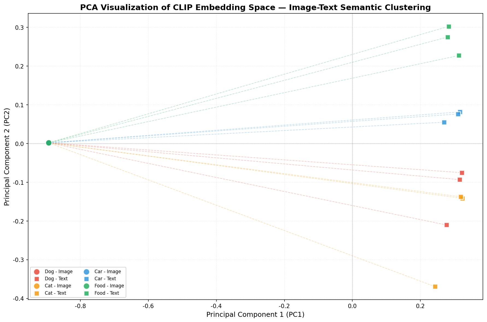

# s22 多模态模型 -- 代码说明与运行报告

## 程序做了什么
加载 OpenAI 预训练的 CLIP ViT-B/32 模型（首次运行自动下载约 600MB），演示零样本图像分类（无需任何训练即可识别任意自定义类别）、图文相似度计算（图像与多段文本描述的余弦相似度得分矩阵）、以及 CLIP 嵌入空间的 PCA 降维可视化（展示图像和文本在共享 512 维空间中的分布关系）。

## 运行方法
```bash
cd s22_multimodal/code
python demo.py
```

## 运行结果

### 输出摘要
- 环境自动检测 CUDA/MPS/CPU 设备并据此选择运行模式
- 零样本分类：对测试图像输出 Top-5 预测类别及概率分数
- 图文相似度：计算图像与多段文本描述之间的余弦相似度矩阵并打印
- PCA 可视化：将图像和文本嵌入向量降至 2D 并绘制在同一共享空间中
- 如依赖未安装，给出优雅提示并跳过对应部分（不影响纯数学/概念演示）

### 生成图表

#### 图表 1: CLIP 嵌入空间 PCA 投影

**说明了什么：** 将 CLIP 的 512 维图像和文本嵌入向量通过 PCA 降至 2D 后可视化，不同颜色区分图像点和文本类别点。语义上相近的图文在共享空间中距离更近，展示了 CLIP 通过对比学习实现的跨模态对齐能力。

#### 图片资源: 概念图解
- `22-01-clip-architecture.png` -- CLIP 双编码器架构（图像编码器 ViT + 文本编码器 Transformer）与对比学习训练过程
- `22-02-clip-zero-shot.png` -- CLIP 零样本分类流程：将类别名编码为文本嵌入，与图像嵌入计算余弦相似度
- `22-03-llava-architecture.png` -- LLaVA 等多模态大模型架构：视觉编码器 + 投影层 + LLM 的端到端设计
- `22-04-multimodal-embedding-space.png` -- 多模态嵌入空间概念图：图文在统一语义空间中对齐的示意

#### 测试图像
`images/samples/` 目录包含 4 张用于零样本分类测试的示例图片：golden_retriever.jpg, orange_cat.jpg, pizza.jpg, red_car.jpg

## 代码结构
- `check_environment()` -- 检测 PyTorch/transformers 可用性及设备类型（CUDA/MPS/CPU）
- `load_clip_model()` -- 加载 CLIPModel + CLIPProcessor + CLIPTokenizer
- `zero_shot_classification()` -- 零样本分类：类别名 -> 文本嵌入 -> 余弦相似度 -> Top-K 预测
- `compute_image_text_similarity()` -- 计算图像与任意文本描述之间的相似度分数矩阵
- `visualize_embedding_space()` -- PCA 降维并可视化图像和文本嵌入在 2D 空间中的分布
- `download_test_images()` -- 获取测试用的 COCO 风格示例图片
- `main()` -- 主流程：环境检测 -> 模型加载 -> 零样本分类 -> 图文相似度 -> PCA 可视化

## 运行环境
- Python 依赖: torch, torchvision, transformers, matplotlib, pillow, scikit-learn
- 硬件需求: CPU 即可运行（GPU 推荐以获得实时推理速度）
- 预计运行时间: ~1-2 分钟（含首次模型下载则 ~5-10 分钟，取决于网络速度）
- 模型大小: CLIP ViT-B/32 约 600MB
