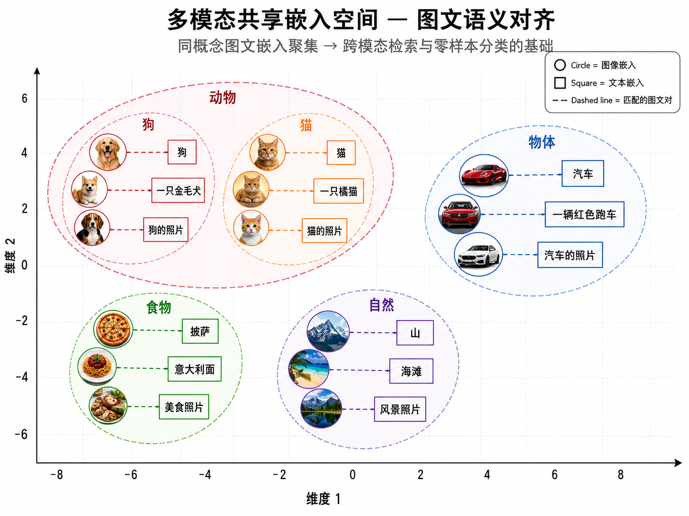
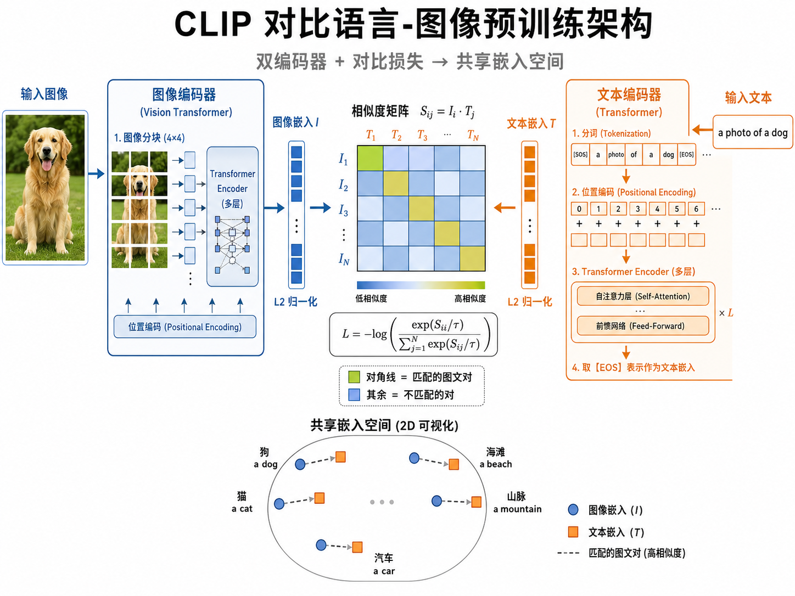
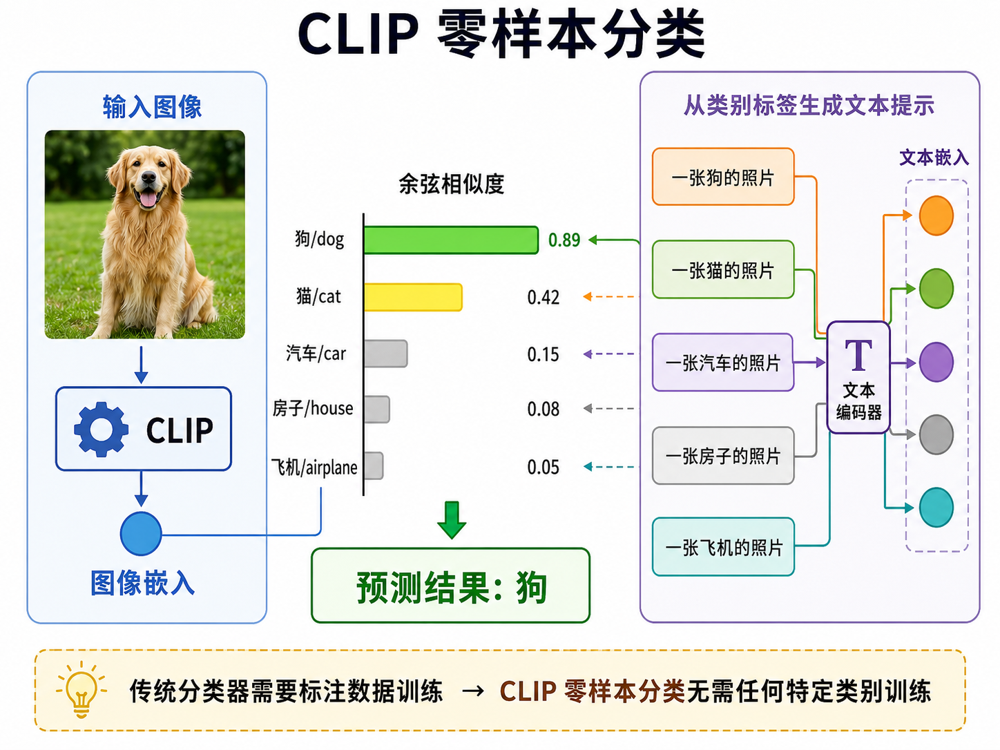
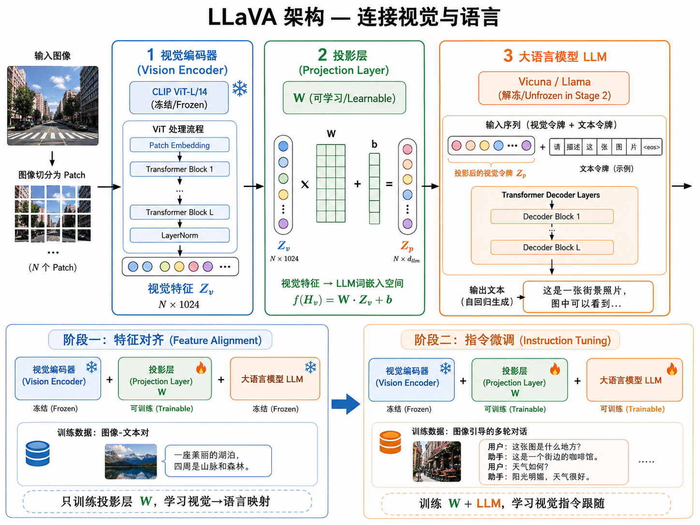

# 多模态模型：从 CLIP 到视觉语言模型

## 1. 什么是多模态？

人类感知世界的方式天生就是多模态的——我们同时用眼睛看、用耳朵听、用触觉感受、用语言交流。一个孩子在认识「狗」这个概念时，不是只看文字定义，而是看到狗的图片、听到狗的叫声、亲手抚摸狗的毛皮，这些不同感官通道的信息在大脑中融合，形成了对「狗」的丰富理解。

**多模态学习（Multimodal Learning）** 的目标与此类似：让机器能够同时理解和推理来自多种模态的信息——文本、图像、音频、视频、传感器数据等。传统深度学习模型往往是单模态的：计算机视觉模型只处理图像，自然语言处理模型只处理文本，语音模型只处理音频。多模态模型则打破了这些边界。

为什么多模态很重要？

- **互补性**：不同模态提供互补信息。一段烹饪视频中，视觉信息告诉你厨师做了什么动作，音频信息告诉你火候大小的声音变化，文本（字幕/标题）告诉你菜名和步骤。
- **鲁棒性**：多模态系统对单一模态的噪声或缺失更具鲁棒性。如果音频嘈杂听不清，还可以看画面和字幕。
- **自然交互**：人类与AI的自然交互方式本应是多模态的——我们可以指着一张图问「这是什么？」，也可以用语音描述想生成的图像。
- **更深的语义理解**：真正的「理解」需要在多种模态间建立联系。知道「苹果」这个词，并且能识别苹果的图片，还能理解「苹果」在不同语境下的含义（水果 vs 公司），这才是更深层的语义理解。

## 2. 核心挑战：不同模态的结构鸿沟

多模态学习的核心挑战在于：**不同模态的数据具有根本不同的结构和统计特性**。

### 2.1 模态的结构差异

- **文本**是离散的、序列化的。一段文本由有限词汇表中的 token 组成，每个 token 是离散符号，文本长度可变，遵循语法规则。文本在计算中被表示为 token ID 序列。

- **图像**是连续的、空间排列的。一张图像由像素网格组成，每个像素有 RGB 三个连续值。图像的「语义」不依赖于固定的词汇表，而是分布在像素的空间排列中。图像在计算中被表示为张量 $(C, H, W)$。

- **音频**是一维时间序列，采样率高（通常 16kHz-48kHz），变化快。音频在计算中被表示为波形或频谱图。

- **视频**是时空数据，可以看作图像序列 + 音频流。维度更高，计算量巨大。

这些差异使得用一个统一模型同时处理所有模态变得极其困难。早期的做法是为每种模态设计专门的编码器，然后在高层语义空间中做融合。而现代的趋势是：**将所有模态映射到一个共享的表示空间，在这个空间中不同模态但语义相似的内容具有相近的向量表示**。

### 2.2 共享语义空间

多模态学习的核心思想可以用一个简单公式表达：

$$
\text{encode}_{\text{image}}(\text{狗的照片}) \approx \text{encode}_{\text{text}}(\text{“一只狗”})
$$

即，一张狗的图片的向量表示，应该和一段描述「一只狗」的文本的向量表示，在同一个向量空间中非常接近。如果做到了这一点，我们就可以在这个共享空间中实现跨模态的检索、推理和生成。

> **图解说明**：图 22-04 展示了图像嵌入（圆圈）和文本嵌入（方块）在同一个 2D 投影空间中的分布。同类概念的图文表示聚集在一起——「狗」的图像和文字在一个簇中，「猫」的图像和文字在另一个簇中，动物类概念彼此靠近，交通工具类概念彼此靠近。

## 3. CLIP：对比语言-图像预训练

**CLIP（Contrastive Language-Image Pre-training）** 是 OpenAI 于 2021 年（Radford et al.）提出的里程碑式工作，它建立了一种简单而强大的跨模态连接方式。

### 3.1 核心思想

CLIP 的核心思想极其优雅：**用自然语言作为图像的监督信号**。传统图像分类需要人工标注每个类别的标签（如「猫」、「狗」、「车」），而 CLIP 使用的是互联网上天然存在的图文配对数据——网页上的图片和其周围的文字描述。

CLIP 在 4 亿对图文数据上进行训练，学习将图像和文本映射到同一个向量空间，使得匹配的图文对在这个空间中靠近。

### 3.2 模型架构

CLIP 由两个独立的编码器组成：

**图像编码器（Image Encoder）**：可以使用 Vision Transformer (ViT) 或 ResNet。输入一张图像，输出一个归一化的向量 $\mathbf{I} \in \mathbb{R}^d$。

- ViT 变体：将图像分割为 $16 \times 16$ 的 patch，每个 patch 作为 Transformer 的一个 token，输出取 [CLS] token 的表示或对所有 patch token 做池化。
- ResNet 变体：在标准 ResNet 基础上做了修改（如使用 attention pooling 替代全局平均池化）。

**文本编码器（Text Encoder）**：使用一个标准的 Transformer（GPT-2 风格的 decoder-only 架构）。输入一段文本（用字节对编码 tokenize），输出取最后一个 token（[EOS]）对应的表示，投影到相同维度 $d$ 后做归一化，得到 $\mathbf{T} \in \mathbb{R}^d$。

两个编码器输出的向量具有相同的维度（例如 ViT-L/14 中 $d=768$），且都经过 L2 归一化处理。

> **图解说明**：图 22-01 展示了 CLIP 的双编码器架构——左侧为图像编码器（ViT）处理狗的照片输出图像嵌入 $\mathbf{I}$，右侧为文本编码器（Transformer）处理文字「一只狗的照片」输出文本嵌入 $\mathbf{T}$，中间通过对比损失将匹配的图文对拉近、不匹配的推远。

### 3.3 对比学习损失

CLIP 的训练目标是对比学习（Contrastive Learning）。核心思想是：在一个 batch 中，匹配的（图像，文本）对视为正样本，不匹配的视为负样本。

具体来说，给定一个 batch 的 $N$ 对图文配对 $\{(\mathbf{I}_i, \mathbf{T}_i)\}_{i=1}^{N}$，首先计算所有图像嵌入和所有文本嵌入之间的余弦相似度矩阵：

$$
S_{ij} = \frac{\mathbf{I}_i \cdot \mathbf{T}_j}{\|\mathbf{I}_i\| \cdot \|\mathbf{T}_j\|} = \cos(\mathbf{I}_i, \mathbf{T}_j)
$$

由于向量已经 L2 归一化，余弦相似度等价于向量内积：$S_{ij} = \mathbf{I}_i \cdot \mathbf{T}_j$。

然后使用 **InfoNCE 损失（Information Noise Contrastive Estimation）**。这实际上是一个多类 softmax 交叉熵损失，双向计算：

对于图像方向（给定图像，找出匹配的文本）：
$$
\mathcal{L}_{\text{image}} = -\frac{1}{N} \sum_{i=1}^{N} \log \frac{\exp(S_{ii} / \tau)}{\sum_{j=1}^{N} \exp(S_{ij} / \tau)}
$$

对于文本方向（给定文本，找出匹配的图像）：
$$
\mathcal{L}_{\text{text}} = -\frac{1}{N} \sum_{i=1}^{N} \log \frac{\exp(S_{ii} / \tau)}{\sum_{j=1}^{N} \exp(S_{ji} / \tau)}
$$

最终损失为两者的平均：
$$
\mathcal{L}_{\text{CLIP}} = \frac{1}{2}(\mathcal{L}_{\text{image}} + \mathcal{L}_{\text{text}})
$$

其中 $\tau$ 是**温度参数（temperature）**，控制 softmax 分布的锐度。CLIP 使用一个可学习的温度参数，初始化为 $\tau = \frac{1}{0.07} \approx 14.3$。

直观理解：
- 对于第 $i$ 张图像，正确的匹配文本是第 $i$ 个，其余 $N-1$ 个文本都是「负样本」。损失函数鼓励 $S_{ii}$ 大（正样本相似度高），$S_{ij} (j \neq i)$ 小（负样本相似度低）。
- 同样地，对于第 $i$ 段文本，正确的匹配图像是第 $i$ 个。这种**对称的对比学习**是 CLIP 的重要设计。

### 3.4 零样本分类

CLIP 训练完成后，最令人惊叹的能力是**零样本分类（Zero-shot Classification）**——可以在从未见过特定类别的情况下对图像进行分类。

零样本分类的流程：

1. 将每个类别名称转化为自然语言提示模板（prompt template），例如 `"a photo of a {class}"`、`"a picture of a {class}"`。
2. 将所有类别的提示模板送入文本编码器，得到每个类别的文本嵌入 $\mathbf{T}_1, \mathbf{T}_2, \dots, \mathbf{T}_K$。
3. 将待分类的图像送入图像编码器，得到图像嵌入 $\mathbf{I}$。
4. 计算图像嵌入与每个类别文本嵌入的余弦相似度。
5. 相似度最高的类别即为分类结果：$\hat{y} = \arg\max_k \cos(\mathbf{I}, \mathbf{T}_k)$。

> **图解说明**：图 22-02 展示了 CLIP 零样本分类的过程——输入一张金毛犬的图片，文本提示包括「一张狗的照片」「一张猫的照片」「一张汽车的照片」等，CLIP 计算图像与每个文本提示的余弦相似度，用柱状图展示分数，最高的「狗」被选为预测结果。

这与传统分类器的本质区别在于：传统分类器需要事先定义好固定数量的类别，用大量标注数据训练，而 CLIP 可以动态适应任意新的类别——只需修改文本提示即可。CLIP 在 ImageNet 上的零样本准确率达到了 **76.2%**，与全监督的 ResNet-50 相当，而后者需要 128 万张标注图像来训练。

## 4. CLIP 的几何解释：共享嵌入空间

CLIP 的精髓在于构建了一个**共享的表示空间**，在这个空间中：

- 语义相似的图像和文本具有相近的向量
- 不同模态但相同语义的向量被对齐到同一点附近
- 空间的几何结构反映了语义的层级关系

可以用下面的方式来理解：

$$
\text{encode}(\text{🐕 dog image}) \approx \text{encode}(\text{"a photo of a dog"})
$$

更神奇的是，这个空间还具有**向量算术**的性质。类似于 Word2Vec 中「国王 - 男人 + 女人 = 王后」，CLIP 的嵌入空间也在一定程度上支持跨模态的语义运算。例如，如果我们有一个穿着特定风格衣服的人的照片嵌入，加上「转换为素描风格」的文本方向，理论上可以得到靠近素描风格图片的向量。

这种共享语义空间的存在，是多模态理解的基础。一旦图像和语言被映射到了同一个空间，我们就可以在向量空间中做：

- **图文检索**：给定图片找最匹配的文字描述，或给定文字找最匹配的图片。
- **零样本分类**：比较图像向量和各类别文本向量的相似度。
- **跨模态推理**：在嵌入空间中进行运算，实现更复杂的跨模态任务。

## 5. 生成式视觉语言模型

CLIP 解决了**图文对齐**问题，但它是一个**判别式**模型——只能判断图文是否匹配，不能根据文本生成图像，也不能根据图像生成文本描述。生成式视觉语言模型填补了这一空白。

### 5.1 DALL-E：文本到图像生成

OpenAI 的 DALL-E 系列（2021-2023）实现了从文本描述生成图像的能力。

- **DALL-E 1**：使用 VQ-VAE 将图像离散化为 token，然后用类似 GPT 的自回归 Transformer 建模文本 token 和图像 token 的联合分布。本质上，它把图像生成变成了一个「语言建模」问题——给定文本，预测下一个图像 token。
- **DALL-E 2**：采用两阶段架构。首先用 CLIP 将文本映射到嵌入空间，然后用扩散模型（Diffusion Model）从该嵌入生成图像。CLIP 文本嵌入提供了语义条件，扩散模型负责生成符合该语义的像素。
- **DALL-E 3**：进一步提升了文本理解和遵循能力，能更准确地反映复杂提示中的细节。

### 5.2 LLaVA：视觉指令跟随

**LLaVA（Large Language and Vision Assistant）** 代表了另一个方向：不是文本生成图像，而是让 LLM「看懂」图像，实现视觉指令跟随——用户可以上传一张图片并就此提问，模型用自然语言回答。

LLaVA 的架构极其简洁，由三个组件构成：

**组件 1：视觉编码器（Vision Encoder）**
使用预训练的 CLIP ViT-L/14。输入图像 $\mathbf{X}_v$，输出视觉特征 $\mathbf{Z}_v = g(\mathbf{X}_v)$。这个视觉编码器在整个训练过程中通常保持冻结（至少在第一阶段），以保留 CLIP 学到的跨模态对齐能力。

**组件 2：投影层（Projection Layer）**
一个简单的线性层或轻量 MLP，将视觉特征 $\mathbf{Z}_v$ 从视觉编码器的输出维度映射到 LLM 的词嵌入维度：
$$
\mathbf{H}_v = \mathbf{W} \cdot \mathbf{Z}_v + \mathbf{b}
$$

其中 $\mathbf{W} \in \mathbb{R}^{d_{\text{LLM}} \times d_{\text{vision}}}$。这个投影层是连接视觉与语言的关键桥梁——它把「视觉 token」转换为 LLM 能理解的「语言 token」。

**组件 3：大语言模型（LLM）**
使用预训练的 LLM（如 Vicuna、Llama 2、Llama 3）。投影后的视觉 token $\mathbf{H}_v$ 被插入到文本 token 序列中，与文本 token 一起送入 LLM 进行自回归生成：

$$
p(\mathbf{y} | \mathbf{X}_v, \mathbf{X}_q) = \prod_{i} p(y_i | \mathbf{H}_v, \mathbf{X}_q, y_{<i})
$$

其中 $\mathbf{X}_q$ 是用户的文本问题，$\mathbf{y}$ 是生成的回答。

> **图解说明**：图 22-03 展示了 LLaVA 的三组件架构——视觉编码器（CLIP ViT-L/14）处理图像输出 patch token，投影层（MLP/线性层）将视觉特征映射到 LLM 的词嵌入空间，LLM（Vicuna/Llama）接收投影后的视觉 token 和文本 token 并生成回答，下方展示两阶段训练流程。

### 5.3 LLaVA 的两阶段训练

**第一阶段：特征对齐（Feature Alignment）**
- 只训练投影层 $\mathbf{W}$，冻结视觉编码器和 LLM。
- 使用简单的图文描述数据（如 CC3M 的子集），让投影层学会将视觉特征映射到 LLM 能理解的语言空间。
- 这一阶段的本质是「教 LLM 认识视觉 token」——让它理解投影后的向量与哪些词嵌入相对应。

**第二阶段：指令微调（Instruction Tuning）**
- 解冻 LLM（有时也解冻投影层），在视觉指令数据集上进行微调。
- 数据格式为多轮对话：用户上传图片并提出问题，助手基于图片内容回答。
- 这一阶段让 LLM 学会「看图说话」——不仅仅是描述图片，还包括推理、问答、遵循复杂指令。

### 5.4 GPT-4V 与 Gemini

闭源模型代表了多模态理解的商业前沿：

- **GPT-4V (GPT-4 with Vision)**：OpenAI 在 GPT-4 基础上增加视觉理解能力。用户可以直接上传图片并就图片内容提问。GPT-4V 在医学影像分析、图表理解、UI 识别等专业领域展现了惊人的能力。
- **Gemini**：Google DeepMind 从头设计的多模态模型，原生支持文本、图像、音频、视频、代码等多种模态的输入和输出。它的目标是在预训练阶段就让模型接触多种模态的数据，而不是后期拼接。

## 6. 多模态对齐：连接不同世界的桥梁

回顾多模态模型的发展，一个贯穿始终的主题是**模态对齐**——如何在不同模态的表示之间建立有意义的对应关系。

### 6.1 对齐的三个层次

**数据层面对齐**：在多模态数据中寻找天然的对应关系。例如，网页中的图片和周围的文字，视频中的画面和旁白/字幕。CLIP 使用了 4 亿对 web 上的图文数据。

**表示层面对齐**：通过对比学习等训练目标，将不同模态的表示拉近到同一空间中的相近位置。这是 CLIP 的核心贡献。

**语义层面对齐**：不仅仅是浅层的图文匹配，而是实现深层的语义理解和跨模态推理。例如，能否从一张医学影像中推断出诊断结论，或从一段代码的截图理解其逻辑。

### 6.2 当前的对齐方法

| 方法 | 对齐方式 | 代表模型 |
|------|---------|---------|
| 对比学习 | 拉近匹配对，推远非匹配对 | CLIP, ALIGN, SigLIP |
| 生成式对齐 | 从一种模态生成另一种模态 | DALL-E, Stable Diffusion |
| 桥接式对齐 | 通过一个中间表示连接两种模态 | LLaVA, BLIP-2 (Q-Former) |
| 原生多模态 | 在预训练阶段就混合多种模态 | Gemini, GPT-4o |

### 6.3 Q-Former：可学习的查询桥接

BLIP-2 中提出的 **Q-Former（Querying Transformer）** 是另一种重要的对齐结构。它与 LLaVA 的线性投影层不同：

- Q-Former 使用一组可学习的 query token，通过交叉注意力（cross-attention）从冻结的视觉编码器输出中提取与文本最相关的视觉信息。
- 这些 query token 的输出再被送入冻结的 LLM。
- Q-Former 同时训练三个目标：图文对比学习（与 CLIP 类似）、图文匹配（二分类判断是否匹配）、图文生成（基于图像生成文本描述）。

这种设计的优势在于：**Q-Former 是一个「瓶颈」**，它学会了从丰富的视觉特征中筛选出 LLM 最需要的信息，减少了传递给 LLM 的视觉 token 数量，从而提高了效率。

## 7. 多模态的现状与展望

### 7.1 技术趋势

- **原生多模态**：从「先训练单模态编码器再拼接」到「从头用多模态数据训练统一模型」。GPT-4o、Gemini 是这一趋势的代表。
- **任意到任意（Any-to-Any）**：不仅支持文本+图像输入，还支持音频、视频输入，而且能生成文本、图像、音频、语音等多种输出。
- **多模态 Agent**：结合视觉感知和工具使用。例如，一个 Agent 可以「看」屏幕截图、理解 UI 元素、然后执行操作。
- **高效多模态**：如何在资源受限的设备上运行多模态模型？量化、蒸馏、参数高效微调（如 LoRA）被广泛应用于多模态模型。

### 7.2 关键挑战

- **长视频理解**：理解一小时的视频需要处理大量帧，同时对时序关系进行建模。当前方法受限于上下文窗口和计算成本。
- **细粒度对齐**：在一张复杂的图片中精确地定位到文本描述的特定区域（如「左边第三个穿红衣服的人」）。
- **幻觉问题**：多模态模型也会产生幻觉——描述图像中不存在的内容，或将两段不相关的信息错误地组合在一起。
- **多语言多模态**：当前最强的多模态模型主要以英语为中心，对其他语言的支持仍有差距。

---

## 本章总结

从 CLIP 到 LLaVA，多模态模型在过去几年取得了令人瞩目的进步。核心思想的演进脉络清晰可见：

1. **CLIP** 用对比学习将图像和文本映射到同一个向量空间，实现了图文对齐和零样本分类。
2. **DALL-E / Stable Diffusion** 实现了从文本表示生成图像，证明了文本嵌入包含了生成图像所需的语义信息。
3. **LLaVA** 将视觉编码器与 LLM 连接，让大语言模型「看懂」图像并回答相关的问题。

这一演进的核心驱动力是**模态对齐**——在不同模态的数据之间建立语义对应关系。一旦这个桥梁建立起来，两个世界的信息就可以相互流动、互相增强。

在接下来的章节中，我们将看到这些多模态能力如何被整合到 RAG 系统和 AI Agent 中，构建更强大的智能应用。

---

## 参考

1. Radford, A., Kim, J. W., Hallacy, C., et al. (2021). Learning Transferable Visual Models From Natural Language Supervision. *ICML 2021*.
2. Liu, H., Li, C., Wu, Q., & Lee, Y. J. (2023). Visual Instruction Tuning. *NeurIPS 2023*.
3. Li, J., Li, D., Savarese, S., & Hoi, S. (2023). BLIP-2: Bootstrapping Language-Image Pre-training with Frozen Image Encoders and Large Language Models. *ICML 2023*.
4. Ramesh, A., Dhariwal, P., Nichol, A., et al. (2022). Hierarchical Text-Conditional Image Generation with CLIP Latents.
5. Alayrac, J.-B., et al. (2022). Flamingo: a Visual Language Model for Few-Shot Learning. *NeurIPS 2022*.
6. OpenAI (2023). GPT-4 Technical Report.
