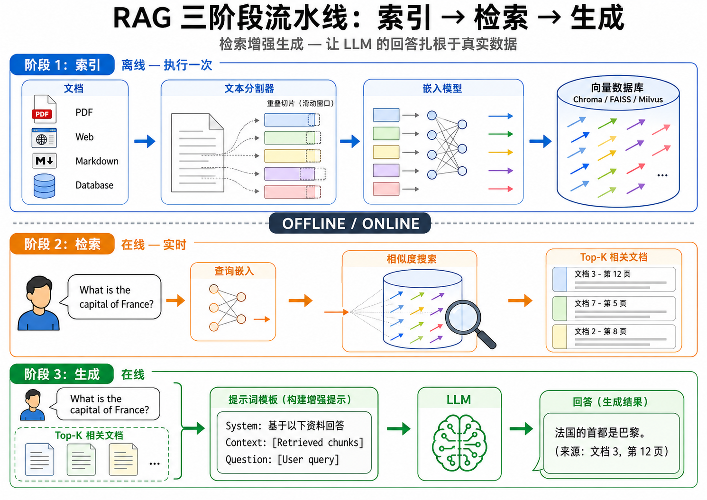
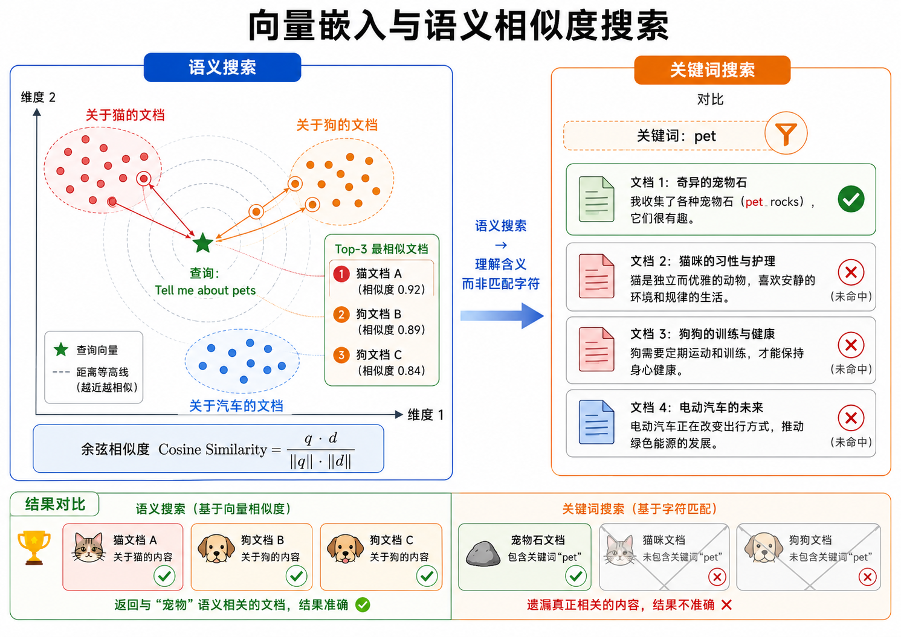
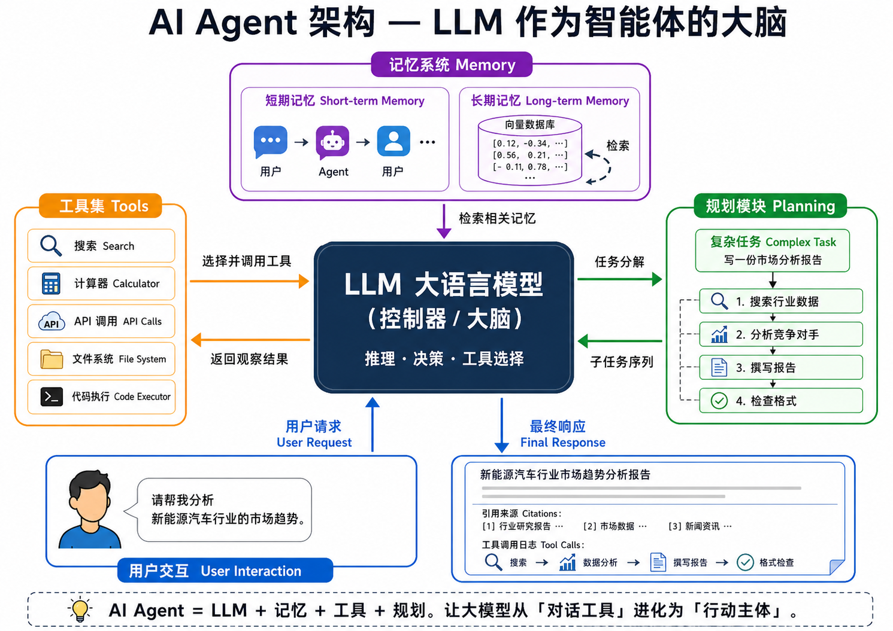
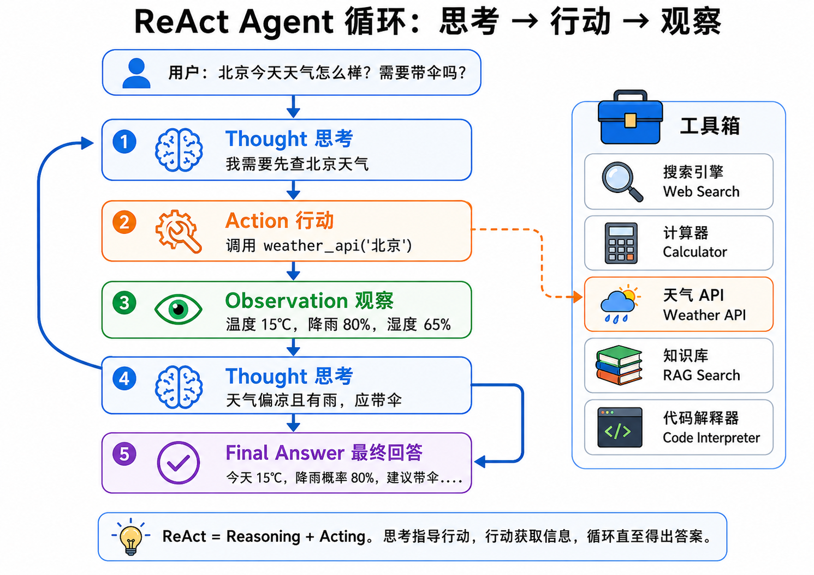

# RAG 与 AI Agent：从检索增强到自主行动

## 1. 大模型的「幻觉」问题

大语言模型（LLM）的一个根本性局限是**幻觉（Hallucination）**——模型会生成看似合理但实际上不正确的内容。幻觉并非模型的「bug」，而是其训练方式和架构的必然结果：

- **训练数据是快照**：LLM 的知识截止于训练数据收集的时间点。它不知道 2025 年发生的事情，除非训练数据包含了那之后的信息。
- **参数化记忆的局限**：模型将所有知识压缩在参数中。对于罕见或高度专业化的事实，参数中的「记忆」可能是不精确的，甚至是被其他更频繁出现的模式所「覆盖」的。
- **生成机制**：LLM 是 next-token predictor，它被训练来生成「最可能的下一个 token」，而不是「最正确的事实」。在不确定性高的情况下，模型倾向于生成语法通顺、语义连贯但事实错误的文本。
- **缺乏溯源能力**：纯 LLM 无法告诉你它从哪里获得了某个信息，也无法引用来源。用户无法区分模型在「回忆已知事实」还是在「即兴编造」。

**幻觉问题的严重程度**因场景而异。在创意写作中，一定的「想象力」可能是好事。但在医疗建议、法律咨询、金融分析等高风险场景中，幻觉可能导致灾难性后果。

这就是 RAG（Retrieval-Augmented Generation）产生的背景——**用外部知识库来锚定模型的输出**。

## 2. RAG：检索增强生成

**RAG（Retrieval-Augmented Generation，检索增强生成）**由 Lewis 等人于 2020 年提出，核心思想非常简单但有效：

> 在 LLM 生成回答之前，先从外部知识库中检索与用户问题相关的文档片段，然后将这些片段作为上下文注入 prompt 中，让 LLM 基于检索到的真实信息来生成答案。



### 2.1 RAG 的三阶段流水线

RAG 系统分为线下（索引）和线上（检索+生成）两大阶段。

**第一阶段：索引（Indexing）— 线下执行**

1. **文档加载**：收集需要作为知识源的各种文档——PDF、网页、数据库记录、Markdown 文件等。
2. **文本分割（Chunking）**：将长文档切分为适当大小的「块（chunk）」。太大则检索不精确，太小则丢失上下文。典型 chunk 大小在 256-1024 tokens 之间，块之间可以有 10%-20% 的重叠以保持连续性。
3. **嵌入生成**：用嵌入模型（如 text-embedding-ada-002、bge-large、GTE 等）将每个 chunk 编码为固定维度的向量。
4. **向量存储**：将所有向量存入向量数据库（如 Chroma、FAISS、Milvus、Pinecone），建立高效的近似最近邻（ANN）索引。

**第二阶段：检索（Retrieval）— 线上执行**

1. **查询嵌入**：将用户的自然语言问题用同一个嵌入模型编码为向量。
2. **相似度搜索**：在向量数据库中搜索与查询向量最相似的 top-$k$ 个文档块。
3. **后处理**：可能包括重排序（reranking）、去重、过滤等步骤。

**第三阶段：生成（Generation）— 线上执行**

1. **构建增强 prompt**：将检索到的文档块组织成结构化的上下文，与用户原始问题一起注入到 prompt 中。
2. **LLM 生成**：LLM 基于提供的上下文和自身能力生成准确、有引用来源的回答。

> **图解说明**：图 23-01 清晰展示了 RAG 三阶段流水线——线下索引阶段（文档→切分→嵌入→向量数据库），线上检索阶段（用户查询→嵌入→相似搜索→Top-K 文档），以及生成阶段（查询+检索文档→LLM→带引用的答案）。

### 2.2 RAG 的核心优势

| 对比维度 | 纯 LLM | RAG 增强 LLM |
|---------|--------|-------------|
| 知识时效性 | 训练截止日期 | 实时更新知识库 |
| 事实准确性 | 可能幻觉 | 有来源依据 |
| 可溯源 | 无法引用来源 | 可标注信息来源 |
| 知识范围 | 训练数据覆盖范围 | 知识库决定范围 |
| 隐私/安全 | 敏感信息可能在参数中 | 知识库可独立管理权限 |
| 更新成本 | 需要重新训练/微调 | 只需更新知识库文档 |

### 2.3 文本分割策略

文本分割是 RAG 的关键预处理步骤。一个糟糕的切分策略会产生语义不完整的片段，严重影响检索质量。

**固定长度切分（Fixed-length chunking）**：
最简单的方法是按固定 token 数切分，加上重叠窗口以避免在句子中间截断。

```
文档: "人工智能是计算机科学的一个分支......在医疗领域，AI 被用于..."
Chunk 1 (512 tokens): "人工智能是计算机科学的一个分支......"
Chunk 2 (512 tokens, overlap 128): "......在医疗领域，AI 被用于..."
```

**语义切分（Semantic chunking）**：
按自然段落、章节、或使用嵌入相似度变化来检测语义边界，在语义断裂处切分。

**递归字符切分**：
先尝试用段落分隔符（`\n\n`）切分，如果 chunk 仍然太大，再用句子分隔符（`\n`、`。`），最后用空格/字符切分。这是 LangChain 的 RecursiveCharacterTextSplitter 采用的策略。

### 2.4 检索质量优化



基础的向量检索可以通过以下技术增强：

**混合检索（Hybrid Search）**：
结合稀疏检索（如 BM25，擅长精确关键词匹配）和稠密检索（向量相似度，擅长语义匹配）。在查询包含专有名词、缩写、ID 等时，BM25 可能比向量检索更准确。

**重排序（Reranking）**：
第一阶段用高效的 ANN 检索 top-$k$（如 $k=50$），第二阶段用更精确但更慢的交叉编码器（cross-encoder）对这些候选进行重排序，选出最终的 top-$n$（如 $n=5$）。交叉编码器同时处理查询和文档对，能做出更精确的相关性判断。

**查询改写（Query Rewriting）**：
在检索之前，使用 LLM 对用户的原始查询进行改写或扩展，以提升检索效果：
- 将口语化问题改为更适合检索的陈述句
- 生成多个子查询来覆盖问题的不同方面
- 添加假设性答案（HyDE: Hypothetical Document Embeddings）——先生成一个假设的答案，然后用这个答案的嵌入去做检索

## 3. AI Agent：从「对话工具」到「行动主体」

如果说 RAG 解决了 LLM「知识不足」的问题，那么 **AI Agent** 则解决了 LLM「能力不足」的问题——让 LLM 不仅仅是生成文本，而是能够**使用工具**、**制定计划**、**执行行动**。

### 3.1 什么是 AI Agent？

AI Agent（智能代理）是一个能够自主感知环境、做出决策、执行行动以实现目标的系统。在 LLM 的语境下，Agent 就是以 LLM 作为「大脑」，配合外部工具和记忆系统，完成复杂任务的自主程序。



一个典型的 LLM Agent 包含以下组件：

- **LLM（控制器/Brain）**：负责理解任务、制定计划、决定使用什么工具、何时给出最终答案。
- **工具（Tools）**：Agent 可以调用的外部功能——搜索引擎、计算器、代码解释器、数据库查询、API 调用、文件系统操作等。
- **记忆（Memory）**：分为短期记忆（当前对话历史）和长期记忆（向量数据库存储的经验和知识）。
- **规划模块（Planning）**：将复杂任务分解为可执行的子任务，通常使用 Chain-of-Thought 或 Tree-of-Thought 等方法。

> **图解说明**：图 23-04 展示了 Agent 的整体架构——LLM 作为中央控制器，连接到记忆系统（短期对话历史 + 长期向量存储）、工具集（搜索、计算器、API 等）和规划模块（任务分解、链式推理），从用户请求到最终响应的完整流程。

### 3.2 ReAct：推理与行动的循环

**ReAct（Reasoning + Acting）**是 Yao 等人于 2022 年提出的 Agent 推理框架，它将推理（Thought）和行动（Action）交织在一起。



ReAct 的核心循环是：

```
Thought → Action → Observation → Thought → Action → ... → Final Answer
```

以一个具体例子来理解：

> 用户问题：「北京今天的天气怎么样？我需要带伞吗？」

- **Thought 1**：我需要先获取北京当前的天气信息。我可以用天气 API 查询。
- **Action 1**：调用 `weather_api("北京")`
- **Observation 1**：温度 15°C，降雨概率 80%，湿度 65%
- **Thought 2**：温度偏低（15°C），降雨概率很高（80%）。我应该建议用户带伞，最好也提醒穿外套。
- **Action 2**：`final_answer("北京今天 15°C，降雨概率 80%，天气偏凉且有大概率下雨。强烈建议带伞，并穿一件外套。")`

> **图解说明**：图 23-03 以流程图展示了 ReAct 循环——用户提问→Thought（我需要查天气）→Action（调用 weather_api）→Observation（结果）→Thought（需要带伞）→Final Answer。旁边展示 Agent 可用的工具箱（搜索、计算器、天气 API 等）。

ReAct 的精妙之处在于：

- **推理指导行动**：Thought 解释了 Agent *为什么*选择某个工具。
- **行动获取信息**：Observation 提供了来自外部世界的新信息。
- **可解释性**：整个 Thought→Action→Observation 链是完全透明的，用户可以追溯 Agent 的每一步决策。

### 3.3 工具定义与调用

Agent 通过**函数调用（Function Calling）**或**工具描述**机制来使用外部工具。每种工具都有明确的定义：

```json
{
  "name": "search_knowledge_base",
  "description": "在知识库中搜索相关文档。当需要查找事实性信息时使用。",
  "parameters": {
    "query": "搜索查询字符串",
    "top_k": "返回的文档数量，默认 5"
  }
}
```

LLM 在被调用时会输出它想使用的工具名称和参数，应用程序框架（如 LangChain、LlamaIndex）会实际执行工具调用，并将结果返回给 LLM。

### 3.4 Agent 架构类型

**单 Agent**：一个 LLM 负责所有决策和工具使用。简单、易实现，适合大多数场景。

**多 Agent 系统**：多个专业化的 Agent 协作完成任务。例如：
- 一个 Agent 负责搜索和收集信息
- 一个 Agent 负责分析和推理
- 一个 Agent 负责撰写最终报告
- 一个协调 Agent 负责任务分配和结果整合

**工具增强 Agent**：LLM 搭配丰富的工具集，但工具的选择和调用顺序由 LLM 自主决定。这是目前最流行的 Agent 范式。

## 4. 关键挑战与前沿

### 4.1 规划与错误恢复

Agent 在执行多步任务时可能遇到各种错误——工具调用失败、返回意外结果、陷入循环。健壮的 Agent 需要：

- **错误检测**：识别工具调用是否成功，结果是否符合预期。
- **重试与回退**：在失败时尝试替代方案。
- **自我反思**：定期检查「我是否在正轨上？」，必要时调整计划。

### 4.2 上下文管理

随着 Agent 执行越来越多的步骤，对话历史迅速增长。当上下文窗口被填满时，早期的关键信息可能被截断。解决方案包括：

- **摘要记忆**：定期将旧的对话历史压缩为摘要。
- **向量记忆**：将重要信息存入向量数据库，按需检索。
- **滑动窗口**：只保留最近的 N 轮交互。

### 4.3 安全与可控性

Agent 能够自主执行行动（如发送邮件、修改文件、调用付费 API），这带来了严重的安全隐患：

- **权限控制**：Agent 应该只被授权执行安全的操作。
- **人工审核**：在关键决策点引入人类确认（Human-in-the-Loop）。
- **行动范围限制**：明确定义 Agent 可以执行的操作边界。

## 5. RAG + Agent 的融合

RAG 和 Agent 不是互斥的，而是互补的。在实际应用中，Agent 经常使用 RAG 作为其工具之一：

- Agent 的「长期记忆」可以用 RAG 实现——将过去的经验和知识存入向量库，需要时检索。
- Agent 的「搜索工具」本质上就是 RAG 检索。
- 多步问答场景中，Agent 可以先用 RAG 检索基础信息，再调用其他工具做进一步处理。

两者结合的模式通常被称为 **RAISE（Retrieval-Augmented Intelligent System with Execution）**或简称为 RAG Agent。

---

## 本章总结

从 RAG 到 Agent，我们看到了 LLM 应用范式的两大进化方向：

1. **RAG（知识维度）**：将 LLM 与外部知识库连接，解决了幻觉和知识时效性问题。核心是将信息检索与文本生成无缝结合。
2. **Agent（能力维度）**：让 LLM 不仅能「说」，还能「做」。通过工具使用和自主规划，Agent 将 LLM 从对话工具转变为行动主体。

两者的结合——RAG Agent——代表了当前 AI 应用的最高形式之一：一个既拥有广阔知识、又能自主行动、还可以引用来源的智能系统。

在接下来的章节中，我们将探讨如何高效地部署这些系统，以及如何确保它们的安全性。

---


## 📥 Code

| File | View | Download |
|------|------|----------|
| demo.py | [Open](./code-demo) | <a href="../code/s23_rag_agent/demo.py" target="_blank" download>Download</a> |
| exercise.py | [Open](./code-exercise) | <a href="../code/s23_rag_agent/exercise.py" target="_blank" download>Download</a> |

## 参考

1. Lewis, P., et al. (2020). Retrieval-Augmented Generation for Knowledge-Intensive NLP Tasks. *NeurIPS 2020*.
2. Yao, S., et al. (2022). ReAct: Synergizing Reasoning and Acting in Language Models. *ICLR 2023*.
3. Gao, Y., et al. (2023). Retrieval-Augmented Generation for Large Language Models: A Survey.
4. Wang, L., et al. (2024). A Survey on Large Language Model based Autonomous Agents. *Frontiers of Computer Science*.
5. LangChain Documentation. (2024). Agents and RAG.
6. Chase, H. (2022). LangChain: Building Applications with LLMs through Composability.
