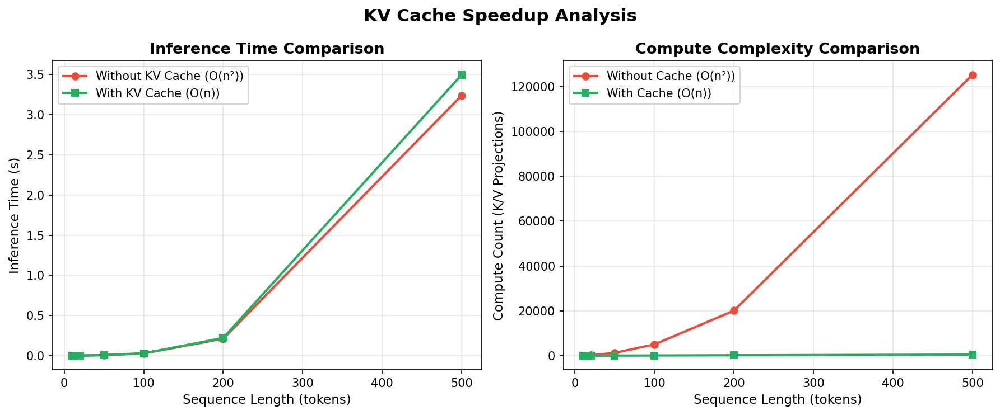
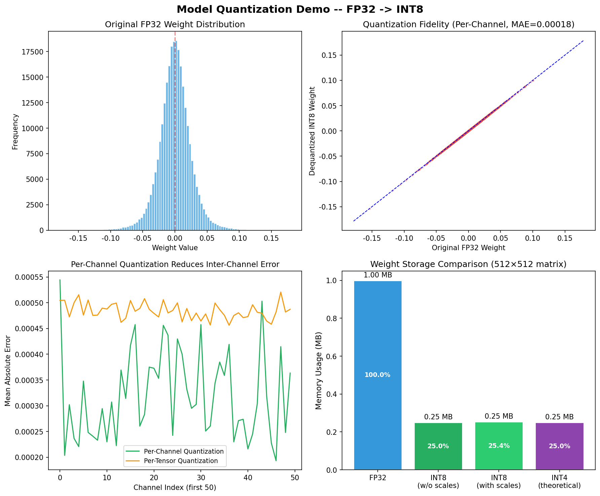

# s24 模型部署与推理优化 -- 代码说明与运行报告

## 程序做了什么
用纯 NumPy 演示大模型推理的两个核心优化技术：KV Cache（模拟自回归生成中 Key/Value 矩阵的缓存复用，对比有/无缓存在不同序列长度下的 FLOPs 和耗时差异）和模型量化（FP32 到 INT8 的对称量化过程，展示压缩率、量化前后权重分布及精度损失 MSE/MAE）。

## 运行方法
```bash
cd s24_deployment_inference/code
python demo.py
```

## 运行结果

### 输出摘要
- KV Cache 基准测试：不同序列长度（如 4/8/16/32/64/128）下有/无 cache 的推理耗时对比及加速比
- 序列越长加速比越大：无 cache 时每步重算全部历史 K/V（O(n^2)），有 cache 时只算当前 token（O(n)）
- 量化统计：原始 FP32 权重的 min/max/mean/std，量化后 INT8 值的统计
- 压缩率：FP32 (4 bytes) vs INT8 (1 byte)，理论压缩比 4x
- 量化误差：MSE（均方误差）和 MAE（平均绝对误差）数值展示

### 生成图表

#### 图表 1: KV Cache 性能对比

**说明了什么：** 双图展示：左图是有/无 KV Cache 的推理耗时随序列长度增长曲线（无 cache 呈二次增长，有 cache 呈线性增长）；右图是加速比随序列长度增加而提升的趋势，序列越长 KV Cache 的优势越显著。

#### 图表 2: 量化演示

**说明了什么：** 四子图展示：原始 FP32 权重分布直方图、量化后 INT8 权重分布（离散化台阶状）、逐元素的量化误差分布（接近零均值）、压缩率条形图（per-tensor vs per-channel 方案对比）。体现了量化在精度损失可接受的前提下大幅降低内存占用的 trade-off。

#### 图片资源: 概念图解
- `24-01-kv-cache.png` -- KV Cache 原理：Transformer 自回归生成中 K/V 矩阵的缓存复用机制
- `24-02-flash-attention.png` -- Flash Attention：通过分块（tiling）和重计算减少 HBM 访问的 IO-aware 优化
- `24-03-quantization-comparison.png` -- 量化方案对比：对称/非对称、per-tensor/per-channel、PTQ/QAT 等
- `24-04-paged-attention.png` -- Paged Attention（vLLM 核心技术）：将 KV Cache 按页管理以提高显存利用率

## 代码结构
- `class SimpleAttention` -- 简单注意力机制，支持有/无 KV Cache 两种生成模式
  - `_single_head_attention()` -- 单头注意力 QK^T * V 计算
  - `generate_without_kv_cache()` -- 无缓存：每步重新计算全部历史 K/V（O(n^2) FLOPs）
  - `generate_with_kv_cache()` -- 有缓存：只计算新 token 的 K/V，拼接已有缓存（O(n) FLOPs）
- `run_kv_cache_benchmark()` -- 基准测试：不同序列长度下有/无 cache 的耗时和加速比
- `quantize_weights()` -- FP32 -> INT8 对称量化：scale = max(|W|)/127, W_int8 = round(W/scale)
- `compare_quantization_error()` -- per-tensor vs per-channel 的量化误差对比
- `plot_kv_cache_comparison()` -- KV Cache 耗时与加速比可视化
- `plot_quantization_demo()` -- 量化前后权重分布与误差可视化
- `main()` -- 主流程

## 运行环境
- Python 依赖: numpy, matplotlib
- 硬件需求: CPU 即可
- 预计运行时间: ~10-20 秒
