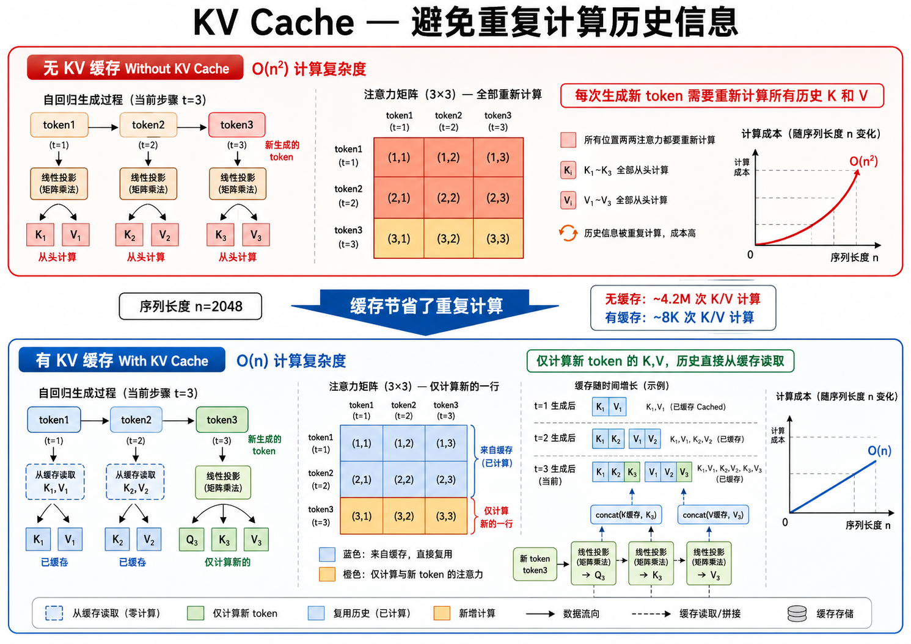
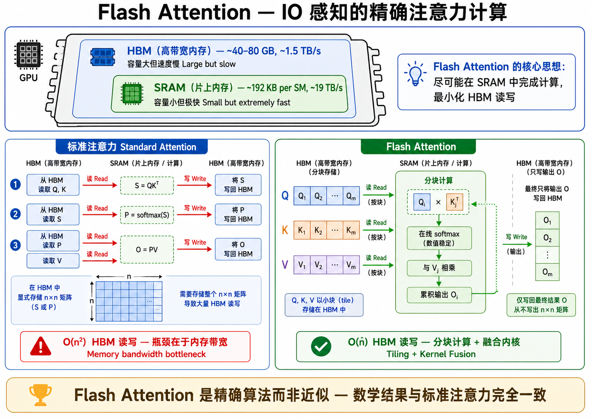
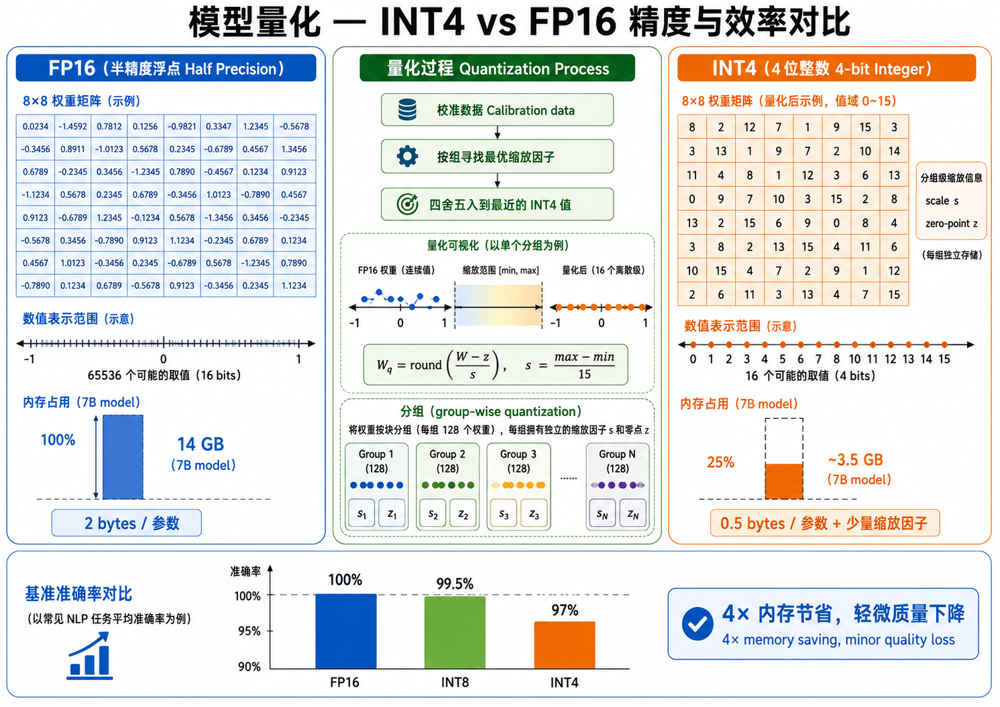
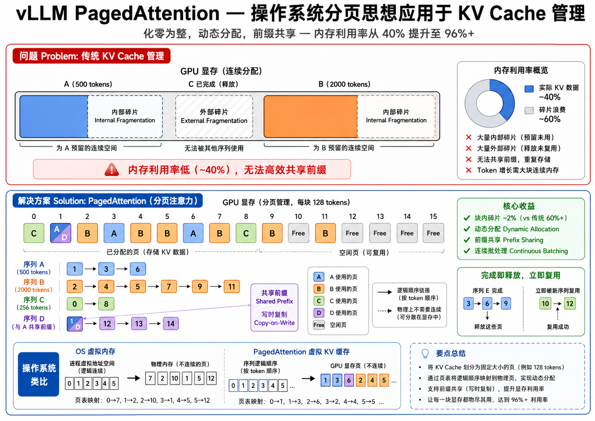

# 模型部署与推理优化

## 1. 训练 vs 推理：两种不同的优化目标

深度学习模型的完整生命周期分为两大阶段：**训练（Training）**和**推理（Inference）**。尽管两者都涉及神经网络的前向传播，但它们的优化目标截然不同。

| 维度 | 训练 | 推理 |
|------|------|------|
| 目标 | 最小化损失函数，最大化模型性能 | 在给定延迟/内存下生成高质量输出 |
| 计算模式 | 前向 + 反向传播（含梯度计算） | 仅前向传播，无梯度 |
| 批处理 | 大 batch（利用数据并行） | 小 batch 甚至 batch=1（低延迟） |
| 精度 | FP16/BF16 混合训练 | INT8/INT4 量化推理 |
| 硬件 | 多 GPU 集群（如 8×A100） | 单 GPU 甚至 CPU/手机 |
| 内存 | 需要存储梯度、优化器状态 | 仅需模型权重和中间激活 |
| 延迟要求 | 训练时间（小时/天）可接受 | 毫秒级响应（用户等待） |
| 主要瓶颈 | 通信带宽（GPU 互联） | 内存带宽和计算延迟 |

> 训练追求**高吞吐量（Throughput）**——每秒处理多少样本；推理追求**低延迟（Latency）**——单个请求的响应时间。这导致了两套完全不同的技术栈。

对于训练，我们需要关注分布式策略（数据并行、模型并行、流水线并行）和梯度同步效率。对于推理，我们需要关注内存占用、解码速度、批处理效率、服务化部署等。

## 2. 推理计算的本质

一次 Transformer 的推理前向传播，对每个 token 需要执行大量矩阵乘法。以 Llama 2-7B 为例，生成一个 token 的过程大致包括：

1. 输入 token 的嵌入查找
2. 对每一层（32 层）：
   - Self-Attention：Q、K、V 投影 → 注意力计算 → 输出投影
   - FFN：两个线性变换 + 激活函数
3. 最后的 LM Head 投影 + softmax

在自回归生成（逐 token 解码）中，当前 token 的注意力计算需要访问所有之前 token 的 Key 和 Value。如果没有优化，每生成一个新 token 都需要重新计算所有历史 token 的 K 和 V，计算量随序列长度呈平方增长：

$$
\text{计算复杂度: } O(n^2 \cdot d) \quad \text{其中 } n \text{ 是序列长度，} d \text{ 是模型维度}
$$

## 3. KV Cache：避免重复计算过去

### 3.1 无 KV Cache 的情况

在标准自回归生成中，生成第 $t$ 个 token 时，整个序列（包括之前 $t-1$ 个 token 和当前 token）都要经过所有注意力层。对于第 $t$ 个 token：

- 需要计算 `Q_t`（当前 token 的 Query）
- 需要计算 `K_{1:t}` 和 `V_{1:t}`（所有 token 的 Key 和 Value）
- 注意力得分：`Attention(Q_t, K_{1:t}, V_{1:t}) = softmax(Q_t K_{1:t}^T / \sqrt{d_k}) V_{1:t}`

之前 $t-1$ 个 token 的 K 和 V 在上一轮已经计算过了，但在没有缓存的情况下必须重新计算。总计算量：

$$
O(1 + 2 + 3 + \dots + n) = O(n^2)
$$

### 3.2 KV Cache 的工作原理

**KV Cache 的核心思想**：将每层计算的 Key 和 Value 张量存储起来，生成下一个 token 时只需要计算新 token 的 Q, K, V，然后将新的 K, V 追加到缓存中即可。

对于第 $t+1$ 个 token：
- 仅计算 `Q_{t+1}`、`K_{t+1}`、`V_{t+1}`（3 次矩阵乘法，与历史无关）
- 拼接：`K_{1:t+1} = [K_{1:t}, K_{t+1}]`，`V_{1:t+1} = [V_{1:t}, V_{t+1}]`
- 注意力得分：`softmax(Q_{t+1} K_{1:t+1}^T / \sqrt{d_k}) V_{1:t+1}`

每生成一个 token 的计算复杂度降为 $O(n)$（注意力需要与所有缓存的 K 做点积），但不需要重复计算历史 K、V。



### 3.3 KV Cache 的内存分析

KV Cache 显著减少了计算量，但引入了新的内存开销。对于 Llama 2-7B：

- 层数 $L = 32$，头数 $H = 32$，头维度 $d_h = 128$
- 每个 token 的 KV Cache 大小：$2 \times L \times H \times d_h \times 2 \text{ bytes} = 2 \times 32 \times 32 \times 128 \times 2 = 524,288 \text{ bytes} \approx 0.5 \text{ MB}$
- 对于 4096 个 token 的序列：$0.5 \times 4096 = 2 \text{ GB}$
- 对于 batch_size=32：$2 \times 32 = 64 \text{ GB}$

KV Cache 的内存占用是限制长序列推理吞吐量的关键瓶颈。这也是 vLLM 的 PagedAttention 要解决的核心问题。

> **图解说明**：图 24-01 对比了有/无 KV Cache 的推理过程——无缓存时每步重新计算全部 K、V ($O(n^2)$)，有缓存时只需计算新 token 的 K、V 并追加到缓存中 ($O(n)$)。

## 4. Flash Attention：IO 感知的注意力计算

### 4.1 GPU 内存层次结构

现代 GPU 的内存分为多个层次：

- **HBM（High Bandwidth Memory，高带宽内存）**：GPU 的主内存，容量大（A100 为 40GB/80GB）但访问速度相对慢（~1.5 TB/s 带宽）。
- **SRAM（Static RAM，片上静态内存）**：内置于 GPU 计算单元内部，容量小（A100 每个 SM 约 192KB）但访问速度极快（~19 TB/s 带宽）。

标准注意力计算的瓶颈不在于计算（FLOPs），而在于**IO（数据传输）**——注意力矩阵 $QK^T$ 的大小为 $n \times n$，需要从 SRAM 写入 HBM，再读回做 softmax，再写回，再读回乘 V。对于 $n=2048$，注意力矩阵就有 $4M$ 个元素（FP16 下约 8MB），这对 SRAM 来说太大了。

### 4.2 Flash Attention 的核心创新

**Flash Attention (Dao et al., 2022)** 通过以下技术解决了 IO 瓶颈：

1. **分块计算（Tiling）**：将 Q、K、V 分成小块，逐块加载到 SRAM 中计算局部注意力，永远不会将完整的 $n \times n$ 注意力矩阵写入 HBM。
2. **融合操作（Kernel Fusion）**：在单个 CUDA kernel 中完成 `QK^T → softmax → ×V` 的全部计算，避免了中间结果写入/读取 HBM。
3. **在线 Softmax**：使用一种数值稳定的增量式计算方式，在分块的情况下也能得到精确的 softmax 结果。



Flash Attention 的效果是显著的：
- 将标准注意力的 HBM 读写量从 $O(n^2)$ 降低到 $O(n)$
- 训练速度提升 2-4 倍
- 支持更长的上下文序列（如 64K tokens）
- **在数学上是精确的**，不是近似算法

Flash Attention 已经成为几乎所有现代 Transformer 实现的标配，被集成到了 PyTorch 2.0 的 `torch.nn.functional.scaled_dot_product_attention` 中。

> **图解说明**：图 24-02 展示了 GPU 内存层次结构——HBM（大而慢）和 SRAM（小而快）的对比，标准注意力需要将完整注意力矩阵多次写入/读取 HBM，而 Flash Attention 在 SRAM 中分块完成全部计算，只将最终结果写入 HBM。

## 5. 量化：用更少的比特表示模型

### 5.1 为什么需要量化？

大语言模型的权重通常以 16 位浮点数（FP16/BF16）存储。一个 7B 参数的模型需要约 14GB 显存才能加载（$7 \times 10^9 \times 2 \text{ bytes} = 14 \text{ GB}$）。这对于消费级 GPU（如 RTX 3060 的 12GB、RTX 4060 的 8GB）来说是不可承受的。

**量化的目标**：将模型参数和/或激活值用更低的精度表示（如 INT8 的 8 位或 INT4 的 4 位），在保持模型性能的同时大幅减少内存占用和加速推理。

### 5.2 量化基础

将 FP16 权重 $W$ 量化为 INT4 的过程：

1. **分组**：将权重按行或按通道分组（如每组 128 个权重）。
2. **确定缩放因子**：对每组权重，找到缩放因子 $s$ 和零点 $z$，使得量化后的值能最好地拟合权重分布：
   $$
   W_q = \text{round}\left(\frac{W - z}{s}\right), \quad s = \frac{\max(W) - \min(W)}{2^b - 1}
   $$
3. **存储**：存储量化后的整数权重 $W_q$ 和每组对应的 $s$、$z$。
4. **反量化**（推理时）：$\hat{W} = s \cdot W_q + z$，用近似的权重进行计算。



### 5.3 量化方法比较

| 方法 | 精度 | 大小 (7B) | 特点 |
|------|------|-----------|------|
| FP16 | 16-bit | 14 GB | 原始精度，基准线 |
| INT8 | 8-bit | 7 GB | 几乎无损，广泛支持 |
| INT4 | 4-bit | 3.5 GB | 有轻微质量下降，可在消费级 GPU 上运行 |
| NF4 | 4-bit | 3.5 GB | QLoRA 使用，信息论最优的 4-bit 数据类型 |

**GPTQ (Frantar et al., 2023)**：
- 后训练量化方法，使用校准数据逐层量化权重
- 每量化一列权重后，用剩余列的 Hessian 信息补偿量化误差
- 适合 GPU 推理，配合 CUDA kernel 实现加速

**AWQ (Lin et al., 2023)**：
- Activation-aware Weight Quantization（激活感知权重量化）
- 核心发现：不是所有权重同等重要——与较大激活值对应的权重（salient weights）需要更高精度
- 通过对显著权重通道进行缩放保护来减少量化误差
- 简单有效，无需反向传播

**GGUF / GGML**：
- 专为 CPU 推理设计的量化格式
- 由 llama.cpp 项目使用，支持从 2-bit 到 8-bit 的多种量化级别
- Q4_K_M、Q5_K_M 等变体在质量和速度之间提供了多种折中选择
- 使在普通笔记本电脑上运行 7B 甚至 13B 模型成为可能

> **图解说明**：图 24-03 对比了 FP16 和 INT4 量化的权重表示——FP16 有 65536 个可能值（16 位），INT4 只有 16 个可能值（4 位），通过校准数据找到最佳缩放因子来最小化信息损失，同时展示了精度-效率的折中柱状图。

### 5.4 量化的内存节省

以 Llama 2-7B 为例：

$$
\begin{aligned}
\text{FP16: } & 7 \times 10^9 \times 2 \text{ bytes} = 14 \text{ GB} \\
\text{INT8: } & 7 \times 10^9 \times 1 \text{ byte} = 7 \text{ GB} \quad (\text{含少量缩放因子})\\
\text{INT4: } & 7 \times 10^9 \times 0.5 \text{ bytes} + \text{缩放因子} \approx 3.5-4 \text{ GB}
\end{aligned}
$$

INT4 量化将 7B 模型的内存占用从 14GB 降至约 3.5-4GB，这意味着可以在 8GB 显存的消费级 GPU 上运行，甚至在 16GB RAM 的笔记本上用 CPU 运行。

## 6. vLLM：PagedAttention 与高效服务

### 6.1 KV Cache 的内存碎片问题

如前所述，KV Cache 占用了推理过程中的大部分内存。在服务多个用户时，每个请求的序列长度不同，导致传统实现中出现严重的内存碎片：

- 请求 A 需要 500 token 的 KV Cache
- 请求 B 需要 2000 token 的 KV Cache
- 请求 C 完成，释放了 800 token 的空间

传统实现为每个请求预分配最大长度的连续内存块，这造成了类似操作系统早期「无分页内存管理」的内碎片和外碎片问题。

### 6.2 PagedAttention

**vLLM (Kwon et al., 2023)** 提出的 **PagedAttention** 借鉴了操作系统的虚拟内存分页机制：

- 将 KV Cache 划分为固定大小的「块（blocks）」——就像内存页（通常 16-256 tokens/block）
- 一个序列的 KV Cache 是一个块链表，而非连续的物理内存
- 新 token 的 KV 被追加到当前块；当前块满时，分配新块
- 当序列结束时，释放该序列占用的所有块



这带来了几个关键好处：
- **零内存浪费**：只有 2% 的块内碎片（vs 传统方案的 60%+）
- **灵活内存共享**：Beam search 和并行采样中，多个序列可以共享相同的 prompt KV Cache 块（写时复制）
- **连续批处理（Continuous Batching）**：不必等整个 batch 都完成，新请求可以动态加入，完成的请求立即释放资源

> **图解说明**：图 24-04 将 PagedAttention 比作操作系统的虚拟内存分页——KV Cache 被划分为固定大小的块，序列的 KV Cache 是块的链表，蓝色块已分配（标注序列 ID），灰色块空闲，展示了并行序列共享前缀块的机制。

### 6.3 OpenAI 兼容 API

vLLM 提供了与 OpenAI API 兼容的 HTTP 服务接口，这意味着任何使用 `openai` Python 库的代码都可以无缝切换到 vLLM：

```python
# 只需修改 base_url，其余代码完全不变
from openai import OpenAI
client = OpenAI(base_url="http://localhost:8000/v1")
response = client.chat.completions.create(
    model="meta-llama/Llama-2-7b-chat-hf",
    messages=[{"role": "user", "content": "Hello!"}]
)
```

## 7. Ollama：本地运行大模型的简易方案

**Ollama** 是一个面向终端用户的本地模型运行工具，它将模型下载、量化、服务化封装为极其简单的命令行接口：

```bash
# 下载并运行模型
ollama run qwen2.5:0.5b

# 通过 API 调用
curl http://localhost:11434/api/generate -d '{"model": "qwen2.5:0.5b", "prompt": "你好"}'
```

Ollama 内部使用了 llama.cpp 作为推理引擎，支持 GGUF 量化格式，自动检测硬件并优化。对于学习和开发来说，Ollama 是最简单的本地 LLM 运行方案。

## 8. 部署方案对比

| 方案 | 适用场景 | 优势 | 局限 |
|------|---------|------|------|
| HuggingFace Transformers | 研究/原型 | 灵活、易调试 | 未优化、速度慢 |
| llama.cpp + GGUF | CPU 推理/边缘设备 | 无需 GPU、内存效率高 | 速度受限 |
| vLLM | 高性能服务 | PagedAttention、连续批处理 | 需 GPU、部署复杂 |
| Ollama | 个人使用/开发 | 极简易用、一键运行 | 定制性有限 |
| TensorRT-LLM | 极致性能 | 专用 kernel、最高吞吐 | 编译复杂、NVIDIA 绑定 |

---

## 本章总结

模型部署和推理优化是将学术成果转化为可用产品的关键一步。本章涵盖的核心技术构成了现代 LLM 服务的基础：

1. **KV Cache**：通过缓存历史 Key/Value 避免了重复计算，将每 token 的复杂度从 $O(n^2)$ 降至 $O(n)$。
2. **Flash Attention**：通过 IO 感知的分块计算，大幅减少了注意力计算的 HBM 读写，同时保持数学精确性。
3. **量化**：通过降低权重精度（FP16 → INT8 → INT4），将模型内存占用减少 2-4 倍，使大模型可以在消费级硬件上运行。
4. **PagedAttention**：借鉴 OS 分页机制，解决了 KV Cache 的内存碎片问题，提升了多用户服务的吞吐量。

这些技术共同使得在合理成本下部署和运行数十亿参数的大语言模型成为可能。

---


## 📥 Code

| File | View | Download |
|------|------|----------|
| demo.py | [Open](./code-demo) | <a href="../code/s24_deployment_inference/demo.py" target="_blank" download>Download</a> |
| exercise.py | [Open](./code-exercise) | <a href="../code/s24_deployment_inference/exercise.py" target="_blank" download>Download</a> |

## 参考

1. Dao, T., Fu, D., Ermon, S., et al. (2022). FlashAttention: Fast and Memory-Efficient Exact Attention with IO-Awareness. *NeurIPS 2022*.
2. Kwon, W., Li, Z., Zhuang, S., et al. (2023). Efficient Memory Management for Large Language Model Serving with PagedAttention. *SOSP 2023*.
3. Frantar, E., Ashkboos, S., Hoefler, T., & Alistarh, D. (2023). GPTQ: Accurate Post-Training Quantization for Generative Pre-trained Transformers. *ICLR 2023*.
4. Lin, J., Tang, J., Tang, H., et al. (2024). AWQ: Activation-aware Weight Quantization for LLM Compression and Acceleration. *MLSys 2024*.
5. Dettmers, T., Pagnoni, A., Holtzman, A., & Zettlemoyer, L. (2024). QLoRA: Efficient Finetuning of Quantized LLMs. *NeurIPS 2023*.
6. Gerganov, G. (2023). llama.cpp: LLM inference in C/C++.
